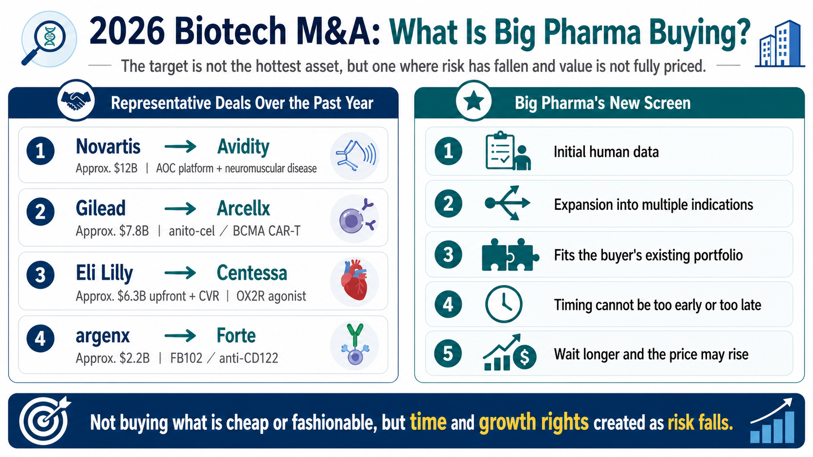
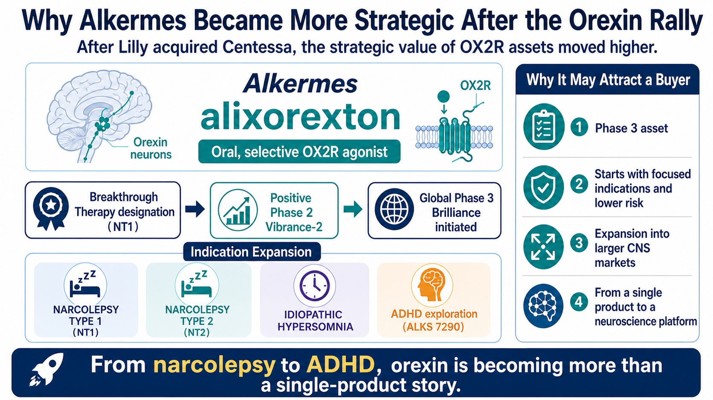
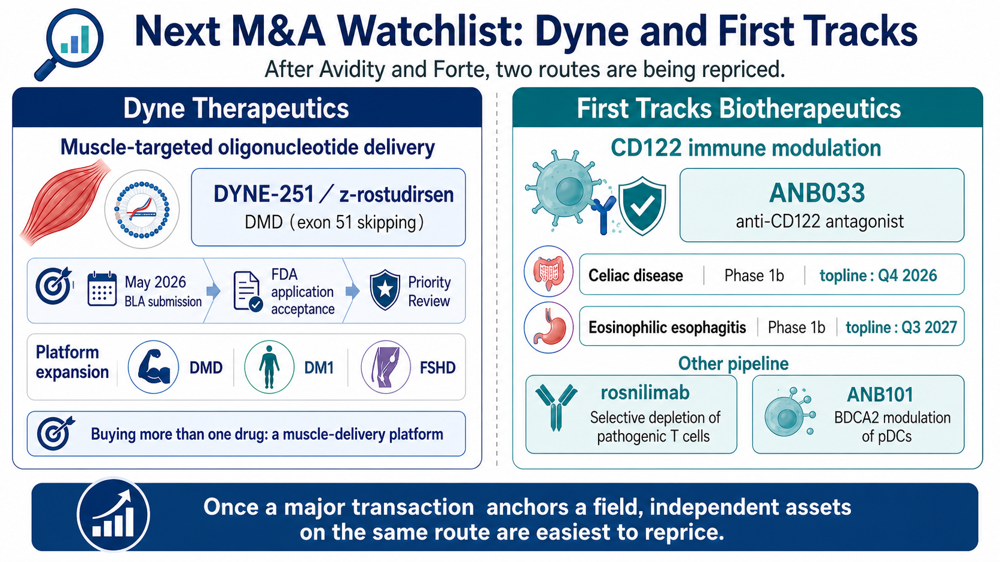
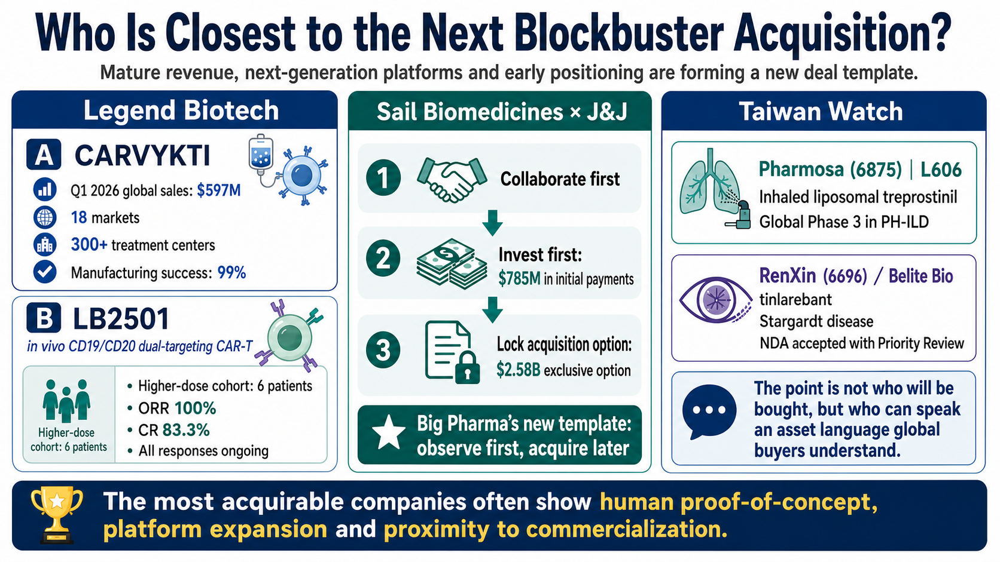

# Who Could Be Big Pharma's Next Major Biotech Acquisition?

The global biotech M&A market is making one preference unusually clear in 2026.

Large pharmaceutical companies still have cash, and the need to refill portfolios ahead of major patent expirations has not disappeared. What has changed is the distribution of that capital. Buyers are no longer spreading it evenly across the biotech universe. They are concentrating on a much smaller group of companies positioned at a particular point on the risk curve: clinical uncertainty has begun to fall, while commercial and strategic value has not yet been fully priced.

Big Pharma is not out of money. It has simply become more selective.

The biotechs that enter an acquisition conversation often share several features. Their lead asset has produced an initial human signal. Their therapeutic field has already been validated by a large transaction. The product can extend into more than one indication. The platform fills a specific gap in a buyer's portfolio. Above all, the timing cannot be too early or too late.

Too early, and the science remains too risky. Too late, and the asset may already be prohibitively expensive. That is why biotech M&A in 2026 increasingly looks like a competition over timing.

## 01 | Recent deals have rewritten the acquisition standard

Several transactions over the past year show what large pharmaceutical companies now want.

Novartis acquired Avidity Biosciences for approximately $12 billion, adding a muscle-targeted antibody oligonucleotide conjugate platform and several late-stage neuromuscular programs. Novartis framed the acquisition as a route to multiple potential launches before 2030 and access to multibillion-dollar market opportunities.

Gilead Sciences paid approximately $7.8 billion for its long-term partner Arcellx, bringing the BCMA CAR-T therapy anitocabtagene autoleucel, or anito-cel, fully into the Kite cell-therapy organization. The sequence is instructive: collaborate first, observe the data and execution, and acquire the company once the strategic fit has been de-risked.

Eli Lilly has also remained active. It agreed to acquire Centessa Pharmaceuticals for roughly $6.3 billion upfront plus a contingent value right of up to approximately $1.5 billion, gaining a sleep-wake pipeline centered on OX2R agonism. Lilly then moved further into neuroscience with an agreement to buy AtaiBeckley for about $2.8 billion upfront plus a CVR worth up to $1 billion, adding new approaches to treatment-resistant depression.

Immunology is attracting similar premiums. argenx agreed to acquire Forte Biosciences for approximately $2.2 billion, adding the anti-CD122 antibody FB102. The transaction followed positive Phase 1b vitiligo data. It showed that a leading immunology company was willing to pay for an early asset when the mechanism was coherent and the indication expansion opportunity was broad.

The common standard is straightforward. A low price is not enough, and a fashionable target is not enough. Buyers want an initial human signal, credible indication expansion, a clean fit with existing capabilities and a reason to believe that waiting will make the asset more expensive.

## 02 | As orexin heats up, Alkermes occupies a more sensitive position

Lilly's acquisition of Centessa makes Alkermes strategically more visible because of one mechanism: orexin.

Orexins are hypothalamic neuropeptides that play a central role in maintaining wakefulness. Traditional sleep medicines generally help patients fall or remain asleep. An OX2R agonist works in the opposite direction: it activates wake-promoting circuitry. The therapeutic opportunity includes narcolepsy type 1, narcolepsy type 2 and idiopathic hypersomnia.

Alkermes' alixorexton is an oral, selective OX2R agonist in development across all three conditions. The US Food and Drug Administration has granted Breakthrough Therapy designation for alixorexton in narcolepsy type 1. In the Phase 2 Vibrance-2 study in narcolepsy type 2, the drug produced statistically significant and clinically meaningful improvements on both the Maintenance of Wakefulness Test and the Epworth Sleepiness Scale. Alkermes has since initiated the global Phase 3 Brilliance program in narcolepsy types 1 and 2.

That creates two layers of value. First, Alkermes has a core OX2R asset in Phase 3. Second, the company is not confining the mechanism to rare sleep disorders. It is also exploring ALKS 7290 in adults with attention-deficit/hyperactivity disorder.

If OX2R agonism can move from narcolepsy to idiopathic hypersomnia and eventually into larger indications such as ADHD, the proposition changes. It is no longer a single-product sleep-disorder story; it becomes a neuroscience platform. For a large pharmaceutical company, the pattern of beginning in a focused indication and expanding into larger markets can be especially attractive.

## 03 | After Avidity, Dyne is the most visible independent muscle-delivery platform

Novartis' acquisition of Avidity naturally raises a follow-on question: which independent company now represents the next muscle-targeted oligonucleotide platform?

Dyne Therapeutics is the most obvious name.

Dyne's platform uses an antibody-based targeting component to deliver oligonucleotide therapies to muscle, with programs in Duchenne muscular dystrophy, myotonic dystrophy type 1 and facioscapulohumeral muscular dystrophy. Its most commercially advanced asset is zeleciment rostudirsen, also known as z-rostudirsen or DYNE-251, for patients with DMD who are amenable to exon 51 skipping. Dyne submitted a biologics license application seeking accelerated approval in May 2026. The FDA accepted the filing and granted Priority Review.

This is close to the timing window favored by strategic buyers. The product is not yet fully commercial, but it is approaching a regulatory decision. Meaningful risk remains, yet the greatest uncertainties are lower than they were when the platform was purely early-stage.

Dyne also extends beyond DMD. Its DM1 and FSHD programs matter because a buyer would not be purchasing only an exon-skipping drug. It would be acquiring a muscle-delivery platform. The approximately $12 billion Avidity transaction created a reference price and validated the strategic importance of that technology class. Dyne is therefore likely to be evaluated against a different benchmark than it was before that deal.

## 04 | Once CD122 became transactible, First Tracks became harder to ignore

Immunology has long been one of the areas where Big Pharma is most willing to spend. In the summer of 2026, CD122 suddenly became a transaction-backed mechanism.

argenx's purchase of Forte after early FB102 data in vitiligo signaled that the IL-2/IL-15 receptor beta chain could become a meaningful new immunology entry point. Following that deal, First Tracks Biotherapeutics stands out as an independent company working on the same target class.

First Tracks' ANB033 is an anti-CD122 antagonist directed at the shared beta subunit of the IL-2 and IL-15 receptors. The program is in Phase 1b development in celiac disease and eosinophilic esophagitis. The company's second-quarter 2026 update guides to topline data from the first celiac cohort in the fourth quarter of 2026, the second celiac cohort in the first quarter of 2027, and eosinophilic esophagitis data in the third quarter of 2027.

The company has two additional immunology programs. Rosnilimab is designed to selectively deplete pathogenic T cells and has completed a Phase 2b trial in rheumatoid arthritis. ANB101 is an earlier program designed to modulate plasmacytoid dendritic cells through BDCA2.

First Tracks belongs on an M&A watch list for a simple reason. If ANB033 establishes human proof of concept in a second independent indication, CD122 will no longer be a story supported by a single acquired company. It will begin to look like a competitive immunology platform with multiple strategic entry points.

## 05 | Legend Biotech is now worth more than Carvykti alone

Legend Biotech represents a different acquisition logic. This is not an early platform built entirely on clinical promise. It already has a commercially successful CAR-T product.

Carvykti, or ciltacabtagene autoleucel, generated $597 million in global net sales in the first quarter of 2026, a 62% increase year over year. Growth outside the United States was even faster. The product had reached 18 markets and more than 300 treatment centers. Legend also reported a 99% manufacturing success rate and said more than 95% of orders were released on or before their final product delivery date.

The asset that expands Legend's strategic imagination, however, is LB2501.

LB2501 is an in vivo CD19/CD20 dual-targeting CAR-T candidate. Conventional autologous CAR-T therapy requires a patient's T cells to be collected, engineered outside the body and reinfused. In vivo CAR-T attempts to reprogram the cells inside the patient, potentially reducing the complexity of individualized manufacturing. In June 2026, Legend reported preliminary Phase 1 data. Among six patients with relapsed or refractory B-cell non-Hodgkin lymphoma treated at the higher dose level, the objective response rate was 100% and the complete response rate was 83.3%; all responses were ongoing at the data cutoff.

Six patients are far too few to declare clinical success. That limitation must remain explicit. Yet the strategic signal is already visible: Legend combines an established CAR-T revenue stream with a potential next-generation platform that could move cell therapy from ex vivo manufacturing toward in vivo engineering.

That pairing—mature revenue plus a next-generation platform—is precisely the type of structure that can draw large pharmaceutical interest.

## 06 | J&J has already secured an option on Sail

Some transactions begin well before a full acquisition. Sail Biomedicines is a useful example.

In July 2026, Johnson & Johnson entered a strategic collaboration with Sail to develop in vivo CAR-T therapies for immune-mediated diseases. J&J agreed to provide a total of $785 million in upfront consideration, including a $465 million equity investment, and received an exclusive option to acquire Sail for $2.58 billion.

This structure deserves attention. Big Pharma does not always need to buy a platform outright at the start. It can invest, collaborate, gain an internal observation window and secure a future purchase right. If the platform fails, the buyer has avoided paying the full acquisition price immediately. If human data validate the approach, the buyer is already inside the relationship and rivals will find it much harder to intervene.

Option-based collaborations may therefore become a recurring transaction template for high-potential platform biotechs. The buyer controls timing; the biotech secures development capital without giving up the company on day one.

## 07 | Which Taiwan companies speak the new acquisition language?

Bringing the discussion back to Taiwan requires discipline. The useful question is not which local company will be acquired. It is which companies have assets that global buyers can understand using the same strategic language.

One example is Pharmosa Biopharm, listed in Taiwan under ticker 6875.

Its L606 program is a liposomal treprostinil inhalation suspension for pulmonary arterial hypertension and pulmonary hypertension associated with interstitial lung disease. L606 has been licensed to Liquidia for North America and is being evaluated in the global Phase 3 Re-Spire trial in PH-ILD. It combines a focused specialty market, differentiated formulation, late-stage clinical development and an international partnership—four attributes that can make an asset legible to a global portfolio owner.

A second example is Lin BioScience, listed under ticker 6696, through its subsidiary Belite Bio.

Belite's tinlarebant, also known as LBS-008, is being developed for Stargardt disease and geographic atrophy. Belite has completed the rolling submission of a US new drug application for tinlarebant in Stargardt disease, following positive topline results from the Phase 3 DRAGON trial. Rare ophthalmic diseases can offer concentrated clinical pathways, clearly defined patient needs and globally valuable regulatory milestones.

Pharmosa Biopharm and Lin BioScience are not direct comparators to Alkermes, Dyne or Legend. Their relevance lies elsewhere. Both illustrate how Taiwanese companies can create value through specialty diseases, late-stage evidence, regulatory execution and international partnerships rather than through narrative momentum alone.

Global buyers do not purchase attractive stories. They purchase assets that can be modeled, developed and integrated into a worldwide product portfolio.

## Conclusion | The next major deal may happen where risk has just started to fall

The most likely acquisition candidates in the second half of 2026 are not necessarily the cheapest biotechs or the companies attached to the most fashionable platform.

The more consequential candidates tend to sit where several conditions intersect: human proof of concept has emerged; the platform can expand across indications; commercialization is within sight; a large transaction has established a price reference for the field; and a specific buyer can integrate the asset into its clinical, regulatory or commercial system.

Alkermes represents OX2R agonism and sleep-wake disorders. Dyne represents muscle-targeted oligonucleotide delivery. First Tracks represents CD122 immunomodulation. Legend combines mature CAR-T revenue with a next-generation in vivo CAR-T platform. Sail illustrates how a pharmaceutical company can secure a strategic position through an acquisition option before committing to full ownership.

None of these companies is certain to be acquired, and none of the investigational programs is certain to succeed. Their shared feature is more precise: they occupy the point that Big Pharma now watches most closely, where risk is beginning to fall but future value has not been completely realized.

For a large pharmaceutical company, the best acquisition is rarely the cheapest company. It is the opportunity to secure several years of future growth before the rest of the market has fully priced it.

## References

1. [Novartis: Successful completion of the Avidity Biosciences acquisition](https://www.novartis.com/news/media-releases/novartis-successfully-completes-acquisition-avidity-biosciences-strengthening-late-stage-neuroscience-pipeline-and-advancing-xrna-strategy)
2. [Gilead Sciences: Completion of the Arcellx acquisition](https://www.gilead.com/news/news-details/2026/gilead-sciences-completes-acquisition-of-arcellx-ahead-of-potential-commercial-launch-of-anito-cel)
3. [Eli Lilly: Agreement to acquire Centessa Pharmaceuticals](https://investor.lilly.com/node/54066)
4. [Eli Lilly: Agreement to acquire AtaiBeckley](https://investor.lilly.com/news-releases/news-release-details/lilly-acquire-ataibeckley-advance-therapies-treatment-resistant)
5. [argenx: Agreement to acquire Forte Biosciences and add FB102](https://argenx.com/news/2026/press-release-3333257.html)
6. [Alkermes: Initiation of the Phase 3 Brilliance studies](https://investor.alkermes.com/node/23196/pdf)
7. [Alkermes: Detailed positive results from the Phase 2 Vibrance-2 study](https://investor.alkermes.com/news-releases/news-release-details/alkermes-presents-detailed-positive-results-vibrance-2-phase-2/)
8. [Dyne Therapeutics: FDA accepts the z-rostudirsen BLA and grants Priority Review](https://www.dyne-tx.com/fda-accepts-bla-for-z-rostudirsen/)
9. [First Tracks Biotherapeutics: Second-quarter 2026 pipeline update](https://ir.firsttracksbio.com/news-releases/news-release-details/first-tracks-biotherapeutics-announces-second-quarter-2026)
10. [First Tracks Biotherapeutics: ANB033 program overview](https://www.firsttracksbio.com/our-pipeline/anb033/overview/)
11. [Legend Biotech: First-quarter 2026 results and Carvykti sales](https://investors.legendbiotech.com/news-releases/news-release-details/legend-biotech-reports-first-quarter-2026-results-and-recent/)
12. [Legend Biotech: Preliminary Phase 1 proof of concept for LB2501](https://investors.legendbiotech.com/news-releases/news-release-details/legend-biotech-establishes-clinical-proof-concept-lb2501/)
13. [Johnson & Johnson: Strategic collaboration with Sail Biomedicines](https://www.investor.jnj.com/investor-news/news-details/2026/Johnson--Johnson-Announces-Collaboration-with-Sail-Biomedicines-to-Advance-in-vivo-CAR-T-Programs-and-Transform-Autoimmune-Disease-Through-Immune-Reset/default.aspx)
14. [ClinicalTrials.gov: Re-Spire Phase 3 study of L606 in PH-ILD, NCT07285655](https://clinicaltrials.gov/study/NCT07285655)
15. [Belite Bio: Positive topline results from the Phase 3 DRAGON trial](https://investors.belitebio.com/news-releases/news-release-details/new-hope-people-living-disease-once-deemed-untreatable-belite)
16. [Belite Bio: Completion of the rolling NDA submission for tinlarebant](https://investors.belitebio.com/news-releases/news-release-details/belite-bio-completes-rolling-submission-new-drug-application-us)

Verification cutoff: August 23, 2026.

## Disclaimer

The acquisition candidates and transaction structures discussed here are industry observations based on public information. They do not imply that any company will be acquired, any clinical trial will succeed, or any investigational therapy has been proven safe or effective. This article is intended for industry research and knowledge sharing only. It does not constitute investment, medical, fundraising, or individual stock advice.
