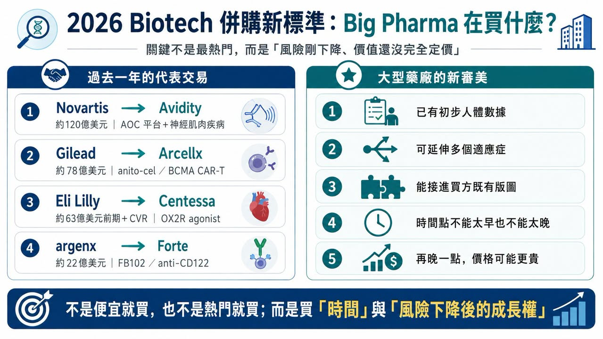
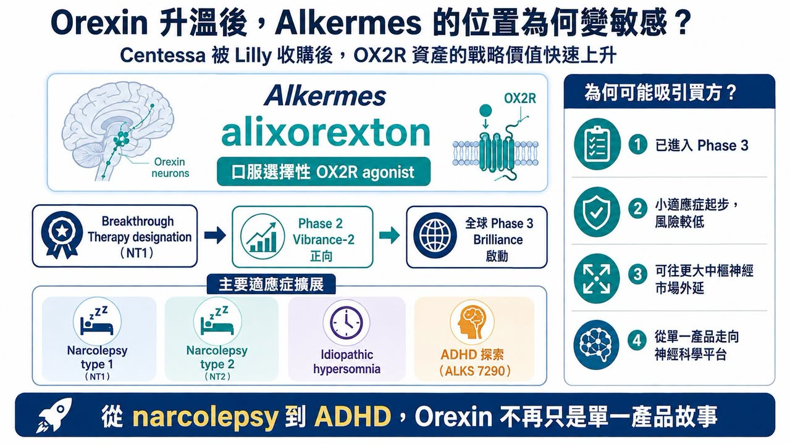
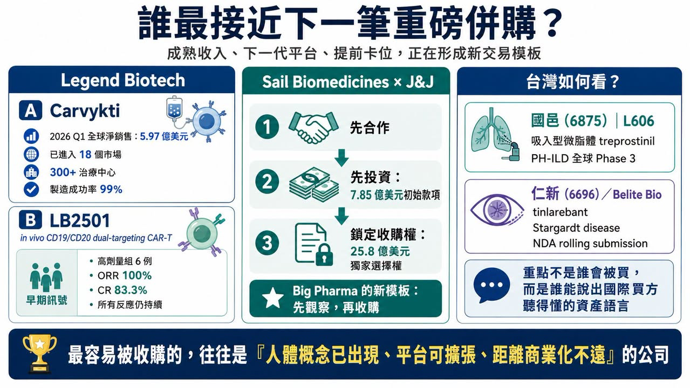

# Biotech 下一筆重磅併購，會落在誰身上？

2026 年的全球 Biotech 併購市場，出現一個很清楚的變化。

大型藥廠手上仍有現金，專利懸崖帶來的產品補洞壓力也沒有消失。但錢不再平均灑向所有 Biotech，而是集中流向一小群「剛好站在臨床風險下降、商業價值還沒完全定價」的公司。

換句話說，Big Pharma 不是沒錢，只是變得更挑。

能進入收購視野的 Biotech，通常有幾個共同特徵：核心資產已經有初步人體數據；所處領域已有大型交易驗證；產品可以擴展到多個適應症；技術平台能補足買方現有版圖；更重要的是，時間點不能太早，也不能太晚。

太早，科學風險太高；太晚，價格已經貴到難以下手。這也是為什麼 2026 年的併購交易，越來越像一場對「時點」的競賽。

## 01｜過去一年的交易，已經把新標準寫出來

過去一年幾筆交易，幾乎把大型藥廠的新審美說得很清楚。

Novartis 以約 120 億美元收購 Avidity Biosciences，取得肌肉靶向 Antibody Oligonucleotide Conjugate（AOC）平台，以及多個後期神經肌肉疾病管線。Novartis 表示，這筆交易可望在 2030 年前帶來多個產品上市機會，並打開數十億美元級市場。

Gilead Sciences 則以約 78 億美元收購長期合作夥伴 Arcellx，把 anito-cel（anitocabtagene autoleucel）這款 BCMA CAR-T 完全收進自家 Kite 細胞治療體系。這是一種典型的「合作觀察後完整併購」：先合作、看資料、看執行，再決定把資產整合進來。

Eli Lilly 也持續出手。它以約 63 億美元前期對價、另附最高約 15 億美元 CVR 收購 Centessa Pharmaceuticals，取得以 OX2R agonist 為核心的睡眠覺醒障礙管線；之後又以約 28 億美元前期對價、最高 10 億美元 CVR 收購 AtaiBeckley，進一步加碼治療抗性憂鬱症與精神醫學新機制。

免疫領域也在升溫。argenx 宣布以約 22 億美元收購 Forte Biosciences，取得 anti-CD122 antibody FB102。這筆交易發生在 Forte 公布白斑症 Phase 1b 積極資料之後，顯示大型免疫公司願意為早期但機制清楚、平台外延大的免疫資產支付高溢價。

這些交易的共通點很直接：不是便宜就買，也不是熱門就買。要有初步人體資料，要有多適應症外延，要能接進買方既有業務，還要讓買方相信：再晚一點，價格會更貴。

## 02｜Orexin 升溫後，Alkermes 的位置變得更敏感

Centessa 被 Lilly 收走後，Alkermes 的戰略位置明顯變得更突出。原因在於 orexin。

Orexin，也就是食慾素，是由下丘腦產生的神經胜肽，對維持清醒狀態非常關鍵。過去睡眠藥物多半是讓人睡得著，但 OX2R agonist 的邏輯反過來：直接增強清醒相關神經通路，用於 narcolepsy type 1、narcolepsy type 2、idiopathic hypersomnia 等疾病。

Alkermes 的 alixorexton 是口服選擇性 OX2R agonist，目前已經在 narcolepsy type 1、narcolepsy type 2 和 idiopathic hypersomnia 中推進開發。FDA 已授予 alixorexton 治療 narcolepsy type 1 的 Breakthrough Therapy designation。更重要的是，alixorexton 在 narcolepsy type 2 的 Phase 2 Vibrance-2 研究中，於 Maintenance of Wakefulness Test（MWT）與 Epworth Sleepiness Scale（ESS）兩個主要終點上，都展現統計顯著且具臨床意義的改善。Alkermes 也已啟動針對 narcolepsy type 1 與 type 2 的全球 Phase 3 Brilliance 計畫。

這讓 Alkermes 具備兩層價值。第一，它有一條已進入 Phase 3 的 OX2R 核心資產；第二，公司沒有把 OX2R 限定在罕見睡眠疾病，還在探索 ALKS 7290 用於成人 ADHD。

若 OX2R 能從 narcolepsy 擴展到 idiopathic hypersomnia，再往 ADHD 等更大市場延伸，這就不再是單一產品故事，而是神經科學平台故事。對大型藥廠來說，這種「小適應症起步、大適應症外延」的結構很有吸引力。

## 03｜Avidity 之後，Dyne 成為肌肉靶向核酸藥物最醒目的獨立標的

Avidity 被 Novartis 收購後，市場自然會問：下一個肌肉靶向核酸藥物標的會是誰？最容易被看見的，是 Dyne Therapeutics。

Dyne 的核心技術，是把寡核苷酸藥物透過抗體導向肌肉細胞，處理 Duchenne muscular dystrophy（DMD）、myotonic dystrophy type 1（DM1）與 FSHD 等神經肌肉疾病。最接近商業化的是 zeleciment rostudirsen（z-rostudirsen，DYNE-251），用於適合 exon 51 skipping 的 DMD 患者。2026 年 5 月，Dyne 向 FDA 提交 BLA，尋求 accelerated approval；FDA 隨後接受申請並給予 priority review。

這種狀態非常符合併購市場喜歡的時間點。產品還沒完全商業化，但已經接近監管決策。風險還在，但最大的不確定性已經比早期平台低很多。

Dyne 也不是只有 DMD。它還有 DM1、FSHD 等管線，這正是買方在意的地方：它買到的不是一個 exon skipping 藥，而是一個肌肉遞送平台。Avidity 已經用 120 億美元交易為這條技術路線定錨，Dyne 自然會被市場重新估值。

## 04｜CD122 變熱後，First Tracks 會被盯上

免疫學一直是 Big Pharma 最願意花錢的領域。2026 年夏天，CD122 突然成為交易熱點。

Forte 的 FB102 在白斑症早期資料後，被 argenx 以 22 億美元買走，代表市場開始相信 CD122 可能成為新的免疫調節入口。Forte 交易之後，同靶點上仍獨立的 First Tracks Biotherapeutics，就變得更值得注意。

First Tracks 的 ANB033 是 anti-CD122 antagonist，靶向 IL-2／IL-15 receptor shared beta subunit。公司管線資料顯示，ANB033 正在 celiac disease 與 eosinophilic esophagitis 中進行 Phase 1b 研究；celiac disease 的 Cohort 1 topline data 預計於 2026 年第四季讀出，Cohort 2 預計在 2027 年第一季，eosinophilic esophagitis 則預計 2027 年第三季讀出。

First Tracks 還有 rosnilimab 和 ANB101。Rosnilimab 目標是選擇性清除 pathogenic T cells，已完成 rheumatoid arthritis Phase 2b；ANB101 則透過 BDCA2 調節 plasmacytoid dendritic cells，目前處於早期開發階段。

這類公司最適合被放進「下一筆可能交易」清單。原因很簡單：如果 ANB033 在第二個獨立適應症中建立人體概念驗證，CD122 就不再只是 Forte 一家公司的故事，而會變成一條可被多家公司競逐的免疫平台路線。

## 05｜Legend Biotech 的價值，已經不只 Carvykti

Legend Biotech 是另一種併購邏輯。它已經不是只有早期平台與臨床想像，而是有一款真正商業化成功的 CAR-T 產品。

Carvykti（ciltacabtagene autoleucel）2026 年第一季全球淨銷售額達 5.97 億美元，年增 62%；美國以外市場成長更快，產品已進入 18 個市場、超過 300 個治療中心。Legend 也披露製造成功率達 99%，超過 95% 訂單能按最終產品交付日期準時釋放。

但真正讓 Legend 想像力變大的，是 LB2501。

LB2501 是 in vivo CD19／CD20 dual-targeting CAR-T。傳統自體 CAR-T 需要取出患者 T 細胞，在體外改造後再回輸；in vivo CAR-T 則試圖直接在患者體內完成 T 細胞改造，降低個體化製造的複雜度。2026 年 6 月，Legend 公布 LB2501 Phase 1 初步資料。在較高劑量組 6 名復發或難治性 B 細胞非何杰金氏淋巴瘤患者中，ORR 達 100%，CR 達 83.3%，且所有反應在資料截止時仍持續。

樣本數很小，遠遠不能宣告成功。但對併購市場來說，意義已經足夠清楚：Legend 不是只有已上市 CAR-T 收入，還有可能把細胞治療從 ex vivo 推向 in vivo 的下一代平台。

這種「成熟收入＋下一代平台」的組合，正是大型藥廠最容易動心的類型。

## 06｜Sail 已經被 J&J 提前卡位

有些交易，不會等到完整併購才發生。Sail Biomedicines 就是例子。

2026 年 7 月，Johnson & Johnson 與 Sail 建立戰略合作，開發用於免疫介導疾病的 in vivo CAR-T。J&J 將支付總計 7.85 億美元初始款項，其中包含 4.65 億美元股權投資，並取得以 25.8 億美元收購 Sail 的獨家選擇權。

這種模式很值得注意。Big Pharma 不一定要一開始就全買。它可以先投資、先合作、先取得內部觀察窗口，並鎖住未來收購權。如果平台失敗，買方沒有立刻承擔完整收購成本；如果人體數據跑出來，買方已經站在門內，競爭對手很難中途搶走。這可能會成為未來高潛力平台型 Biotech 很常見的交易模板。

## 07｜台灣誰符合「新併購語言」

這個題目放回台灣，不能簡單問哪家公司會被併購。更實際的問題是：哪些公司比較接近全球 Big Pharma 現在願意理解的資產語言？

第一個可以看國邑（6875）。

國邑的 L606（Liposomal Treprostinil Inhalation Suspension）是吸入型微脂體 treprostinil，用於 pulmonary arterial hypertension（PAH）與 PH-ILD 等肺高壓相關疾病。L606 已授權給 Liquidia 推進北美市場，並啟動 PH-ILD 全球 Phase 3 Re-Spire 試驗。這是一個很典型的專科市場、差異化製劑、後期臨床與國際合作結構。

第二個是仁新（6696）。

仁新子公司 Belite Bio 的 tinlarebant（LBS-008）瞄準 Stargardt disease 與 geographic atrophy。公司公告指出，Belite 已完成向 FDA 滾動提交 tinlarebant 治療 Stargardt disease 的 NDA；先前 DRAGON 試驗也已公布 positive topline data。這類罕見眼科疾病，具備患者需求明確、臨床路徑集中、國際藥證價值高的特徵。

國邑和仁新不是 Alkermes、Dyne 或 Legend 的直接對標。但它們共同符合一個方向：不是靠題材熱度，而是靠專科疾病、後期資料、法規路徑與國際合作來建立價值。這才是台灣公司最值得學的地方。國際買方要的不是漂亮故事，而是能被放進全球產品組合裡計算的資產。

## 結語｜下一筆重磅併購，會落在「風險剛下降」的公司身上

2026 年下半年的 Biotech 併購，最值得看的不一定是最低估值公司，也不一定是最熱門平台公司。

真正有機會被收購的，往往站在幾個條件交會處：人體概念驗證已經出現；平台能擴展到多個適應症；產品距離商業化不遠；所處領域已有大型交易定價；買方能把它接進既有臨床、法規或商業化體系。

Alkermes 代表 OX2R 與睡眠覺醒障礙；Dyne 代表肌肉靶向核酸遞送；First Tracks 代表 CD122 免疫調節；Legend 代表成熟 CAR-T 收入與 in vivo CAR-T 下一代平台；Sail 則代表大型藥廠提前卡位的選擇權模式。

這些公司不一定都會被買，也不一定都會成功，但它們都站在 Big Pharma 現在最敏感的位置：風險開始下降，價值尚未完全兌現。

對大型藥廠來說，最好的併購從來不是買最便宜的公司，而是在市場還沒完全定價前，先買下未來幾年的成長權。

## 參考資料

1. [Novartis｜Successfully completes acquisition of Avidity Biosciences](https://www.novartis.com/news/media-releases/novartis-successfully-completes-acquisition-avidity-biosciences-strengthening-late-stage-neuroscience-pipeline-and-advancing-xrna-strategy)
2. [Gilead｜Completes acquisition of Arcellx ahead of potential commercial launch of anito-cel](https://www.gilead.com/news/news-details/2026/gilead-sciences-completes-acquisition-of-arcellx-ahead-of-potential-commercial-launch-of-anito-cel)
3. [Eli Lilly｜Lilly to acquire Centessa Pharmaceuticals to advance treatments for sleep-wake disorders](https://investor.lilly.com/node/54066)
4. [Eli Lilly｜Lilly to acquire AtaiBeckley to advance therapies for treatment-resistant depression](https://investor.lilly.com/news-releases/news-release-details/lilly-acquire-ataibeckley-advance-therapies-treatment-resistant)
5. [argenx｜argenx to acquire Forte Biosciences, adding anti-CD122 antibody FB102](https://argenx.com/news/2026/press-release-3333257.html)
6. [Alkermes｜Initiation of Phase 3 Brilliance studies evaluating alixorexton](https://investor.alkermes.com/node/23196/pdf)
7. [Alkermes｜Detailed positive Vibrance-2 Phase 2 results](https://investor.alkermes.com/news-releases/news-release-details/alkermes-presents-detailed-positive-results-vibrance-2-phase-2/)
8. [Dyne Therapeutics｜FDA accepts BLA for z-rostudirsen and grants Priority Review](https://www.dyne-tx.com/fda-accepts-bla-for-z-rostudirsen/)
9. [First Tracks Biotherapeutics｜Second-quarter 2026 pipeline update](https://ir.firsttracksbio.com/news-releases/news-release-details/first-tracks-biotherapeutics-announces-second-quarter-2026)
10. [First Tracks Biotherapeutics｜ANB033 overview](https://www.firsttracksbio.com/our-pipeline/anb033/overview/)
11. [Legend Biotech｜First-quarter 2026 results and Carvykti sales](https://investors.legendbiotech.com/news-releases/news-release-details/legend-biotech-reports-first-quarter-2026-results-and-recent/)
12. [Legend Biotech｜LB2501 in vivo CD19/CD20 CAR-T Phase 1 data](https://investors.legendbiotech.com/news-releases/news-release-details/legend-biotech-establishes-clinical-proof-concept-lb2501/)
13. [Johnson & Johnson｜Strategic collaboration with Sail Biomedicines](https://www.investor.jnj.com/investor-news/news-details/2026/Johnson--Johnson-Announces-Collaboration-with-Sail-Biomedicines-to-Advance-in-vivo-CAR-T-Programs-and-Transform-Autoimmune-Disease-Through-Immune-Reset/default.aspx)
14. [ClinicalTrials.gov｜Re-Spire Phase 3 study of L606 in PH-ILD, NCT07285655](https://clinicaltrials.gov/study/NCT07285655)
15. [Belite Bio｜Positive topline results from the Phase 3 DRAGON trial](https://investors.belitebio.com/news-releases/news-release-details/new-hope-people-living-disease-once-deemed-untreatable-belite)
16. [Belite Bio｜Completion of tinlarebant NDA rolling submission](https://investors.belitebio.com/news-releases/news-release-details/belite-bio-completes-rolling-submission-new-drug-application-us)

查證截止日：2026 年 8 月 23 日。

## 免責聲明

本文提及的併購候選與交易結構，僅為依公開資料所作的產業觀察，不代表任何公司必然被收購、任何試驗必然成功或任何藥物已證實安全有效。本文僅供產業研究與知識分享，不構成投資、醫療、募資或個股建議。
