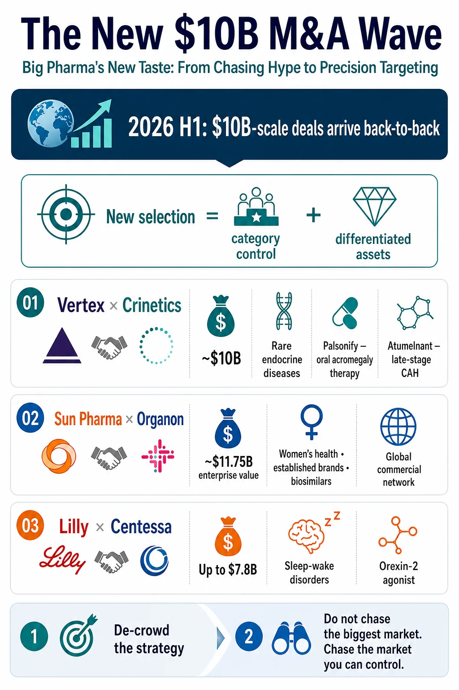
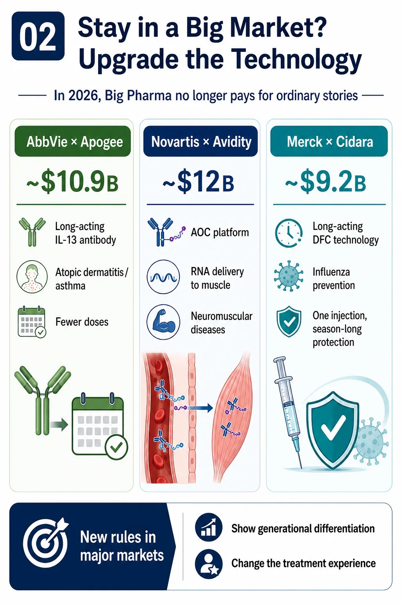
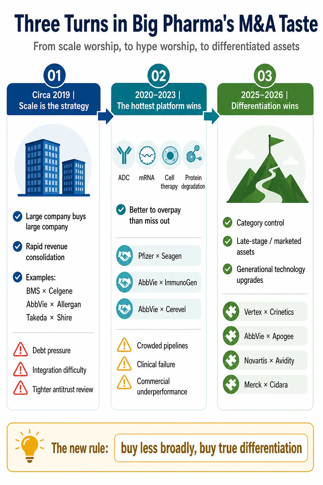
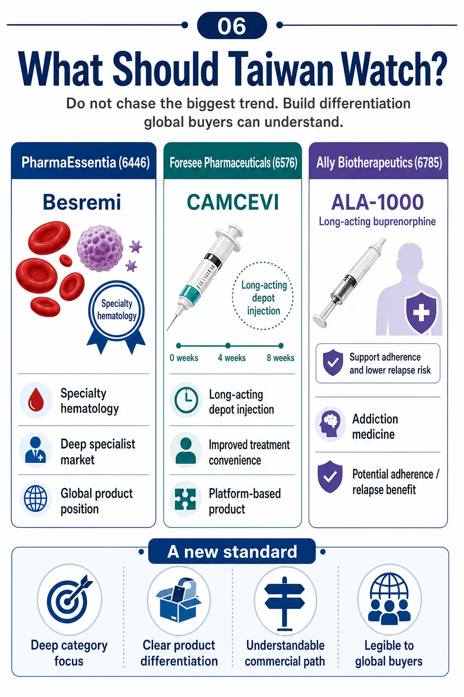

# Big Pharma's New $10 Billion M&A Wave: Why Differentiation Now Beats Scale and Hype

## 00 | Big Pharma's acquisition taste has changed

Another $10 billion pharmaceutical acquisition has arrived.

On July 6, Vertex Pharmaceuticals agreed to acquire Crinetics Pharmaceuticals for $85 per share in cash, implying an equity value of approximately $10 billion. If completed, the transaction will give Vertex PALSONIFY, Crinetics' marketed oral therapy for acromegaly, together with atumelnant, a late-stage asset for congenital adrenal hyperplasia and other ACTH-driven endocrine disorders.

Vertex estimates that the portfolio carries roughly $5 billion in peak-sales potential. The deal also turns endocrinology into the company's fifth therapeutic area. By this point, 2026 has already produced a succession of pharmaceutical transactions at or near the $10 billion mark.

The renewed acquisition appetite is not surprising. Patent cliffs are approaching, internal research cannot deliver on schedule every time, and large drugmakers still hold substantial cash and financing capacity. M&A remains the most direct way to fill a looming growth gap.

What matters is not simply that Big Pharma is buying again. It is buying differently.

Over the past decade, pharmaceutical acquisition logic passed through two distinct phases. The first worshipped scale: bigger was presumed to be better. The second worshipped fashionable platforms: the hotter the modality, the greater the fear of missing out.

By 2026, a different preference is taking shape. Buyers are no longer chasing only the loudest therapeutic category. They are looking for assets that face less direct crowding, possess a clear source of differentiation and can establish leadership in a well-defined specialist market.

That is the more important message behind Vertex's move for Crinetics.

## 01 | A new $10 billion wave built on precision, not indiscriminate buying

Two strategic lines run through the current transaction cycle.

The first is strategic de-crowding.

Instead of forcing another asset into the most fashionable and congested category, companies are moving toward specialist markets with durable clinical needs, fewer competitors and a realistic path to category leadership.

Sun Pharma's agreement to acquire Organon at an enterprise value of approximately $11.75 billion illustrates this logic. The attraction is not a glamorous new target. It is a global commercial network spanning women's health, established brands, biosimilars and specialty products. The portfolio may not carry the excitement of immuno-oncology, but it offers mature channels, clearer competitive dynamics and existing cash flow.

Eli Lilly's agreement to acquire Centessa Pharmaceuticals for up to $7.8 billion represents a different version of the same move. Lilly is stepping outside the gravitational pull of GLP-1 to enter sleep-wake disorders. Centessa's core program, cleminorexton, is an orexin receptor 2 agonist being developed for narcolepsy and idiopathic hypersomnia. This is not the largest mass-market chronic-disease opportunity. It is a specialist CNS market with identifiable patients, substantial unmet need and a more limited field of direct competitors.

Vertex's acquisition of Crinetics follows the same strategic grammar.

Acromegaly and congenital adrenal hyperplasia have never been the loudest areas in biopharma. Treatment has often depended on injections or imperfect alternatives that create adherence and disease-management burdens. Crinetics did not need to invent entirely new biology to create value. It differentiated mature endocrine mechanisms through product design, converting cumbersome treatment into convenient once-daily oral therapy.

PALSONIFY is the first and only once-daily oral therapy approved for adults with acromegaly. Atumelnant is a once-daily oral ACTH receptor antagonist in phase 3 development for congenital adrenal hyperplasia, with additional potential in Cushing's syndrome.

This is not the most theatrical scientific story. It is, however, closely matched to Vertex's established operating model: build a deep specialist position in serious disease, then use global development and commercialization capabilities to magnify its value.

Vertex created a highly concentrated franchise in cystic fibrosis. Buying Crinetics is, in effect, an attempt to reproduce that playbook in rare endocrine disease.

The new preference can be stated simply: do not chase the biggest market; pursue the market that can be controlled.

## 02 | If a company stays in a crowded category, the technology must move up a generation

The second line is technological de-crowding.

Big Pharma will still invest in oncology, immunology, metabolism and neuroscience. What has changed is its willingness to pay a premium for an ordinary follow-on asset. Remaining in a large and competitive market now requires technology that can produce a generational difference from existing therapy.

AbbVie's proposed acquisition of Apogee Therapeutics for approximately $10.9 billion is a bet on extended-duration immunology. Apogee's lead asset, zumilokibart, is a half-life-extended anti-IL-13 antibody being developed for atopic dermatitis and other type 2 inflammatory diseases.

AbbVie does not lack immunology products. What it needs is a next-generation profile: fewer administrations, longer biological activity and a potentially better treatment experience that supports adherence.

Novartis' approximately $12 billion acquisition of Avidity Biosciences adds a muscle-directed antibody oligonucleotide conjugate platform and three late-stage neuromuscular programs. The strategic value is not a single molecular target. Avidity's AOC architecture attempts to move RNA therapeutics beyond the liver and into muscle, addressing one of the central delivery constraints in oligonucleotide drug development.

Merck's approximately $9.2 billion acquisition of Cidara Therapeutics follows the same logic. Cidara's CD388, now MK-1406, is a long-acting drug-Fc conjugate in phase 3 development for influenza prevention in people at higher risk of complications. It is neither a vaccine nor a conventional monoclonal antibody. The candidate links copies of a neuraminidase-inhibiting small molecule to an engineered Fc fragment, seeking to provide season-long protection from a single administration without dependence on vaccine-strain matching.

These deals appear to span unrelated fields: immunology, neuromuscular disease, influenza and endocrinology. Their underlying language is remarkably consistent.

Either leave the crowded arena and build dominance in a specialist market, or remain in a major category and enter with a technological step-change.

Big Pharma has not stopped buying. It has become less willing to buy an ordinary story.

## 03 | A decade ago, scale itself was the thesis

Turn the clock back a decade and the acquisition logic looks very different.

The governing belief was that scale created safety.

As blockbuster patents approached expiry, the most direct response was to acquire a larger company, absorb a broader product portfolio, eliminate duplicated costs and consolidate revenue immediately.

The year 2019 marked the peak of this model. Bristol Myers Squibb acquired Celgene for roughly $74 billion. AbbVie acquired Allergan for about $63 billion. Takeda took on significant leverage to buy Shire and expand its rare-disease and plasma-derived-therapy businesses.

These transactions reflected confidence in the idea of "too big to fail." More products, wider channels, removable costs and immediately consolidated profits appeared to offer protection against the patent cliff.

The costs of mega-mergers were equally clear. Organizations became more cumbersome. Pipelines proved difficult to integrate. Debt burdens rose. Amortization of acquired intangible assets weighed on financial statements.

When subsequent clinical programs or commercial launches underperformed, an acquisition designed to solve one growth problem could become a multi-year operating burden. Antitrust scrutiny also tightened globally, reducing the room for transformational mergers valued in the tens or hundreds of billions.

Scale alone was no longer an adequate investment thesis.

## 04 | After the pandemic, fashionable platforms became the thesis

Between 2020 and 2023, acquisition taste changed again.

The pandemic created liquidity and a powerful fear of missing the next technology cycle. Drugmakers supported by COVID-19 windfalls or mature-product cash flow became anxious about being absent from the next major therapeutic platform.

Antibody-drug conjugates, mRNA, cell therapy, gene therapy, new CNS mechanisms and targeted protein degradation all attracted escalating attention.

Gilead paid approximately $21 billion for Immunomedics and its TROP2 ADC Trodelvy. Pfizer paid roughly $43 billion for Seagen in an attempt to rebuild its oncology business around an ADC platform. AbbVie paid approximately $10.1 billion for ImmunoGen and the FRalpha-directed ADC Elahere.

The platform chase extended beyond ADCs. AbbVie bought Cerevel Therapeutics for about $8.7 billion, gaining emraclidine, an M4 receptor positive allosteric modulator then viewed as a promising approach to schizophrenia. Pfizer acquired Biohaven's migraine franchise and Global Blood Therapeutics' sickle-cell portfolio.

The implicit rule was that buying the wrong fashionable asset might be painful, but missing the platform altogether could be worse.

Once the cycle cooled, however, the costs became visible. Too many companies pursued similar pipelines. Clinical failures accumulated. Commercial performance frequently fell short of expectations. ADCs became crowded, CNS development risk reasserted itself, and some rare-disease assets encountered serious post-approval safety problems.

Pfizer's Seagen portfolio has faced multiple setbacks. In June 2026, the phase 3 SigVie-002 study of sigvotatug vedotin in previously treated metastatic non-squamous non-small cell lung cancer failed to show a statistically significant overall-survival improvement over docetaxel in the overall population.

The Global Blood Therapeutics acquisition delivered an even more severe lesson. Oxbryta, or voxelotor, was withdrawn globally over safety concerns. The FDA reported higher rates of vaso-occlusive crises and more deaths in postmarketing studies, concluding that the accumulating data no longer supported a favorable benefit-risk balance.

The industry was forced to relearn three distinctions.

A fashionable platform is not a competitive moat. Popularity is not differentiation. Paying a premium for technology cannot purchase clinical success in advance.

## 05 | The new preference is not to buy less, but to buy genuine differentiation

By 2025 and 2026, pharmaceutical M&A was accelerating again, but the selection criteria had changed.

Companies were no longer defaulting to another mega-merger or buying an entire fashionable platform simply to secure a seat at the table. They were searching more selectively for three types of asset.

First, an asset with an established first-mover position in a specialist market.

Second, a late-stage or marketed product with greater visibility into regulatory and commercial execution.

Third, a platform capable of producing a generational difference rather than another closely related follow-on program.

Crinetics fits this new preference. PALSONIFY is valuable not because the target is new, but because it turns acromegaly treatment into a once-daily oral regimen and enters a specialist market with clear unmet need and lower competitive density.

Apogee is attractive not because IL-13 is novel, but because extended half-life could materially change dosing and the treatment experience in type 2 inflammatory disease.

Avidity is not merely another RNA company. Its strategic proposition is the ability to deliver oligonucleotide therapy into muscle.

Cidara is not simply another influenza program. Its drug-Fc conjugate may change how high-risk patients receive seasonal prevention.

The new acquisition standard is therefore unforgiving.

In a large market, an asset without a generational difference will struggle to command strategic value. In a small market, an asset without a credible path to leadership will face the same problem.

## 06 | What this means for Taiwan: build differentiation that international buyers can understand

PharmaEssentia (6446) is the clearest Taiwan example of the specialist-franchise path.

Its internally developed BESREMi, or ropeginterferon alfa-2b, is approved in the United States for adults with polycythemia vera. It is one of the few medicines originating from a Taiwan biotech that has established a real position in a global rare hematology market.

Its significance does not come from addressing the largest possible market. It comes from using a long-acting interferon to build a differentiated global product position in myeloproliferative neoplasms, a highly specialized disease category.

Foresee Pharmaceuticals (6576) is closer to the formulation and treatment-experience route.

CAMCEVI, a long-acting leuprolide mesylate injectable, entered the hormonal-treatment market for advanced prostate cancer through a sustained-release formulation. The six-month product is marketed in the United States, while the three-month formulation previously entered FDA review.

The strategic point is not a novel biological target. It is the use of formulation technology to improve dosing convenience and extend commercial options. That logic resembles Crinetics' effort to make endocrine treatment oral and easier to use.

Ally Biotherapeutics, also known as Alar Pharmaceuticals (6785), belongs in the same discussion.

Its long-acting buprenorphine injectable ALA-1000, now known as INDV-6001, was licensed to Indivior for development in opioid use disorder. Addiction medicine is not the most fashionable oncology narrative, but it contains substantial unmet need. A long-acting formulation could reduce the burden of frequent dosing, improve adherence and support patients with limited access to care.

That is precisely the profile increasingly favored by the new acquisition environment: focused, specialist and built around a product difference that is easy to explain.

For Taiwan biotech, the lesson is not to imitate the largest international platform or chase whichever target currently commands the highest valuation. The more durable question is whether a company's advantage can be translated into language a global partner understands.

Does the asset dominate a defined patient segment? Does it materially improve administration, adherence or treatment logistics? Does the platform solve a delivery barrier? Is there enough clinical and regulatory visibility to reduce uncertainty? Can the company defend the economics and rights around the product?

International value is created when scientific differentiation becomes commercial clarity.

## Conclusion | Big Pharma's taste has changed, and so has the standard for innovative drugs

Big Pharma has spent hundreds of billions of dollars learning an expensive lesson over the past decade.

The scale era demonstrated that bigger is not automatically better.

The platform-hype era demonstrated that fashionable is not automatically right.

The proliferation of similar pipelines demonstrated that buying a technology does not guarantee meaningful differentiation.

The 2026 acquisition preference is therefore more disciplined. Large drugmakers remain willing to pay substantial premiums, but the asset must present a clear strategic case.

It may dominate a specialist market. It may create a generational improvement in a large category. It may already be late-stage or marketed, improving visibility into execution. Or it may solve an important part of the clinical workflow rather than merely offering an elegant mechanism.

Big Pharma is no longer buying scale or excitement alone.

It is buying differentiation, certainty and the right to lead a market in which the product can actually survive.

## References

1. [Vertex | Vertex to Acquire Crinetics Pharmaceuticals, July 6, 2026](https://news.vrtx.com/node/35161/pdf)
2. [Organon | Sun Pharma signs Definitive Agreement to Acquire Organon, April 26, 2026](https://www.organon.com/news/sun-pharma-signs-definitive-agreement-to-acquire-organon/)
3. [Eli Lilly | Lilly to acquire Centessa Pharmaceuticals to advance treatments for sleep-wake disorders, March 31, 2026](https://investor.lilly.com/news-releases/news-release-details/lilly-acquire-centessa-pharmaceuticals-advance-treatments-sleep)
4. [AbbVie | AbbVie to Acquire Apogee Therapeutics, Deepening Immunology Portfolio, June 22, 2026](https://investors.abbvie.com/news-releases/news-release-details/abbvie-acquire-apogee-therapeutics-deepening-immunology)
5. [Novartis | Novartis agrees to acquire Avidity Biosciences, October 26, 2025](https://www.novartis.com/news/media-releases/novartis-agrees-acquire-avidity-biosciences-innovator-rna-therapeutics-strengthening-its-late-stage-neuroscience-pipeline)
6. [Merck | Merck to Acquire Cidara Therapeutics, November 14, 2025](https://www.merck.com/news/merck-to-acquire-cidara-therapeutics-inc-diversifying-its-portfolio-to-include-late-phase-antiviral-agent/)
7. [Pfizer | Phase 3 topline results for sigvotatug vedotin in previously treated metastatic non-squamous NSCLC, June 22, 2026](https://www.pfizer.com/news/press-release/press-release-detail/pfizer-announces-topline-phase-3-results-sigvotatug-vedotin)
8. [FDA | Voluntary withdrawal of Oxbryta from the market due to safety concerns, September 26, 2024](https://www.fda.gov/drugs/drug-alerts-and-statements/fda-alerting-patients-and-health-care-professionals-about-voluntary-withdrawal-oxbryta-market-due)
9. [FDA | BESREMi prescribing information](https://www.accessdata.fda.gov/drugsatfda_docs/label/2024/761166s007lbl.pdf)
10. [FDA | CAMCEVI prescribing information](https://www.accessdata.fda.gov/drugsatfda_docs/label/2025/211488s010lbl.pdf)
11. [Indivior | Exclusive licensing agreement for Alar Pharmaceuticals' ALA-1000, October 11, 2023](https://www.indivior.com/latest/category/press-releases/2023/indivior-enters-an-exclusive-licensing-agreement-with-alar-pharmaceuticals)

---

This article is provided for industry research and educational purposes only. It does not constitute investment, medical, fundraising or securities advice.
