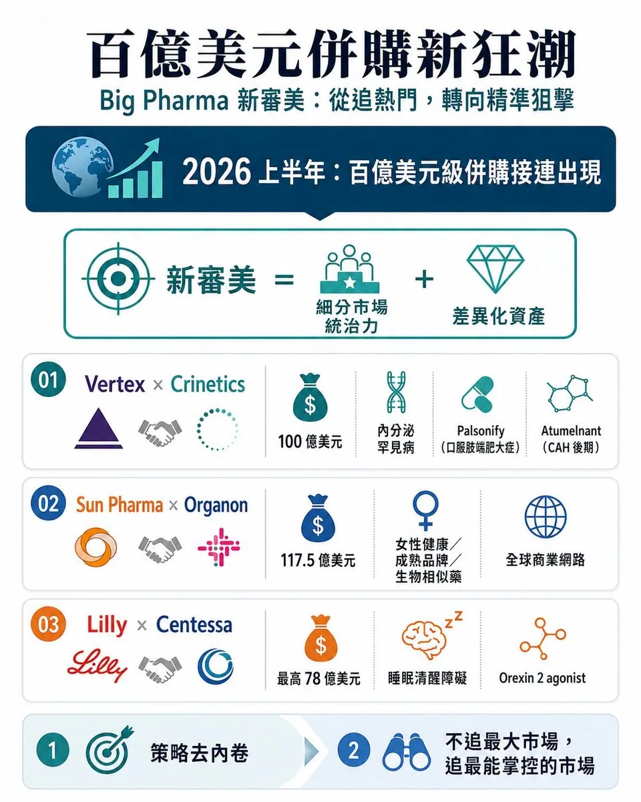
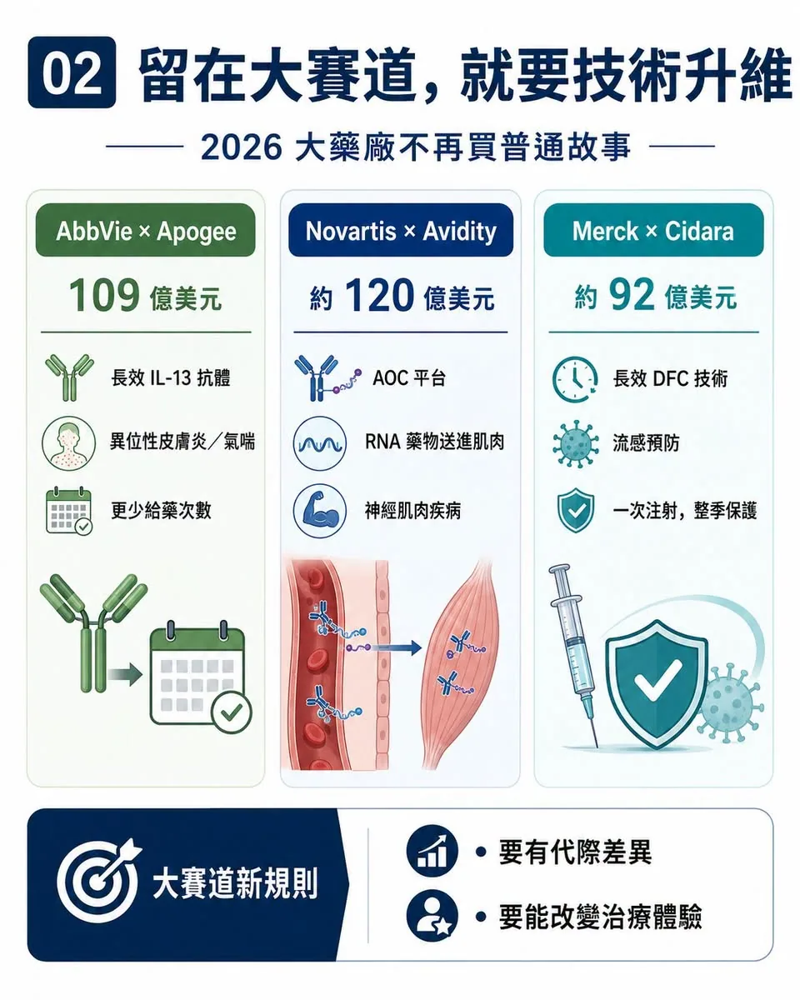
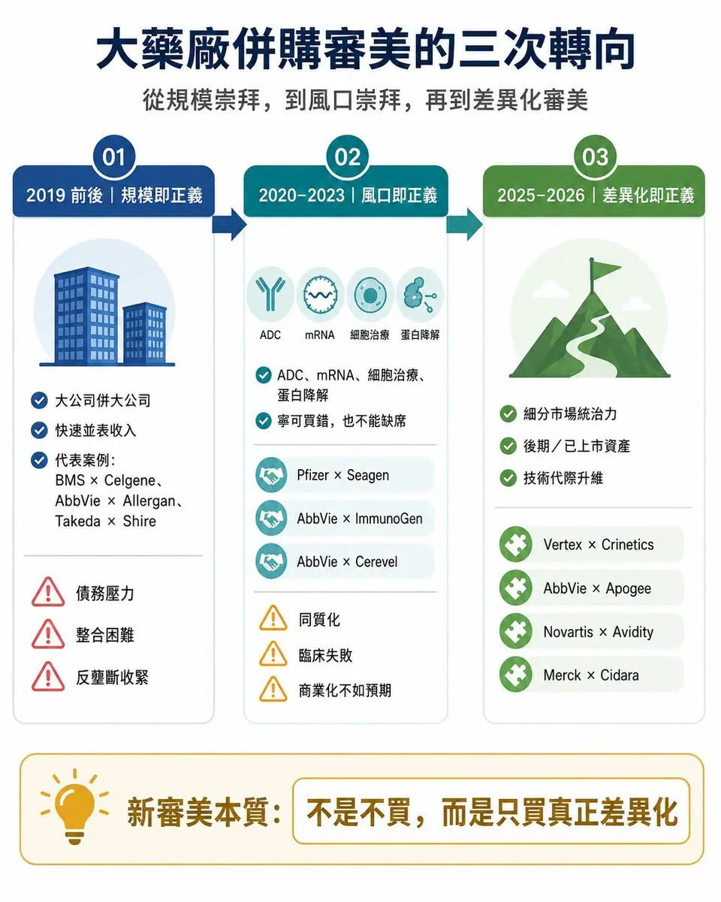
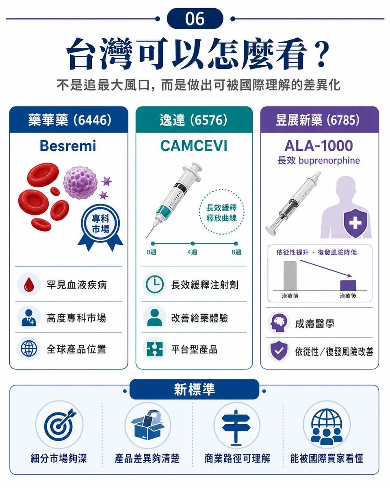

# 百億美元併購新狂潮

## 00｜大藥廠的「審美」變了

又一筆百億美元級併購誕生。

7 月 6 日，Vertex Pharmaceuticals 宣布以每股 85 美元、總股權價值約 100 億美元的全現金交易，收購專注於內分泌罕見病的 Crinetics Pharmaceuticals。交易完成後，Crinetics 將為 Vertex 帶來已上市的肢端肥大症口服藥 PALSONIFY，以及處於後期開發階段的 atumelnant。

Atumelnant 瞄準先天性腎上腺增生症與其他 ACTH 相關內分泌疾病。Vertex 官方也表示，這組資產具備約 50 億美元峰值銷售潛力，並將內分泌學納入公司第五大治療領域。

至此，2026 年全球製藥產業的百億美元級併購已經一筆接一筆。

大型藥廠加大併購力度並不意外。專利懸崖逼近，內部研發不可能永遠準時交卷，手上又握有大量現金，併購本來就是 Big Pharma 填補成長缺口最直接的工具。

真正值得注意的，不是它們又開始買了，而是它們開始買得不一樣了。

過去十年，跨國藥廠的併購審美經歷過兩個階段：第一個階段是規模崇拜，越大越好；第二個階段是風口崇拜，越熱門越好。

到了 2026 年，新的審美正在成形：不再追逐最大聲量的賽道，而是尋找最不內卷、最具差異化、最能形成細分統治力的資產。

這才是 Vertex 收購 Crinetics 背後真正值得看的地方。

## 01｜百億美元新狂潮：不是亂買，而是精準狙擊

這一輪跨國藥廠併購，有兩條很清楚的主線。

第一條，是策略去內卷。

也就是不再硬擠最紅、最擁擠、最被資本追捧的大賽道，而是轉向相對冷門、競爭較少、但臨床需求穩定的細分市場，追求絕對統治力。

Sun Pharma 以企業價值約 117.5 億美元收購 Organon，看中的不是一個炫目的新靶點，而是女性健康、成熟品牌、生物相似藥與專科產品組成的全球商業網路。這種資產不像腫瘤免疫那樣性感，但現金流穩定、通路成熟、競爭格局相對清楚。

Eli Lilly 以最高 78 億美元收購 Centessa Pharmaceuticals，則是跳出 GLP-1 舒適圈，切入睡眠清醒障礙市場。Centessa 的核心是 orexin receptor 2 agonist，也就是 orexin 2 受體促效劑 cleminorexton，瞄準 narcolepsy，也就是嗜睡症，以及 idiopathic hypersomnia，也就是特發性嗜睡症。這不是最熱的大眾慢病市場，卻是高度專科、需求明確、競品有限的 CNS，也就是中樞神經系統細分藍海。

Vertex 收購 Crinetics，也是同一個邏輯。

肢端肥大症與先天性腎上腺增生症，本來不是最吸睛的賽道。傳統治療長期依賴注射或不夠理想的替代方案，患者依從性差，醫療負擔也重。Crinetics 的價值，不在於發明了全新的生物學，而在於把成熟內分泌靶點做出產品差異化：把原本麻煩的治療，做成每日一次口服藥。

PALSONIFY 是全球首個且目前唯一每日一次口服肢端肥大症治療藥物。Atumelnant 則是口服 ACTH receptor antagonist，也就是 ACTH 受體拮抗劑，處於先天性腎上腺增生症後期開發階段。

這不是最華麗的科學故事，但非常符合 Vertex 的核心能力：在罕見病裡建立深度專科壁壘，再用全球商業化能力放大價值。

Vertex 過去靠囊性纖維化建立壟斷型商業模式。現在買 Crinetics，本質上是把這套模式複製到內分泌罕見病。

這是非常典型的新審美：不追最大市場，而追最能掌控的市場。

## 02｜第二條路：如果留在大賽道，就必須技術升維

另一條主線，是技術去內卷。

如果 Big Pharma 仍然要留在腫瘤、免疫、代謝、神經這些大賽道，它們不再願意為普通跟隨型資產付高價。它們要的是能對現有療法形成代際差異的技術平台。

AbbVie 宣布以約 109 億美元收購 Apogee Therapeutics，看中的就是長效化免疫療法。Apogee 的核心資產 zumilokibart 是長效 IL-13 antibody，也就是長效 IL-13 抗體，主攻異位性皮膚炎、氣喘等 type 2 inflammation，也就是第二型發炎疾病。

AbbVie 不是缺免疫藥，它真正需要的是下一代免疫產品：更少給藥次數、更長作用時間、更好的患者黏著度。

Novartis 完成約 120 億美元收購 Avidity Biosciences，則是買下肌肉導向的 Antibody Oligonucleotide Conjugate，簡稱 AOC，也就是抗體寡核苷酸偶聯平台，與三個後期神經肌肉疾病管線。這筆交易的重點不是單一靶點，而是把 RNA 藥物從肝臟推向肌肉組織，解決過去小核酸藥物遞送受限的問題。

Merck 完成約 92 億美元收購 Cidara Therapeutics，也是類似邏輯。Cidara 的 CD388 是長效 Drug-Fc Conjugate，簡稱 DFC，也就是藥物 Fc 偶聯抗病毒候選藥，處於 Phase 3，用於高風險族群流感預防。它不是疫苗，也不是傳統單株抗體，而是小分子神經胺酸酶抑制劑與 Fc 片段結合，目標是一次注射提供整季保護，且不依賴疫苗株匹配。

這些交易表面上分散在免疫、神經肌肉、流感、內分泌，但背後語言一致：要嘛避開內卷，在細分市場建立壟斷；要嘛進入大賽道，但必須用技術升維打出差異化。

Big Pharma 不是不買了，而是不再願意買普通故事。

## 03｜十年前的審美：規模即正義

如果把時間拉回十年前，Big Pharma 的併購邏輯完全不同。

那時候的核心信仰是：規模即正義。

重磅藥專利到期壓力浮現，藥廠最直接的解法，就是買更大的公司、吃下更大的產品矩陣、砍掉重複成本、快速並表收入。

2019 年，是大型併購的巔峰。Bristol Myers Squibb 以約 740 億美元收購 Celgene；AbbVie 以約 630 億美元收購 Allergan；Takeda 則背負巨大債務收購 Shire，押注罕見病與血液製品版圖。

這些交易背後，是對「大而不倒」的信仰。產品多、通路大、成本可砍、利潤能並表，看起來就能對抗專利懸崖。

但大型合併的代價也很清楚：組織臃腫、管線整合困難、債務壓力大、無形資產攤銷沉重。

一旦後續臨床或商業化不如預期，當初的併購很容易變成多年負擔。更重要的是，全球反壟斷監管開始收緊，千億美元級超大型合併的空間越來越小。

規模崇拜，不再那麼好用了。

## 04｜疫情後的審美：風口即正義

2020 到 2023 年，Big Pharma 的審美又轉了一次。

疫情帶來流動性，也帶來 FOMO，也就是害怕錯過。手握 COVID-19 紅利和老藥現金流的大藥廠，開始害怕錯過下一代技術平台。

ADC、mRNA、細胞治療、基因治療、CNS 新機制、蛋白降解，一個又一個熱點被推高。

Gilead 以約 210 億美元收購 Immunomedics，拿下 TROP2 ADC Trodelvy。Pfizer 以約 430 億美元收購 Seagen，試圖用 ADC 平台重建腫瘤業務。AbbVie 以約 101 億美元收購 ImmunoGen，買下 FRα ADC Elahere。

風口不只在 ADC。AbbVie 也以約 87 億美元收購 Cerevel Therapeutics，押注精神分裂症 M4 receptor positive allosteric modulator，也就是 M4 受體正向變構調節劑 emraclidine。Pfizer 也買下 Biohaven 的偏頭痛管線，並收購 Global Blood Therapeutics，進入鐮刀型貧血市場。

那時候的邏輯是：寧可買錯，也不能缺席。

但風口過後，代價開始浮現。同質化管線太多，臨床失敗頻繁，商業化不如預期。ADC 變成紅海，CNS 高風險再次暴露，部分罕見病資產也在上市後面對真實世界安全性挑戰。

Pfizer 收購 Seagen 後，多個 ADC 管線接連遇挫。2026 年，sigvotatug vedotin 在既往治療過的非鱗狀非小細胞肺癌 Phase 3 試驗中，未能相較 docetaxel，也就是多西他賽，顯著改善整體存活期。

Pfizer 收購 Global Blood Therapeutics 的教訓更重。其鐮刀型貧血藥 Oxbryta，也就是 voxelotor，因安全性疑慮在全球撤市。FDA 也發布警示，指出 Pfizer 撤回該藥與疼痛併發症和潛在死亡風險有關。

這些案例讓產業重新清醒：風口不是壁壘，熱門不等於差異化；大手筆買下平台，也買不到臨床成功保證。

## 05｜新審美的本質：不是不買，而是只買真正差異化

到了 2025、2026 年，Big Pharma 併購重新升溫，但審美明顯變了。

不是再追千億美元超級合併，也不是再看到熱門平台就全包，而是更精準地尋找三種資產：

第一，細分市場裡已建立先發位置的資產。

第二，後期臨床或已上市、商業化能見度高的資產。

第三，技術平台能帶來代際差異，而不是只做同質化跟隨的資產。

Vertex 買 Crinetics，就是這種新審美的代表。PALSONIFY 不是因為靶點新而值錢，而是因為它把肢端肥大症治療做成每日一次口服，切進一個高度專科、低內卷、未滿足需求明確的市場。

AbbVie 買 Apogee，也不是因為 IL-13 是新靶點，而是因為長效化可能改變 type 2 inflammation 的給藥體驗。

Novartis 買 Avidity，不是只買 RNA 藥物，而是買能把 RNA 藥物送進肌肉的遞送平台。

Merck 買 Cidara，不是買一個普通流感藥，而是買一種可能重新定義流感預防方式的長效 DFC 技術。

所以，Big Pharma 的新審美其實很殘酷：大賽道裡，沒有代際差異就不值錢；小賽道裡，沒有統治力也不值錢。

## 06｜台灣可以怎麼看？不是追最大風口，而是做出可被國際理解的差異化

藥華藥（6446）是最典型的細分專科路線。

它的 BESREMi，也就是 ropeginterferon alfa-2b 長效干擾素，已在美國核准用於成人真性紅血球增多症，屬於台灣少數真正把自研藥物推進全球罕見血液疾病市場的公司。

它的意義不是「市場最大」，而是用長效干擾素在 MPN，也就是骨髓增生性腫瘤這種高度專科市場建立全球產品位置。

逸達（6576）則更接近劑型與給藥體驗革新的路線。

其 CAMCEVI，也就是 leuprolide mesylate 亮丙瑞林長效針劑，以長效緩釋注射劑切入前列腺癌荷爾蒙治療市場。美國六個月劑型已上市，三個月劑型也曾向 FDA 遞件並進入實質審查。

這類資產的重點不是全新靶點，而是用製劑平台改善治療便利性與商業延展性，和 Crinetics 把內分泌療法口服化的邏輯有相通之處。

昱展新藥（6785）也值得放進這個脈絡。

其長效 buprenorphine，也就是丁基原啡因注射劑 ALA-1000，現稱 INDV-6001，曾與 Indivior 達成授權合作，用於 opioid use disorder，也就是鴉片類藥物使用障礙。

這不是最熱門的癌症題材，但成癮醫學是明確未滿足需求，長效製劑又能改善依從性與復發風險，符合「小而深、專科化、產品差異清楚」的新審美。

## 結語｜Big Pharma 的審美變了，創新藥的標準也變了

過去十年，Big Pharma 用數千億美元繳了一堂很貴的課。

規模崇拜告訴它們：大不等於好。

風口崇拜告訴它們：熱不等於對。

同質化平台告訴它們：買下技術，不代表買到差異化。

於是，2026 年的新審美開始變得冷靜。它們願意付高溢價，但前提是資產必須夠清楚：要嘛在細分市場形成統治力；要嘛在大賽道帶來代際升維；要嘛已經進入後期或上市，商業能見度足夠高；要嘛能真正解決臨床流程中的痛點，而不是只擁有一個漂亮機制。

Big Pharma 的審美變了。

它們不再只買規模，也不再只買熱點。

它們買的是差異化、確定性，以及一個細分市場裡真正能活下來的主導權。

## 參考資料

1. [Vertex｜Vertex to Acquire Crinetics Pharmaceuticals, 2026-07-06](https://news.vrtx.com/node/35161/pdf)
2. [Organon｜Sun Pharma signs Definitive Agreement to Acquire Organon, 2026-04-26](https://www.organon.com/news/sun-pharma-signs-definitive-agreement-to-acquire-organon/)
3. [Eli Lilly｜Lilly to acquire Centessa Pharmaceuticals to advance treatments for sleep-wake disorders, 2026-03-31](https://investor.lilly.com/news-releases/news-release-details/lilly-acquire-centessa-pharmaceuticals-advance-treatments-sleep)
4. [AbbVie｜AbbVie to Acquire Apogee Therapeutics, Deepening Immunology Portfolio, 2026-06-22](https://investors.abbvie.com/news-releases/news-release-details/abbvie-acquire-apogee-therapeutics-deepening-immunology)
5. [Novartis｜Novartis agrees to acquire Avidity Biosciences, 2025-10-26](https://www.novartis.com/news/media-releases/novartis-agrees-acquire-avidity-biosciences-innovator-rna-therapeutics-strengthening-its-late-stage-neuroscience-pipeline)
6. [Merck｜Merck to Acquire Cidara Therapeutics, 2025-11-14](https://www.merck.com/news/merck-to-acquire-cidara-therapeutics-inc-diversifying-its-portfolio-to-include-late-phase-antiviral-agent/)
7. [Pfizer｜Phase 3 topline results for sigvotatug vedotin in previously treated metastatic non-squamous NSCLC, 2026-06-22](https://www.pfizer.com/news/press-release/press-release-detail/pfizer-announces-topline-phase-3-results-sigvotatug-vedotin)
8. [FDA｜Voluntary withdrawal of Oxbryta from the market due to safety concerns, 2024-09-26](https://www.fda.gov/drugs/drug-alerts-and-statements/fda-alerting-patients-and-health-care-professionals-about-voluntary-withdrawal-oxbryta-market-due)
9. [FDA｜BESREMi prescribing information](https://www.accessdata.fda.gov/drugsatfda_docs/label/2024/761166s007lbl.pdf)
10. [FDA｜CAMCEVI prescribing information](https://www.accessdata.fda.gov/drugsatfda_docs/label/2025/211488s010lbl.pdf)
11. [Indivior｜Exclusive licensing agreement for Alar Pharmaceuticals' ALA-1000, 2023-10-11](https://www.indivior.com/latest/category/press-releases/2023/indivior-enters-an-exclusive-licensing-agreement-with-alar-pharmaceuticals)

---

本文僅供產業研究與知識分享，不構成投資、醫療、募資或個股建議。
