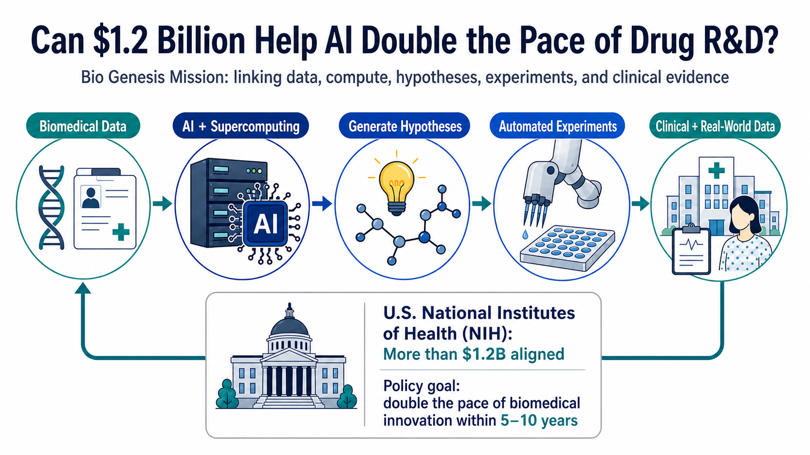
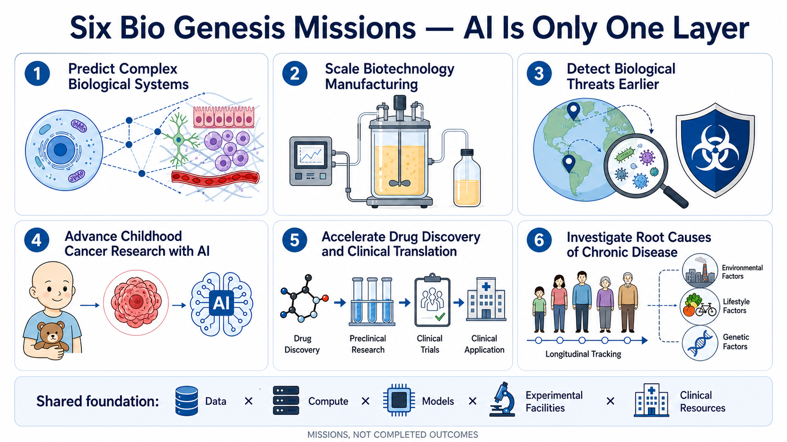
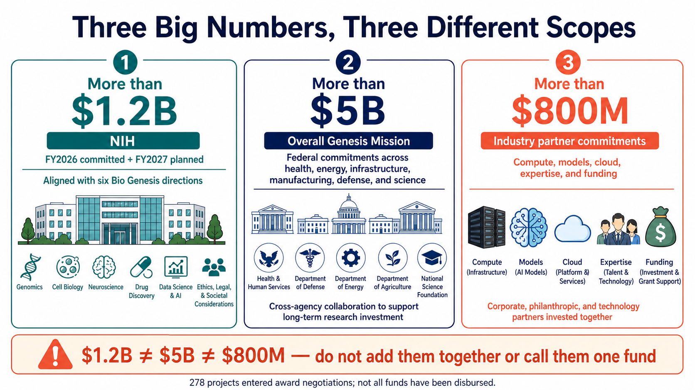
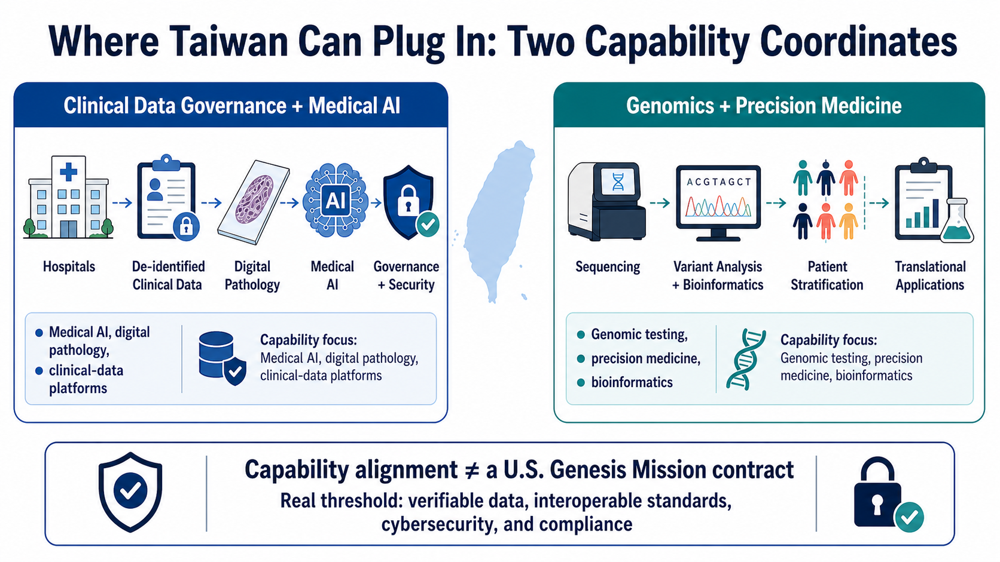

# Can $1.2 Billion Help AI Double the Pace of Drug R&D?

From target discovery and experimental design to clinical development, the United States is trying to reconnect the entire drug R&D process around AI.

On July 22, the US National Institutes of Health launched the Bio Genesis Mission, aligning more than $1.2 billion in funding. Its official ambition is larger still: double the pace of biomedical innovation over the next five to ten years, or cut the time from scientific discovery to patients in half within a decade.

Bio Genesis is meant to connect national-laboratory supercomputing, federal genomic and clinical data, AI agents, automated laboratories, hospitals, cancer centers, and FDA regulatory capabilities. What the United States wants to rebuild is the operating system for biomedical research.

But the $1.2 billion is not a newly approved fund that has already been disbursed in full. It combines funding committed in fiscal 2026 with resources planned for fiscal 2027. The White House's figure of more than $5 billion also covers the broader Genesis Mission across energy, manufacturing, defense, health, and other scientific priorities; it cannot all be attributed to Bio Genesis.

The hardest question may not be whether the AI is intelligent enough. It is whether sensitive data can move safely across institutions, whether AI-generated hypotheses can survive experimental replication, and whether the resulting evidence can actually reach patients.

*Figure 1 | Bio Genesis aims to connect governed biomedical data, AI supercomputing, hypothesis generation, automated experiments, and clinical evidence in a repeatable R&D loop.*

## 1. DOE Builds the Scientific Foundation, Then NIH Connects Biomedicine

Bio Genesis sits inside the broader Genesis Mission, which was launched by executive order in November 2025. The US Department of Energy is responsible for building the American Science and Security Platform, connecting supercomputers, national laboratories, scientific datasets, and research facilities. Health, childhood cancer, chronic disease, and translational medicine were brought into the same framework in July 2026.

A more accurate picture is that DOE is building the scientific highway. The National Institutes of Health, Department of Health and Human Services, Food and Drug Administration, and Advanced Research Projects Agency for Health then connect the data they may legally provide, their clinical networks, and their regulatory capabilities. Individual models can be replaced. Once cross-agency infrastructure is built, however, it can reshape the entire research process.

## 2. Connecting Cells All the Way to Patients

NIH has placed six missions in the same pipeline. At the front end, AI is expected to predict the behavior of cells, tissues, and complex biological systems. It is also expected to connect molecular, genomic, phenotypic, and real-world data to accelerate target discovery, drug repurposing, and clinical translation.

The middle of the pipeline addresses two gaps: how biological discoveries become scalable manufacturing processes, and how abnormal pathogen signals can be detected and attributed earlier. One connects scientific discovery to industrialization; the other connects it to public health and national security.

The final destination is the patient. Childhood cancers contain many rare subtypes, making it difficult for any single hospital to accumulate enough data. Chronic disease requires long-term population data, environmental exposure, genetics, and fundamental biology to be analyzed together. All six missions face the same wall: data are scattered across laboratories, hospitals, databases, and regulatory systems; computational findings are slow to return to experiments, and experiments often fail to connect with clinical development.

An AI signal is only a starting point. It still has to be tested in cells, animals, prospective clinical studies, and regulatory review. Treating correlation as causation would merely allow researchers to take the wrong path faster.

*Figure 2 | The six Bio Genesis missions span complex biological systems, manufacturing scale-up, biological threats, childhood cancer, translational medicine, and chronic disease. AI is one shared layer of the infrastructure.*

## 3. The $1.2 Billion, $5 Billion, and $800 Million Figures Describe Different Things

Large policy programs are easily reduced to a headline, so the funding definitions need to be separated.

The first figure is NIH's "more than $1.2 billion."

That amount contains three components: funding already committed in 2026, funding planned for 2027, and resources previously directed toward related fields that are now being aligned under the same mission framework. New Bio Genesis funding opportunities are still to be announced.

The second figure is the White House's "more than $5 billion."

This is the federal commitment to the Genesis Mission as a whole. It spans health, energy, infrastructure, manufacturing, defense, and other scientific missions. It does not mean Bio Genesis alone has received $5 billion.

The third figure is "more than $800 million" in commitments from industry partners.

DOE explicitly says that this support includes compute and credits, access to foundation models, cloud infrastructure, scientific expertise, research collaboration, and direct funding. The $800 million therefore cannot be treated entirely as cash, much less converted directly into revenue for any named company.

On the same day, DOE selected 278 projects: 168 led by universities, 87 led by DOE or National Nuclear Security Administration laboratories, 19 led by companies, and four led by nonprofit organizations.

Those 278 projects remain under award negotiation, and DOE retains the right to withdraw selections. What can be confirmed today is that policy and resources are beginning to align. Whether research actually becomes twice as fast will have to be judged from completed scientific work.

*Figure 3 | The $1.2 billion, $5 billion, and $800 million figures refer to NIH resources, the broader Genesis Mission, and partner commitments, respectively. They cannot be added together or treated as one fund.*

## 4. What Could Change in Drug Development Is the Speed of Feedback

Drug development today often gets stuck in a cumbersome cycle.

Researchers begin with the literature or an existing dataset, propose a hypothesis, design an experiment, wait for a result, and then decide what to do next. Data formats, access permissions, and experimental equipment differ across institutions. Simply organizing information so that it can be compared may consume a large share of the available time.

The Genesis Mission imagines something closer to a closed loop.

Data first enter an environment with access controls and provenance tracking. Models propose candidate targets or designs. AI agents coordinate simulations and analysis. Automated laboratories test the hypotheses. The new results return to the models to determine the next cycle. Only after sufficient evidence has accumulated does the work enter clinical and regulatory development.

The most practical value of AI is to shorten each cycle of asking a question, running an experiment, receiving a result, and revising the hypothesis, while preserving an auditable record.

This also explains why DOE suddenly matters so much. NIH has biomedical research and clinical networks. FDA has regulatory data and review expertise. ARPA-H supports high-risk health research. DOE contributes national laboratories, supercomputing, scientific facilities, and experience with automated experimentation. Bio Genesis is betting that connecting these capabilities creates more leverage than any one agency building AI on its own.

Unfortunately, arrows on an organization chart are usually smoother than the real world.

Once computing capacity is available, the difficult part begins: data.

Medical records, genomic data, and clinical datasets each carry their own consent scope, ethical constraints, de-identification requirements, retention policies, and limits on reuse. Different fields, sampling methods, and patient populations cannot simply be pooled for training. Institutions must also determine who is responsible for dataset bias, provenance, intellectual-property allocation, AI-agent errors, and cross-agency cybersecurity.

The executive order already requires attention to privacy, intellectual property, cybersecurity, data standards, and provenance. The NIH director has also stressed that AI will not replace scientific judgment or peer review.

A supercomputer may compress a week of computation into an hour. It cannot turn a medical record that lacks consent, provenance, or reproducibility into reliable evidence.

## 5. Technology Companies Are Already Inside, but Procurement Values Are Not Public

DOE's collaboration list includes OpenAI, Google, Microsoft, AWS, NVIDIA, AMD, IBM, Intel, Oracle, Palantir, xAI, and other companies. The list shows who has entered the network; it does not disclose procurement amounts.

The participants should be viewed across three layers. The first is compute, cloud infrastructure, permissions, cybersecurity, and provenance, which provide a secure environment for sensitive scientific data. The second is whether scientific models and automated experiments can reproduce results across datasets and laboratories. The third is whether pharmaceutical companies, CROs, hospitals, diagnostics providers, and manufacturers can carry those results into clinical development.

No matter how polished the first two layers look, the system remains an expensive research demonstration if the third layer never reaches patients.

## 6. Two Capability Coordinates to Watch in Taiwan

For Taiwan, a more useful question is this: which local companies genuinely sit at the points where data become computable and research results become translatable?

AetherAI Emerging Co. (7803) develops digital-pathology workflows, pathology-image annotation, and AI-assisted analysis, and integrates those systems into hospital pathology departments and pharmaceutical research workflows. Its capabilities map to a critical part of Bio Genesis: converting information that is scattered across glass slides, manual interpretation, and hospital processes into a digital workflow that models can analyze and clinicians can use.

Genomics BioSci & Tech Emerging Co. (4195) provides multiple generations of sequencing, whole-genome, RNA, methylation, single-cell, microbiome, proteomics, and bioinformatics services, and has expanded into nucleic-acid and peptide CRDMO services. It sits closer to another part of the chain: generating and organizing multi-omics data, then advancing the work toward biomarkers and early translational manufacturing.

The two companies represent different modules. AetherAI is oriented toward clinical imaging and pathology workflows; Genomics BioSci & Tech is oriented toward genomics, multi-omics, and early translational services. Neither is currently listed as a Genesis Mission partner, and there is no primary-source evidence that either has received a Bio Genesis order.

That boundary matters. Capability alignment and direct commercial exposure are not the same thing.

The larger lesson for Taiwan is that no single company can reproduce a national closed loop of this scale. The gaps to address are cross-hospital data standards, patient consent and governance, trusted computing environments, clinical validation, and collaboration that connects research findings with manufacturing and regulation.

*Figure 4 | In Taiwan, digital pathology and clinical-data governance form one capability coordinate, while genomics and multi-omics form another. Capability alignment does not imply a US government contract.*

## 7. The Next Test Is Three Implementation Scorecards

Bio Genesis has only just begun. It is too early to declare that it will double the pace of drug development.

The first scorecard will be funding: when NIH announces new programs, how much each of the six missions receives, and how much of the total is genuinely incremental. The second will be the platform: whether the American Science and Security Platform can demonstrate a publicly verifiable data-to-model-to-experiment workflow.

The most important third scorecard remains clinical and regulatory. How will sensitive data be licensed and traced? How many AI-identified targets enter prospective experiments? What standards will FDA use to evaluate AI-generated evidence?

It does not matter how many times faster a slide deck claims the process has become. The final metric is how much less time patients have to wait.

The grandeur of the program's name is beside the point. If Bio Genesis is valuable, it will eventually be visible in one concrete outcome: whether a reliable discovery reaches patients sooner.

## References

*Sources checked through July 26, 2026, 14:00 (UTC+8).*

1. [NIH - Bio Genesis Mission](https://www.nih.gov/bio-genesismission)
2. [NIH Director - Statement on the Launch of the Bio Genesis Mission](https://www.nih.gov/about-nih/nih-director/statements/statement-launch-bio-genesis-mission-nihs-component-national-genesis-mission)
3. [The White House - More Than $5 Billion for the Genesis Mission](https://www.whitehouse.gov/releases/2026/07/45502/)
4. [Executive Order 14363 - Launching the Genesis Mission](https://www.federalregister.gov/documents/2025/11/28/2025-21665/launching-the-genesis-mission)
5. [DOE - First Genesis Mission Projects Selected](https://www.energy.gov/articles/secretary-energy-chris-wright-announces-first-genesis-mission-projects-selected-accelerate)
6. [DOE - More Than $800 Million in Partner Commitments](https://www.energy.gov/undersecretaryforscience/articles/us-department-energy-announces-more-800-million-partner)
7. [HHS - HHS Joins the Genesis Mission](https://www.hhs.gov/press-room/hhs-joins-genesis-mission-ai-chronic-disease-research.html)
8. [DOE - Genesis Mission Collaboration](https://www.energy.gov/undersecretaryforscience/genesis-mission/genesis-mission-collaboration)
9. [TWSE Market Insights - AetherAI](https://www.twse.com.tw/market_insights/zh/detail/8a8216d69dbea9fd019e25ffea930207)
10. [AetherAI - Our Service](https://www.aetherai.com/our-service)
11. [AetherAI - About](https://www.aetherai.com/zh/about)
12. [TWSE Market Insights - Genomics BioSci & Tech](https://www.twse.com.tw/market_insights/zh/detail/8a8216d69dbea9fd019dd856ecae00a6)
13. [Genomics BioSci & Tech - Multi-Omics Services](https://www.genomics.com.tw/tw/product/product0?cate=cate1)
14. [Genomics BioSci & Tech - CRDMO Services](https://www.genomics.com.tw/tw/product/product8?cate=cate3)

## Disclaimer

This article organizes information about biotechnology, public policy, and industry developments. It does not constitute medical, investment, or product-specific advice. Funding levels, project status, and partner lists may change; readers should consult the latest official disclosures.
