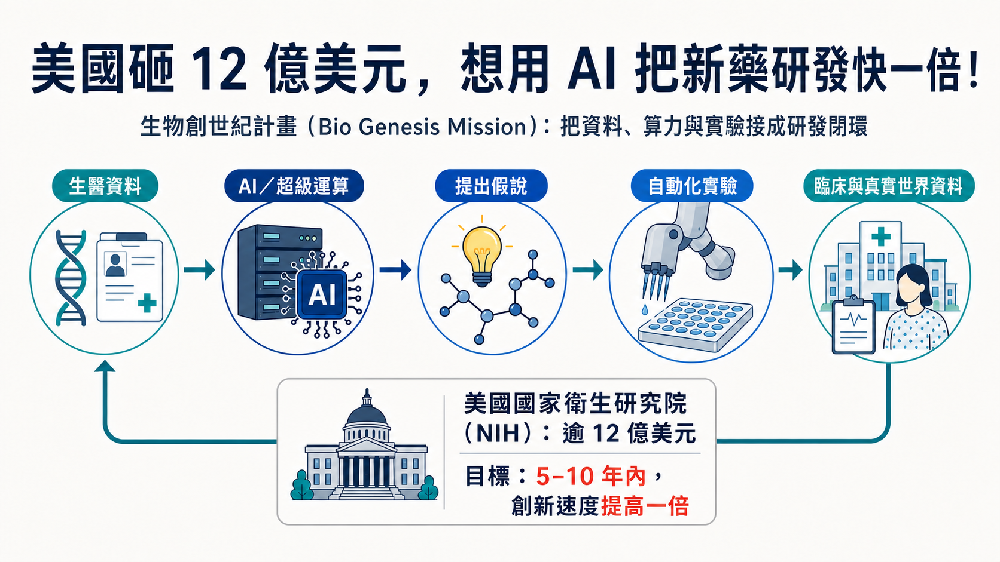
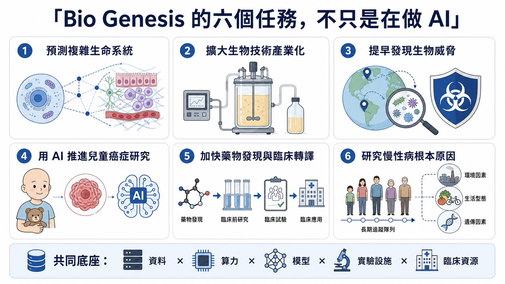
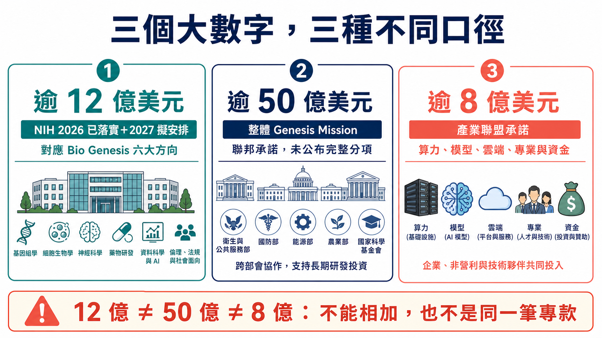
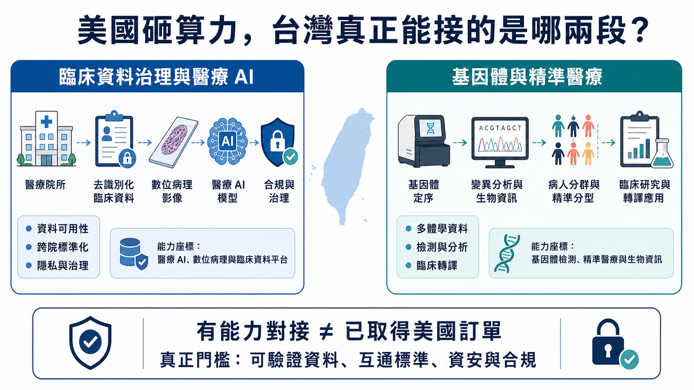

# 美國砸 12 億美元，想用 AI 把新藥研發快一倍！

從找靶點、做實驗到進臨床，美國想用 AI 把整條新藥研發流程重接一次。

7 月 22 日，美國國家衛生研究院（NIH）啟動「生物創世紀計畫」（Bio Genesis Mission），對齊超過 12 億美元資金。官方目標更大：未來 5 至 10 年讓生醫創新速度加倍，或在 10 年內把科學發現走到患者的時間縮短一半。

Bio Genesis 要接起國家實驗室超算、聯邦基因體與臨床資料、AI 代理、自動化實驗室、醫院、癌症中心與 FDA 監管能力。美國想重做的，是整個生醫研究作業系統。

但 12 億美元不是一筆剛核定、全數撥付的新基金；其中同時包含 2026 會計年度已承諾與 2027 會計年度規劃中的相關資金。白宮所說超過 50 億美元的聯邦承諾，也屬於涵蓋能源、製造、國防與健康任務的整體 Genesis Mission，不能全部算給 Bio Genesis。

接下來最難的未必是 AI 夠不夠聰明，而是敏感資料能不能安全互通、AI 提出的假說能不能被實驗重現，以及研究結果能不能真的走進患者身上。

*圖1｜Bio Genesis Mission 想把生醫資料、AI 超算、假說、自動化實驗與臨床證據接成可反覆驗證的研發閉環。*

## 一、能源部先搭科研底座，NIH 再把生醫接上去

Bio Genesis 的母體，是 2025 年 11 月由行政命令啟動的 Genesis Mission。美國能源部（DOE）負責建置「美國科學與安全平台」，把超算、國家實驗室、科學資料與研究設施接起來；2026 年 7 月，健康、兒童癌症、慢性病與藥物轉譯才被拉進同一框架。

更接近的畫面是：能源部先搭科研高速公路，再由美國國家衛生研究院（NIH）、衛生與公共服務部（HHS）、食品藥物管理局（FDA）、衛生高級研究計畫局（ARPA-H）等機構，把能合法提供的資料、臨床網路與監管能力接上去。單一模型可以更換，跨機構基礎設施一旦建成，影響的是整條研究流程。

## 二、從細胞一路接到患者

NIH 把六個任務裝進同一條管線。前端要用 AI 預測細胞、組織與複雜生命系統，也要把分子、基因體、表型與真實世界資料接起來，加快找靶點、藥物再定位與臨床轉譯。

中段瞄準兩個落差：生物學發現如何走到可放大製造，以及異常病原訊號如何更早被發現與歸因。這兩件事一邊連著產業化，一邊連著公共衛生與國家安全。

最後落到患者。兒童癌症有大量罕見亞型，單一醫院很難累積足夠資料；慢性病則要把長期人群、環境暴露、遺傳與基礎生物學放在一起看。六個任務都卡在同一堵牆：資料散在實驗室、醫院、資料庫與監管系統，計算結果很難迅速回到實驗，實驗也常接不上臨床。

AI 找到訊號只是起點。它仍要回到細胞、動物、前瞻性臨床與監管判讀；把相關性誤當因果，只會更快走錯路。

*圖2｜Bio Genesis 的六項任務涵蓋複雜生物系統、製造放大、生物威脅、兒童癌症、藥物轉譯與慢性病；AI 只是共同底座的一層。*

## 三、12 億、50 億、8 億，各有自己的口徑

這類大型政策最容易被 headline 帶著走，所以資金口徑一定要拆開。

第一個數字，是 NIH 的「超過 12 億美元」。

這 12 億美元由三部分組成：2026 年已承諾資金、2027 年規劃中資金，以及原本投入相關領域、如今被納入同一任務框架的資源；新的 Bio Genesis 資助機會之後才會公布。

第二個數字，是白宮的「超過 50 億美元」。

這是整個 Genesis Mission 的聯邦承諾，涵蓋健康、能源、基礎設施、製造、國防與其他科學任務，不是 Bio Genesis 單一計畫拿到 50 億美元。

第三個數字，是產業聯盟的「超過 8 億美元」。

DOE 說得很清楚，這些支持包含算力與額度、基礎模型使用權、雲端基礎設施、科學專業、研究合作以及直接資金。也就是說，不能把 8 億美元全部當成現金，更不能直接推算成哪一家公司的訂單。

同一天 DOE 還選出 278 個項目，包括 168 個大學主導、87 個 DOE 或 NNSA 國家實驗室主導、19 個企業主導與 4 個非營利組織主導。

278 個項目目前仍在授獎談判，能源部保留撤回權。現階段能確認的是政策與資源已開始對齊；研究速度是否真的加倍，要等完成的科學成果。

*圖3｜12 億、50 億與 8 億美元分屬 NIH、整體 Genesis Mission 與產業夥伴承諾三種不同口徑，不能相加或視為同一基金。*

## 四、新藥研發可能被改變的，是回饋速度

現在的新藥研發常卡在一個很笨重的循環。

研究者先從文獻或資料中提出假說，設計實驗，等結果，再決定下一輪。不同資料格式不一樣、權限不一樣、實驗設備不一樣，光把資料整理到可以比較，就可能耗掉大量時間。

Genesis Mission 想像的流程更像閉環：

資料先進入有權限與來源追蹤的環境，模型提出候選靶點或設計；AI 代理安排模擬與分析；自動化實驗室驗證；新結果再回到模型，決定下一輪；有足夠證據後，才接進臨床與監管流程。

AI 最實際的價值，是把「提出問題—做實驗—拿結果—再修正」的每一輪縮短，並留下可稽核紀錄。

這也解釋了為什麼 DOE 的角色會突然變得很重。NIH 有生醫研究與臨床網路，FDA 有監管資料與判讀能力，ARPA-H 做高風險健康研究；DOE 則有國家實驗室、超算、科學設施與自動化實驗經驗。Bio Genesis 賭的是把這些不同能力接起來，比任何一個部門自己做 AI 都更有槓桿。

可惜，組織圖上的箭頭通常比現實世界順。

算力到位後，真正難關才出現：資料。

病歷、基因體與臨床資料各有同意範圍、倫理、去識別、保存與再利用限制；欄位、採樣與患者族群不同，也不能直接混在一起訓練。還要回答資料偏差、來源追蹤、智財分配、AI 代理錯誤與跨機構資安由誰負責。

行政命令已把隱私、智財、資安、資料標準與來源追蹤寫進要求；NIH 主任也強調 AI 不會取代科學判斷與同儕審查。

超算可以把一週的計算縮成一小時，卻不能把沒有同意、沒有來源、不能重現的病歷變成可靠證據。

## 五、科技公司先進場，採購金額還沒公開

DOE 合作名單可見 OpenAI、Google、Microsoft、AWS、NVIDIA、AMD、IBM、Intel、Oracle、Palantir、xAI 等公司。合作名單只顯示誰已進入網路，採購金額仍未公開。

這張名單要分三層看。第一層是算力、雲端、權限、資安與來源追蹤，讓敏感科研資料有地方安全運作；第二層是科學模型與自動化實驗能否跨資料集、跨實驗室重現；第三層才是藥廠、CRO、醫院、檢測與製造端，能不能把結果一路接到臨床。

前兩層做得再漂亮，若第三層走不進患者，仍然只是很昂貴的科研展示。

## 六、台灣可看兩個能力座標

台灣這一題，比較有用的問法是：本地哪些公司真的站在「資料變得可運算」與「研究結果可轉譯」的節點上？

雲象科技－創（7803）做的是數位病理工作流程、病理影像標註與 AI 輔助分析，也把系統接進醫院病理科與藥廠研究流程。它對應的是 Bio Genesis 裡很關鍵的一塊：如何把原本散在玻片、人工判讀與醫院流程中的資料，轉成可供模型分析、又能回到臨床使用的數位工作流。

基米－創（4195）提供不同世代定序、全基因體、RNA、甲基化、單細胞、微生物體、蛋白質體與生資分析，也延伸到核酸與胜肽 CRDMO。它比較靠近另一段：多體學資料如何被生成、整理，並往生物標記與早期轉譯製造推進。

兩家公司代表的是不同模組。雲象偏臨床影像與病理工作流，基米偏基因體、多體學及早期轉譯服務。它們都不是美方目前公布的 Genesis Mission 合作夥伴，也沒有一級證據顯示拿到 Bio Genesis 訂單。

這個邊界不能省略。能力相近，和直接受惠，是兩件事。

對台灣更大的提醒反而是：單一公司不可能複製美國這種國家級閉環。台灣要補的是跨院資料標準、患者同意與治理、可信任運算環境、臨床驗證，以及研究結果接到製造和法規的協作方式。

*圖4｜台灣可觀察臨床資料治理與醫療 AI，以及基因體與精準醫療兩個能力座標；能力對位不等於取得美方合約。*

## 七、接下來看三張落地成績單

Bio Genesis 剛啟動，現在就宣告它會讓新藥研發翻倍，太早了。

第一張成績單會來自資金：NIH 新專項何時公布，六個方向各拿多少，新增預算又占多少。第二張來自平台：American Science and Security Platform 能否跑出一條可公開驗證的「資料—模型—實驗」工作流。

最關鍵的第三張，仍在臨床與監管。敏感資料如何授權與追蹤來源？AI 找到的靶點有多少走進前瞻性實驗？FDA 又會用什麼標準判斷 AI 生成的證據？

投影片上快了幾倍沒有意義。患者少等了多久，才是最後那張成績單。

宏大的計畫名稱不重要。Bio Genesis 若真有價值，最後會反映在一件很具體的事：一項可靠發現，能否更快走到患者面前。

## 參考資料

*查證截止：2026-07-26 14:00（UTC+8）*

1. [NIH — Bio Genesis Mission](https://www.nih.gov/bio-genesismission)
2. [NIH Director — Statement on the Launch of the Bio Genesis Mission](https://www.nih.gov/about-nih/nih-director/statements/statement-launch-bio-genesis-mission-nihs-component-national-genesis-mission)
3. [The White House — More Than $5 Billion for the Genesis Mission](https://www.whitehouse.gov/releases/2026/07/45502/)
4. [Executive Order 14363 — Launching the Genesis Mission](https://www.federalregister.gov/documents/2025/11/28/2025-21665/launching-the-genesis-mission)
5. [DOE — First Genesis Mission Projects Selected](https://www.energy.gov/articles/secretary-energy-chris-wright-announces-first-genesis-mission-projects-selected-accelerate)
6. [DOE — More Than $800 Million in Partner Commitments](https://www.energy.gov/undersecretaryforscience/articles/us-department-energy-announces-more-800-million-partner)
7. [HHS — HHS Joins the Genesis Mission](https://www.hhs.gov/press-room/hhs-joins-genesis-mission-ai-chronic-disease-research.html)
8. [DOE — Genesis Mission Collaboration](https://www.energy.gov/undersecretaryforscience/genesis-mission/genesis-mission-collaboration)
9. [TWSE Market Insights — 雲象科技](https://www.twse.com.tw/market_insights/zh/detail/8a8216d69dbea9fd019e25ffea930207)
10. [雲象科技 — Our Service](https://www.aetherai.com/our-service)
11. [雲象科技 — About](https://www.aetherai.com/zh/about)
12. [TWSE Market Insights — 基米](https://www.twse.com.tw/market_insights/zh/detail/8a8216d69dbea9fd019dd856ecae00a6)
13. [基米 — 多體學服務](https://www.genomics.com.tw/tw/product/product0?cate=cate1)
14. [基米 — CRDMO 服務](https://www.genomics.com.tw/tw/product/product8?cate=cate3)

## 免責聲明

本文為生技醫藥、政策與產業資訊整理，不構成醫療、投資或個別產品建議。政策資金、項目狀態與合作名單仍可能更新，應以官方最新公告為準。
