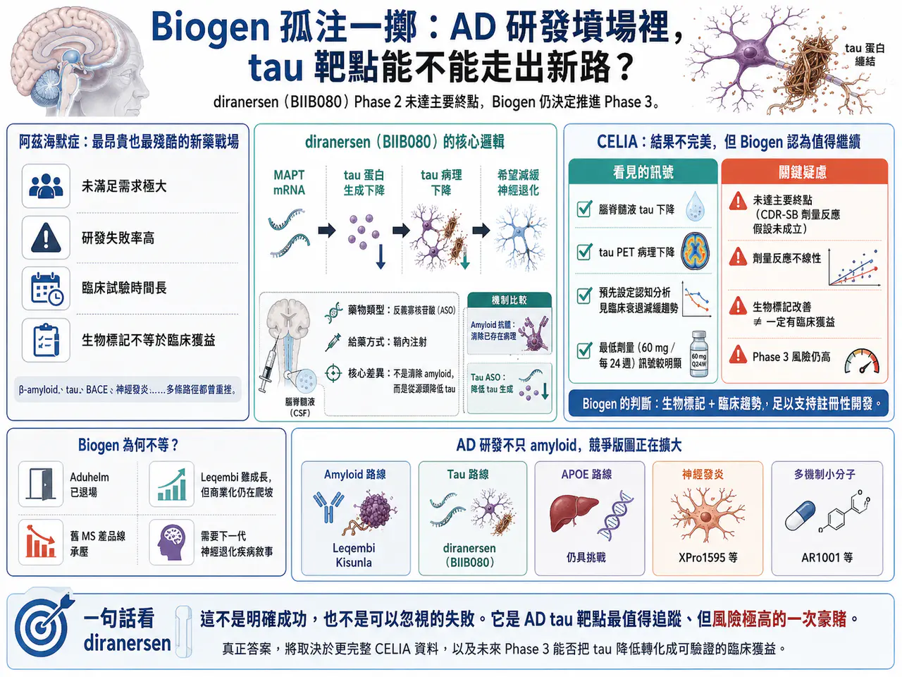
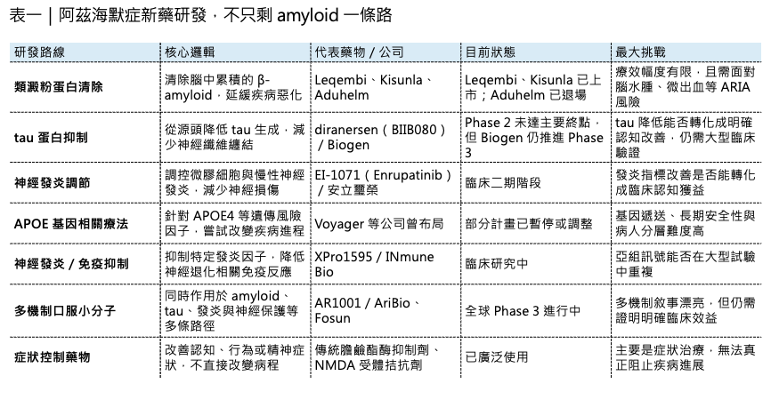
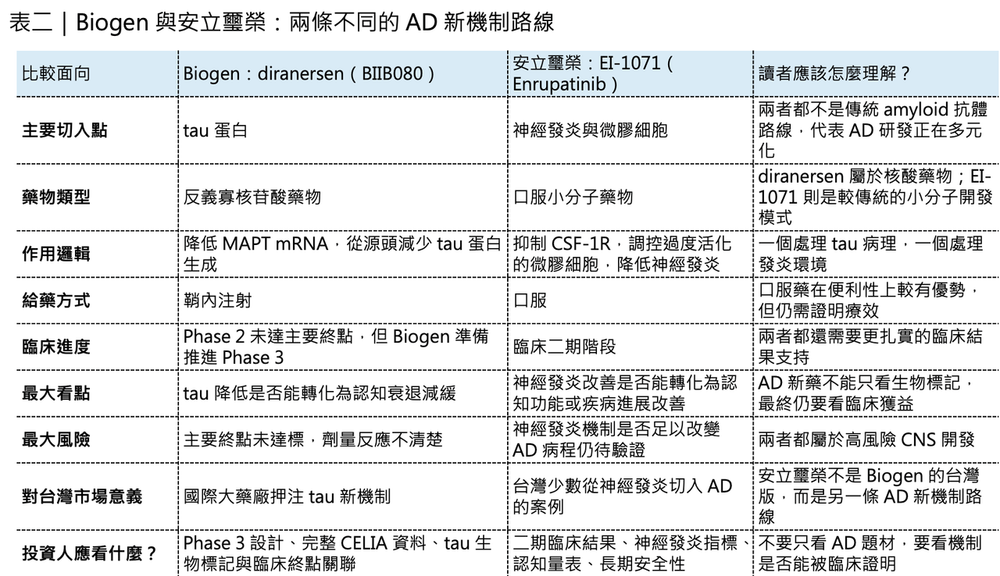

# Biogen 孤注一擲：Alzheimer’s Disease 研發墳場裡，tau 靶點能不能走出新路？

Alzheimer’s Disease（阿茲海默症，以下簡稱 AD）一直是全球新藥研發最昂貴、最殘酷、也最令人著迷的戰場之一。

這個領域燒掉了太多資金，也埋葬了太多希望。從 β-amyloid（乙型澱粉樣蛋白）到 tau protein（tau 蛋白），從 BACE inhibitor 到單株抗體，從基因療法到神經發炎調節，每一條路徑都曾經被寄予厚望，也幾乎都經歷過重挫。

但大型藥廠仍然不願離場。

原因很簡單：AD 的未滿足需求太大，患者人數太多，照護負擔太重。只要有一款藥能真正延緩疾病進展，它就不只是一個重磅藥，而可能是改寫全球神經退化治療史的資產。

📌Biogen 最近又做了一個高風險決定。

它公布 diranersen（BIIB080） 治療早期 AD 的 Phase 2 CELIA 研究頂線結果。這是一款反義寡核苷酸藥物，目標是降低 tau 蛋白生成。問題是，CELIA 研究沒有達到主要終點。照一般邏輯，這種結果通常會讓公司停下來，重新設計劑量、補做研究，或至少等待更完整資料後再決定。但 Biogen 選擇繼續往 Phase 3 註冊性開發推進。

這就是整件事最值得討論的地方，Biogen 究竟是在看到別人沒看到的訊號，還是又一次在 AD 戰場上賭得太重？

## 01｜CELIA 沒有達主要終點，Biogen 卻說看到了「值得推進」的訊號
CELIA 是一項 Phase 2、隨機、雙盲、安慰劑對照研究，納入早期 AD 患者，包括因 AD 導致的輕度認知障礙，以及輕度 AD 失智患者。研究評估 diranersen 三種劑量的鞘內注射治療，時間長達 76 週。

Biogen 公告指出，這項研究沒有達到主要終點，也就是第 76 週時臨床失智評分總和量表，也就是 CDR-SB，相較基線變化與劑量反應之間的關係。這句話翻成白話就是：研究沒有證明「劑量越高，臨床效果越好」這個預先設定的主要假設。這對任何新藥都是一個問題。尤其是在 AD 這種高失敗率領域，只要主要終點沒達標，市場自然會非常警覺。

但 Biogen 仍然強調，預先設定的認知終點分析顯示，三個劑量組都看到臨床衰退減緩，其中最低劑量，也就是每 24 週 60 mg 的組別，訊號尤其明顯。公司也表示，diranersen 在所有劑量下都能明顯降低腦脊髓液 tau 與正子斷層影像測量的 tau 病理變化，且這種下降在給藥期間維持。

所以這是一個典型的「主要終點失敗，但次要與生物標記訊號看起來有希望」的案例。

這種情況最難判斷。

如果完全忽略生物標記與次要終點，有可能錯過一個真正有效但劑量設計不完美的新機制。但如果過度相信次要分析與探索性訊號，也可能把一個偶然波動誤認為療效，最後在 Phase 3 付出更大代價。

📌Biogen 選擇了前者。

它認為 tau 蛋白下降與臨床衰退減緩的組合訊號，足以支持進入註冊性開發，資本市場則沒有那麼樂觀。消息公布後，Biogen 股價先漲後跌，市場明顯對「主要終點未達標卻繼續推進」保持疑慮。

## 02｜Diranersen 的真正吸引力：它不是清除 amyloid，而是從源頭降低 tau
要理解 diranersen 為什麼仍然值得看，必須先理解 tau 在 AD 裡的角色。

過去二十多年，AD 藥物研發最重要的靶點是 amyloid。簡單說，就是大腦中異常堆積的乙型澱粉樣蛋白。Aduhelm（aducanumab）、Leqembi（lecanemab）、Kisunla（donanemab），都屬於這條路線。

📌但 AD 不只是 amyloid 的疾病，另一個核心病理，就是 tau。

Tau 原本是幫助神經細胞穩定微管結構的蛋白。正常情況下，它像支架一樣協助神經細胞內部運輸。但在 AD 中，tau 會異常磷酸化、脫離微管、聚集成神經纖維纏結。這些 tau 纏結的分布與密度，和患者認知衰退程度高度相關。這也是為什麼很多科學家相信：amyloid 可能是病程上游事件，但 tau 更直接反映神經退化與認知惡化。

Diranersen 的設計邏輯，是用反義寡核苷酸，也就是 ASO，去靶向 MAPT mRNA，從源頭降低 tau 蛋白生成。這和抗體很不一樣。抗體通常是清除已經存在的異常蛋白；ASO 則是降低蛋白產生。

也就是說，diranersen 不是拿掃把去清理已經堆積的 tau，而是試圖讓細胞少製造 tau。這條路徑如果成立，意義非常大。因為它會讓 AD 治療第一次真正從 amyloid 之外，看到一個可能影響疾病進程的分子干預路線。但這條路也有很大挑戰。ASO 需要鞘內注射，也就是把藥物打進脊髓腔附近，這比一般皮下注射或靜脈輸注更不方便。對長期慢性病患者來說，給藥方式會影響可及性與接受度。更重要的是，降低 tau 到底能不能帶來穩定臨床改善，仍然需要 Phase 3 證明。

📌生物標記漂亮，不等於患者真的記憶變好、生活能力維持更久，這是 AD 研發最殘酷的地方。

## 03｜Biogen 為什麼敢推 Phase 3？因為它在 AD 已經沒有太多退路
Biogen 的這個決定，如果單看 CELIA 資料，確實會讓人覺得激進，但如果把它放回 Biogen 過去 20 年的 AD 歷史，就比較能理解。

Biogen 在 AD 領域最有名、也最具爭議的產品，是 Aduhelm（aducanumab）。Aduhelm 在 2021 年透過 FDA 加速核准上市，成為多年來第一款獲准的 AD 新藥。但這個核准極具爭議。當年 FDA 外部諮詢委員會對其療效資料非常不認同，上市後商業化也幾乎失敗。2024 年，Biogen 宣布停止 Aduhelm 的開發與商業化，並終止授權，權利回到 Neurimmune。

這對 Biogen 是一次沉重打擊，Aduhelm 曾經被視為 Biogen 在 AD 領域的巨大商業機會，但最後變成監管爭議、商業失敗與品牌傷害的案例。Biogen 的另一條 AD 路線，是與 Eisai 共同推動 Leqembi（lecanemab）。Leqembi 是抗 amyloid 抗體，在 Clarity AD Phase 3 研究中證明能減緩早期 AD 患者臨床衰退，並於美國獲得完全核准。

它確實是 AD 領域的重要進展。但商業化速度沒有市場當初想像那麼快。2026 年第一季，Leqembi 全球終端銷售額為 1.68 億美元，年增 74%，其中美國銷售額 8,600 萬美元。這是一個快速成長的數字，但以 AD 巨大患者基數來看，仍離真正重磅藥物的想像有距離。

所以 Biogen 現在的處境很清楚，過去的多發性硬化症產品線面臨競爭與衰退，Spinraza 的增長也不再像早期那麼強，Aduhelm 已經退出，Leqembi 雖有成長，但仍需要時間證明商業化天花板。在這種背景下，diranersen 就變成 Biogen 在 AD 領域最重要的下一張牌。這不是一個低風險選擇，但對 Biogen 來說，它可能是不得不押的高風險選擇。

## 04｜Biogen 的血淚史：AD 從來不是一個普通疾病市場
AD 研發不能用一般藥物邏輯來看，在其他疾病裡，Phase 2 沒達主要終點，公司繼續推 Phase 3，可能會被認為非常不理性。但 AD 領域本來就是一個充滿不確定性的戰場。

過去失敗的藥物太多。

📌 BACE inhibitor 失敗。

📌 γ-secretase 調節劑失敗。

📌 多個 amyloid 抗體失敗。

📌 多個 tau 抗體也失敗。

Biogen 自己也經歷過 BACE 抑制劑 elenbecestat 的終止。2019 年，Biogen 與 Eisai 宣布停止 elenbecestat Phase 3 研究，原因是資料安全監測委員會認為風險效益不利。所以，AD 研發一直在一個尷尬位置。病理假說很多，生物標記越來越精密，但臨床轉化非常困難。腦中 amyloid 降了，不一定代表認知明顯改善；Tau 降了，也不一定代表生活功能真的維持；神經發炎變化，也不一定能轉成臨床獲益。

這就是 AD 新藥最痛苦的地方：它不是沒有靶點。

而是靶點與患者真實功能之間，隔著非常長的神經退化病程。所以 Biogen 推進 diranersen，其實也是在押一個更大的問題：如果 amyloid 路線只能帶來有限但可證明的延緩效果，那麼 tau 路線能不能提供下一個更強的疾病修正方向？

📌這個答案，整個產業都想知道。

## 05｜AD 賽道不是只有 amyloid，新的競爭版圖正在形成
目前 AD 研發仍然以 amyloid 與 tau 兩條主軸為核心，但整個賽道已經變得更加多元。

📌 第一條路，仍然是 amyloid 抗體。

Leqembi 和 Kisunla 已經證明，清除 amyloid 可以在早期 AD 患者中減緩臨床衰退。問題在於，這類藥物需要 amyloid 檢測、輸注或注射管理，還需要監測 ARIA，也就是 amyloid 相關影像異常，包括腦水腫和微出血。這些都限制了商業化速度。

📌 第二條路，是 tau 靶向。

Diranersen 是目前最受矚目的 tau ASO。過去 Roche 與 AC Immune 的 tau 抗體 semorinemab 曾在 Phase 2 失敗，顯示用抗體直接處理 tau 並不容易。Diranersen 的不同之處，是從 mRNA 層級降低 tau 生成，但它仍然需要證明臨床獲益。

📌 第三條路，是 APOE 靶向。

APOE4 是晚發型 AD 最重要的遺傳風險因子之一。攜帶一個 APOE4 拷貝，AD 風險明顯上升；兩個拷貝則風險更高。因此 APOE 基因療法一度受到高度關注。不過，Voyager Therapeutics 已在 2026 年 3 月暫停 APOE gene therapy 相關計畫，顯示這條路徑仍充滿技術與轉化挑戰。

📌 第四條路，是神經發炎與免疫調節。

INmune Bio 的 XPro1595 代表選擇性抑制可溶性 TNF 的方向。這類藥物想處理的是 AD 中慢性神經發炎與免疫失衡問題。但目前神經發炎療法仍缺乏明確成功案例。

📌 第五條路，是多機制小分子。

例如 AriBio 的 AR1001，是一款口服 PDE5 inhibitor，主張同時影響 amyloid、tau、神經發炎與神經保護。Fosun Pharma 已取得相關權益，其全球 Phase 3 POLARIS-AD 研究備受關注。

這些方向說明 AD 已經不再只是 amyloid 單一路線，但真正能走出來的，還要看 Phase 3 臨床結果。因為 AD 市場最不缺的，就是有道理的機制。真正稀缺的是可重複、可監管、可商業化的臨床獲益。

## 06｜Diranersen 的最大問題：生物標記能不能變成臨床獲益？
Diranersen 現在最核心的問題，只有一個：tau 降了，患者到底有沒有變好？

Biogen 公告強調，diranersen 能降低腦脊髓液 tau 與 PET 影像上的 tau 病理變化，且預先設定的認知終點分析看到臨床衰退減緩訊號。

這些都很重要，但市場擔心的是，主要終點沒有達到，而且劑量反應不符合預期。在藥物開發裡，劑量反應很重要，因為它能支持療效與藥物作用之間的因果關係。如果最低劑量看起來效果最好，中高劑量反而沒有更清楚的臨床優勢，市場自然會問：

📌 這是生物學真相？

📌 還是樣本波動？

📌 是高劑量不必要？

📌 還是數據不穩？

📌 是 tau 降低太多反而有問題？

📌 還是臨床量表噪音太大？

這些問題目前沒有完整答案。Biogen 計畫在 2026 年 7 月的 Alzheimer’s Association International Conference，也就是 AAIC，公布更完整 CELIA 資料。這會是評估 diranersen 真實價值的重要時點。在那之前，最合理的態度不是否定，也不是盲目樂觀，而是承認它是一個高風險但值得追蹤的訊號。

## 07｜為什麼 Biogen 不能等？因為 CNS 公司的時間成本太高
Biogen 現在其實面臨一個典型大型 CNS 公司困境，如果它等待更完整 Phase 2b 劑量優化研究，時間可能又要多花好幾年。

但 AD 市場競爭不會等它，Leqembi 正在放量，Kisunla 已上市，更多 amyloid、tau、神經發炎、基因療法、口服小分子都在推進。Biogen 若想維持 AD 領域話語權，就必須持續押注，這就是為什麼它選擇直接推進註冊性開發。

📌從科學角度看，這可能太冒險。

📌從企業戰略看，它可能又是不得不做。

這也是 Biogen 被稱為「孤注一擲」的原因，不是因為它只剩這一個藥，而是因為它若在 AD 領域再次失去下一代機制的領先位置，未來就很難再把自己包裝成神經科學創新巨頭，對 Biogen 來說，diranersen 不只是一個藥。它是公司神經退化疾病敘事能否翻新的關鍵。

## 08｜台灣可以怎麼看？安立璽榮從神經發炎切入阿茲海默症
台灣目前沒有直接對應 Biogen diranersen（BIIB080） 這類 tau 反義寡核苷酸藥物的公司，但可以觀察 安立璽榮-KY。

安立璽榮的阿茲海默症候選藥物 EI-1071（Enrupatinib），走的不是類澱粉蛋白或 tau 路線，而是切入 神經發炎與微膠細胞調節。它是一款口服小分子 CSF-1R 抑制劑，目標是調控大腦中過度活化的微膠細胞，降低慢性神經發炎，進而嘗試延緩認知退化。

這代表阿茲海默症研發已經不只剩下 amyloid 和 tau 兩條路。對台灣投資人來說，安立璽榮真正值得觀察的是：EI-1071 能不能在臨床二期證明神經發炎指標改善，並進一步轉化成認知功能或疾病進展的臨床獲益。

## 結語｜Biogen 還不想退出 AD 牌桌，但這一局風險極高
回到最初的問題：Biogen 為什麼在 CELIA 主要終點未達標後，仍要把 diranersen 推進 Phase 3？

答案並不單純。

從科學角度看，diranersen 確實提供了一些前所未有的 tau 相關訊號，包括腦脊髓液 tau 降低、tau 影像病理下降，以及某些認知終點上的臨床衰退減緩趨勢。從風險角度看，它也存在明顯不確定性。主要終點未達標、劑量反應不線性、療效大小尚未完整揭露、給藥方式不方便，這些都讓 Phase 3 風險非常高。

從企業角度看，Biogen 沒有太多時間慢慢等。

Aduhelm 已經退場，Leqembi 還在商業化爬坡，舊 MS 產品線承壓，公司需要新的神經退化疾病敘事。Diranersen 就是它現在最重要的賭注之一。AD 藥物研發本來就是一部不斷從失敗裡學習的歷史。每一次失敗，都讓產業更了解 amyloid、tau、神經發炎、基因風險與病人分層。每一次成功，即使只是延緩一點點，也可能打開下一代療法的門。Diranersen 現在站在這個交界點上，它還不是成功。但也不是可以輕易忽略的失敗。真正的答案，會在更完整的 CELIA 資料，以及未來 Phase 3 設計中逐步出現。

Biogen 的態度很清楚：它不想退出 AD 這張牌桌。

但這一次，它押上的不是 amyloid，而是 tau，在 AD 這個新藥墳場裡，這可能是一次勇敢的轉向，也可能是又一次昂貴的教訓。
-------------
參考資料：各公司官網與公開資料。

本文僅供產業研究與知識分享，不構成投資、醫療、募資或個股建議。
