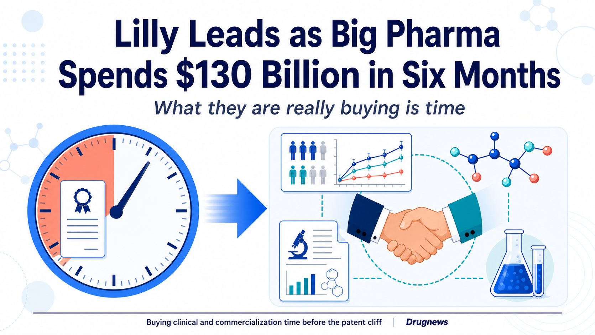
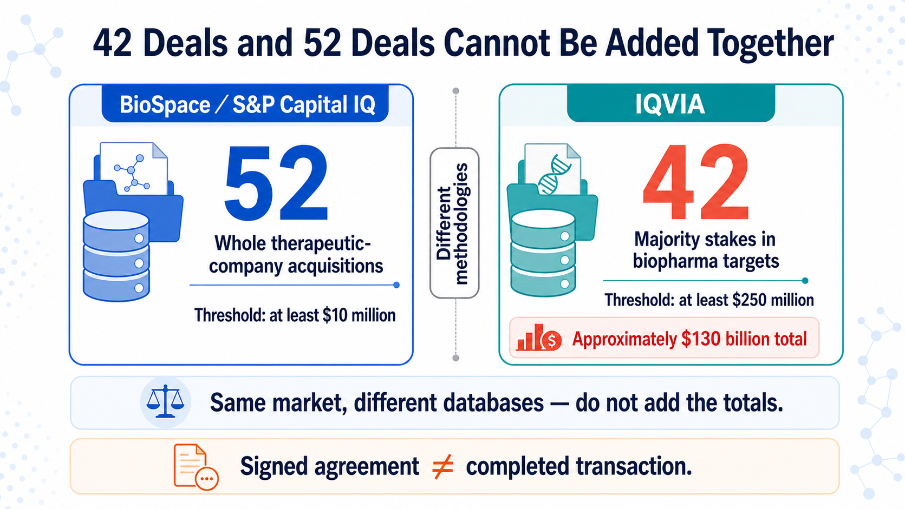
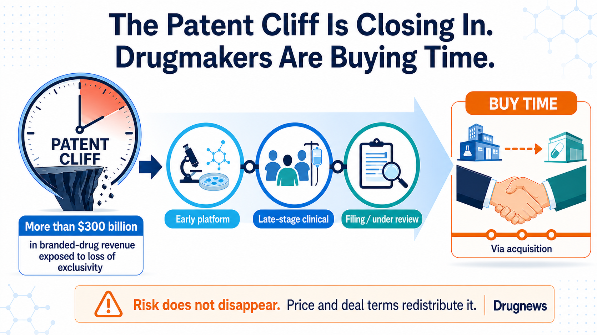
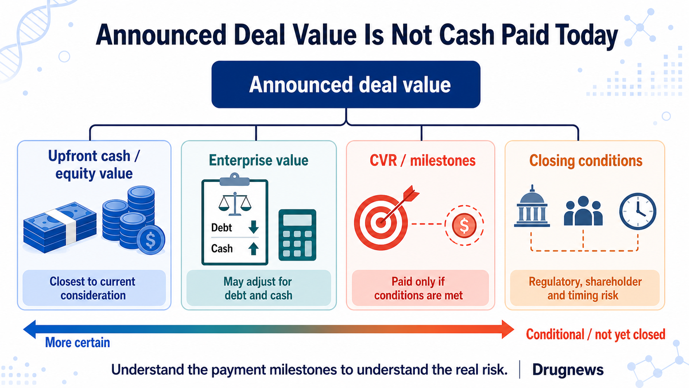

# $130 Billion in Six Months: Big Pharma Is Buying Time

Eli Lilly, Merck, AbbVie, Gilead and GSK are all buying.

In the first half of 2026, IQVIA counted 42 biopharma mergers and acquisitions worth approximately $130 billion, nearly matching the total for all of 2025. BioSpace, using a methodology focused on acquisitions of entire companies, counted 52 deals, well above roughly 30 in the same period last year. Lilly was the most active buyer, completing nine deals and committing more than $25 billion on its own.

The striking part is that the first half produced no megamerger involving a target valued above $30 billion, yet nine transactions were worth at least $5 billion. Drugmakers have shifted their attention toward late-stage assets, programs approaching a data readout, and products nearing launch.

That is because more than $300 billion in branded-drug revenue is exposed to loss of market exclusivity during this decade. What this acquisition wave is chasing is time: time that can be measured, and time that may still arrive before the patent cliff.

*Figure 1 | The central purpose of this acquisition wave is not simply to buy companies, but to secure clinical and commercialization time before the patent cliff.*

## 01 | The 52-Deal and 42-Deal Totals Use Different Methodologies

BioSpace, drawing on S&P Capital IQ, identified 52 transactions. Its list includes purchases of entire therapeutic drug companies worth at least $10 million, and transaction values may include debt and other adjustments. IQVIA instead counts transactions that secure a majority interest in a biopharma target and are worth at least $250 million. Under that definition, it recorded 42 deals totaling about $130 billion.

IQVIA states the comparison clearly: approximately $130 billion in the first half of 2026, nearly equal to the $133 billion recorded for all of 2025.

### The 52 and 42 figures describe two different deal universes

BioSpace's 52 transactions form a list of whole-company acquisitions. That list shows a clear increase from approximately 30 deals in the same period of 2025. Lilly ranked first with nine transactions and more than $25 billion in committed value.

IQVIA applies a higher threshold of $250 million. Its 42 deals averaged approximately $3.1 billion, up from $2.7 billion in 2025. Nine transactions in the first half were worth at least $5 billion, but none involved a target valued above $30 billion, the threshold for a megamerger in this analysis.

The market was not propped up by one Celgene-scale giant. Instead, it filled with targets in roughly the $5 billion to $11 billion range whose science and development timelines were relatively concrete.

PwC sees the same pattern from another angle. Biopharma deal value exceeded $65 billion in the first quarter of 2026, with 16 announced transactions at or above $1 billion. Its midyear report describes this cycle as being driven less by scale and more by precision science. Buyers prefer midsize acquisitions that can fit into existing portfolios, and they increasingly use contingent value rights, or CVRs, milestones and other conditional payments in deal structures.

*Figure 2 | The 52- and 42-deal counts use different thresholds and definitions. They describe the same market through different databases and should not be added together.*

## 02 | As the Patent Clock Runs Down, Drugmakers Buy Clinical Time

The answer begins with one number: PwC estimates that more than $300 billion in branded-drug revenue is exposed to loss of market exclusivity during this decade.

That $300 billion represents revenue at risk over the decade. Large pharmaceutical companies must build a sufficiently large new growth curve before older products lose momentum.

Early platforms can certainly be valuable. But the time, failure rate and additional capital required to move from animal studies through Phase 1, Phase 2 and pivotal trials are difficult to predict. When only a few years remain on the patent clock, buyers focus more closely on three questions: How far has the clinical evidence progressed? How long until the next readout? Can the acquired asset connect immediately to the buyer's development and commercial systems?

That is what it means to buy time.

Merck announced in March that it would acquire Terns Pharmaceuticals for an equity value of approximately $6.7 billion and completed the transaction on May 5. The core asset, TERN-701, remains in a Phase 1/2 trial for chronic myeloid leukemia. Completion of the corporate acquisition does not mean Merck purchased guaranteed revenue.

AbbVie announced in June that it would acquire Apogee Therapeutics for an equity value of approximately $10.9 billion, adding an immunology pipeline centered on atopic dermatitis and asthma. The transaction is expected to close in the third quarter and remains subject to shareholder approval and regulatory conditions. Its current status is signed, not closed.

Both transactions are doing the same thing: placing an asset with an emerging clinical profile directly into an established therapeutic franchise and commercial engine.

*Figure 3 | Acquiring assets with clearer clinical profiles can shorten the time needed to replenish a pipeline, but closing a corporate transaction does not eliminate product risk.*

## 03 | Lilly Is Shopping Aggressively, but Integration and Attrition Are the Real Tests

Lilly remained the most active buyer in the first half of 2026.

Under the whole-company acquisition methodologies used by IQVIA and BioSpace, Lilly completed nine deals. IQVIA calculates approximately $26 billion of investment, while BioSpace reports more than $25 billion in committed value. Investment, commitment and eventual cash paid are different measures.

Cash generated by GLP-1 products is being deployed beyond obesity and diabetes. Lilly has moved into immunology, neuroscience, in vivo cell therapy and vaccines. IQVIA highlights Lilly's acquisition of three vaccine companies in May as a representative example; the three transactions totaled $3.8 billion.

Lilly is diversifying GLP-1-generated cash across immunology, neuroscience, in vivo cell therapy and vaccines. For now, the only conclusion is that it is buying quickly. Whether a second pillar can grow will depend on post-acquisition trials, portfolio prioritization, integration and disciplined attrition.

An M&A review also cannot combine acquisitions, licensing deals, investments and collaborations into one trophy list. The total will look impressive, but the analysis will be distorted.

## 04 | Gilead and GSK Are Betting on Oncology Assets Closer to Commercialization

Gilead's Arcellx transaction shows the value of time particularly clearly.

Gilead completed its acquisition of Arcellx on April 28, 2026. The consideration consisted of cash plus one CVR worth $5 per share, implying an equity value of approximately $7.8 billion at closing. The target asset is anito-cel, a BCMA-directed CAR T-cell therapy still in development. Closing gave Gilead full control and removed the profit-sharing, milestone and royalty obligations in the companies' previous collaboration.

The company acquisition is complete, but anito-cel still awaits regulatory approval. Product risk did not disappear at closing.

Gilead also completed its acquisition of Tubulis on May 21. The terms included $3.15 billion in upfront cash plus up to $1.85 billion in milestones. Calling it simply a "$5 billion acquisition" combines a certain payment with amounts that will be paid only if future conditions are met. The transaction is complete, but the lead asset, TUB-040, remains in a Phase 1/2a trial. Both product risk and milestone risk remain.

GSK announced in June that it would acquire Nuvalent for a total equity value of $10.6 billion and completed the transaction on July 15. It gained two late-stage targeted lung cancer therapies, zidesamtinib and neladalkib, as well as NVL-330, a Phase 1 HER2 inhibitor. The first two assets remain under FDA review, with target decision dates of September 18 and November 27, 2026, respectively.

Nuvalent can therefore be described as a completed corporate acquisition that brought in assets approaching potential launch. It cannot be described as a case in which the products are already on the market or certain to contribute profit in 2027. GSK itself conditions future launches on FDA approval.

The three transactions form a risk spectrum. Arcellx's product awaits approval. Tubulis's lead asset remains in early clinical development, with part of the consideration tied to milestones. Nuvalent's two late-stage products still await FDA decisions. Translating "the company has been acquired" into "the product will soon generate revenue" erases the actual risk.

## 05 | Even One of the Largest Deals Cannot Be Read from the Headline Value Alone

One of the largest transactions in the first half was the Sun Pharma and Organon deal. The companies announced an enterprise value of $11.75 billion and expect the transaction to close around early 2027. BioSpace's $12.6 billion figure includes debt and other database adjustments, so it should not be treated as the cash acquisition price announced by the companies. Sun Pharma is buying women's health products, established medicines, biosimilars and global distribution. The deal shows that a mature product portfolio can also be a rational target when it fills a clearly defined gap.

*Figure 4 | An announced value is not the same as cash paid today. Payment stages and closing conditions reveal where transaction risk remains.*

## 06 | The M&A Recovery Illuminates Only a Small Group of Biotechs

For sellers, more acquisitions are clearly welcome. M&A provides an exit route beyond an initial public offering and gives companies with data but limited cash another option.

Yet this wave of activity reaches only a small group of companies with mature data and assets that can fill patent-cliff gaps. Financing conditions for most early-stage biotechs have not improved alongside it.

PwC is seeing more surgical transactions. Assets must fill patent gaps, enter high-growth categories and preferably offer a near-term clinical or commercial catalyst. Buyers also use CVRs and milestones to shift part of the failure risk back to sellers. This environment is more selective than a broad bull market.

The factors that could cool the market are equally concrete: US drug-pricing policy, most-favored-nation pricing proposals, expansion of Inflation Reduction Act negotiations, tariffs, cross-border reviews and uncertainty in US-China policy could all change valuations and payment terms. If a small number of large drugmakers bid popular assets to high prices, boards may also choose to wait for more data rather than chase the market.

Whether the market remains hot in the second half therefore cannot be projected from first-half aggregate value alone. More reliable indicators include:

1. Whether the number of billion-dollar transactions continues, rather than whether one enormous deal appears;
2. Whether upfront cash represents a shrinking share of total transaction value as milestones grow;
3. Whether buyers continue to prefer Phase 3, pre-filing or FDA-reviewed assets;
4. Whether announced transactions move from signing headlines to closing on schedule;
5. Whether acquired assets are accelerated, delayed or discontinued within one year of the transaction.

## 07 | What Should Readers in Taiwan Watch?

There is not enough primary-source evidence to identify a Taiwan-listed or over-the-counter company as a direct beneficiary of this wave, so there is no reason to force a thematic stock connection. Taiwan biotechs should pay closer attention to buyer preferences: clinical data must establish differentiation, the pivotal-trial path must be clear, global rights must be clean, and chemistry, manufacturing and controls, or CMC, plus supply capabilities must connect to a large pharmaceutical company. A platform may support an ambitious vision, but transaction documents still have to withstand due diligence.

For investors, any claim about a "maximum transaction value" should first be separated into cash, equity value, enterprise value, CVRs and milestones. Any claim that a transaction is "complete" should then be checked against the company's announcement to determine whether it was merely announced, signed or actually closed. Those two steps will filter out many numbers that appear more dramatic than they are.

## Conclusion | A Hundred-Billion-Dollar Half-Year Spent on Time

BioSpace's 52 transactions and IQVIA's 42 transactions both point to a hotter M&A market. But different methodologies cannot be merged into one number, and aggregate deal value alone cannot establish that the biotech funding winter is over.

In this cycle, buyers are competing for clinical time, and they need it to arrive before the patent cliff. The closer an asset is to a readout, filing or launch, the more easily its price can rise. Risk has not disappeared. It has been redistributed across upfront cash, CVRs, milestones and closing conditions.

Large pharmaceutical companies have not suddenly become romantic. They are watching the patent clock and beginning to buy time with cash.

## References

Verified through July 19, 2026.

1. [BioSpace, H1 2026 M&A count and methodology](https://www.biospace.com/business/biopharma-strikes-50-m-as-deals-in-h1-led-by-lillys-25b-spend)
2. [IQVIA, Biopharma M&A: Mid-year 2026 update](https://www.iqvia.com/locations/emea/blogs/2026/07/biopharma-ma-mid-year-2026-update)
3. [PwC, US Deals 2026 midyear outlook](https://www.pwc.com/us/en/industries/health-industries/library/pharma-life-sciences-deals-outlook.html)
4. [Merck/Terns transaction agreement](https://www.merck.com/news/merck-to-acquire-terns-pharmaceuticals-inc-expanding-its-hematology-pipeline-with-tern-701-a-novel-candidate-for-chronic-myeloid-leukemia-cml/)
5. [Merck completion of Terns acquisition](https://www.merck.com/news/merck-completes-acquisition-of-terns-pharmaceuticals-inc/)
6. [AbbVie/Apogee transaction announcement](https://investors.abbvie.com/news-releases/news-release-details/abbvie-acquire-apogee-therapeutics-deepening-immunology)
7. [Gilead completion of Arcellx acquisition](https://www.gilead.com/news/news-details/2026/gilead-sciences-completes-acquisition-of-arcellx-ahead-of-potential-commercial-launch-of-anito-cel)
8. [Gilead completion of Tubulis acquisition](https://investors.gilead.com/news/news-details/2026/Gilead-Sciences-Completes-Acquisition-of-Tubulis-Further-Strengthening-Oncology-Portfolio/default.aspx)
9. [GSK/Nuvalent transaction agreement](https://www.gsk.com/en-gb/media/press-releases/gsk-enters-agreement-to-acquire-nuvalent-inc/)
10. [GSK completion of Nuvalent acquisition](https://www.gsk.com/en-gb/media/press-releases/gsk-completes-acquisition-of-nuvalent-inc/)
11. [Sun Pharma/Organon definitive agreement](https://www.organon.com/news/sun-pharma-signs-definitive-agreement-to-acquire-organon/)

## Disclaimer

This article summarizes biopharma and industry trends. It does not constitute medical diagnosis, treatment advice or investment advice. Transaction values may differ depending on whether they refer to equity value, enterprise value, debt, cash, CVRs or milestones. Investment decisions should be based on company announcements and regulatory filings.
