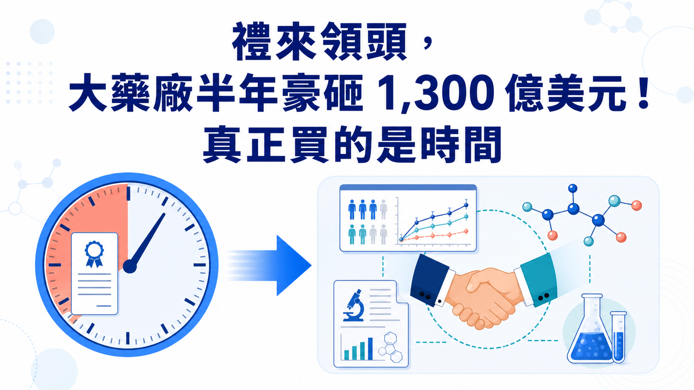
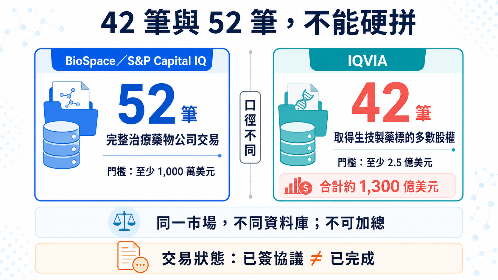
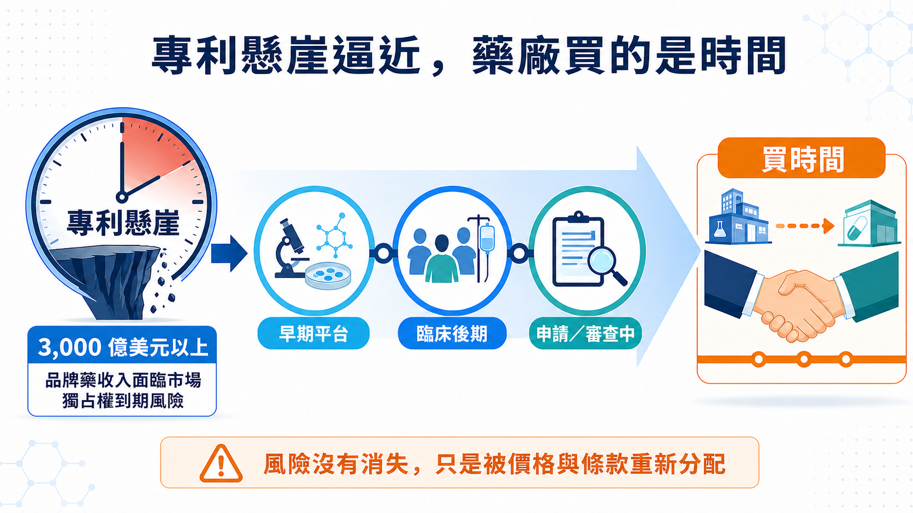
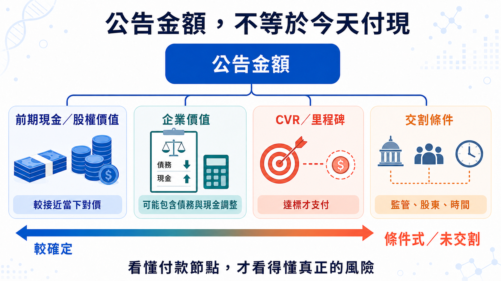

# 禮來領頭，大藥廠半年豪砸 1,300 億美元搶時間！

禮來、默沙東、艾伯維、吉利德、GSK，全都在買。

2026 年上半年，IQVIA 統計 42 筆生技製藥併購，總額約 1,300 億美元，幾乎追平 2025 全年；BioSpace 的完整公司收購口徑則數到 52 筆，明顯高於去年同期約 30 筆。最積極的禮來，一家公司就完成 9 筆、承諾金額超過 250 億美元。

有趣的是，上半年沒有標的價值超過 300 億美元的巨型合併，卻有 9 筆交易達 50 億美元以上。藥廠把目光移到臨床後期、即將讀出或接近上市的資產。

因為本十年有超過 3,000 億美元品牌藥收入暴露在市場獨占權到期風險。這波併購搶的，是一段能被計算、也趕得上專利懸崖的時間。

*圖 1｜半年千億美元併購的核心，不只是買公司，而是在專利懸崖前買進臨床與商業化時間。*

## 01｜52 筆與 42 筆，來自兩套統計口徑

BioSpace 依 S&P Capital IQ 統計到 52 筆交易，納入的是至少 1,000 萬美元、收購完整治療藥物公司的交易，交易價值還可能包含債務與其他調整；IQVIA 的口徑則是取得生技製藥標的多數股權、交易值至少 2.5 億美元，因此得到 42 筆、合計約 1,300 億美元。

IQVIA 的原文寫得很清楚：2026 上半年約 1,300 億美元，幾乎追平 2025 全年的 1,330 億美元。

### 52 筆與 42 筆，是兩種不同交易口徑

BioSpace 的 52 筆，是一張「完整公司收購」清單。它顯示 2025 年同期約 30 筆，2026 年確實明顯變多；其中禮來以 9 筆居首，承諾金額超過 250 億美元。

IQVIA 的 42 筆則設了更高的 2.5 億美元門檻。這 42 筆平均交易規模約 31 億美元，高於 2025 年的 27 億美元；上半年共有 9 筆交易達 50 億美元以上，卻沒有一筆標的價值高於 300 億美元的「超大型合併」。

市場並非靠一樁 Celgene 等級的巨獸交易撐場，而是湧進一群 50 億到 110 億美元左右、科學與時程都相對具體的標的。

PwC 從另一個角度看到同一件事。2026 年第一季生技製藥交易額已超過 650 億美元，宣布的 10 億美元級交易有 16 筆；其年中報告直接把這一波描述為「更少由規模、更多由精準科學驅動」。買家偏好中型、可嵌入現有產品線的收購，也更常把或有價值權（CVR）、里程碑或其他條件式付款塞進交易結構。

*圖 2｜52 筆與 42 筆來自不同門檻與交易定義；同一市場、不同資料庫，不可直接加總。*

## 02｜專利時鐘倒數，藥廠搶臨床時間

答案先從一個數字開始：PwC 估計，本十年有超過 3,000 億美元的品牌藥收入暴露在市場獨占權到期風險之下。

3,000 億美元指的是本十年的收入風險曝險。大藥廠必須趕在舊產品失速前，補上一條夠大的新曲線。

早期平台當然可能很值錢，可是從動物實驗、一期、二期一路走到關鍵試驗，時間、失敗率與追加資本都很難算。當專利倒數只剩幾年，買家會更在意三件事：臨床證據走到哪裡、下一個讀出還要多久、拿進來之後能否立刻接上自己的開發與商業系統。

這就是「買時間」的意思。

默沙東 3 月宣布以約 67 億美元股權價值收購 Terns Pharmaceuticals，5 月 5 日完成交易。核心資產 TERN-701 仍在慢性骨髓性白血病一期／二期試驗；公司收購已完成，不代表已買到確定收入。

艾伯維 6 月宣布以約 109 億美元股權價值收購 Apogee Therapeutics，取得以異位性皮膚炎與氣喘為主的免疫管線。交易預計第三季完成，仍要經股東與監管條件；目前狀態停在簽約，尚未交割。

兩筆交易都在做同一件事：把一個已有臨床輪廓的資產，直接塞進既有治療領域與商業機器。

*圖 3｜買下臨床輪廓較清楚的資產，可以縮短補管線的時間，但公司交割不等於產品風險消失。*

## 03｜禮來掃貨，整合與淘汰才是驗收

2026 上半年最積極的買家仍是禮來。

依 IQVIA 與 BioSpace 的完整公司收購口徑，禮來是 9 筆；IQVIA 計算投入約 260 億美元，BioSpace 則寫承諾超過 250 億美元。「投入」「承諾」與最終實付採用不同口徑。

GLP-1 帶來的現金，正被禮來灑向肥胖與糖尿病以外的戰場：免疫、神經、體內細胞治療、疫苗都出手。IQVIA 也把 5 月一次收購三家疫苗公司視為代表性案例，三筆合計 38 億美元。

禮來正把 GLP-1 帶來的現金分散到免疫、神經、體內細胞治療與疫苗。現在只能確認它買得快；第二支柱能否長成，要看收購後的試驗、排序、整合與淘汰紀律。

併購盤點也不能把收購、授權、投資與合作混在同一張「戰利品清單」；數量會很好看，判斷卻會失真。

## 04｜吉利德與 GSK，押的是接近商業化的腫瘤資產

吉利德的 Arcellx 交易最能看出時間的價值。

吉利德在 2026 年 4 月 28 日完成收購 Arcellx，現金加一項每股 5 美元的或有價值權，完成時隱含股權價值約 78 億美元。標的是仍在開發中的 BCMA CAR-T anito-cel；交易完成讓吉利德取得完整控制權，也消除原合作中的分潤、里程碑與權利金義務。

公司收購已完成，anito-cel 仍待監管核准；產品風險沒有隨交割一起消失。

吉利德也在 5 月 21 日完成 Tubulis 收購。條件是 31.5 億美元前期現金，加上最高 18.5 億美元里程碑；新聞只寫「50 億美元收購」會把確定支付與未來達標才支付的金額混在一起。交易已完成，主力資產 TUB-040 卻仍在 I／IIa 期試驗，產品與里程碑風險都沒有消失。

GSK 6 月宣布以 106 億美元總股權價值收購 Nuvalent，並在 7 月 15 日完成交易，取得兩項後期肺癌標靶藥 zidesamtinib 與 neladalkib，以及一期的 HER2 抑制劑 NVL-330。前兩項資產仍在 FDA 審查，目標決定日分別是 2026 年 9 月 18 日與 11 月 27 日。

因此，Nuvalent 能寫成「公司收購已完成、買進接近上市的資產」，不能寫成「產品已上市、2027 年一定貢獻獲利」。GSK 自己也把未來推出產品綁在 FDA 核准前提上。

三筆交易排出一條風險光譜：Arcellx 的產品待核准；Tubulis 的主力資產仍在早期臨床，部分價金綁里程碑；Nuvalent 的兩項後期產品仍待 FDA 決定。把「公司已收購」翻成「產品即將貢獻收入」，會把真正的風險擦掉。

## 05｜最大一筆，也不能只看公告金額

上半年最大型交易之一，是 Sun Pharma 與 Organon。公司公告的企業價值為 117.5 億美元，預計 2027 年初左右交割；BioSpace 的 126 億美元則含債務等資料庫調整，不能當成公司公告的現金收購價。Sun Pharma 買的是女性健康、成熟藥、生物相似藥與全球通路，顯示只要能補上明確缺口，成熟產品組合也可能是合理標的。

*圖 4｜公告金額不等於今天付現；看懂付款節點與交割條件，才能看見交易真正保留的風險。*

## 06｜併購升溫，只照亮一小群 Biotech

對賣方而言，併購變多當然是好消息。它提供 IPO 以外的退出路徑，也讓有資料、有現金壓力的公司多一個選項。

這波熱度只照到少數資料成熟、能補專利缺口的公司；多數早期 Biotech 的融資環境仍沒有一起轉暖。

PwC 觀察到的是更「外科手術式」的交易：資產要能填專利缺口、切進高成長領域，最好有近期臨床或商業事件；買家也會用 CVR、里程碑把部分失敗風險推回賣方。這其實比全面牛市更挑剔。

接下來可能讓熱度降溫的因素也很具體：美國藥價政策、最惠國藥價構想、IRA 議價擴張、關稅、跨境審查與美中政策不確定性，都可能改變估值與付款條件。另一方面，如果熱門資產價格被少數大藥廠搶高，董事會也可能選擇等待資料，避開高點追價。

所以「下半年會不會繼續熱」不能只看上半年總額外推。更可靠的追蹤方式是：

1. 十億美元級交易的數量是否延續，而非只看一筆巨額交易；
2. 前期現金占總交易價值的比例，有沒有被里程碑愈拉愈低；
3. 買家是否持續偏好三期、申請前或 FDA 審查中的資產；
4. 已宣布交易能否從簽約新聞走到如期交割；
5. 收購後一年內，資產究竟被加速、延後，還是直接砍掉。

## 07｜台灣讀者該看什麼？

這一波沒有足夠一級證據能把台灣上市櫃公司列為直接受益者，因此不硬湊概念股。台灣 Biotech 更該注意買方偏好：臨床資料要能回答差異化、關鍵試驗路徑清楚、全球權利乾淨，CMC 與供應能接上大型藥廠。平台可以有想像力，交易文件卻必須經得起盡職調查。

對投資人而言，看到「最高交易價值」時，先拆成現金、股權價值、企業價值、CVR 與里程碑；看到「完成交易」時，再回公司公告確認究竟是已宣布、已簽約還是已交割。這兩個動作，會過濾掉不少看似驚人的數字。

## 結語｜半年千億，買的是時間

BioSpace 的 52 筆、IQVIA 的 42 筆，都指向併購轉熱；但不同口徑不能拼成一個數字，更不能只用總額宣布資本寒冬結束。

這一輪買家搶的是臨床時間，而且必須趕在專利懸崖前抵達。越接近讀出、申請或上市，價格越容易被抬高；風險還沒消失，只是被重新分配到前期現金、CVR、里程碑與交割條件裡。

大藥廠不是突然變得浪漫。它們只是看著專利時鐘，開始用現金買時間。

## 參考資料

查證截止：2026-07-19

1. [BioSpace, H1 2026 M&A count and methodology](https://www.biospace.com/business/biopharma-strikes-50-m-as-deals-in-h1-led-by-lillys-25b-spend)
2. [IQVIA, Biopharma M&A: Mid-year 2026 update](https://www.iqvia.com/locations/emea/blogs/2026/07/biopharma-ma-mid-year-2026-update)
3. [PwC, US Deals 2026 midyear outlook](https://www.pwc.com/us/en/industries/health-industries/library/pharma-life-sciences-deals-outlook.html)
4. [Merck／Terns transaction agreement](https://www.merck.com/news/merck-to-acquire-terns-pharmaceuticals-inc-expanding-its-hematology-pipeline-with-tern-701-a-novel-candidate-for-chronic-myeloid-leukemia-cml/)
5. [Merck completion of Terns acquisition](https://www.merck.com/news/merck-completes-acquisition-of-terns-pharmaceuticals-inc/)
6. [AbbVie／Apogee transaction announcement](https://investors.abbvie.com/news-releases/news-release-details/abbvie-acquire-apogee-therapeutics-deepening-immunology)
7. [Gilead completion of Arcellx acquisition](https://www.gilead.com/news/news-details/2026/gilead-sciences-completes-acquisition-of-arcellx-ahead-of-potential-commercial-launch-of-anito-cel)
8. [Gilead completion of Tubulis acquisition](https://investors.gilead.com/news/news-details/2026/Gilead-Sciences-Completes-Acquisition-of-Tubulis-Further-Strengthening-Oncology-Portfolio/default.aspx)
9. [GSK／Nuvalent transaction agreement](https://www.gsk.com/en-gb/media/press-releases/gsk-enters-agreement-to-acquire-nuvalent-inc/)
10. [GSK completion of Nuvalent acquisition](https://www.gsk.com/en-gb/media/press-releases/gsk-completes-acquisition-of-nuvalent-inc/)
11. [Sun Pharma／Organon definitive agreement](https://www.organon.com/news/sun-pharma-signs-definitive-agreement-to-acquire-organon/)

## 免責聲明

本文為生技醫藥與產業趨勢整理，不構成醫療診斷、治療建議或投資建議。交易金額可能因股權價值、企業價值、債務、現金、CVR 與里程碑口徑而不同，投資判斷應回到公司公告與監管文件。
