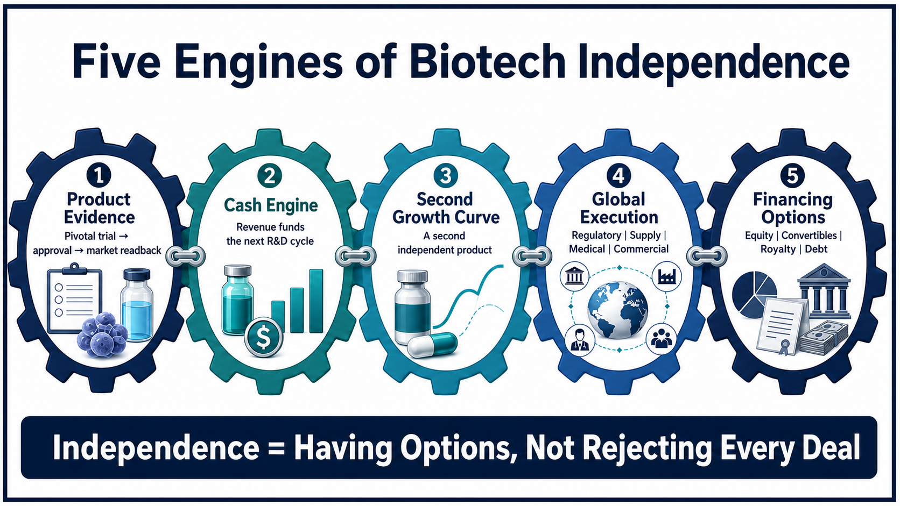
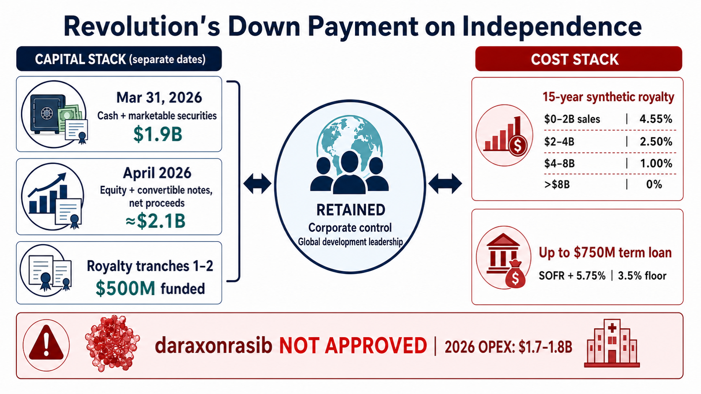
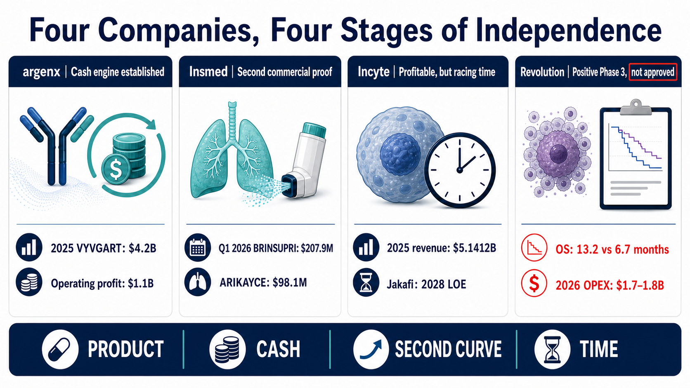
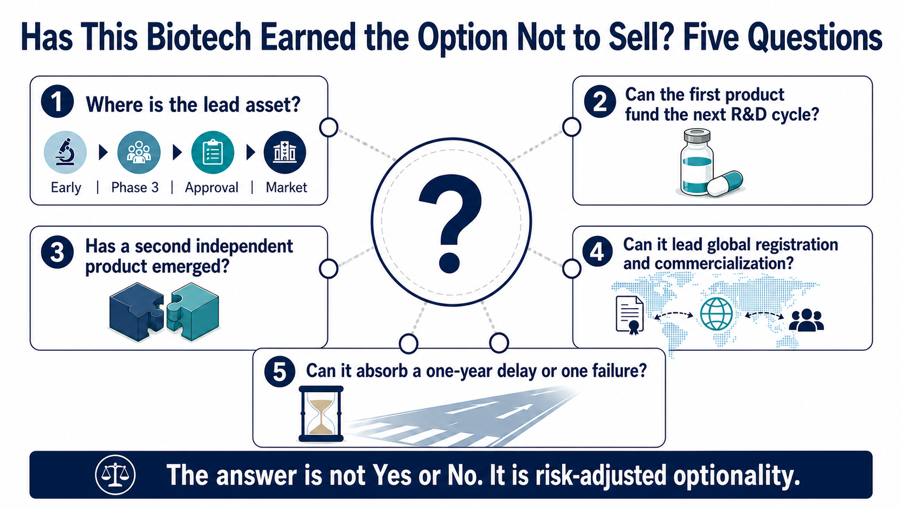

# When a Biotech Says No to a Sale: Five Tests of Whether It Can Become a Biopharma

> Evidence cut-off: July 15, 2026. This analysis puts product evidence, cash generation, a second growth curve, global execution, and financing options on the same scorecard to examine what it really costs a biotech to remain independent.

For years, the market compressed a biotech company's future into two outcomes.

One was clinical failure, followed by a rapid collapse in asset value. The other was clinical success, followed by a sale to a large pharmaceutical company.

Both outcomes are real. But treating an acquisition as the only successful finish line misses a question that is becoming increasingly important:

If a company can create more value by continuing to operate independently than it can capture in a sale today, does it still need to sell?

This is not a story about whether a founder has enough courage, nor is it a romantic tale of a small company standing up to a multinational pharmaceutical company. The ability to say no rests on five practical capabilities: product evidence, cash flow, a second growth curve, global commercialization, and access to capital without surrendering control.

argenx, Insmed, Revolution Medicines, and Incyte illustrate four different stages. The first three do not represent a single formula for success, and Incyte is not a failed company. Putting them side by side instead reveals the dividing lines that are often missed when an asset begins to turn into an operating company.

Drugnews' central view is this:

Biotech independence is not the courage to reject an MNC. It is the ability to retain core rights and reinvest the first success into a second one. Without a second growth curve, independence may simply delay a sale. Without capital and commercial capabilities, rejecting an acquisition can turn scientific value into execution risk.

## Test One: Can One Drug Become an Internal Capital Engine?

argenx has crossed this threshold.

The VYVGART franchise generated $4.2 billion in global net product sales in 2025, up 90% year over year. The company also reached full-year operating profitability for the first time, with $1.1 billion in operating profit. In the first quarter of 2026, VYVGART global net product sales reached another $1.3 billion, an increase of approximately 63% from the prior-year period. [[FY2025](https://argenx.com/news/2026/press-release-3245199); [Q1 2026](https://argenx.com/news/2026/press-release-3289577)]

The significance of those figures is not simply that the product is selling well. They show that argenx can use its own product revenue to fund three expensive activities at the same time: expanding the disease and delivery footprint of VYVGART, advancing follow-on molecules such as empasiprubart and adimanebart, and maintaining a cross-market medical, regulatory, and commercial organization.

The first product is therefore no longer only an asset waiting to be valued by a buyer. It has become an internal capital-allocation tool.

That does not make argenx risk-free. VYVGART remains the source of the company's product revenue. New indications and formulations may extend the growth of the same franchise, but they do not prove that a second independent molecule has achieved commercial validation. The next question for the market is no longer simply how many additional labels VYVGART can secure. It is whether the cash generated by VYVGART can produce the next product outside efgartigimod.

That is the difference between having cash flow and having a repeatable platform.

## Test Two: A Second Drug Shows Whether the First Success Was Repeatable

Insmed looks more like a replication test.

For a long time, Insmed was effectively synonymous with ARIKAYCE. The product generated $433.8 million in global revenue in 2025 and demonstrated that the company could develop and commercialize a therapy in the highly specialized market for Mycobacterium avium complex lung disease. Yet one successful product still leaves the market unable to tell whether the result came from organizational capability or from finding one unusually attractive asset. [[Insmed FY2025](https://investor.insmed.com/2026-02-19-Insmed-Reports-Fourth-Quarter-and-Full-Year-2025-Financial-Results-and-Provides-Business-Update)]

BRINSUPRI changes the question.

In the first quarter of 2026, BRINSUPRI generated $207.9 million, while ARIKAYCE generated $98.1 million. For full-year 2026, Insmed guided to at least $1.0 billion in BRINSUPRI revenue and $450 million to $470 million in ARIKAYCE revenue. [[Insmed Q1 2026](https://investor.insmed.com/2026-05-07-Insmed-Reports-First-Quarter-2026-Financial-Results-and-Provides-Business-Update)]

This is not merely an exercise in adding two revenue streams together. If BRINSUPRI scales as planned, it would show that Insmed's regulatory, payer, medical-affairs, and commercial organizations can support a second and different product. The first success would no longer look like a one-off event.

The next layer is TPIP. Insmed was continuing enrollment in the Phase 3 PALM-ILD study in PH-ILD and initiated the Phase 3 PALM-PAH study in PAH in April 2026. A Phase 3 study in PPF was expected to begin by the end of 2026, while a Phase 3 study in IPF was expected to begin in the first half of 2027. The company also maintained an internal objective of filing, on average, one to two investigational new drug applications each year. That creates a three-part structure: ARIKAYCE is the established base, BRINSUPRI is the second commercial validation, and TPIP plus the early-stage pipeline must show whether a third growth curve can emerge. [[Insmed Q1 2026](https://investor.insmed.com/2026-05-07-Insmed-Reports-First-Quarter-2026-Financial-Results-and-Provides-Business-Update)]

The path still consumes substantial capital. Insmed recorded a net loss of $163.6 million in the first quarter of 2026. As of the end of March, it held approximately $1.2 billion in cash, cash equivalents, and marketable securities. The rapid growth of a second product increases the value of remaining independent, but it does not mean the organization has achieved risk-free self-funding. [[Insmed Q1 2026 Form 10-Q](https://www.sec.gov/Archives/edgar/data/1104506/000110450626000032/insm-20260331.htm)]

A second drug is a birth certificate for a biopharma. It is not a graduation certificate.

## The Incyte Warning: Profitability Does Not Guarantee Belief in the Next Curve

Incyte is easy to oversimplify.

It is not an operating failure. The company reported $5.1412 billion in total revenue and $1.2867 billion in net income in 2025. Jakafi generated $3.0925 billion in net product revenue and Opzelura generated $678.5 million. In the first quarter of 2026, total revenue reached $1.27 billion, Jakafi net product revenue was $758 million, other hematology and oncology products were growing, and the company had ten Phase 3 trials under way. [[FY2025](https://investor.incyte.com/news-releases/news-release-details/incyte-reports-fourth-quarter-and-full-year-2025-financial); [Q1 2026](https://investor.incyte.com/news-releases/news-release-details/incyte-reports-first-quarter-2026-financial-results-and-provides)]

The pressure comes from timing. In its 2025 Form 10-K, Incyte states that it expects Jakafi product sales to begin declining after patent exclusivity expires in 2028 and that new products will need to offset that decline. [[Incyte 2025 Form 10-K](https://www.sec.gov/Archives/edgar/data/879169/000087916926000010/incy-20251231.htm)]

That makes Incyte a useful stress test:

- Revenue does not mean that the revenue base is sufficiently diversified.
- Profitability does not mean that the second growth curve is large enough to cross a patent cliff.
- A long list of clinical programs does not guarantee that one of them will become the next product capable of redefining the company.

The right question is not whether Incyte is a healthy business today. It is whether its current cash flow can create a replacement curve that is both large enough and early enough to arrive before Jakafi declines.

That is the most difficult coming-of-age test for a mature biotech. The first success solves survival. The second proves that the organization can create value again.

## Revolution Medicines: It Did Not Sell the Company, but It Did Sell a Smaller Claim

Revolution Medicines carries the highest risk of the four companies and offers the clearest example of how financing can change the control equation.

The status needs to be anchored to July 15, 2026.

daraxonrasib had not received approval from any regulatory authority, and Revolution Medicines had no revenue from an approved product. The program, however, was no longer just an early clinical story. The Phase 3 RASolute 302 study enrolled 500 patients with previously treated metastatic pancreatic ductal adenocarcinoma. In the intention-to-treat population, median overall survival was 13.2 months with daraxonrasib and 6.7 months with chemotherapy, with an overall-survival hazard ratio of 0.40. Progression-free survival and other primary and key secondary endpoints were also met. [[RASolute 302](https://ir.revmed.com/news-releases/news-release-details/revolution-medicines-announces-asco-plenary-presentation)]

As of July 7, 2026, the European Medicines Agency had started a phased review, and the company said the rolling submission of its new drug application to the U.S. Food and Drug Administration was nearing completion. These developments materially reduced the clinical risk around the lead asset. They did not constitute approval, and they did not prove commercial success. [[EMA phased review](https://ir.revmed.com/news-releases/news-release-details/european-medicines-agency-expedites-assessment-revolution)]

The financing side had also advanced. Revolution held $1.9 billion in cash, cash equivalents, and marketable securities as of March 31, 2026. An equity and convertible-notes offering in April brought in approximately $2.1 billion in additional net proceeds. At the same time, the company raised its 2026 GAAP operating-expense guidance to $1.7 billion to $1.8 billion and reported a first-quarter net loss of $453.8 million. [[Q1 2026 results](https://ir.revmed.com/news-releases/news-release-details/revolution-medicines-reports-first-quarter-2026-financial/); [Form 10-Q](https://ir.revmed.com/static-files/e7a99744-380a-4fa9-93b6-2fb71793c8ee); [April offering 8-K](https://www.sec.gov/Archives/edgar/data/1628171/000119312526159289/d95226d8k.htm)]

This is the real price of independence: the balance sheet is stronger, but the organization has already grown toward the cost structure of a large commercial-stage company.

The 2025 transaction with Royalty Pharma makes the trade-off even clearer.

The agreement provides up to $2.0 billion in financing. Up to $1.25 billion takes the form of a synthetic royalty on daraxonrasib, while up to $750 million is available through a senior secured term loan. After the Phase 3 result met the contractual conditions, Royalty Pharma triggered the second $250 million payment. Together with the first $250 million funded at signing, the first two tranches total $500 million. [[Funding agreement](https://www.royaltypharma.com/news/royalty-pharma-and-revolution-medicines-enter-into-funding-agreements-for-up-to-2-billion/); [2026-04-13 8-K](https://www.sec.gov/Archives/edgar/data/1802768/000119312526152145/d871473d8k.htm)]

In return, Royalty Pharma receives a 15-year, tiered claim based on annual worldwide net sales. Under the rates corresponding to the first two tranches, the royalty is 4.55% on annual net sales from zero to $2 billion, 2.50% from $2 billion to $4 billion, 1.00% from $4 billion to $8 billion, and zero on net sales above $8 billion. The rates would increase if Revolution elects to draw all remaining royalty tranches. [[Royalty Pharma 2026-04-13 8-K](https://www.sec.gov/Archives/edgar/data/1802768/000119312526152145/d871473d8k.htm)]

The package also includes up to $750 million in senior secured term loans. The first loan draw is tied to specified FDA approval conditions for daraxonrasib. The interest rate is SOFR plus 5.75%, subject to a 3.5% SOFR floor.

Revolution therefore did not sell nothing. It sold a portion of the product's future cash flows for 15 years and accepted the possibility of debt costs. What it retained was corporate control, leadership of global development and commercialization, and the remaining upside in the RAS platform.

The structure matters because the capital market now offers alternatives to an MNC acquisition. Equity, convertible debt, synthetic royalties, and milestone-based loans can turn “sell the company because it needs money” into a set of smaller, configurable decisions.

Every option has a price. Equity dilutes shareholders. Debt carries interest. A royalty removes part of successful product cash flow for the agreed 15-year period. If the lead program is delayed or commercialization underperforms, the global organization built in advance will amplify the loss.

## The Five Tests of Whether a Biotech Has Earned the Option Not to Sell

Putting the four companies on one page produces a more useful framework than asking which one might be acquired.

### 1. Product evidence

Does the lead asset only have attractive early data, or has it crossed pivotal trials, regulatory review, and real market adoption? Revolution's Phase 3 result reduced risk, but the product remained unapproved at the evidence cut-off. argenx and Insmed already had commercial readbacks.

### 2. Cash engine

Can the first product fund the next round of research, or does it only extend the company's life? argenx had reached full-year operating profitability. Insmed was expanding revenue with a second product but remained loss-making. Revolution continued to rely on the capital markets and structured financing.

### 3. Second growth curve

Does the next success come from additional indications for the same molecule, or from a separate molecule? Both can create value, but they offer different levels of evidence that the platform and organization are repeatable.

### 4. Global execution

Can the company manage multinational registration, supply, medical affairs, payer access, and commercialization itself? If every critical capability remains outsourced, retaining global rights does not necessarily mean that the company can capture global value.

### 5. Financing options and the capacity to absorb failure

Can the company secure sufficient capital without surrendering control? More importantly, if a Phase 3 trial fails or a launch is delayed by a year, can its balance sheet and organization survive? Real independence is not the ability to reject one offer. It is the capacity to endure a bad outcome after saying no.

## What Taiwan's Biotech Sector Should Take Away Is Not “Never Sell”

Taiwanese biotech companies do not need to copy argenx, Insmed, or Revolution Medicines. Nor should overseas licensing, co-development, or an acquisition be treated as failure.

For companies with smaller capital bases and still-developing global commercial experience, an early license can be a rational allocation of risk. Transferring regional rights to a more capable partner may also move a drug to patients faster.

The more useful questions are:

- Does a business-development deal merely monetize one asset, or does it buy time for the next one?
- Which geographies, indications, manufacturing rights, or co-development rights does the company retain?
- After the first product succeeds, has a second independent molecule entered the clinic?
- Does “internationalization” mean licensing assets out, or building an organization that can lead global trials and commercialization?
- Do financing tools distribute risk, or carve up too much of the future cash flow too early?

At the evidence cut-off, we did not have sufficient primary-source support to place a specific Taiwan-listed company directly into the same maturity framework. We therefore do not force a list of Taiwan stock tickers into the article. The framework is better used to examine each company's retained rights, cash runway, and second growth curve than to manufacture a concept-stock basket.

## Conclusion: Being Acquired Is Not a Defeat, and Remaining Independent Is Not a Medal

An acquisition can give a product faster access to capital, manufacturing capacity, and global distribution. Independence preserves more long-term upside for the original company, but it also leaves the clinical, regulatory, manufacturing, commercial, and financing risks inside that company.

The most accurate dividing line is therefore not whether a biotech sells. It is whether the biotech has a real choice.

An acquisition can be the successful realization of an asset's value. Choosing independence requires proof that the company can turn one success into a second. Only when the risk-adjusted value of remaining independent exceeds the acquisition premium—and when the company has the capital, organization, and resilience to absorb one failure—does “not selling” become a strategy rather than a posture.

## Primary Sources

All links below are company, SEC, or regulatory primary sources. Evidence cut-off: July 15, 2026.

1. [argenx FY2025 results](https://argenx.com/news/2026/press-release-3245199)
2. [argenx 2025 Annual Report](https://reports.argenx.com/2025/)
3. [argenx Q1 2026 results](https://argenx.com/news/2026/press-release-3289577)
4. [Insmed FY2025 results](https://investor.insmed.com/2026-02-19-Insmed-Reports-Fourth-Quarter-and-Full-Year-2025-Financial-Results-and-Provides-Business-Update)
5. [Insmed 2025 Form 10-K](https://www.sec.gov/Archives/edgar/data/1104506/000110450626000009/insm-20251231.htm)
6. [Insmed Q1 2026 results](https://investor.insmed.com/2026-05-07-Insmed-Reports-First-Quarter-2026-Financial-Results-and-Provides-Business-Update)
7. [Insmed Q1 2026 Form 10-Q](https://www.sec.gov/Archives/edgar/data/1104506/000110450626000032/insm-20260331.htm)
8. [Incyte FY2025 results](https://investor.incyte.com/news-releases/news-release-details/incyte-reports-fourth-quarter-and-full-year-2025-financial)
9. [Incyte 2025 Form 10-K](https://www.sec.gov/Archives/edgar/data/879169/000087916926000010/incy-20251231.htm)
10. [Incyte Q1 2026 results](https://investor.incyte.com/news-releases/news-release-details/incyte-reports-first-quarter-2026-financial-results-and-provides)
11. [Revolution Medicines RASolute 302 detailed results](https://ir.revmed.com/news-releases/news-release-details/revolution-medicines-announces-asco-plenary-presentation)
12. [Revolution Medicines EMA phased review release](https://ir.revmed.com/news-releases/news-release-details/european-medicines-agency-expedites-assessment-revolution)
13. [Revolution Medicines Q1 2026 results](https://ir.revmed.com/news-releases/news-release-details/revolution-medicines-reports-first-quarter-2026-financial/)
14. [Revolution Medicines Q1 2026 Form 10-Q](https://ir.revmed.com/static-files/e7a99744-380a-4fa9-93b6-2fb71793c8ee)
15. [Revolution Medicines April 2026 offering 8-K](https://www.sec.gov/Archives/edgar/data/1628171/000119312526159289/d95226d8k.htm)
16. [Revolution Medicines transaction 8-K](https://www.sec.gov/Archives/edgar/data/1628171/000119312525145242/d838043d8k.htm)
17. [Royalty Pharma and Revolution Medicines funding agreement](https://www.royaltypharma.com/news/royalty-pharma-and-revolution-medicines-enter-into-funding-agreements-for-up-to-2-billion/)
18. [Royalty Pharma 2026-04-13 8-K](https://www.sec.gov/Archives/edgar/data/1802768/000119312526152145/d871473d8k.htm)

## Disclaimer

This article is an analysis of biotechnology, corporate strategy, and capital structure. It does not constitute medical advice, a diagnosis or treatment recommendation, or investment advice. Investigational products remain subject to clinical, regulatory, manufacturing, and commercialization risks. Readers should make investment decisions independently.
