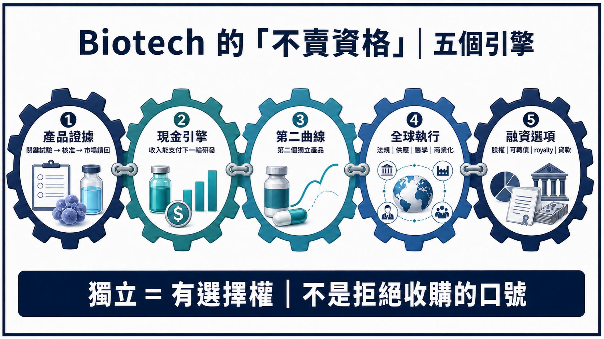
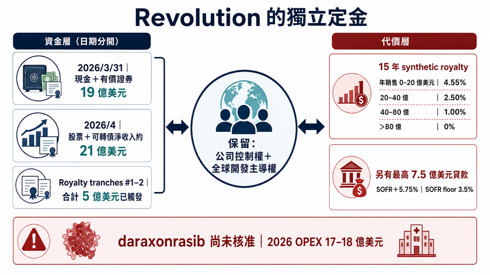
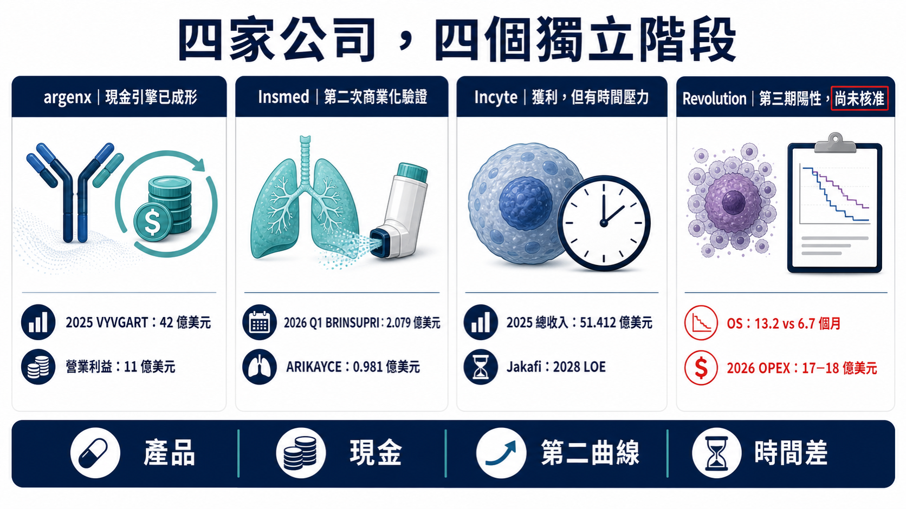
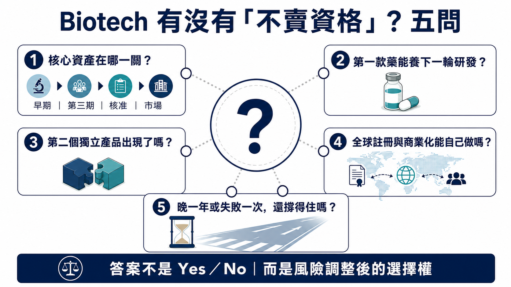

# Biotech 不賣，憑什麼？五張門票決定它能否長成 Biopharma

> 查證截止：2026-07-15。本文將產品證據、現金引擎、第二曲線、全球執行與融資選項放在同一張表上，拆解 Biotech 保留獨立經營權的真正代價。

過去談 Biotech，市場常把結局壓成兩種：

一種是臨床失敗，資產價值快速歸零；另一種是臨床成功，被大型藥廠買走。

這兩條路都是真實的。但把「被收購」當成成功的唯一終點，會漏看一個正在變重要的問題：

如果公司繼續獨立，能創造的價值已經高於今天一次賣掉的價格，它還需要急著出售嗎？

這不是創辦人有沒有骨氣，也不是「小公司對抗 MNC」的浪漫故事。真正能讓 Biotech 說不的，是五項很現實的能力：產品證據、現金流、第二條成長曲線、全球商業化，以及不讓渡控制權也能拿到資金的選項。

argenx、Insmed、Revolution Medicines 與 Incyte，剛好展示了四種不同狀態。前三家不是同一套成功模板，Incyte 也不是「失敗公司」；把它們並排，反而能看出一家公司從資產走向企業時，最容易被忽略的分水嶺。

藥時事的主判斷是：

Biotech 的獨立，不是拒絕 MNC 的勇氣，而是保留核心權利後，仍有能力把第一個成功再投資成下一個成功。沒有第二曲線，獨立可能只是在延後出售；沒有資金與商業化能力，拒絕收購甚至會把科學價值變成執行風險。

## 第一關：一款藥能不能從產品，變成資本引擎？

argenx 已經跨過這一關。

VYVGART 系列 2025 年全球產品淨銷售 42 億美元，較前一年成長 90%；公司同年首度達到全年營業獲利，營業利益 11 億美元。到了 2026 年第一季，VYVGART 全球產品淨銷售再達 13 億美元，年增約 63%。［[FY2025](https://argenx.com/news/2026/press-release-3245199)；[Q1 2026](https://argenx.com/news/2026/press-release-3289577)］

這組數字的重要性，不只是「賣得很好」。它代表 argenx 已經能用自己的產品收入，同時支付三種昂貴工作：擴大 VYVGART 的疾病與給藥布局、推進 empasiprubart、adimanebart 等後續分子，以及維持跨市場的醫學、法規與商業化組織。

換句話說，第一個產品不再只是等待被估價的資產，而開始成為公司內部的資本配置工具。

但 argenx 也沒有因此免除風險。VYVGART 仍是收入主體；多適應症與不同劑型能延長同一平台的成長，卻不等於第二個獨立分子已經完成商業驗證。因此，市場接下來要看的不是 VYVGART 還能多一個標籤，而是 VYVGART 產生的現金，能不能真正養出下一個非 efgartigimod 的產品。

這是「有現金流」與「可重複平台」之間的差別。

## 第二關：第二款藥，才知道第一次是不是偶然

Insmed 的案例更像一張能力複製測驗。

過去很長一段時間，Insmed 幾乎等同 ARIKAYCE。2025 年 ARIKAYCE 全球收入 4.338 億美元，證明公司能在 MAC 肺病這類高度專業市場完成開發與商業化；但單一產品成功，市場仍很難判斷，那是組織能力，還是剛好遇到一個好資產。［[Insmed FY2025](https://investor.insmed.com/2026-02-19-Insmed-Reports-Fourth-Quarter-and-Full-Year-2025-Financial-Results-and-Provides-Business-Update)］

BRINSUPRI 改變了這個問題。

2026 年第一季，BRINSUPRI 收入 2.079 億美元，ARIKAYCE 為 9,810 萬美元；Insmed 對 2026 年的公司指引，是 BRINSUPRI 至少 10 億美元，ARIKAYCE 4.5 億至 4.7 億美元。［[Insmed Q1 2026](https://investor.insmed.com/2026-05-07-Insmed-Reports-First-Quarter-2026-Financial-Results-and-Provides-Business-Update)］

這不是單純把兩個產品收入加起來。BRINSUPRI 如果照計畫放量，代表 Insmed 的法規、支付方、醫學事務與商業團隊能服務第二個不同產品，第一次成功不再只是一次性事件。

更下一層是 TPIP。Insmed 正持續招募 PH-ILD 第三期 PALM-ILD，並已在 2026 年 4 月啟動 PAH 第三期 PALM-PAH；PPF 第三期預計在 2026 年底前啟動，IPF 第三期則預計在 2027 年上半年啟動。公司也維持每年平均申報一到兩個 IND 的內部研發目標。這形成三段式結構：ARIKAYCE 是已建立的底座，BRINSUPRI 是第二次商業化驗證，TPIP 與早期管線則負責回答第三條曲線能不能形成。［[Insmed Q1 2026](https://investor.insmed.com/2026-05-07-Insmed-Reports-First-Quarter-2026-Financial-Results-and-Provides-Business-Update)］

不過，這條路仍然燒錢。Insmed 2026 年第一季淨損 1.636 億美元；截至 3 月底，現金、約當現金與有價證券約 12 億美元。第二款藥的快速成長，確實提高獨立價值，卻不代表組織已進入無風險自我供血。［[Insmed Q1 2026 Form 10-Q](https://www.sec.gov/Archives/edgar/data/1104506/000110450626000032/insm-20260331.htm)］

第二款藥是出生證明，不是畢業證書。

## Incyte 的提醒：會賺錢，不等於市場會相信下一次

Incyte 最容易被過度簡化。

它不是失敗案例。2025 年公司總收入 51.412 億美元、淨利 12.867 億美元；Jakafi 淨產品收入 30.925 億美元，Opzelura 6.785 億美元。2026 年第一季總收入 12.7 億美元，Jakafi 7.58 億美元，其他血液與腫瘤產品也在成長，公司同時有 10 項第三期試驗進行中。［[FY2025](https://investor.incyte.com/news-releases/news-release-details/incyte-reports-fourth-quarter-and-full-year-2025-financial)；[Q1 2026](https://investor.incyte.com/news-releases/news-release-details/incyte-reports-first-quarter-2026-financial-results-and-provides)］

問題是，Incyte 自己在 2025 年 10-K 明確寫出：Jakafi 專利獨占到期後，預期產品銷售將自 2028 年開始下滑，公司必須靠新產品抵銷缺口。［[Incyte 2025 Form 10-K](https://www.sec.gov/Archives/edgar/data/879169/000087916926000010/incy-20251231.htm)］

這讓 Incyte 成為很好的壓力測試：

- 有營收，不代表收入來源已充分分散；
- 有獲利，不代表第二曲線足以穿過專利懸崖；
- 有很多臨床試驗，也不等於其中一定會出現下一個能重新定義公司的產品。

所以真正要問的，不是「Incyte 活得好不好」，而是現有現金流能否在 Jakafi 下滑前，生出規模足夠、時間也來得及的替代曲線。

這也是所有成熟 Biotech 最難的成人禮：第一個成功解決生存，第二個成功才證明組織能重複創造價值。

## Revolution：不是沒賣，而是把較小的一部分先賣掉

Revolution Medicines 是四家公司中風險最高、也最能解釋「融資如何改變控制權」的一家。

先更新到 2026 年 7 月 15 日的狀態。

daraxonrasib 還沒有獲任何主管機關核准，Revolution 也還沒有來自核准產品的收入；但它已不再只是早期臨床故事。第三期 RASolute 302 納入 500 位先前接受過治療的轉移性胰臟導管腺癌患者。在整體意向治療族群，daraxonrasib 的中位總生存期為 13.2 個月，化療為 6.7 個月，OS HR 0.40；PFS 與其他主要、關鍵次要終點也達標。［[RASolute 302](https://ir.revmed.com/news-releases/news-release-details/revolution-medicines-announces-asco-plenary-presentation)］

截至 2026 年 7 月 7 日，EMA 已啟動 phased review；公司並表示，美國 FDA 的 NDA 滾動送件接近完成。這些都大幅降低了核心資產的臨床風險，卻仍不是上市核准，更不是商業化成功。［[EMA phased review](https://ir.revmed.com/news-releases/news-release-details/european-medicines-agency-expedites-assessment-revolution)］

資本端同樣往前推了一大步。Revolution 在 2026 年 3 月 31 日持有 19 億美元現金、約當現金與有價證券；4 月的股票與可轉債融資又帶來約 21 億美元淨收入。與此同時，公司把 2026 年 GAAP 營運費用指引提高到 17 億至 18 億美元，第一季淨損 4.538 億美元。［[Q1 2026 results](https://ir.revmed.com/news-releases/news-release-details/revolution-medicines-reports-first-quarter-2026-financial/)；[Form 10-Q](https://ir.revmed.com/static-files/e7a99744-380a-4fa9-93b6-2fb71793c8ee)；[April offering 8-K](https://www.sec.gov/Archives/edgar/data/1628171/000119312526159289/d95226d8k.htm)］

這就是獨立的真實價格：資本更充足，組織成本也已經先長到接近大型商業化公司的尺度。

2025 年與 Royalty Pharma 的交易，更能說明 Revolution 到底做了什麼。

雙方安排最高 20 億美元資金，其中最高 12.5 億美元是 daraxonrasib 的 synthetic royalty，最高 7.5 億美元是有擔保貸款。第三期結果達標後，Royalty Pharma 已觸發第二筆 2.5 億美元；加上簽約時的 2.5 億美元，前兩筆合計 5 億美元。［[Funding agreement](https://www.royaltypharma.com/news/royalty-pharma-and-revolution-medicines-enter-into-funding-agreements-for-up-to-2-billion/)；[2026-04-13 8-K](https://www.sec.gov/Archives/edgar/data/1802768/000119312526152145/d871473d8k.htm)］

代價是：Royalty Pharma 取得 15 年期、按全球年銷售分級的權利。以目前前兩筆資金對應的級距，年銷售 0–20 億美元部分為 4.55%，20–40 億美元部分為 2.50%，40–80 億美元部分為 1.00%，80 億美元以上為零。若 Revolution 未來選擇把其餘 royalty tranches 全部提領，分潤比例還會上升。［[Royalty Pharma 2026-04-13 8-K](https://www.sec.gov/Archives/edgar/data/1802768/000119312526152145/d871473d8k.htm)］

另有最高 7.5 億美元的 senior secured term loan；首筆需在 daraxonrasib 符合約定的 FDA 核准條件後提領，利率為 SOFR 加 5.75%，並設 3.5% SOFR 下限。

所以 Revolution 並不是「什麼都沒賣」。它賣的是未來 15 年部分產品現金流，也接受可能的債務成本；保留下來的，是公司控制權、全球開發與商業化主導權，以及 RAS 平台其餘上行空間。

這個結構之所以重要，是因為資本市場開始提供 MNC 以外的選項：股權、可轉債、synthetic royalty、里程碑式貸款，可以把「沒錢就必須賣掉整家公司」改成多個可組合的決策。

但每個選項都有價格。股權會稀釋，債務要付利息，royalty 會在約定的 15 年期間切走一部分成功後的現金流；若核心產品延遲或商業化不如預期，提前搭起的全球組織也會放大虧損。

## 真正的「不賣資格」，要同時過五關

把四家公司放在一起，可以得到一個比「誰會被收購」更實用的框架。

### 1. 產品證據

核心資產只是有漂亮的早期數據，還是已跨過關鍵試驗、法規與真實市場？Revolution 的第三期成功降低了風險，但截至查證日仍未核准；argenx 與 Insmed 已有商業化讀回。

### 2. 現金引擎

第一款產品能否支付下一輪研發，而不是只能延長公司壽命？argenx 已有全年營業獲利；Insmed 正在用第二款產品擴大收入，但仍有淨損；Revolution 主要靠資本市場與結構化融資。

### 3. 第二曲線

第二個成功來自同一分子的適應症擴張，還是另一個獨立分子？兩者都能創造價值，但對「平台可重複性」的證明強度不同。

### 4. 全球執行

公司是否能自己完成多國註冊、供應、醫學事務、支付方與商業化？若所有關鍵能力仍外包，保留全球權利不必然等於有能力把全球價值收回來。

### 5. 融資選項與失敗承受力

公司能不能在不交出控制權的前提下拿到足夠資金？更重要的是，若一次第三期失敗、上市延遲一年，現金與組織還撐不撐得住？真正的獨立，不是能拒絕一份報價，而是能承受拒絕後的壞情境。

## 對台灣 Biotech，最值得帶走的不是「別賣」

台灣生技公司不需要複製 argenx、Insmed 或 Revolution，也不該把海外授權、共同開發或併購視為失敗。

對資本規模較小、全球商業化經驗仍在累積的公司來說，早期授權可能是最合理的風險分配；把區域權利交給更有能力的夥伴，也可能讓藥更快走到患者面前。

真正值得追問的是：

- 一筆 BD 是把單一資產變現，還是替下一個資產買到時間？
- 公司保留哪些地區、適應症、製造或共同開發權？
- 首款產品成功後，有沒有第二個獨立分子進入臨床？
- 所謂「國際化」，是簽出資產，還是逐步建立能主導全球試驗與商業化的組織？
- 融資工具是否把風險分散，還是把未來現金流過早切得太薄？

截至查證日，本文沒有足夠一級證據可把特定台灣上市櫃公司直接放進同一成熟度框架，因此不硬湊台股代號。這套框架更適合用來讀每一家公司的權利保留、現金跑道與第二曲線，而不是製造一串概念股。

## 結論：被買不是輸，能不賣也不是勳章

併購可以讓產品更快取得資金、產能與全球通路；獨立則讓原公司保留更大的長期上行，但也把臨床、法規、製造、商業化與融資風險全部留在自己身上。

因此，最準確的分界不是「賣或不賣」，而是公司有沒有選擇權。

被收購，可能是一項資產成功兌現；選擇獨立，則必須證明公司能把一次成功重複成第二次。當繼續獨立的風險調整後價值高於收購溢價，而且公司有錢、有組織、也承受得起一次失敗時，「不賣」才從態度變成策略。

## 參考資料

以下均為公司、SEC 或主管機關一級來源；查證截止：2026-07-15。

1. [argenx FY2025 results](https://argenx.com/news/2026/press-release-3245199)
2. [argenx 2025 Annual Report](https://reports.argenx.com/2025/)
3. [argenx Q1 2026 results](https://argenx.com/news/2026/press-release-3289577)
4. [Insmed FY2025 results](https://investor.insmed.com/2026-02-19-Insmed-Reports-Fourth-Quarter-and-Full-Year-2025-Financial-Results-and-Provides-Business-Update)
5. [Insmed 2025 Form 10-K](https://www.sec.gov/Archives/edgar/data/1104506/000110450626000009/insm-20251231.htm)
6. [Insmed Q1 2026 results](https://investor.insmed.com/2026-05-07-Insmed-Reports-First-Quarter-2026-Financial-Results-and-Provides-Business-Update)
7. [Insmed Q1 2026 Form 10-Q](https://www.sec.gov/Archives/edgar/data/1104506/000110450626000032/insm-20260331.htm)
8. [Incyte FY2025 results](https://investor.incyte.com/news-releases/news-release-details/incyte-reports-fourth-quarter-and-full-year-2025-financial)
9. [Incyte 2025 Form 10-K](https://www.sec.gov/Archives/edgar/data/879169/000087916926000010/incy-20251231.htm)
10. [Incyte Q1 2026 results](https://investor.incyte.com/news-releases/news-release-details/incyte-reports-first-quarter-2026-financial-results-and-provides)
11. [Revolution Medicines RASolute 302 detailed results](https://ir.revmed.com/news-releases/news-release-details/revolution-medicines-announces-asco-plenary-presentation)
12. [Revolution Medicines EMA phased review release](https://ir.revmed.com/news-releases/news-release-details/european-medicines-agency-expedites-assessment-revolution)
13. [Revolution Medicines Q1 2026 results](https://ir.revmed.com/news-releases/news-release-details/revolution-medicines-reports-first-quarter-2026-financial/)
14. [Revolution Medicines Q1 2026 Form 10-Q](https://ir.revmed.com/static-files/e7a99744-380a-4fa9-93b6-2fb71793c8ee)
15. [Revolution Medicines April 2026 offering 8-K](https://www.sec.gov/Archives/edgar/data/1628171/000119312526159289/d95226d8k.htm)
16. [Revolution Medicines transaction 8-K](https://www.sec.gov/Archives/edgar/data/1628171/000119312525145242/d838043d8k.htm)
17. [Royalty Pharma and Revolution Medicines funding agreement](https://www.royaltypharma.com/news/royalty-pharma-and-revolution-medicines-enter-into-funding-agreements-for-up-to-2-billion/)
18. [Royalty Pharma 2026-04-13 8-K](https://www.sec.gov/Archives/edgar/data/1802768/000119312526152145/d871473d8k.htm)

## 免責聲明

本文為生技醫藥、公司策略與資本結構整理，不構成醫療診斷、治療建議或投資建議。文中候選藥仍可能面臨臨床、法規、製造與商業化風險；投資決策應自行評估。
