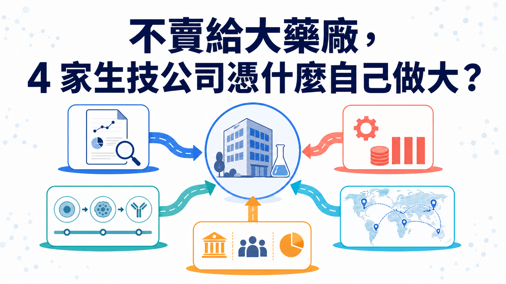
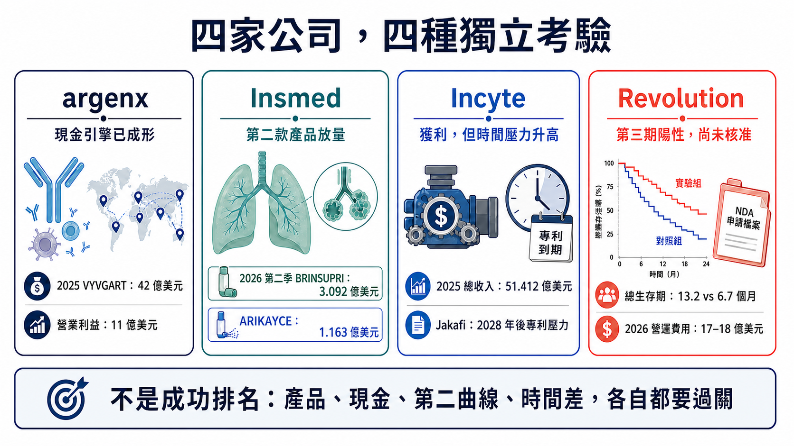
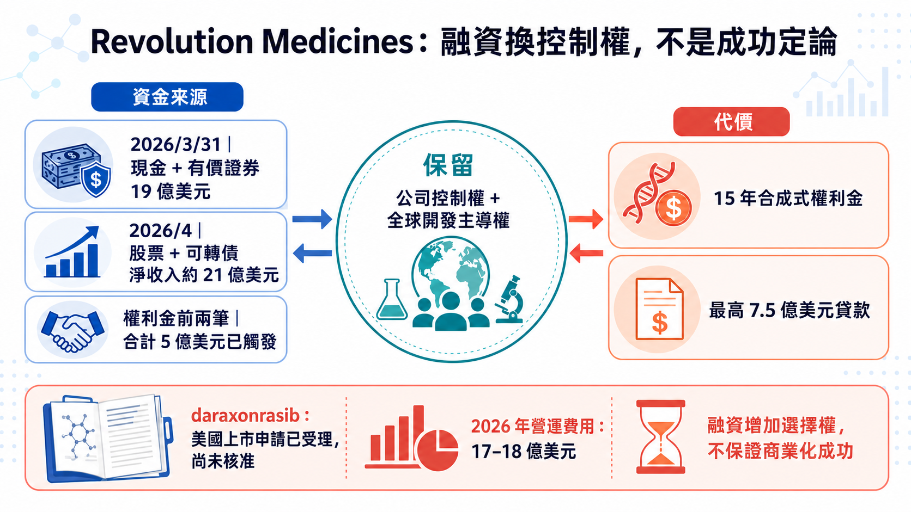
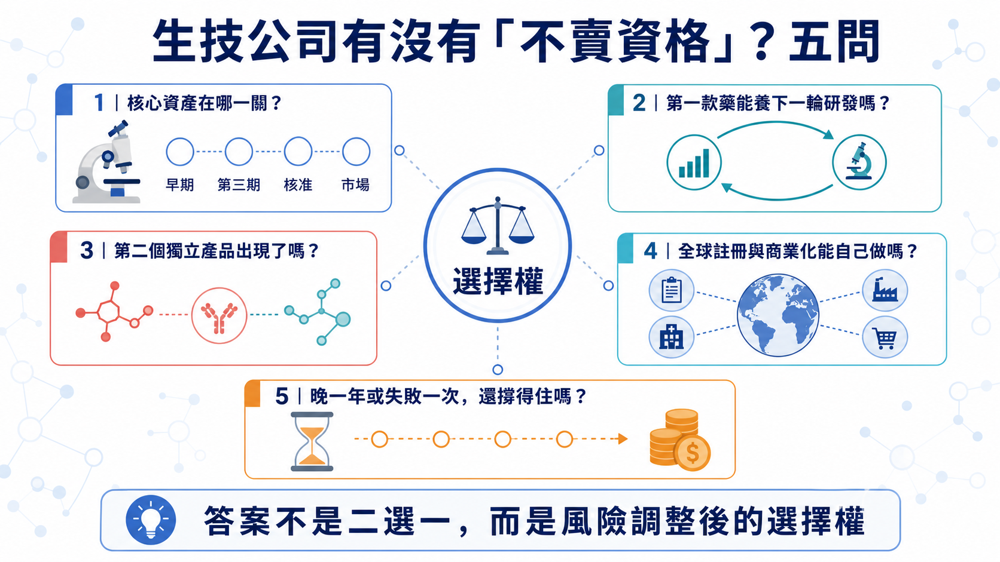

# 不賣給大藥廠，4 家生技公司憑什麼自己做大？

生技公司做出好藥，最常見的結局是被大藥廠買走。但 argenx、Insmed、Incyte 與 Revolution Medicines，選擇了另一條更難的路：自己把藥推到全球、自己養下一條管線，也自己承擔失敗。

它們的底氣都可以換算成數字。argenx 靠 VYVGART（降低致病性 IgG 抗體的自體免疫暢銷藥）在 2025 年賣出 42 億美元，首度全年營業獲利；Insmed 的第二款藥 BRINSUPRI 在 2026 年第二季又賣出 3.092 億美元，季增 49%；Revolution 還沒有核准產品，卻在 4 月透過股票與可轉債取得約 21 億美元淨收入。

它們用現金與產品，替自己換到拒絕整家公司出售的底氣。時間，則是這份底氣最昂貴的成本。

這正是生技公司最難跨過的一關。臨床成功後，被大型藥廠收購通常是最快的變現路；但如果第一款藥已經能養研發、第二款產品開始成形、全球商業化有人做，公司繼續獨立，可能比一次出售更值錢。

判斷一家公司是否真的有「不賣資格」，不能只看創辦人的態度，而要看五件現實的事：產品證據夠不夠、第一款藥能不能變成現金引擎、第二條曲線有沒有出現、全球商業化能不能自己做，以及公司能否在不交出控制權的前提下拿到資金。

四家公司走在不同位置，剛好把生技公司從一項資產長成一家企業的分水嶺攤在桌上。第二曲線決定獨立能走多遠；資金與商業化能力，決定科學價值能否活著抵達市場。

## 第一關｜一款藥能不能從產品，變成資本引擎？

argenx 已經跨過這一關。

VYVGART 系列 2025 年全球產品淨銷售 42 億美元，較前一年成長 90%；公司同年首度達到全年營業獲利，營業利益 11 億美元。到了 2026 年第二季，VYVGART 全球產品淨銷售再達 15 億美元，年增 60%；上半年累計 28 億美元。

42 億美元一進帳，argenx 的身分就變了。它已能用產品收入支付三種昂貴工作：擴大 VYVGART 的疾病與給藥布局、推進 empasiprubart、adimanebart 等後續分子，以及維持跨市場的醫學、法規與商業化組織。

第一個產品已從「等待別人出價的資產」，變成公司手上的資本引擎。

但 argenx 並未因此免除風險。VYVGART 仍是收入主體；多適應症與不同劑型能延長同一平台的成長，第二個獨立分子卻還沒完成商業驗證。下一張成績單很清楚：VYVGART 賺進來的現金，能不能養出下一個非 efgartigimod 的產品？

這是「有現金流」與「可重複平台」之間的差別。

## 第二關｜第二款藥，驗收組織能不能複製成功

Insmed 的案例更像一張能力複製測驗。

過去很長一段時間，Insmed 幾乎等同 ARIKAYCE。2025 年 ARIKAYCE 全球收入 4.338 億美元，證明公司能在 MAC 肺病這類高度專業市場完成開發與商業化；但單一產品成功，市場仍很難判斷，那是組織能力，還是剛好遇到一個好資產。

BRINSUPRI 改變了這個問題。

2026 年第二季，BRINSUPRI 收入已達 3.092 億美元，較第一季再成長 49%；ARIKAYCE 為 1.163 億美元，年增 8%。公司因此把 BRINSUPRI 全年收入指引，從至少 10 億美元上修至 12.5 億至 14 億美元；ARIKAYCE 指引維持 4.5 億至 4.7 億美元。

BRINSUPRI 的意義超過兩個產品收入相加。它如果照計畫放量，代表 Insmed 的法規、支付方、醫學事務與商業團隊，能把成功複製到第二個不同產品。

更下一層是 TPIP。公司正推進 PH-ILD、PAH、PPF、IPF 等第三期計畫，並維持每年平均申報一到兩個 IND 的內部研發目標。這形成三段式結構：ARIKAYCE 是已建立的底座，BRINSUPRI 是第二次商業化驗證，TPIP 與早期管線則負責回答第三條曲線能不能形成。

不過，這條路仍然燒錢。Insmed 第二季雖把淨損壓到 1,320 萬美元，但研發費用 2.10 億美元、銷售與管理費用 2.475 億美元，兩者都在增加；截至 6 月底，現金、約當現金與有價證券仍約 12 億美元。第二款藥拉高獨立價值，組織距離無風險自我供血仍有一段路。

第二款藥是出生證明，不是畢業證書。

## Incyte 的提醒｜會賺錢，市場為何還不買單？

Incyte 最容易被過度簡化。

Incyte 仍是一家會賺錢的公司。2025 年公司總收入 51.412 億美元、淨利 12.867 億美元；Jakafi 淨產品收入 30.925 億美元，Opzelura 6.785 億美元。2026 年第一季總收入 12.7 億美元，Jakafi 7.58 億美元，其他血液與腫瘤產品也在成長，公司同時有 10 項第三期試驗進行中。

問題是，Incyte 自己在 2025 年 10-K 明確寫出：Jakafi 專利獨占到期後，預期產品銷售將自 2028 年開始下滑，公司必須靠新產品抵銷缺口。

Incyte 現在會賺錢，收入卻仍高度依賴 Jakafi。十項第三期試驗能否在 2028 年前補上缺口，才是市場願不願意重估它的關鍵。

這也是所有成熟生技公司最難的成人禮：第一個成功解決生存，第二個成功才證明組織能重複創造價值。

## Revolution｜賣掉一部分未來，換回控制權

Revolution Medicines 是四家公司中風險最高、也最能解釋「融資如何改變控制權」的一家。

先更新到 2026 年 8 月 3 日的狀態。

daraxonrasib 還沒有獲任何主管機關核准，Revolution 也還沒有來自核准產品的收入；但它已不再只是早期臨床故事。第三期 RASolute 302 納入 500 位先前接受過治療的轉移性胰臟導管腺癌患者。在整體意向治療族群，daraxonrasib 的中位總生存期為 13.2 個月，化療為 6.7 個月，OS HR 0.40；PFS 與其他主要、關鍵次要終點也達標。

歐洲藥品管理局（EMA）已在 2026 年 7 月 7 日啟動分階段審查（phased review）；7 月 22 日，美國食品藥物管理局（FDA）也接受 daraxonrasib 的新藥申請（NDA）進入審查，適應症為先前接受過治療的轉移性胰臟導管腺癌。這項申請納入 FDA「國家優先審查券」試行計畫，審查程序可能加快；NDA 受理只代表正式進入審查，距核准與商業化還有兩關。

資本端同樣往前推了一大步。Revolution 在 2026 年 3 月 31 日持有 19 億美元現金、約當現金與有價證券；4 月的股票與可轉債融資又帶來約 21 億美元淨收入。與此同時，公司把 2026 年 GAAP 營運費用指引提高到 17 億至 18 億美元，第一季淨損 4.538 億美元。

這就是獨立的真實價格：資本更充足，組織成本也已經先長到接近大型商業化公司的尺度。

2025 年與 Royalty Pharma 的交易，更能說明 Revolution 到底做了什麼。

雙方安排最高 20 億美元資金，其中最高 12.5 億美元是 daraxonrasib 的合成式權利金（synthetic royalty），最高 7.5 億美元是有擔保貸款。第三期結果達標後，Royalty Pharma 已觸發第二筆 2.5 億美元；加上簽約時的 2.5 億美元，前兩筆合計 5 億美元。

代價是：Royalty Pharma 取得 15 年期、按全球年銷售分級的權利。以目前前兩筆資金對應的級距，年銷售 0–20 億美元部分為 4.55%，20–40 億美元部分為 2.50%，40–80 億美元部分為 1.00%，80 億美元以上為零。若 Revolution 未來選擇把其餘權利金分批款（royalty tranches）全部提領，分潤比例還會上升。

另有最高 7.5 億美元的優先順位有擔保定期貸款（senior secured term loan）；首筆需在 daraxonrasib 符合約定的 FDA 核准條件後提領，利率為擔保隔夜融資利率（SOFR）加 5.75%，並設 3.5% SOFR 下限。

Revolution 先讓出未來 15 年的一部分產品現金流，也接受可能的債務成本，換回公司控制權、全球開發主導權與 RAS 平台的上行空間。

這個結構之所以重要，是因為資本市場開始提供跨國大型藥廠（MNC）以外的選項：股權、可轉債、合成式權利金、里程碑式貸款，可以把「沒錢就必須賣掉整家公司」改成多個可組合的決策。

但每個選項都有價格。股權會稀釋，債務要付利息，權利金會在約定的 15 年期間切走一部分成功後的現金流；若核心產品延遲或商業化不如預期，提前搭起的全球組織也會放大虧損。

## 想說「不賣」，先過這五關

把四家公司放在一起，可以得到一個比「誰會被收購」更實用的框架。

1. 產品證據

核心資產只是有漂亮的早期數據，還是已跨過關鍵試驗、法規與真實市場？Revolution 的第三期成功降低了風險，但截至查證日仍未核准；argenx 與 Insmed 已有商業化讀回。

2. 現金引擎

第一款產品能否支付下一輪研發，而不是只能延長公司壽命？argenx 已有全年營業獲利；Insmed 正在用第二款產品擴大收入，但仍有淨損；Revolution 主要靠資本市場與結構化融資。

3. 第二曲線

第二個成功來自同一分子的適應症擴張，還是另一個獨立分子？兩者都能創造價值，但對「平台可重複性」的證明強度不同。

4. 全球執行

公司是否能自己完成多國註冊、供應、醫學事務、支付方與商業化？若所有關鍵能力仍外包，保留全球權利不必然等於有能力把全球價值收回來。

5. 融資選項與失敗承受力

公司能不能在不交出控制權的前提下拿到足夠資金？更重要的是，若一次第三期失敗、上市延遲一年，現金與組織還撐不撐得住？獨立公司的硬門檻，是拒絕報價後仍撐得過第三期失敗或上市延誤。

## 台灣生技更該學會替自己保留選擇權

台灣生技公司不需要複製 argenx、Insmed 或 Revolution，也不該把海外授權、共同開發或併購視為失敗。

對資本規模較小、全球商業化經驗仍在累積的公司來說，早期授權可能是最合理的風險分配；把區域權利交給更有能力的夥伴，也可能讓藥更快走到患者面前。

台灣公司該追問的是：

- 一筆 BD 是把單一資產變現，還是替下一個資產買到時間？
- 公司保留哪些地區、適應症、製造或共同開發權？
- 首款產品成功後，有沒有第二個獨立分子進入臨床？
- 所謂「國際化」，是簽出資產，還是逐步建立能主導全球試驗與商業化的組織？
- 融資工具是否把風險分散，還是把未來現金流過早切得太薄？

台灣市場目前很難找到成熟度完全相同的上市櫃公司。與其硬湊概念股，這套框架更適合用來檢查每家公司的權利保留、現金跑道與第二曲線。

## 結論｜被收購能兌現，獨立要能重複成功

併購可以讓產品更快取得資金、產能與全球通路；獨立則讓原公司保留更大的長期上行，但也把臨床、法規、製造、商業化與融資風險全部留在自己身上。

最後的分界很簡單：公司手上還有沒有選擇權。

被收購，可能是一項資產成功兌現；選擇獨立，則必須證明公司能把一次成功重複成第二次。當繼續獨立的風險調整後價值高於收購溢價，而且公司有錢、有組織、也承受得起一次失敗時，「不賣」才從態度變成策略。

## 參考資料

以下均為公司、SEC 或主管機關一級來源；查證截止：2026-08-07。

1. [argenx FY2025 財務結果](https://argenx.com/news/2026/press-release-3245199)
2. [argenx 2026 H1／Q2 財務結果](https://argenx.com/news/2026/press-release-3331862.html)
3. [Insmed FY2025 財務結果](https://investor.insmed.com/2026-02-19-Insmed-Reports-Fourth-Quarter-and-Full-Year-2025-Financial-Results-and-Provides-Business-Update)
4. [Insmed 2026 Q2 財務結果](https://investor.insmed.com/2026-08-06-Insmed-Reports-Second-Quarter-2026-Financial-Results-and-Provides-Business-Update)
5. [Insmed SEC filings](https://investor.insmed.com/financial-information/sec-filings)
6. [Incyte FY2025 財務結果](https://investor.incyte.com/news-releases/news-release-details/incyte-reports-fourth-quarter-and-full-year-2025-financial)
7. [Incyte 2025 Form 10-K](https://www.sec.gov/Archives/edgar/data/879169/000087916926000010/incy-20251231.htm)
8. [Incyte 2026 Q1 財務結果](https://investor.incyte.com/news-releases/news-release-details/incyte-reports-first-quarter-2026-financial-results-and-provides)
9. [Revolution Medicines RASolute 302 第三期結果](https://ir.revmed.com/news-releases/news-release-details/revolution-medicines-announces-asco-plenary-presentation)
10. [Revolution Medicines EMA phased review 公告](https://ir.revmed.com/news-releases/news-release-details/european-medicines-agency-expedites-assessment-revolution)
11. [FDA 接受 daraxonrasib NDA 審查公告](https://ir.revmed.com/news-releases/news-release-details/revolution-medicines-new-drug-application-daraxonrasib-accepted/)
12. [Revolution Medicines 2026 Q1 財務結果](https://ir.revmed.com/news-releases/news-release-details/revolution-medicines-reports-first-quarter-2026-financial/)
13. [Revolution Medicines 2026 Q1 Form 10-Q](https://ir.revmed.com/static-files/e7a99744-380a-4fa9-93b6-2fb71793c8ee)
14. [Revolution Medicines 2026 年 4 月融資 8-K](https://www.sec.gov/Archives/edgar/data/1628171/000119312526159289/d95226d8k.htm)
15. [Royalty Pharma 與 Revolution Medicines 融資協議](https://www.royaltypharma.com/news/royalty-pharma-and-revolution-medicines-enter-into-funding-agreements-for-up-to-2-billion/)
16. [Royalty Pharma 2026-04-13 8-K](https://www.sec.gov/Archives/edgar/data/1802768/000119312526152145/d871473d8k.htm)

## 免責聲明

本文為生技醫藥、公司策略與資本結構整理，不構成醫療診斷、治療建議或投資建議。文中候選藥仍可能面臨臨床、法規、製造與商業化風險；投資決策應自行評估。
