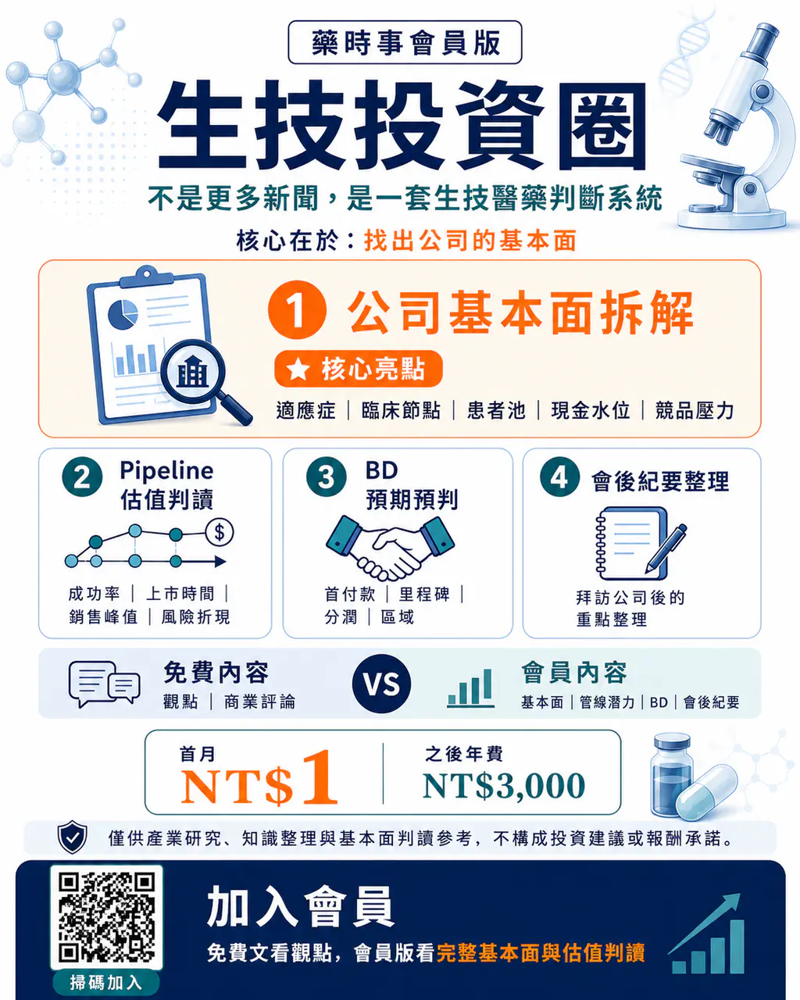

# 🧬 生技投資圈｜不是更多新聞，是一套生技醫藥判斷系統

生技新聞很多。

但真正難的不是「知道發生了什麼」，而是看懂：

🔍 這件事到底改變了公司的基本面嗎？

一個臨床結果，是降低失敗風險，還是市場短線情緒？

一個授權案，是有真實商業價值，還是只是在包裝題材？

一家公司股價上漲，背後是管線價值重估，還是資本市場敘事？

這就是我們做 「生技投資圈」 的原因，我們想做的不是更多新聞，而是一套給台灣讀者看的生技醫藥基本面判斷系統。

🎯 會員版重點：找出公司的基本面

會員版會聚焦在四件事：

1️⃣ 公司基本面拆解

適應症、臨床節點、患者池、現金水位、競品壓力。

2️⃣ Pipeline 估值判讀

成功率、上市時間、銷售峰值、風險折現。

3️⃣ BD 預期預判

首付款、里程碑、分潤、區域、授權可能性。

4️⃣ 會後紀要整理

藥時事團隊拜訪公司後，整理真正值得投資人關注的重點。

🆓 免費內容看什麼？

看觀點、看商業評論。

💎 會員內容看什麼？

看公司基本面、管線潛力、BD 預期與會後紀要。

💰 首月 NT$1

💰 之後年費 NT$3,000

如果你不只想追新聞，而是想開始看懂：

🧩 「這家公司到底值不值得研究？」

📈 「這件事有沒有真的改變估值？」

歡迎加入 生技投資圈。

📌 免費文看觀點。

📌 會員版看完整基本面與估值判讀。

👉

藥時事 Drugnews的方案｜方格子 vocus

歡迎加入 100+ 醫藥菁英圈 在這邊我們分享最深度的醫藥行業 投資分析 以及我們對未來醫藥行業的看法

vocus.cc

👉 掃碼加入會員

＊內容僅供產業研究、知識整理與基本面判讀參考，不構成投資建議、買賣建議或報酬承諾。

#藥時事 #生技投資圈 #生技醫藥 #台股生技 #美股生技 #Pipeline估值 #BD授權 #基本面研究

