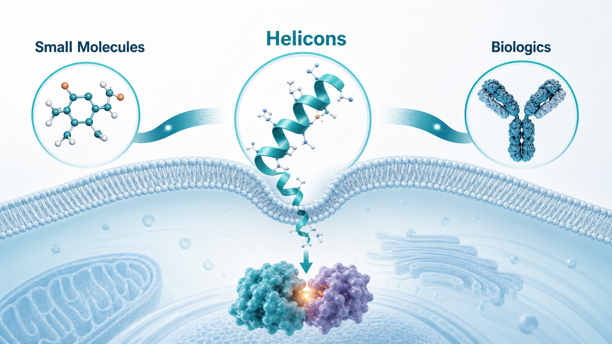
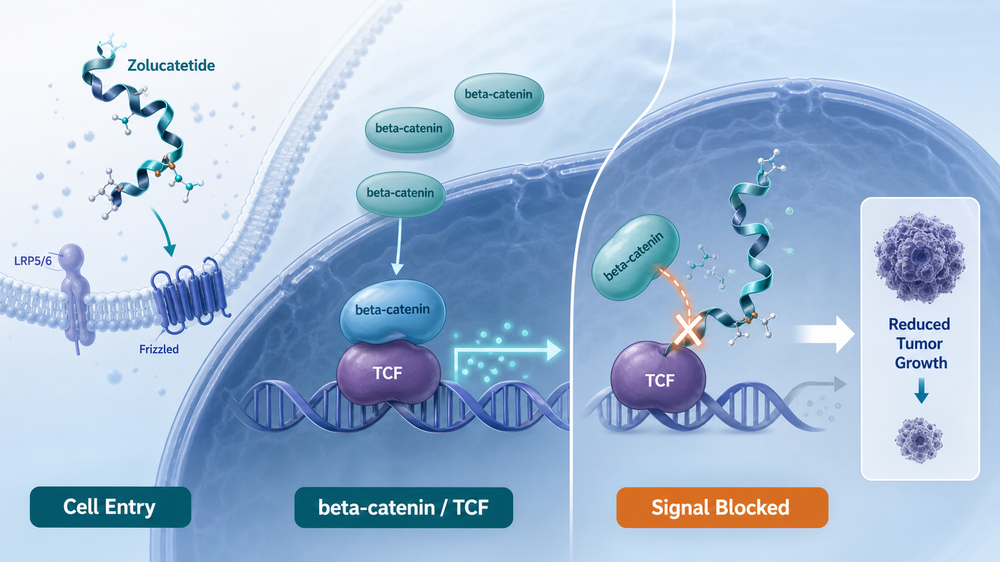
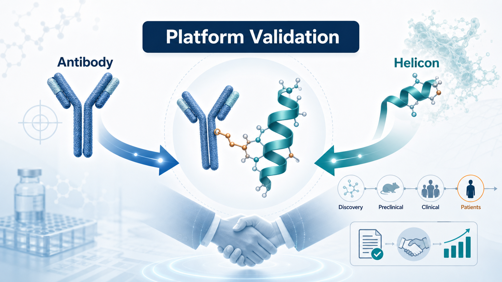
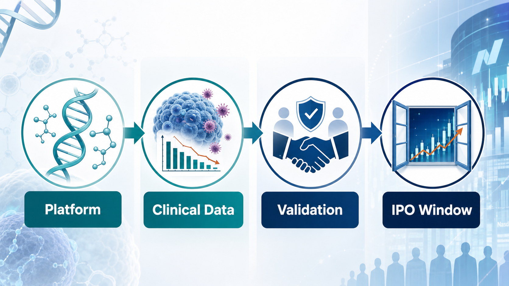

# The Largest Biotech IPO in US Market History: What Parabilis Is Really Teaching Investors

## Parabilis Is Giving the Market a Lesson

Taiwan's biotech sector is still struggling through a weak capital-market cycle. In the United States, however, the biotech market has just produced a striking contrast.

On June 10, 2026, Parabilis Medicines listed on Nasdaq under the ticker PBLS.

The company originally planned to raise roughly US$475 million. The offering was upsized to US$670 million, making it one of the largest biotech IPOs in US market history. Its first-day trading performance was also strong, suggesting that public-market appetite for selected clinical-stage platform companies is recovering.

The interesting question is this: why Parabilis?

The company has no marketed product. Its lead drug candidate, zolucatetide, is still in clinical development. From a conventional financial perspective, this is not a stable cash-flow pharmaceutical company. It is a high-risk biotech whose valuation depends on clinical data, platform credibility, and the market's willingness to underwrite future optionality.

That is exactly why the case matters.

Parabilis' IPO does not mean the market is once again willing to pay for any biotech story. It means investors are still willing to fund high-risk innovation when the technology differentiation is clear, the target logic is understandable, early clinical evidence exists, and the platform can be translated into a credible pipeline.

In other words, capital has not left biotech.

It has moved from story-driven investing to clinical-asset logic.

## 01 | What Is Parabilis Building? Not a Small Molecule, Not an Antibody, but Helicons

Parabilis' core technology is called Helicons.

These are engineered and stabilized alpha-helical peptides. In simple terms, the company is trying to build a drug modality that sits between small molecules and large biologics. Small molecules can often enter cells, but they frequently struggle with broad protein-protein interfaces that do not contain a clean binding pocket. Antibodies can be highly specific, but most of them act outside the cell and cannot easily reach intracellular proteins, transcription factors, or protein-DNA interaction nodes.

This has been one of the pharmaceutical industry's long-running problems. Many disease targets are biologically important, but they are hard to drug because they are too flat, too dynamic, too large, or located inside the cell.

Helicons are designed to fill that gap.

Parabilis describes its Helicon platform as a cell-penetrating alpha-helical peptide technology that can modulate intracellular proteins that conventional modalities have struggled to address. If the technology works, the significance is not merely that the industry gains one more drug format. It could also reopen a set of targets that were previously set aside as too difficult.

This is why the platform story is powerful. But it is also why clinical proof matters so much. A new modality is not valuable simply because it sounds novel. It becomes valuable only when it produces drug candidates that can survive human testing.

## 02 | Zolucatetide: Going Directly After beta-Catenin, One of the Hardest Bones in Oncology

Parabilis' most important clinical asset is zolucatetide, previously known as FOG-001.

The program targets the Wnt / beta-catenin signaling pathway. This pathway is important in cancer and several proliferative diseases. The problem is that beta-catenin has long been viewed as a difficult target. It is not a classic enzyme pocket that a small molecule can easily enter. It works through protein-protein interactions that drive transcriptional signaling.

Zolucatetide is designed to block the interaction between beta-catenin and TCF. That is a critical downstream node in the Wnt pathway and has long been considered difficult to drug directly.

Parabilis says zolucatetide is being evaluated in a first-in-human Phase 1/2 trial in patients with locally advanced or metastatic solid tumors, and that its mechanism is to block the beta-catenin:TCF protein-protein interaction.

The most closely watched indication is desmoid tumors, also called aggressive fibromatosis. These tumors are not typical malignant cancers, but they can be locally invasive, painful, recurrent, and functionally damaging. Existing management can involve observation, surgery, hormone therapy, or targeted therapy, but there remains a need for better precision treatment.

Early data have shown tumor-shrinkage signals. Public reports noted that, as of February 2026, 25 evaluable treated patients had shown some degree of tumor reduction. Among 19 patients with at least two post-treatment scans, 74% achieved objective response by RECIST 1.1.

That is the core reason Parabilis was able to attract the market's attention.

It is not merely claiming that it can address hard-to-drug targets. It has produced an early clinical signal.

## 03 | The Regeneron Collaboration Turned Platform Potential Into Industry Validation

Another important event before the IPO was Parabilis' collaboration with Regeneron.

The companies agreed to develop Antibody-Helicon Conjugates. Conceptually, this combines Regeneron's antibody capabilities with Parabilis' Helicon platform. The goal is to merge antibody targeting with the intracellular reach of Helicons and create new therapies against targets that traditional modalities have struggled to drug.

Regeneron's announcement described the deal as a multi-target collaboration that combines its antibody technology with Parabilis' Helicon platform. Parabilis is eligible to receive US$50 million upfront, a US$75 million equity investment, and up to roughly US$2.2 billion in milestone payments.

This partnership matters because it gives Parabilis more than a capital-market narrative.

It provides industry validation from a research-oriented large biopharma company. For a biotech, having a major partner before an IPO can be highly persuasive. It tells public-market investors that the platform is not only interesting to venture capital and crossover investors. It is also interesting enough for a company like Regeneron to incorporate into its future platform strategy.

That kind of external validation often carries more weight than a slide deck.

## 04 | Why Parabilis? The Answer Is Not One Single Factor

Parabilis' success cannot be explained simply by saying that the technology is new.

The founding science matters.

Parabilis has deep scientific links to Gregory Verdine, a Harvard professor and an important pioneer in stapled peptide technology. Stapled peptides use chemical crosslinking to stabilize peptides in an alpha-helical conformation, improving stability, cell penetration, and drug-like properties.

This field did not appear overnight. It has been shaped by years of chemical biology, peptide engineering, non-natural amino acids, crosslinking chemistry, and modern computational design. Parabilis' Helicons should be understood as the product of that long technical evolution rather than a sudden marketing concept.

Capital accumulation also matters.

Before the IPO, Parabilis had already completed several large private financings, including a US$305 million financing in early 2026. By the time it reached the public market, it had already been heavily supported by private capital. Add early clinical data, a Regeneron collaboration, and a more open IPO window, and several conditions aligned at the same time.

So Parabilis was not a random overnight winner.

It was the result of technology, clinical data, team credibility, capital support, industry partnership, and market timing all lining up.

## 05 | This Is a Biotech IPO Reopening, Not a Return of Concept Stocks

Parabilis' IPO should also be read in the broader market context.

The US biotech IPO market has clearly improved in 2026. Public reports have noted renewed momentum after a difficult period, and several companies have begun testing investor appetite again. Parabilis' US$670 million IPO surpassed the previous large biotech IPO benchmark set by Kailera Therapeutics, which raised about US$625 million.

But this cycle is different from 2020 and 2021.

Back then, investors were often willing to pay high premiums for platform stories, early concepts, and fashionable therapeutic themes. Today, the market is more realistic.

It wants clinical assets.

It wants a clear use of proceeds.

It wants large-pharma validation.

It wants a visible development path.

Kailera, for example, benefited from the fact that obesity and GLP-1-related pipelines remain among the hottest and most commercially attractive themes in global biopharma. Kardigan drew attention because of its later-stage cardiovascular assets and clinical-development orientation.

The message is not that public markets are broadly forgiving again. The door is reopening, but the first companies allowed through are those with more mature asset logic.

Concept-only biotech remains difficult. What the market is rewarding first are companies with clear clinical milestones, a defined disease rationale, and a credible reason to raise public capital.

## 06 | What This Means for Taiwanese Biotech

Parabilis offers an important lesson for Taiwan's biotech sector:

A platform alone is not valuable. Clinical assets produced by the platform are what create value.

Several Taiwanese companies can be used as useful comparisons, even though their technologies are different.

The first is Foresee Pharmaceuticals.

Foresee is not developing Helicons or hard-to-drug protein-protein interaction drugs. But its core logic is also that a specialized platform can generate commercial products. CAMCEVI came from a long-acting injectable technology platform, is already marketed in the United States, and a three-month formulation is under FDA review. The similarity is not the technology. The similarity is the need to prove that a platform can repeatedly generate products with commercial value.

The second is ACRO Biomedical.

ACRO focuses on novel drug-delivery and formulation systems, including spray, foam, and topical products for conditions such as post-herpetic neuralgia, osteoarthritis pain, and local anesthesia. This is not a high-risk oncology platform like Parabilis. It is closer to a more practical Taiwan-style path: drug-delivery and formulation innovation that can be translated into defined products.

The third example is Genovate-related peptide-drug conjugate concepts in Taiwan's broader biotech ecosystem.

Although not all of these companies are public-market mainstream names, the peptide-drug conjugate, or PDC, concept echoes part of the broader drug-modality shift represented by Parabilis. Public materials describe PDC platforms as using peptides to carry drugs toward receptors on cancer cells, including applications in lung cancer and other oncology settings.

The lesson is not that Taiwanese companies should copy Helicons.

The lesson is that platform companies must show how the platform becomes a product, how the product becomes clinical data, and how the clinical data becomes a capital-market thesis.

## Conclusion | Parabilis' Record IPO Is Not Market Madness. It Is Capital Looking for Hard-Tech Assets Again.

Parabilis' US$670 million IPO does not prove that a full biotech bull market has returned. It does not mean every innovative drug company can once again list at a high valuation.

What it represents is a direction.

Capital markets are still willing to fund high-risk innovation, but they want hard logic.

Hard-to-drug targets need a clear mechanism.

A platform needs a clinical product.

A product needs early human data.

External partnerships need to validate the technology.

IPO proceeds need a clear development purpose.

That is why Parabilis was accepted by the market. It is not yet a commercial-stage success story, but every layer of its thesis connects: Helicons address hard-to-drug targets, zolucatetide challenges beta-catenin, desmoid tumor data provide an early clinical signal, Regeneron provides industry validation, and IPO capital supports Phase 3 development and platform expansion.

This is the kind of company the market is willing to wait for.

Parabilis reminds us that biotech winter does not last forever. But spring does not arrive equally for everyone.

It arrives first for companies with real technical depth, real data, and real assets.

References:

[0]: Parabilis Medicines official website and investor relations materials, https://parabilismed.com/

[1]: Parabilis Medicines, "Parabilis Medicines Announces Pricing of Upsized Initial Public Offering", 2026-06-09, https://investors.parabilismed.com/news-releases/news-release-details/parabilis-medicines-announces-pricing-upsized-initial-public

[2]: Parabilis Medicines, "Parabilis Medicines Announces Closing of Upsized Initial Public Offering, Including Full Exercise of Underwriters' Option to Purchase Additional Shares", 2026-06-11, https://investors.parabilismed.com/news-releases/news-release-details/parabilis-medicines-announces-closing-upsized-initial-public

[3]: Parabilis Medicines, "About Helicons", https://parabilismed.com/innovation/about-helicons/

[4]: Parabilis Medicines, "Zolucatetide", https://parabilismed.com/program/fog-001/

[5]: Parabilis Medicines, "Parabilis Medicines Announces Strategic Collaboration with Regeneron Pharmaceuticals to Advance Novel Antibody-Helicon Conjugates Across Multiple Therapeutic Areas", 2026-05-18, https://investors.parabilismed.com/news-releases/news-release-details/parabilis-medicines-announces-strategic-collaboration-regeneron

[6]: Parabilis Medicines, "Parabilis Medicines Announces Oversubscribed $305 Million Financing to Support Ongoing FOG-001 (zolucatetide) Clinical Development Across a Broad Range of Tumors and Advance Pioneering Pipeline and Helicon Platform", 2026-01-08, https://investors.parabilismed.com/news-releases/news-release-details/parabilis-medicines-announces-oversubscribed-305-million

---

This article is intended for industry research and knowledge sharing only. It does not constitute investment, medical, fundraising, or individual stock advice.
