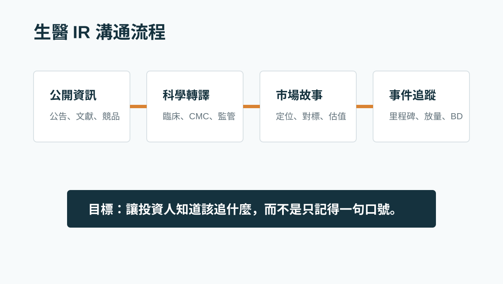

# 生醫公司 IR 不是把簡報變漂亮，而是把管線變成可追蹤的資本市場故事

很多生醫公司談 IR，第一反應是簡報、新聞稿、活動或社群曝光。

這些都重要，但它們不是核心。

真正的核心是：投資人是否知道公司靠什麼創造價值，以及接下來應該追哪些事件。

## 投資人不缺資訊，缺的是可採用的結構

生醫公司資訊通常很複雜。臨床設計、CMC、監管路徑、競品、授權案例、醫療未滿足需求，單獨看都能寫成一份長報告。

但資本市場需要的是一個能被理解、被比較、被追蹤的故事。

## 一個好的 IR 內容應該回答四件事

- 公司核心管線解決哪個未滿足需求。
- 相對競品與對標公司，差異化在哪裡。
- 下一個會改變市場理解的事件是什麼。
- 如果事件兌現，估值模型裡哪個參數應該被調整。

## 合規邊界很重要

資本市場內容不能建立在未公開重大訊息上。

更穩健的做法，是用公開資訊、公司已公開或確認可使用資料，搭配外部文獻、競品資料與可驗證事件，形成可公開討論的研究內容。

本文僅供產業研究與知識分享，不構成投資、醫療、募資或個股建議。
