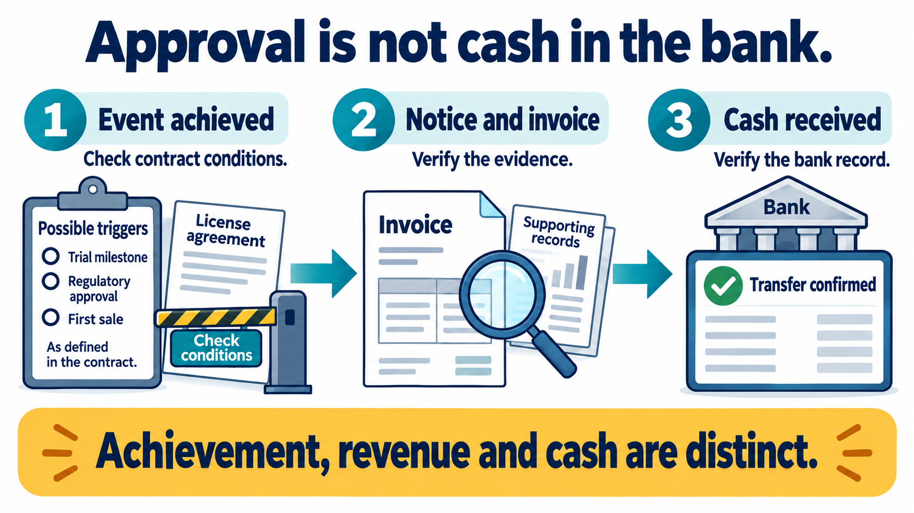
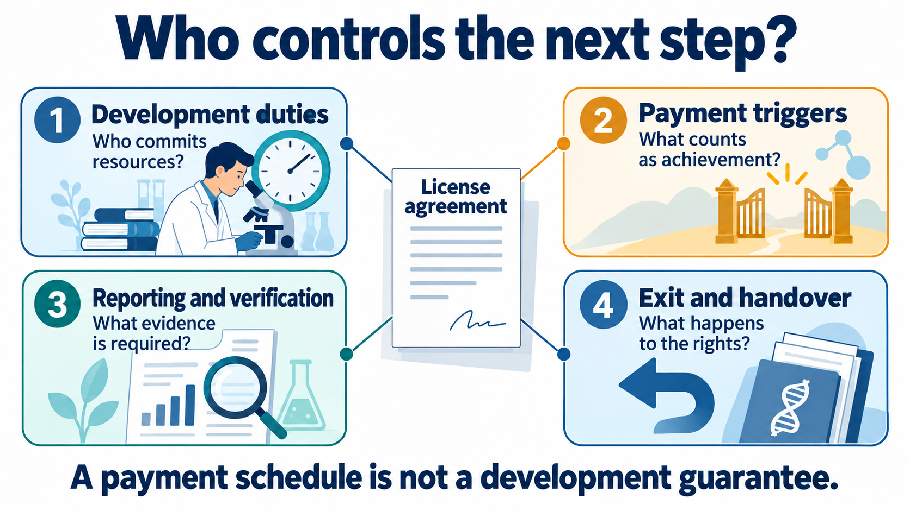
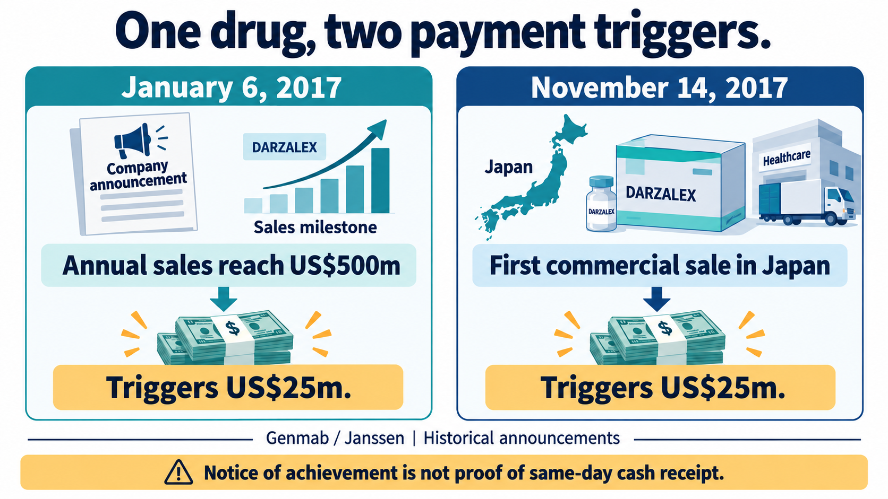
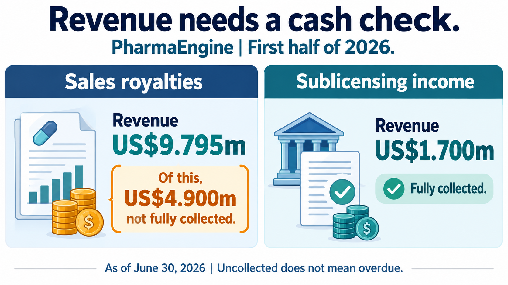

# Drug Approval in Hand—But Is the Cash in the Bank? How Formosa and PharmaEngine Turn Licensing Payments Into Cash
──────────

Formosa Pharmaceuticals’ ophthalmic drug received U.S. FDA approval in March 2024. Once the marketing authorization transfer was completed, the first US$2 million development milestone from licensing partner Eyenovia was triggered. Yet the payment was half cash and half shares. The collaboration subsequently ended, with US$2.2 million of obligations released. In 2026, PharmaEngine’s half-year financial report illustrated another gap: royalties had been recognized, while part of the amount remained reflected in contract assets and tax-related entries. [1][2][7]

For investors, these distinctions affect whether a company can fund its next trial. Putting an entire announced milestone into a cash budget as soon as it is achieved can produce the wrong estimate of the funding gap. Formosa’s experience provides a concrete starting point: a transaction that has already passed through approval, payment and a change of partner.

## 【01｜A US$2 Million Milestone Was Achieved. How Much Reached the Bank?】

Eyenovia’s 2024 annual report states that the milestone required both FDA approval and the effective acceptance of the transfer and assignment of that approval. Those conditions were met on March 14, 2024. Eyenovia paid US$1 million in cash on April 26 and delivered shares for the other portion on April 29. [1]

The number of shares was calculated using the contractual US$1 million amount and an earlier share price. At settlement, however, the financial report valued those shares at approximately US$0.4 million. Three different measures therefore coexist: the contractual basis for calculating the shares, their value at delivery, and the cash actually paid. [1]

💵 Receiving US$1 million in cash does not mean the other US$1 million is available, at face value, to pay R&D expenses. Converting shares into cash depends on the eventual sale price and their ability to be monetized. The US$0.4 million settlement value is not evidence of Formosa’s eventual share-sale proceeds.

This structure preserves cash for the payer while transferring part of the funding risk to the recipient. For Formosa’s financial planning, a liquidity question remains between achieving the milestone and receiving equity.

*Figure 1 | Achievement of a trigger, notification and invoicing, and collection are distinct states. Contractual procedures vary; an announcement does not automatically establish receipt of the full amount in cash. [1][10]*

## 【02｜Ending the Collaboration: Releasing US$2.2 Million Is Not Another Cash Receipt】

On June 6, 2025, Formosa and Eyenovia entered into a termination arrangement. Eyenovia’s second-quarter filing states that the relevant conditions were met in July, when its total obligations of US$2.2 million were extinguished. This settled rights and obligations between the parties; it was not another US$2.2 million paid to Formosa. [2]

The joint announcement also explained that Eyenovia had suspended sales of the ophthalmic drug following corporate setbacks involving other programs. That turn of events illustrates an important point: after a product receives approval, commercialization still depends on the partner’s funding, commitment and execution. [11]

A license therefore cannot be assessed from its headline amount alone. Responsibility for further development and launch, payment calculations, sales reporting, and the return of rights when a party exits all influence what the originator can retain. After termination, future revenue assumptions must be rebuilt around the revised rights and obligations.

Finding another partner also requires launch preparations, supply coordination and market development to be connected again. Even with an approval in place, the time needed for a new partner to take over may delay cash returns. A partner’s willingness to keep allocating commercial resources deserves as much attention as the maximum amount in the contract.

*Figure 2 | Development responsibilities, payment conditions, sales reporting and exit arrangements jointly determine transaction value. Exit provisions change rights and amounts owed; they do not create an additional revenue stream. [2][10]*

## 【03｜Harrow Takes Over: Payment Now Depends on First Sale and Gross Profit】

Three days later, on June 9, 2025, Harrow announced that it had obtained exclusive U.S. rights and marketing authorization for BYQLOVI. The product is clobetasol propionate ophthalmic suspension 0.05%, used to treat inflammation and pain after ocular surgery. Formosa’s APNT nanoparticle formulation technology addresses drug dispersion, dissolution and bioavailability. This is a product with a specific formulation and approved use; the commercial task is to translate it into prescriptions and sales. [3][4]

Harrow’s 8-K describes the payment terms clearly: US$500,000 is payable when Harrow makes its first commercial sale to a third party. Formosa is also eligible for additional one-time payments tied to commercial gross-profit milestones and royalties calculated on the product’s gross profits. [3]

That US$500,000 first-sale payment is not an upfront fee received on the signing date. “Gross profit” is the more consequential term to follow. If sales volumes increase but contractually defined costs also rise, the base available for sharing may not expand at the same pace. Multiplying a market-size estimate by an assumed royalty rate would miss this transaction’s actual payment structure.

Gross profit is also different from net profit. The public 8-K does not fully disclose allowable cost deductions, milestone thresholds or royalty rates. Investors need subsequent, verifiable settlement information to assess the collaboration’s recurring returns.

Formosa’s first-quarter 2026 financial report provides one concrete update: no revenue had been recognized under the Harrow agreement from signing through March 31, 2026. [12] That accounting statement is confined to the reporting period; September collection status requires later documentation. As of September 27, the subsequent public materials used in this article do not provide an explicit receipt date for the US$500,000 payment.

## 【04｜The Same US$25 Million Meant Two Different Milestones for Genmab】

🔎 A short comparison from 2017 is instructive. On January 6, Genmab announced that DARZALEX, or daratumumab, had reached US$500 million in calendar-year sales, triggering a US$25 million payment. On November 14 that year, another US$25 million payment was triggered by the first commercial sale in Japan. [8][9]

The first reflected sales accumulating to a specified scale; the second reflected entry into a new market. The amounts were identical, but their implications for future revenue differed. Neither announcement was evidence of cash reaching the bank on that same day.

The publicly filed Genmab–Janssen agreement, signed in 2012, also treats notification, invoicing and payment separately, with some deadlines redacted. It permits Genmab to issue an invoice before Janssen’s notification if Genmab becomes aware that a milestone has genuinely been achieved. [10] The order of notification and invoicing, and the payment deadline, depend on the terms governing each payment.

*Figure 3 | Two US$25 million milestones in 2017: one triggered by US$500 million in calendar-year sales, the other by the first commercial sale in Japan. Equal amounts do not imply equal commercial maturity. [8][9]*

## 【05｜PharmaEngine Recognized US$9.795 Million. Why Is That Not the Same as Cash Collection?】

PharmaEngine’s ONIVYDE is a pancreatic-cancer medicine that encapsulates irinotecan in liposomes, using formulation technology to change drug delivery and release. Once the product reaches the market, PharmaEngine receives sales royalties under its licensing arrangements for Europe and Asia, excluding Taiwan. This provides a route for market revenue to flow back to the drug developer. [6][7]

In the first half of 2026, PharmaEngine recognized US$9.795 million in sales royalties. The financial notes state that US$4.9 million of that amount had not been fully collected as of June 30. Of this, US$4.41 million was recorded as current contract assets; the remaining US$0.49 million was reflected in a reduction of current income tax liabilities. [7]

📘 The US$4.9 million is already included in the US$9.795 million: it is a subset, not an additional amount. When assessing bank cash, the US$0.49 million tax treatment must also be separated out. The entire US$4.9 million should not be described as a missing remittance. Reducing a liability by US$0.49 million does not increase bank deposits, but it also differs from a contract asset awaiting settlement. The note does not explain the underlying tax mechanism in further detail, so that mechanism should not be assumed.

Current contract assets are not synonymous with overdue or uncollectible amounts. The classification alone does not establish late payment or justify describing the amount as a bad debt. Funding budgets must distinguish recognized income, amounts awaiting settlement, and cash actually available.

This also explains why an income statement alone can give a misleading picture of financial runway. Licensing income in one period may include collected amounts, pending settlements and different tax treatments. Subtracting R&D expenditure from the revenue total is not enough to estimate how long the company can operate. Collection periods, cash flows and existing available funds must also be considered.

The same half-year report separately records US$1.7 million of sublicensing income and explicitly states that it was fully collected during the first half. This establishes one collected income item, separate from the sales royalties. The collection status of other income still needs to be checked individually. [7]

*Figure 4 | H1 2026: US$9.795 million of royalties includes US$4.9 million described as not fully collected. Within that amount, US$4.41 million is recorded as current contract assets and US$0.49 million is reflected in lower income tax liabilities. A separate US$1.7 million of sublicensing income was fully collected. These figures should not be double-counted. [7]*

## 【06｜From “Will Receive” to “Received”: One Additional Record Changes the Conclusion】

PharmaEngine’s US$50 million milestone in 2025 provides a more complete comparison. Its February 5 announcement stated that ONIVYDE’s 2024 sales in Europe and Asia had reached the second threshold and that the company would receive the payment. The product milestone page separately records receipt of the US$50 million in February 2025. [5][6]

The first record establishes the trigger and notification; the second adds collection. That historical payment belongs in the relevant 2025 period, separately from first-half 2026 income. PharmaEngine’s sales royalties and Formosa’s new gross-profit sharing arrangements also have different settlement bases.

The Drugnews team’s interpretation is that licensing income can support the next development program only to the extent that payment form, continuity of the collaboration and actual cash conversion allow it. Formosa’s new agreement ties part of its return to product gross profit. The next substantive question is how much sustainable, usable R&D cash Harrow’s first sale and subsequent settlements can bring back to Formosa.

This article provides industry information and business analysis and does not constitute individualized investment advice.

## References

[1] [Eyenovia 2024 Form 10-K](https://www.sec.gov/Archives/edgar/data/1682639/000141057825000743/eyen-20241231x10k.htm)

[2] [Hyperion DeFi (formerly Eyenovia) Q2 2025 Form 10-Q](https://www.sec.gov/Archives/edgar/data/1682639/000141057825001740/hypd-20250630x10q.htm)

[3] [Harrow Form 8-K, June 9, 2025](https://www.sec.gov/Archives/edgar/data/1360214/000164117225014234/form8-k.htm)

[4] [Harrow–Formosa joint announcement](https://www.sec.gov/Archives/edgar/data/1360214/000164117225014234/ex99.htm)

[5] [PharmaEngine US$50m milestone announcement, February 5, 2025](https://www.pharmaengine.com/en/investors/investors_5/88)

[6] [PharmaEngine ONIVYDE product and milestone history](https://www.pharmaengine.com/en/product/index/8)

[7] [PharmaEngine Q2 2026 financial report, page 20](https://www.pharmaengine.com/en/uploads/en/investors_3/20260817374.pdf)

[8] [Genmab DARZALEX sales milestone, January 6, 2017](https://www.globenewswire.com/news-release/2017/01/06/904135/0/en/Genmab-Achieves-USD-25-Million-Sales-Milestone-in-DARZALEX-daratumumab-Collaboration-with-Janssen.html)

[9] [Genmab first commercial sale in Japan, November 14, 2017](https://www.globenewswire.com/news-release/2017/11/14/1186131/0/en/Genmab-Achieves-USD-25-Million-Milestone-for-First-Commercial-Sale-of-DARZALEX-daratumumab-in-Japan-and-Updates-Financial-Guidance.html)

[10] [Genmab–Janssen agreement dated August 30, 2012, filed with the SEC](https://www.sec.gov/Archives/edgar/data/1434265/000104746919003334/a2238822zex-10_1.htm)

[11] [Formosa announcement of Harrow agreement, June 9, 2025](https://www.formosapharma.com/harrow-acquires-u-s-commercial-rights-to-byqlovi-clobetasol-propionate-ophthalmic-nanosuspension-0-05-from-formosa-pharmaceuticals/)

[12] [Formosa Q1 2026 financial report, page 34](https://www.formosapharma.com/wp-content/uploads/2026/06/%E5%8F%B0%E6%96%B0%E8%97%A5.2026%E5%90%88%E4%BD%B5%E7%AC%AC%E4%B8%80%E5%AD%A3.FS_.AllReport.ENG_0529.pdf)
