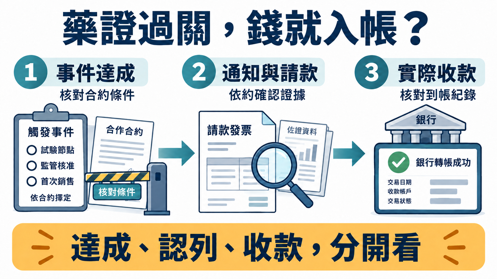
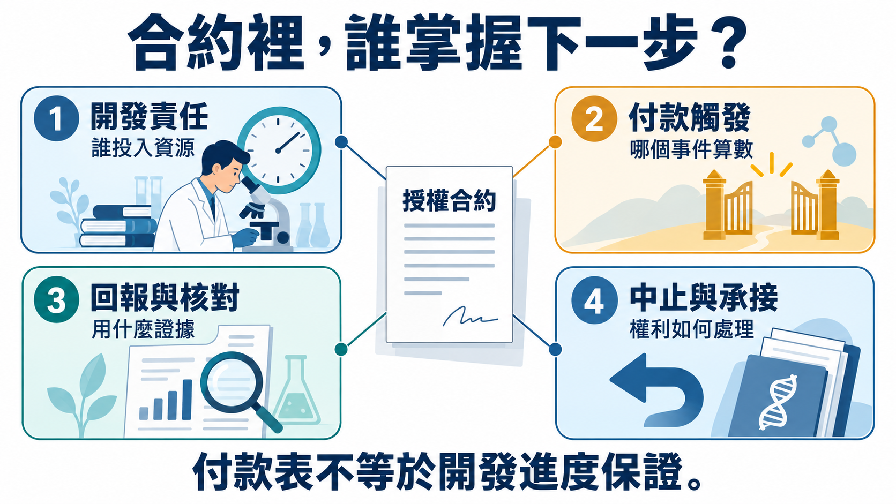
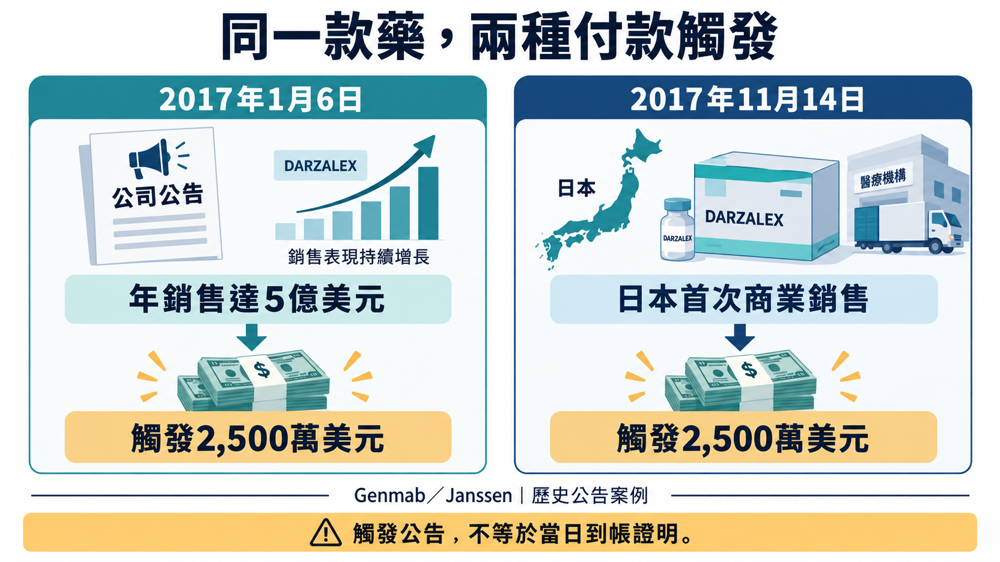
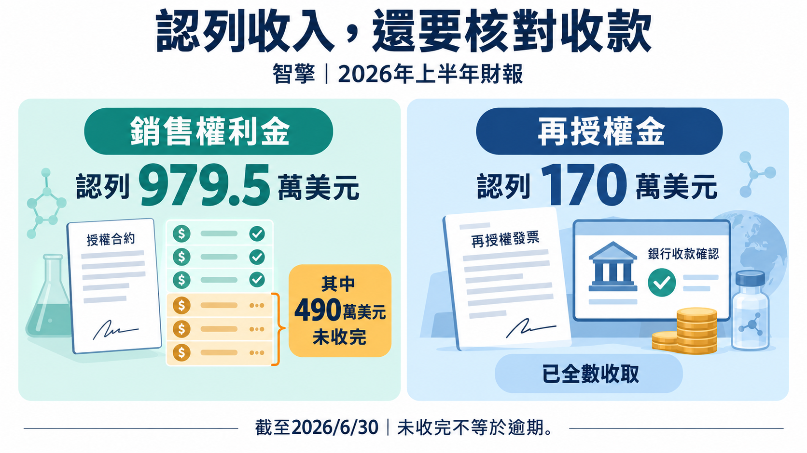

# 藥證到手，錢就到帳？從台新藥、智擎看懂授權金怎麼變成現金
──────────

台新藥的眼科新藥在2024年3月取得美國FDA核准，完成藥證移轉後，觸發授權夥伴Eyenovia第一筆200萬美元開發里程碑。但真正支付時，一半是現金，一半是股票；後來合作終止，還有220萬美元義務被免除。到了2026年，智擎半年報又展示另一種差距：權利金已認列，部分款項仍在合約資產與稅務項目裡。[1][2][7]

對投資人而言，這些金額會影響公司能不能支應下一個試驗。看到「達標」就把整筆金額放進現金預算，可能連資金缺口都算錯。先看台新藥這筆已經走過核准、支付與換約的交易。

【01｜200萬美元達標，銀行收到多少？】

Eyenovia的2024年報記載，這筆里程碑除了FDA核准，還包括藥證移轉與承接生效；條件在2024年3月14日達成。4月26日支付100萬美元現金，4月29日再以股票完成另一部分支付。[1]

股票數量依契約約定的100萬美元及先前股價計算；到了交付日，財報列出的股票公允價值約40萬美元。這裡同時存在三個量：契約計數基礎、交付日估值，以及真正進銀行的現金。[1]

💵 已支付100萬美元現金，並不代表另外100萬美元也能原額拿去付研發費。股票若要變成現金，還得看實際出售價格與可變現條件；40萬美元也不是台新藥最後賣股所得的證明。

這種安排讓付款方保留現金，也把一部分資金風險交給收款方。對台新藥的資金規劃而言，里程碑達成與股票入帳之間，仍有一道流動性問題。

*圖1｜觸發條件、通知請款與收款是不同狀態；各合約對程序的安排不同，不能把一項公告自動接成全額現金入帳。[1][10]*

【02｜合作結束，免除220萬美元不是又收到一筆錢】

2025年6月6日，台新藥與Eyenovia簽署終止安排。對方第二季財報記載，相關條件於7月滿足，Eyenovia合計220萬美元義務因而解除。這是在結清雙方權利義務，不是台新藥另收220萬美元。[2]

原共同公告也交代，Eyenovia因其他計畫遇到公司層面的挫折，停止推進這款眼藥的銷售。這個轉折提醒投資人：產品取得藥證後，商業化仍依靠夥伴的資金、投入與執行能力。[11]

一份授權因此不能只讀價碼。誰負責後續開發與上市工作、付款如何計算、銷售如何回報，以及一方退出後權利怎麼回來，都會影響原廠還能留下什麼。終止之後，未來收入模型也必須按新的權利義務重估。

重新找到夥伴，還意味著上市準備、供應協調與市場拓展需要重新銜接。即使藥證留在，等待新夥伴接手的時間仍可能拉長現金回流。評估授權案時，對方願不願意持續配置商業資源，與合約列出的最高金額同樣值得看。

*圖2｜開發責任、付款條件、銷售回報與退出安排共同決定交易價值；退出條款會改變權利與款項，不是額外一筆收入。[2][10]*

【03｜Harrow接手，付款改看首賣與毛利】

三天後，2025年6月9日，Harrow宣布取得BYQLOVI在美國的獨家權利與上市許可。它是0.05% clobetasol propionate眼用懸浮液，治療眼科手術後的發炎與疼痛；台新藥的APNT奈米製劑技術著重藥物的分散、溶解與可利用性。這是有具體製劑與核准用途的產品，後面的考題是如何轉成處方與銷售。[3][4]

Harrow的8-K把付款寫得很清楚：首次向第三方商業銷售時，支付50萬美元；另有依商業毛利里程碑觸發的一次性款項，以及按產品毛利計算的權利金。[3]

首賣50萬美元並非簽約當天就到帳的簽約金。更值得追的是「毛利」：若銷量增加，符合合約定義的成本也增加，可分潤的基礎未必同步擴大。只拿終端市場規模乘上一個猜測的權利金率，會漏掉這份交易真正的計價方式。

毛利也不等於淨利。哪些成本可以扣、里程碑門檻與分潤比例如何設定，這份公開8-K沒有完整揭露；投資人需要後續可核的結算資料，才能判斷合作的持續收益。

台新藥2026年第一季財報提供一個具體進度：從簽約到2026年3月31日，Harrow合約尚未認列收入。[12] 這個會計狀態止於該報告期，9月的收款情況仍需後續文件。截至9月27日，本文所採後續公開資料仍未提供那筆50萬美元的明確實收日期。

【04｜同樣2,500萬美元，Genmab兩次達標的意思不同】

🔎 2017年有一個很短、卻足以提醒投資人的對照。Genmab在1月6日公告，DARZALEX（daratumumab）曆年銷售達到5億美元，觸發2,500萬美元款項；同年11月14日，另一筆2,500萬美元則由日本首次商業銷售觸發。[8][9]

前一筆反映銷售已累積到約定規模，後一筆反映產品進入一個新市場。金額相同，對未來收入的意義卻不同；兩則公告也不是同日銀行收款憑證。

Genmab與Janssen於2012年簽訂的公開合約，更把通知、發票和付款分開處理，部分期限被遮蔽。契約還容許Genmab在知悉條件已達成時，先於對方通知開立發票。[10] 通知與請款的先後、付款期限，都要回到各筆款項的約定。

*圖3｜2017年兩筆各2,500萬美元：一筆由曆年銷售達5億美元觸發，另一筆由日本首次商業銷售觸發。相同金額不代表相同商業成熟度。[8][9]*

【05｜智擎已認列979.5萬美元，為什麼不能直接當收現？】

智擎的ONIVYDE是脂質體包覆irinotecan的胰臟癌用藥，透過製劑改變藥物遞送與釋放方式。產品有市場後，智擎依授權安排分享歐亞地區、台灣除外的銷售權利金；這是後續市場收入回流研發公司的途徑。[6][7]

2026年上半年，智擎認列銷售權利金979.5萬美元。財報接著說明，截至6月30日，其中490萬美元尚未收款完畢；再往下拆，441萬美元列流動合約資產，其餘49萬美元涉及本期所得稅負債減少。[7]

📘 490萬美元已包含在979.5萬美元裡，這是一層子集關係。拆解銀行現金時，還要把其中49萬美元的稅務處理分開，不能把整筆490萬美元視為尚缺匯款。這49萬美元的負債減少不等於現金存款增加，卻也不同於仍待結算的合約資產；公開附註未進一步交代的稅務機制，不宜自行填入。

流動合約資產也不是「逾期收不回」的同義詞。單看這個分類，無法判定對方遲付，更不能據此寫成壞帳。對公司的資金預算，仍要把已認列收益、待結算款項與真正可動用的現金分開。

這也解釋了為什麼只看損益表容易誤判資金續航。同一季的授權收入可能包含本期已收款、仍待結算，以及不同稅務處理；用總額直接減掉研發支出，還不足以推算公司能撐多久。需要再對照收款期間、現金流與既有可用資金。

同一份半年報另列170萬美元再授權收入，並明確說已於上半年全數收款。這筆款項與前述銷售權利金分開揭露，提供了一項已收款的收入證據；其他收入的收款狀態仍須逐筆對照。[7]

*圖4｜2026H1：US$9.795m權利金內含US$4.9m未收款完畢項目，其中US$4.41m列流動合約資產、US$0.49m涉及所得稅負債減少；另有US$1.7m再授權收入已全收，勿重複加總。[7]*

【06｜把「將收」核成「已收」，差一份文件就差一種判斷】

智擎2025年的5,000萬美元里程碑，提供了完整一點的對照。2月5日公告說，因ONIVYDE的2024年歐亞銷售達到第二個門檻，公司「將收到」款項；產品里程碑頁則另記載，2025年2月已收到這5,000萬美元。[5][6]

前者證明觸發與通知，後者補上收款。這筆歷史款項應留在2025年的對應期間，與2026年上半年收入分開。智擎的銷售權利金和台新藥的新毛利分潤，後續也各有不同的結算基礎。

藥時事團隊的判讀是，授權收益能否支撐下一個研發計畫，取決於付款形式、合作能否延續，以及收入如何落入現金流。台新藥的新合約已把部分回報綁在產品毛利上。接下來真正值得等的是：Harrow的首賣與後續結算，能為台新藥帶回多少可持續、可用於研發的現金？

本文提供產業資訊與商業分析，不構成個別化投資建議。

## 參考來源

[1] [Eyenovia 2024 Form 10-K](https://www.sec.gov/Archives/edgar/data/1682639/000141057825000743/eyen-20241231x10k.htm)

[2] [Hyperion DeFi／原Eyenovia 2025Q2 Form 10-Q](https://www.sec.gov/Archives/edgar/data/1682639/000141057825001740/hypd-20250630x10q.htm)

[3] [Harrow Form 8-K（2025-06-09）](https://www.sec.gov/Archives/edgar/data/1360214/000164117225014234/form8-k.htm)

[4] [Harrow／台新藥共同公告](https://www.sec.gov/Archives/edgar/data/1360214/000164117225014234/ex99.htm)

[5] [智擎：將收到US$50m公告（2025-02-05）](https://www.pharmaengine.com/en/investors/investors_5/88)

[6] [智擎ONIVYDE產品與里程碑頁](https://www.pharmaengine.com/en/product/index/8)

[7] [智擎2026年第二季財報，第20頁](https://www.pharmaengine.com/en/uploads/en/investors_3/20260817374.pdf)

[8] [Genmab：DARZALEX銷售里程碑（2017-01-06）](https://www.globenewswire.com/news-release/2017/01/06/904135/0/en/Genmab-Achieves-USD-25-Million-Sales-Milestone-in-DARZALEX-daratumumab-Collaboration-with-Janssen.html)

[9] [Genmab：日本首次商業銷售里程碑（2017-11-14）](https://www.globenewswire.com/news-release/2017/11/14/1186131/0/en/Genmab-Achieves-USD-25-Million-Milestone-for-First-Commercial-Sale-of-DARZALEX-daratumumab-in-Japan-and-Updates-Financial-Guidance.html)

[10] [Genmab／Janssen授權合約（2012-08-30），SEC公開附件](https://www.sec.gov/Archives/edgar/data/1434265/000104746919003334/a2238822zex-10_1.htm)

[11] [台新藥官網：Harrow接手公告（2025-06-09）](https://www.formosapharma.com/harrow-acquires-u-s-commercial-rights-to-byqlovi-clobetasol-propionate-ophthalmic-nanosuspension-0-05-from-formosa-pharmaceuticals/)

[12] [台新藥2026Q1財報英文版，第34頁](https://www.formosapharma.com/wp-content/uploads/2026/06/%E5%8F%B0%E6%96%B0%E8%97%A5.2026%E5%90%88%E4%BD%B5%E7%AC%AC%E4%B8%80%E5%AD%A3.FS_.AllReport.ENG_0529.pdf)
