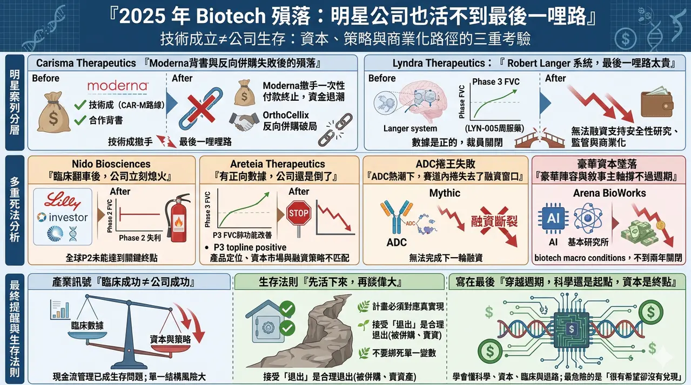
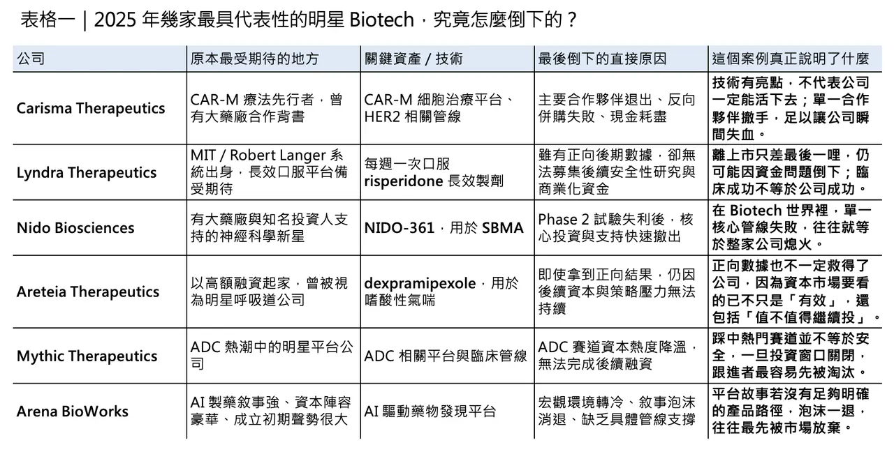
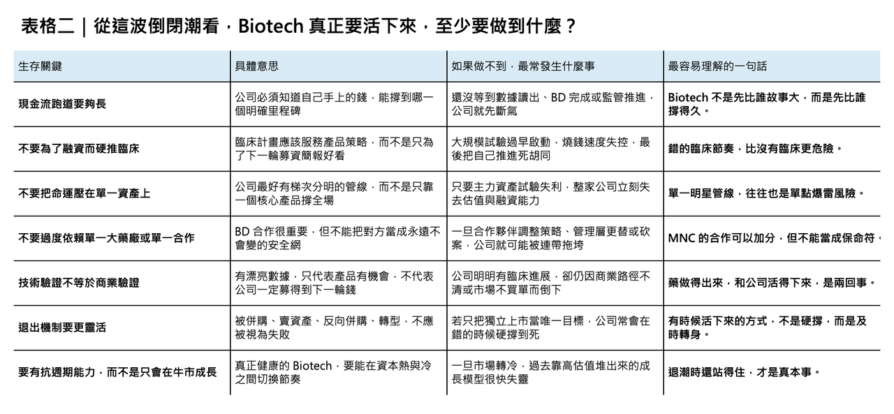
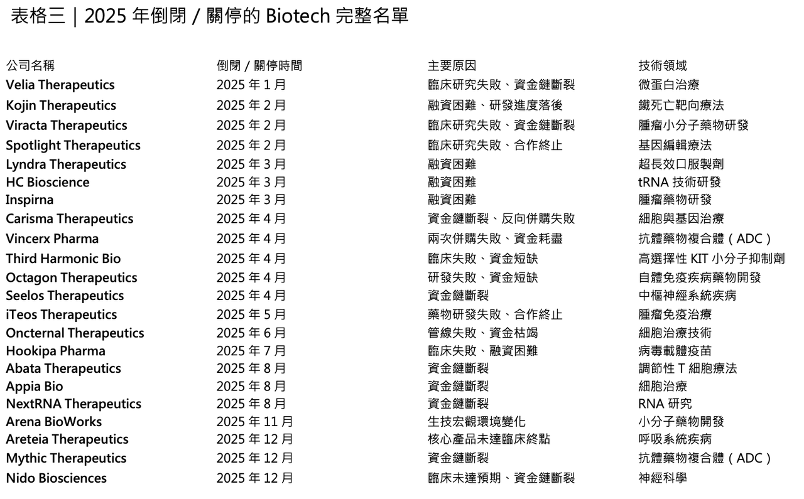

# 兩家明星 Biotech 的隕落

## 2025 年最殘酷的訊號，不是沒技術，而是活不到商業化
2025 年的生技產業，表面上看起來不像 2022 年那麼驚慌，但真正懂產業的人都知道，市場其實正在經歷一場更深層的重估。依 Fierce Biotech 年底的 graveyard 清單，2025 年美國共有 16 家 Biotech 正式關門，另有 3 家已一腳踏進墳場；雖然低於 2024 年的 22 家，但更值得警惕的不是數量，而是倒下公司的質地愈來愈高：不再只是沒人記得的小型早期平台，而是那些曾拿過大額融資、擁有明星科學家、甚至已經走到臨床後段的「明星 Biotech」。

✦【如果要用兩家公司，概括這個新時代最殘酷的真相】

如果要用兩家公司來概括這個新時代最殘酷的真相，Carisma Therapeutics 與 Lyndra Therapeutics 幾乎是最有代表性的兩個案例。前者代表的是「技術成立，但資本與合作關係先斷掉」；後者代表的是「臨床幾乎走到終點，卻 still die on the last mile」。這兩種死法不同，但共同指向同一件事：

今天的 Biotech，臨床成功已不再等於公司能活下去。

✦【Carisma Therapeutics：不是科學先死，而是資本先走】

先看 Carisma Therapeutics。它曾是 CAR-M 路線最具代表性的公司之一，也拿過 Moderna 的合作背書，原本被視為細胞治療下一波值得期待的創新方向。

但到了 2025 年 9 月，公司與 Moderna 修改合作協議，Moderna 以 400 萬美元一次性付款換取未來所有里程碑與權利金義務的終止；幾乎同一時間，Carisma 原本想透過與 OrthoCellix 的反向併購替自己續命，最後也宣告破局。根據後續 SEC 文件，公司已進入有序 wind-down，核心問題不是單一科學數據崩壞，而是資金退潮、合作撤手與資本市場不再願意給它第二次機會。

✦【Lyndra Therapeutics：不是做不出來，而是撐不到最後一哩路】

再看 Lyndra Therapeutics。這家公司出身自 MIT 與 Robert Langer 的技術系統，做的是極具想像力的超長效口服藥物平台。它的核心產品 LYN-005，是一種每週一次口服的 risperidone 製劑，用於思覺失調症治療；2024 年，Lyndra 甚至已公布正向的 pivotal Phase 3 數據，顯示每週一次給藥可維持與每日即時釋放 risperidone 相近的暴露與療效。

照理說，這樣的公司應該離上市不遠了。

但現實是，Lyndra 仍在 2025 年啟動裁員與 wind-down，原因不是產品徹底失敗，而是無法再募到足以支撐後續安全性研究、監管推進與商業化前準備的資金。這是一種比早期失敗更令人唏噓的隕落：公司不是死在科學上，而是死在「最後一哩路太貴」。

✦【2025 年最殘酷的地方：有數據，也不一定活得下來】

這也是 2025 年生技出清最殘酷的地方：

死亡不再只發生在沒有數據的公司，也發生在有數據、甚至有希望上市的公司。

Nido Biosciences 就是另一個更典型的「臨床一翻車，公司立刻熄火」案例。這家成立於 2020 年、背後有 Eli Lilly 與多家頂級投資人支持的神經科學公司，主力產品 NIDO-361 用於治療 spinal and bulbar muscular atrophy（SBMA, Kennedy’s disease）。但到了 2025 年底，全球 Phase 2 試驗未能達到關鍵終點，公司隨即在 2026 年初宣布關閉。

這說明了一件事：在今天的市場裡，哪怕背後站著大藥廠，臨床失敗依然足以讓公司在幾個月內失去生存資格。

✦【更值得玩味的是 Areteia：數據是正的，公司還是倒了】

更值得玩味的是 Areteia Therapeutics。因為它不是典型的「數據失敗後倒下」。相反地，Areteia 在 2025 年 9 月才公布 dexpramipexole 用於嗜酸性氣喘的 Phase 3 正向 topline 結果，顯示肺功能改善達到主要終點。然而，到了 12 月，市場傳出的卻是公司 wind-down 與 Phase 3 計畫中止。

這個案例比單純的 trial failure 更值得警惕，因為它說明了一個新的產業現實：

就算你拿到正向數據，若產品定位、資本市場環境、後續商業路徑與融資條件不再匹配，公司一樣可能活不下去。

✦【另外兩種很典型的死法，也很值得記住】

若把視角再拉寬，2025 年還有兩種非常典型的死亡方式，也值得所有 Biotech 記住。

🔹 第一種，是 Mythic Therapeutics 這類「概念很熱，但賽道迅速內捲後失去融資窗口」的公司。Mythic 做的是 ADC，原本踩在產業最熱的浪頭上，卻在資本市場對 ADC 跟進者快速降溫後，因無法完成下一輪融資而關門，甚至最終走到資產處分。

🔹 第二種，則是 Arena BioWorks 這類帶著巨大敘事與豪華資本陣容登場，卻在不到兩年內迅速關閉的公司。Arena 2024 年高調起步，背後有 5 位億萬富豪支持、承諾 5 億美元長線研發，但到 2025 年 11 月仍因「biotech macro conditions」而宣布收掉。

這兩家公司共同揭示的，是平台型故事、AI 敘事、熱門模態敘事都不再天然安全；若缺乏具體管線、明確里程碑與資本耐受度，再大的故事也撐不過週期。

✦【把這些案例放在一起看，2025 年真正的產業訊號其實很清楚】

把這些案例放在一起看，2025 年真正的產業訊號其實非常清楚。

🔸 第一，現金流管理已經從財務問題，變成生存問題。

🔸 第二，臨床成功與公司成功已經正式脫鉤。

🔸 第三，單一 MNC 合作、單一核心管線、單一敘事主軸，都變成非常危險的脆弱結構。

Carisma 死於合作夥伴撤手後無法再融資，Lyndra 死於商業化前資本缺口，Nido 死於單一核心資產試驗失利，Areteia 則證明了即便有正向數據，若公司整體融資與策略結構撐不住，還是會倒。

✦【這對亞洲生技圈，其實是非常重要的提醒】

這對亞洲，尤其是台灣與整個華語生技圈，其實是很重要的提醒。

過去幾年，很多 Biotech 習慣把「出海授權」「拿到跨國藥廠合作」「啟動關鍵性試驗」視為幾乎等同於公司安全的訊號；但現在看來，這些都不再是保證書。

真正能活下來的公司，不一定是技術最炫、新聞最多、融資最亮眼的公司，而是那些最早把現金流跑道、臨床節奏、BD 選項與退出機制一起設計好的公司。

✦【如果要從這一波倒閉潮裡提煉最重要的生存法則】

所以，如果要從這一波倒閉潮裡提煉最重要的生存法則，我反而會把它講得更直接一點。

🌿 第一，先活下來，再談偉大。任何臨床計畫都必須對應真實現金流，而不是只為了下一輪募資簡報好看。

🌿 第二，不要把公司命運綁死在單一試驗、單一大藥廠、單一敘事上。

🌿 第三，要學會接受「被併購、賣資產、反向合併、轉型」也是合理退出，不必把獨立上市當成唯一成功路徑。

✦【寫在最後】

2025 年明星 Biotech 的集體墜落，真正埋葬的不是創新本身，而是那種只靠資本寬鬆與敘事泡沫就能一路撐到上市的舊時代。

對今天的 Biotech 來說，科學還是最重要的起點，但已經不再是唯一答案。未來能穿越週期的公司，必須同時懂科學、懂資本、懂臨床、也懂怎麼為自己設計退路。

因為在新的市場規則裡，最危險的公司，不一定是沒有希望的公司，而是明明很有希望，卻沒有撐到希望兌現那一天的公司。
-----------
參考資料：

[0]: 各公司官網＆公開資料

[1]:

The 2025 Biotech Graveyard

Biotechs, beware: You're in for a scare.

www.fiercebiotech.com

[2]:

Langer spinout Lyndra begins winding down

The wind-down officially began on March 26, with 60 employees set to be laid off when all is said and done.

www.fiercebiotech.com

[3]:

www.sec.gov

https://www.sec.gov/Archives/edgar/data/1485003/000110465925091064/tm2526076d1_8k.htm

www.sec.gov

[4]:

Neuro biotech Nido closes after 5 years

Founded by 5AM Ventures’ 4:59 Initiative, Nido Bio publicly emerged in 2023 with $109 million and support from Big Pharma Eli Lilly.

www.fiercebiotech.com

[5]:

Areteia Therapeutics Announces Positive Topline Results from the First Phase III Study of Oral Dexpramipexole in Eosinophilic Asthma

Areteia Therapeutics, Inc. (“Areteia”) today announced positive results from the Phase III EXHALE-4 efficacy and safety study of dexpramipexole as an add-on ...

www.businesswire.com

---

本文僅供產業研究與知識分享，不構成投資、醫療、募資或個股建議。
