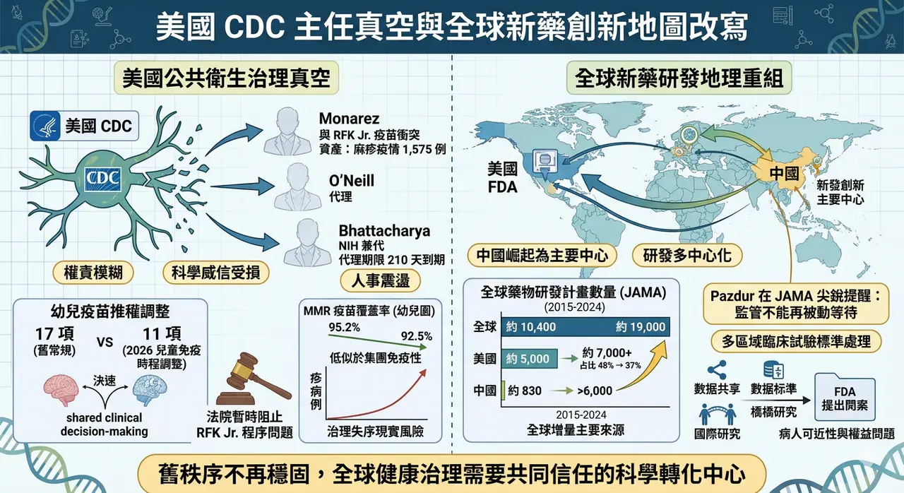
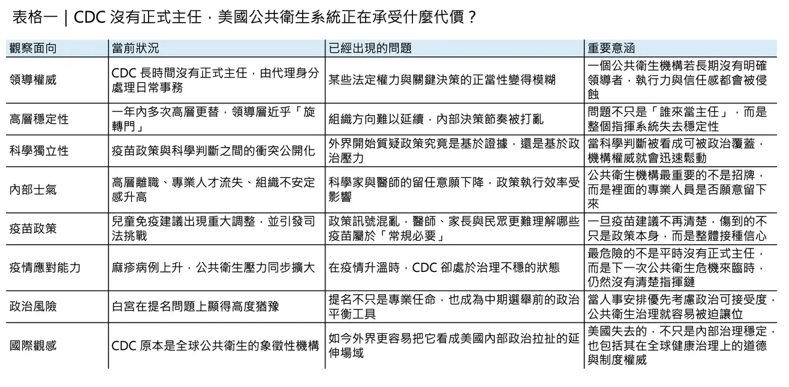
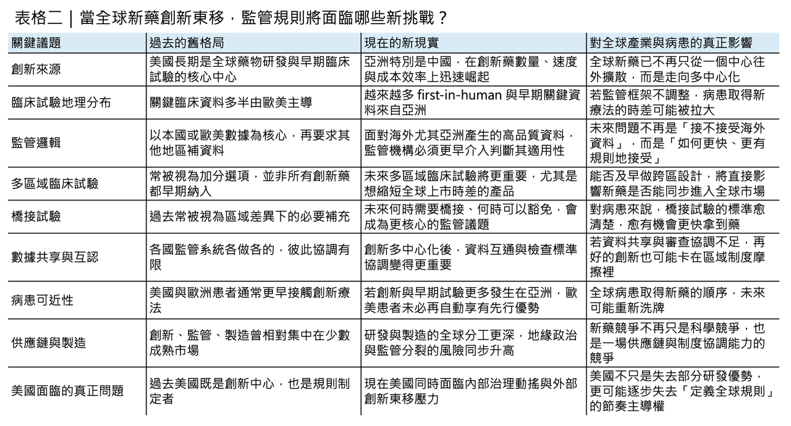

# 當美國 CDC 還在找主任...

## 當美國 CDC 還在找主任，全球新藥創新已經開始改寫地圖
真正值得擔心的，從來不只是美國疾病管制與預防中心（CDC）這個位子到底由誰來坐，而是當一個國家的公共衛生指揮中樞長期處於權責模糊、科學威信受損、政策方向反覆擺盪的狀態時，它原本在全球健康治理與醫藥監管上的領導角色，也會跟著一起鬆動。2026 年 3 月 25 日，白宮錯過了為 CDC 提出正式主任人選的關鍵時點；依據聯邦代理任命規則，Jay Bhattacharya 的 210 天代理期限本已走到盡頭，但白宮仍選擇讓他繼續以「可委派職責」的方式管理 CDC。換句話說，美國最重要的公共衛生機構，至今仍沒有真正意義上的正式領導者。
## 這場真空，不是偶然

這場真空不是偶然，而是一連串政治與科學衝突累積後的結果。Reuters 的報導指出，Susan Monarez 去年 8 月遭撤換，導火線是她反對衛生部長 Robert F. Kennedy Jr. 推動、但她認為缺乏科學依據的疫苗政策變更；她離職後，四名資深 CDC 官員相繼請辭。之後 Jim O’Neill 接手代理主任，再到 2026 年 2 月由同時身兼 NIH 院長的 Jay Bhattacharya 暫代。短短幾個月內，CDC 不只換了多位領導者，還出現了 Ralph Abraham 這位首席副主任上任不久便以家庭因素辭職的情況。對一個本來就要面對疫苗政策、麻疹疫情、州際協調與突發公衛事件的機構而言，這種高層人事震盪本身就是治理風險。
## 問題已經不是人事，而是政策本身開始搖晃

問題更嚴重的是，這場人事危機並不是孤立事件，它已經直接滲透到政策內容本身。2026 年 1 月，美國調整兒童免疫時程，取消對流感、輪狀病毒、A 型肝炎與腦膜炎球菌等疫苗的普遍常規建議，改成「shared clinical decision-making」模式；之後的訴訟資料又顯示，CDC 將常規建議疾病數從 17 項降到 11 項，另有包括 B 型肝炎在內的疫苗被改列為須與醫師討論後決定。3 月 16 日，聯邦法官 Brian Murphy 暫時阻止了 Kennedy 對兒童疫苗政策與諮詢委員會的重塑行動，認定相關程序存在問題。也就是說，今天美國不是只有「政策有爭議」，而是連政策制定程序本身，都已經被法院質疑。
## 麻疹疫情，讓治理失序變成現實風險

若這一切只是華府內鬥，影響或許還可控；但偏偏它發生在美國麻疹疫情重新升高的時點。CDC 3 月 27 日更新顯示，截至 3 月 26 日，美國 2026 年已累計 1,575 例確診麻疹病例，其中 94% 與群聚疫情有關；同時，美國幼兒園 MMR 疫苗覆蓋率已從 2019–2020 學年的 95.2% 降到 2024–2025 學年的 92.5%，低於群體免疫常被引用的 95% 目標。這些數字的意義很直接：當一個國家的公共衛生機構正面對內部領導真空、外部政治施壓與司法爭議時，它面對的不是理論性風險，而是已經發生中的傳染病壓力。
## 另一邊，全球新藥創新地圖已經開始改寫
如果故事只到這裡，頂多可以說是美國公共衛生治理出了問題；但更值得注意的是，這個治理問題，正好發生在全球醫藥創新地理版圖劇烈重組的同一時間。3 月 26 日，前 FDA 腫瘤卓越中心與 CDER 重要領導人物 Richard Pazdur 與 Steven Usdin 在 JAMA 發表文章指出，中國已崛起為全球藥物研發的主要中心之一。根據同一期研究，2015 到 2024 年間，全球藥物研發計畫數量幾乎翻倍，從約 10,400 個增加到約 19,000 個；美國雖然仍在增加，從約 5,000 個成長到 7,000 多個，但全球占比已從約 48% 降到 37%；同期，中國則從約 830 個增至超過 6,000 個，成為全球增量最主要的來源。

這篇文章真正尖銳的地方，不是單純說「中國變強了」，而是它把問題直接丟回監管者面前：如果越來越多創新療法的早期甚至關鍵資料主要來自美國之外，尤其來自中國，那麼原本建立在美國主導創新節奏之上的監管設計，還能不能確保患者及時取得新藥？Pazdur 的答案很清楚——監管機構不能再被動等待，而必須更積極處理多區域臨床試驗、橋接試驗標準、資料共享與跨區同步審查。否則，未來美國病人不只可能更晚接觸到早期臨床試驗，連正式新藥上市的時點都可能開始出現新的落差。這個提醒其實非常重要，因為它意味著：全球創新重心的轉移，不再只是產業競爭議題，而已經是監管可近性與病人權益問題。
## 真正鬆動的，是美國兩種最核心的權威
從這個角度回頭看 CDC 的領導危機，就不再只是單一機構的人事混亂，而像是美國健康治理能力在兩條戰線上同時失速。

🔹 一條戰線是內部：CDC 在疫苗政策、疫情治理與機構穩定性上被政治持續侵蝕。

🔹 另一條戰線是外部：全球新藥研發活動正加速多中心化，美國若不能在監管上更靈活地處理來自海外、尤其是亞洲的高品質資料，它原本在「定義標準、整合證據、決定誰先受益」這件事上的制度優勢，就會逐步被稀釋。

這裡真正的風險，不是某一篇 JAMA 文章寫得太誇張，而是美國正在同時失去兩種節奏：一種是公共衛生危機來臨時的指揮節奏，另一種是全球創新加速重組時的監管節奏。
## 這已經不是「誰來當主任」那麼簡單
這也讓今天的問題變得比「誰是下一任 CDC 主任」更大。因為即便白宮最終找到一位能通過參議院的人選，那也只能暫時填補職位空缺，未必能修補外界對程序正當性與科學獨立性的信任裂痕。

同樣地，即便美國藥廠仍然握有龐大資本、成熟商業化能力與頂尖學術網絡，如果它無法把全球新興創新來源更有效地納入自身監管與開發體系，那麼未來全球新藥的首發節點、授權談判重心與早期臨床主導權，就會愈來愈分散。這對美國而言，挑戰已經不是單純的「競爭變強」，而是它是否還能繼續扮演全球健康秩序的中樞。
## 對台灣與亞洲市場來說，真正要看的不是熱鬧，而是規則怎麼變
對台灣與其他亞洲市場的讀者來說，這件事的啟示其實非常現實。未來幾年，真正值得關注的，不只是某家中國 biotech 是否又簽下一筆大授權、或某位美國衛生官員又說了什麼，而是全球監管體系會不會因此被迫重寫遊戲規則。

🧩 多區域臨床試驗會不會變得更早期、更同步？

🧩 橋接試驗的門檻會不會更明確？

🧩 美國與其他監管機構對海外資料的接受度會不會提高？

🧩 供應鏈與檢查制度會不會更政治化？

這些問題表面上屬於法規與政策，但最終影響的其實是病人何時拿到藥、企業在哪裡做試驗、資本如何重新定價創新資產。
## 寫在最後
所以，當 CDC 的帥位仍然懸而未決，真正浮出水面的，其實不是單一人事案，而是一個更大的時代訊號：美國曾經最穩固的兩種權威——公共衛生權威與醫藥監管權威——如今都不再是理所當然。

前者正在被國內政治消耗，後者則正在被全球創新東移重新挑戰。未來世界不一定會出現一個能完全取代美國的新中心，但幾乎可以確定的是，舊秩序已經不再像以前那樣穩固。

當創新的地理中心開始移動，而美國自己又在領導與程序上失去穩定性時，全球健康治理的下一個問題，恐怕已不再是「誰領導」，而是：

還有沒有一個被普遍信任、能夠把科學轉化成公共利益的共同中心。
--------
參考資料：

[0]: 各公司官網＆公開資料

[1]:

reuters.com

https://www.reuters.com/business/healthcare-pharmaceuticals/bhattacharya-lead-cdc-now-white-house-continues-search-permanent-head-2026-03-25/

www.reuters.com

"Trump delays naming new CDC head, Bhattacharya will still oversee agency | Reuters"

[2]:

reuters.com

https://www.reuters.com/business/healthcare-pharmaceuticals/nih-director-temporarily-run-cdc-new-york-times-reports-2026-02-18/

www.reuters.com

"US NIH director Bhattacharya to temporarily run CDC | Reuters"

[3]:

reuters.com

https://www.reuters.com/world/us-judge-blocks-efforts-reshape-childhood-vaccine-policy-2026-03-16/

www.reuters.com

"US judge upends Kennedy's overhaul of childhood vaccine policies | Reuters"

[4]:

Measles Cases and Outbreaks | Measles (Rubeola) | CDC

Find the latest numbers of confirmed U.S. measles cases. CDC updates this page weekly.

www.cdc.gov

"Measles Cases and Outbreaks | Measles (Rubeola) | CDC"

[5]:

The Geography of Pharmaceutical Innovation

China’s rise as a major center of drug development represents one of the most consequential shifts in the global life sciences landscape in a generation. From the patient perspective, a key policy question is how China’s expanding capacity, spanning follo

jamanetwork.com

"The Geography of Pharmaceutical Innovation: The US and China in a New World Order | Pharmacoeconomics | JAMA | JAMA Network"

---

本文僅供產業研究與知識分享，不構成投資、醫療、募資或個股建議。
