# 臨床試驗作假，FDA 撤市風暴！

臨床資料不只是科學問題，也是資產價值問題；一旦資料完整性被質疑，藥品命運可能被監管重新改寫。

## 資料可信度，是藥品價值的地基

一個藥品能不能上市，表面上看的是療效與安全性；但更底層的是資料能不能被相信。臨床試驗如果牽涉造假、漏報、紀錄不一致或稽核失敗，監管機關就不只是在質疑某個數字，而是在質疑整個證據鏈。

這也是為什麼資料完整性事件常常會引發撤市、補件、重新試驗或標籤限制。對投資人來說，這不是法規細節，而是資產現金流可能被瞬間重估。

- 資料完整性問題會破壞整個臨床證據鏈。
- FDA 關注的是病人安全與決策依據是否可靠。
- 撤市風險常常比單純療效不佳更難預測。

## 不要只看藥效，也要看試驗品質

生技投資常被療效數字吸引，但真正成熟的分析會回頭看試驗設計、收案品質、中心分布、缺失資料比例與監管溝通紀錄。越是關鍵試驗，越不能只看公司簡報上的漂亮圖表。

如果一個藥的核心證據高度依賴少數中心，或資料清理與稽核問題反覆出現，就算結果看起來正面，市場也應該給予折價。

- 多中心一致性比單點亮眼更重要。
- 缺失資料與事後分析要特別留意。
- 監管文件常比新聞稿更接近風險核心。

## Drugnews 的判斷

臨床試驗作假事件提醒我們：新藥價值不是只由科學假說決定，也由執行品質決定。好的資產需要好的臨床營運，否則再漂亮的機制都可能在法規面前失去說服力。

- 資料可信度是估值底線。
- 監管風險不是附註，而是核心投資變數。

## 小結

這篇文章的重點不是把單一新聞看成短線題材，而是回到 Drugnews 一直強調的分析方法：從臨床證據、商業定位、競爭格局與監管風險四個面向，判斷一個生技醫藥事件是否真的會改變公司價值。

本文僅供產業研究與知識分享，不構成投資、醫療、募資或個股建議。
