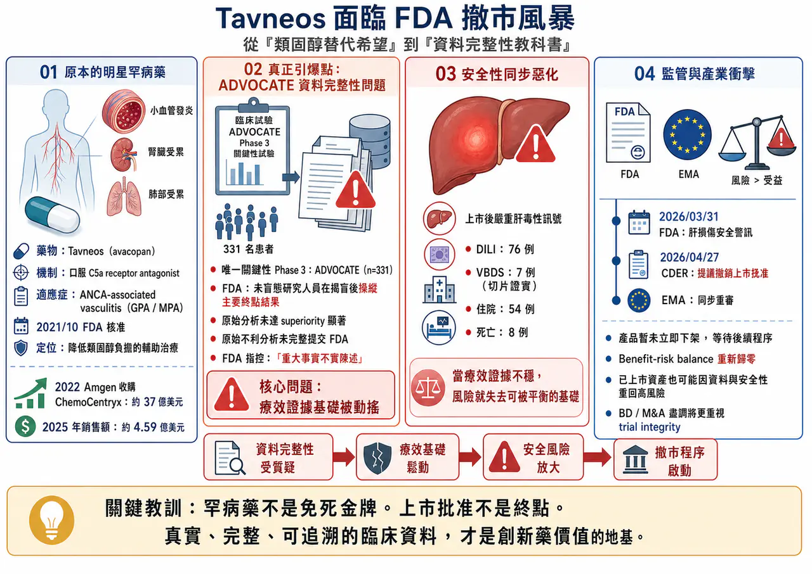
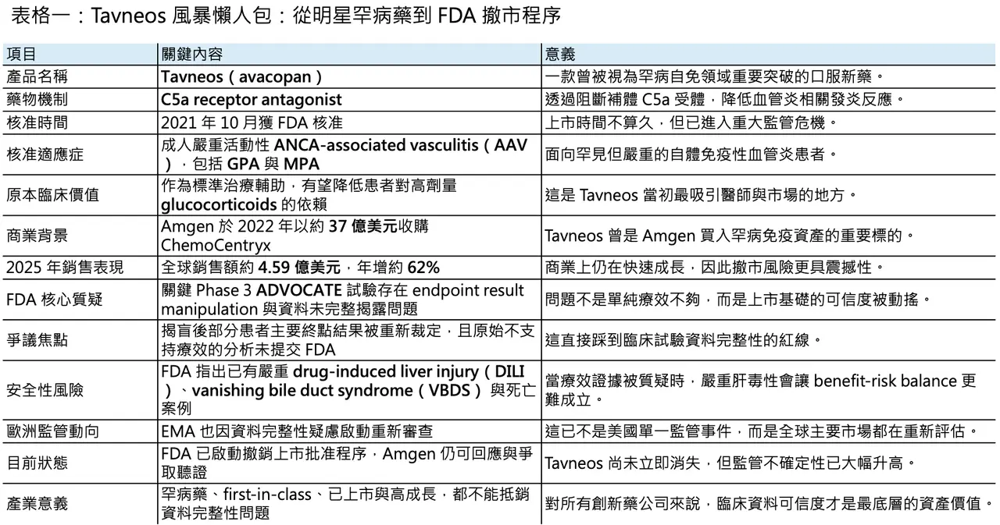
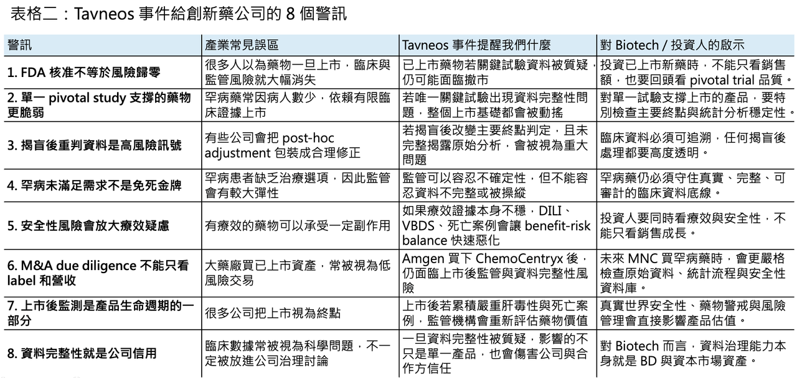

# 臨床試驗作假，FDA 撤市風暴！

## Tavneos 面臨 FDA 撤市風暴：一款明星罕病藥，為什麼會從「類固醇替代希望」變成資料完整性教科書？

- 美國 FDA 這次對 Tavneos（avacopan）出手，訊號非常重。
2026 年 4 月 27 日，FDA 藥品審查與研究中心 CDER（Center for Drug Evaluation and Research）正式提議撤銷 Tavneos（avacopan）的上市批准。理由不是單純「療效不夠好」，而是更嚴重的兩件事：第一，新的資訊顯示 Tavneos 並未被充分證明對核准適應症有效；第二，當初申請上市的資料中，包含「重大事實不實陳述」。FDA 在公告中甚至明確指出，關鍵性 Phase 3 試驗 ADVOCATE 中，有未盲態研究人員操縱主要終點結果，讓原本不支持療效的分析看起來變成有效。

這件事之所以震撼，不只是因為 Tavneos 是 Amgen 旗下成長最快的產品之一，更因為它原本代表了一個非常漂亮的罕病創新藥故事：一款 first-in-class 口服補體藥物，切入罕見自體免疫血管炎，試圖降低患者對高劑量 glucocorticoids 的依賴。

但現在，這個故事被重新打開審視。

問題已經不只是 Tavneos 還能不能賣，而是整個產業必須重新面對一個更根本的問題：

當一款藥物的療效證據本身被質疑，而上市後又出現嚴重安全性訊號時，監管機構還能不能繼續讓它留在市場上？

## 01｜Tavneos 曾經是一個非常漂亮的罕病藥故事

🧬 Tavneos（avacopan）是一款口服 C5a receptor antagonist，用於治療成人嚴重活動性 ANCA-associated vasculitis（AAV），包括 granulomatosis with polyangiitis（GPA）與 microscopic polyangiitis（MPA）。這些疾病本質上是罕見但嚴重的自體免疫性血管炎，會造成小到中型血管發炎，進一步影響腎臟、肺部與其他器官。FDA 於 2021 年 10 月 7 日核准 Tavneos，定位是與 glucocorticoids 及其他標準治療合併使用；FDA 也特別提醒，Tavneos 並不是完全消除 glucocorticoid 使用，而是作為輔助治療。

這個機制當時很吸引人。

AAV 的傳統治療高度依賴 glucocorticoids、rituximab、cyclophosphamide、azathioprine 等藥物。這些療法有效，但類固醇相關副作用沉重，長期使用會帶來感染、骨質疏鬆、代謝異常、情緒問題與多器官負擔。若能用口服 C5a receptor antagonist 降低發炎、控制血管炎活動，同時減少 glucocorticoid 暴露，這對患者和醫師都有很強吸引力。

這也是為什麼 Amgen 會在 2022 年以約 37 億美元收購 ChemoCentryx。Amgen 當時看上的，正是 Tavneos 這個已上市、具 first-in-class 標籤、又有罕病定價能力的發炎免疫資產。Amgen 官方公告顯示，這筆交易的企業價值約 37 億美元，目的就是把 Tavneos 納入其 inflammation portfolio。

從商業表現看，Tavneos 也沒有讓人失望。2025 年 Tavneos 年銷售額達 4.59 億美元，年增 62%，屬於 Amgen 成長最快的產品之一。對 Amgen 這種大型藥廠來說，4.59 億美元不是最大體量，但對一款罕病炎症藥而言，這已經是一條很值得繼續放大的成長曲線。

也正因如此，FDA 這次提議撤銷上市，才會顯得格外刺眼。

## 02｜真正引爆撤市程序的，不是普通瑕疵，而是 ADVOCATE 試驗的資料完整性問題

⚠️ FDA 這次的核心指控，集中在 Tavneos 上市所依賴的唯一關鍵性療效試驗：ADVOCATE study（CL010_168）。

這是一項納入 331 名 GPA 或 MPA 患者的 Phase 3 試驗。EMA 的公開資料也描述過，ADVOCATE 將 Tavneos 與高劑量 corticosteroids 比較，兩者都搭配標準治療，例如 rituximab 或 cyclophosphamide followed by azathioprine。依照原先審查邏輯，Tavneos 被認為在誘導緩解方面至少不劣於高劑量 corticosteroids，並在長期緩解率上有優勢。

但 FDA 現在披露的新資訊，直接動搖了這個基礎。

根據 CDER 的 Notice of Opportunity for a Hearing，FDA 指出，未盲態研究人員在資料庫鎖定與揭盲後，操縱了 ADVOCATE 試驗的 endpoint results。更關鍵的是，FDA 表示，依照原本預先設定的 statistical analysis plan 進行的初始分析，avacopan 組在主要終點的 superiority outcome 並未達到統計顯著；但這個原始分析沒有被提交給 FDA。FDA 進一步指出，如果當初提交的是原始分析，該試驗不會被視為已建立足以支持 NDA 核准的 substantial evidence of effectiveness。

這裡的重點，不只是「9 位患者的資料被重判」這麼簡單。

在罕病試驗中，樣本數本來就有限。ADVOCATE 全試驗 331 人，若主要終點邊界本來就接近，少數患者的 endpoint re-adjudication 可能足以改變整體統計結論。這也是 FDA 如此嚴厲的原因：如果資料處理發生在揭盲後，如果原始不利分析沒有揭露，如果最後提交給監管機構的是被重新處理後的結果，那就不是一般統計爭議，而是直接碰到臨床試驗可信度的底線。

FDA 在公告中寫得非常直白：CDER 已無法再認定 Tavneos 對其核准適應症存在有效性證明。這句話的分量很重，因為它等於否定了這款藥上市基礎的可靠性。

## 03｜安全性問題讓局勢更糟：DILI、VBDS 與死亡案例

🧪 如果 Tavneos 只有療效資料爭議，Amgen 或許還可以試圖透過補充分析、真實世界證據或後續研究來修補。

但麻煩在於，安全性也同時惡化。

FDA 在 2026 年 3 月 31 日發布安全通訊，指出已辨識到與 Tavneos 使用有合理因果關聯的嚴重 drug-induced liver injury（DILI）案例，其中包含 vanishing bile duct syndrome（VBDS）。FDA 表示，雖然肝毒性在 Tavneos 上市前臨床試驗中已被辨識為重要風險，並已寫入標籤，但 VBDS 以及伴隨死亡結局的 DILI 案例，代表新的安全性疑慮。

FDA 的 NOOH 文件進一步指出，截至當時，CDER 已確認 76 例與 avacopan 使用相關的 DILI 案例，其中 7 例為切片證實的 VBDS，74 例報告嚴重結果，包括 54 例住院與 8 例死亡。FDA 因此認為，在缺乏可靠療效證明的情況下，Tavneos 的已知嚴重風險更難被接受。

這就是 benefit-risk balance 最殘酷的地方。

任何藥物都可能有風險。特別是在 AAV 這種嚴重罕見疾病中，患者本來就面臨高 morbidity 與 mortality，醫師和監管機構通常願意接受一定程度的安全性風險。問題是，風險必須被療效抵銷。

如果療效證據可靠，嚴重肝毒性可以透過風險管理、監測、停藥規則、標籤警示與病人選擇來處理。

但如果療效證據本身被 FDA 認為無法成立，安全性風險就會從「可管理代價」變成「無法合理承擔的危害」。

這也是 FDA 在文件中真正想說的事：

不是因為 Tavneos 有肝毒性，所以必然撤市；而是在有效性證明被動搖後，肝毒性風險已經失去可被平衡的基礎。

## 04｜Tavneos 當初獲批，本來就不是一條毫無爭議的路

🏛️ Tavneos 的上市史，本來就有爭議。

2021 年 FDA 審查時，該藥曾經歷高度分歧的外部專家討論。公開資料顯示，2021 年 5 月的 FDA advisory committee 對 Tavneos 的 efficacy 與 benefit-risk 問題有激烈討論；當時諮詢委員會投票並非壓倒性支持，而是相當分裂。最後 FDA 仍在 2021 年 10 月核准 Tavneos 上市，部分原因是 AAV 患者存在明確未滿足需求，而降低 glucocorticoid burden 具有臨床意義。FDA 的 NOOH 文件也提到，當初 NDA 審查團隊曾辨識出多項可能阻礙核准的問題。

換句話說，Tavneos 不是一款從上市第一天就毫無懸念的藥。

它比較像是一個在罕病未滿足需求、類固醇替代價值、有限臨床資料與監管彈性之間被批准的產品。這類藥物上市後，需要靠真實世界數據、長期安全監測與後續證據不斷補強其位置。

可惜的是，這次出現的是反方向訊號：療效資料完整性被質疑，安全性風險同步升高。這就是為什麼 FDA 這次不是要求單純加黑框警語，而是啟動撤銷上市批准的程序。

## 05｜EMA 也在重審：這已經不是美國單一監管事件

🌍 Tavneos 的壓力也不只來自 FDA。

2026 年 1 月，歐洲藥品管理局 EMA 的 CHMP 啟動對 Tavneos 的審查，原因同樣是新出現的資訊引發對 ADVOCATE 研究資料完整性的疑問。EMA 表示將評估所有可用資料，以判斷這些資訊是否影響 Tavneos 在歐盟的 benefit-risk balance，最終可能建議維持、修訂、暫停或撤銷上市許可。

這一點非常重要。

如果只是 FDA 內部重新評估，Amgen 還可以把事件解讀成美國監管程序問題。但 EMA 同時啟動審查，代表資料完整性疑問已經跨越單一市場，變成全球監管風險。對一款跨國罕病藥來說，真正危險的不是某一個市場標籤更新，而是主要監管機構開始同步質疑上市依據。一旦美國與歐洲都對 ADVOCATE 的可信度產生疑問，後續其他市場的監管機構、醫院、給付單位與醫師，都會重新思考這款藥的位置。Amgen 目前則強調，仍相信 Tavneos 的效益與風險特徵，並表示正在與 FDA 溝通。Reuters 報導也指出，Tavneos 在最終決定前仍會留在市場上；除非 Amgen 自願撤回，或 FDA Commissioner 最後下令撤銷批准，否則產品不會立即消失。

## 06｜這場風波真正傷到的，是 Biotech 資產併購的信任鏈

Tavneos 這件事，對 Amgen 當然尷尬。

但對整個產業更大的啟示，是它會讓大型藥廠重新審視「買已上市或 late-stage 罕病資產」的風險。Amgen 2022 年花 37 億美元買 ChemoCentryx，本質上買的是一個已經通過 FDA、具 first-in-class 機制、商業放量中的罕病免疫資產。對買方來說，這類交易原本比 early-stage 管線更安全，因為臨床和監管風險看似已經大幅下降。但 Tavneos 事件提醒所有 BD 團隊：FDA approval 不等於風險完全清零。

如果關鍵試驗資料完整性有瑕疵，如果原始統計分析沒有完整揭露，如果 post-marketing safety signal 快速累積，已上市資產也可能重新變成高風險資產。

未來大型藥廠在收購已核准罕病藥時，due diligence 很可能會更嚴格。它們不只會看 label、sales growth 和 market access，也會更仔細回頭看：

🔍 關鍵試驗是否只有單一 pivotal study？

🔍 主要終點是否靠少數患者事件支撐？

🔍 揭盲後是否有 endpoint re-adjudication？

🔍 資料庫鎖定、揭盲、統計分析流程是否乾淨？

🔍 是否存在未提交分析、補充分析或事後改判？

🔍 上市後安全資料是否與臨床前標籤一致？

🔍 是否有地區性安全訊號集中爆發？

🔍 是否已有監管機構啟動重新審查？

這些問題以前可能只是法規或統計團隊的細節。現在會變成 BD 估值模型的一部分。

## 結語｜罕病藥不是免死金牌，資料完整性才是底線

✨ Tavneos 的故事，原本可以是一個非常漂亮的創新藥故事。

一款 first-in-class 口服 C5a receptor antagonist，切入嚴重罕見自體免疫血管炎，試圖降低患者對高劑量 glucocorticoids 的依賴，上市後快速放量，最後被大型藥廠以 37 億美元買下。

但現在，這個故事的重點變了。FDA 這次真正追問的，不是 Tavneos 曾經有沒有市場，不是 Amgen 當初買得貴不貴，也不是 AAV 患者需不需要新選項。

真正的問題是：

如果關鍵臨床試驗的原始分析不支持療效，如果資料處理在揭盲後發生重大改變，如果這些資訊沒有完整揭露給監管機構，那麼這款藥的上市基礎還能不能成立？

再加上 DILI、VBDS 與死亡案例，監管機構的天平自然會重新傾斜。

🔍 創新藥研發可以承受失敗。

🔍 罕病藥也可以有風險。

🔍 監管機構也可以在未滿足需求面前保留彈性。

但有一條底線不能碰：資料必須真實、完整、可追溯。

因為醫師開出的不是一個商業故事，患者吞下的也不是一個投資敘事。他們相信的是臨床試驗、監管審查與上市後安全監測共同建立起來的信任系統。Tavneos 最終會不會被正式撤市，還要等待 FDA 後續程序與 Amgen 的回應。但無論結局如何，這起事件已經給整個產業上一課：加速審批不是免死金牌。罕病需求不是資料瑕疵的遮羞布。上市批准不是終點。而真實、完整、不可被操縱的臨床資料，才是所有創新藥價值的地基。

---

最後，在推播一下

藥時事 與 全曜財經 共同推出的 生技類股理財課程上線啦！

歡迎我們的所有 藥時事讀者 給我們支持！這個課程目前是免費報名！

【限時免費－台北場】藥時事｜捕捉生技飆股：用NPV框架算出翻倍重估點

課程裡我們會講解生技醫藥股的估值邏輯，以及投資人如何抓住被低估的生技股票

我們更是會以台灣生技之光 藥華藥（6446）作為我們的案例拆解他的估值與目標價

以下為報名連結歡迎大家踴躍報名：

【限時免費-線上直播】藥時事｜捕捉生技飆股：用NPV框架算出翻倍重估點｜CMoney 理財寶

藥時事 X CMoney 攜手打造，推出由藥時事主講的《【限時免費-線上直播】藥時事｜捕捉生技飆股：用NPV框架算出翻倍重估點》課程，藉由藥時事的投資經驗分享，幫每一個人做好人生投資。2026年05月21日(四) 20:30-21:30開課，現在報名只要0元 (原價6666元)！限時限額開放，立即報名！

www.cmoney.tw

---

參考資料：

[0]: 各公司官網＆公開資料

[1]:

CDER proposes to withdraw approval of TAVNEOS | FDA

CDER proposes to withdraw approval of TAVNEOS

www.fda.gov

"CDER proposes to withdraw approval of TAVNEOS | FDA"

[2]:

AMGEN TO ACQUIRE CHEMOCENTRYX FOR $4 BILLION IN CASH| Amgen

https://www.amgen.com/newsroom/press-releases/2022/08/amgen-to-acquire-chemocentryx-for-$4-billion-in-cash

www.amgen.com

[3]:

AMGEN REPORTS FOURTH QUARTER AND FULL YEAR 2025 FINANCIAL RESULTS

/PRNewswire/ -- Amgen (NASDAQ: AMGN) today announced financial results for the fourth quarter and full year of 2025 versus the comparable periods in 2024....

www.prnewswire.com

[4]:

EMA starts review of Tavneos, a medicine for rare autoimmune diseases GPA and MPA | European Medicines Agency (EMA)

Review prompted by questions regarding data integrity of main study

www.ema.europa.eu

"EMA starts review of Tavneos, a medicine for rare autoimmune diseases GPA and MPA | European Medicines Agency (EMA)"

[5]:

www.fda.gov

https://www.fda.gov/media/192160/download

www.fda.gov

"Letter NOOH Taveneos (avacopan)"

[6]:

FDA Identifies Cases of Serious Liver Injury in Patients Taking Tavneos (avacopan) for Severe Active Anti-neutrophil Cytoplasmic Autoantibody (ANCA)-associated Vasculitis | FDA

FDA Identifies Cases of Serious Liver Injury in Patients Taking Tavneos (avacopan) for Severe Active Anti-neutrophil Cytoplasmic Autoantibody (ANCA)-associated Vasculitis

www.fda.gov

"FDA Identifies Cases of Serious Liver Injury in Patients Taking Tavneos (avacopan) for Severe Active Anti-neutrophil Cytoplasmic Autoantibody (ANCA)-associated Vasculitis | FDA"

[7]:

reuters.com

https://www.reuters.com/legal/litigation/fda-proposes-withdraw-amgens-rare-autoimmune-disease-drug-2026-04-28/

www.reuters.com

本文僅供產業研究與知識分享，不構成投資、醫療、募資或個股建議。
