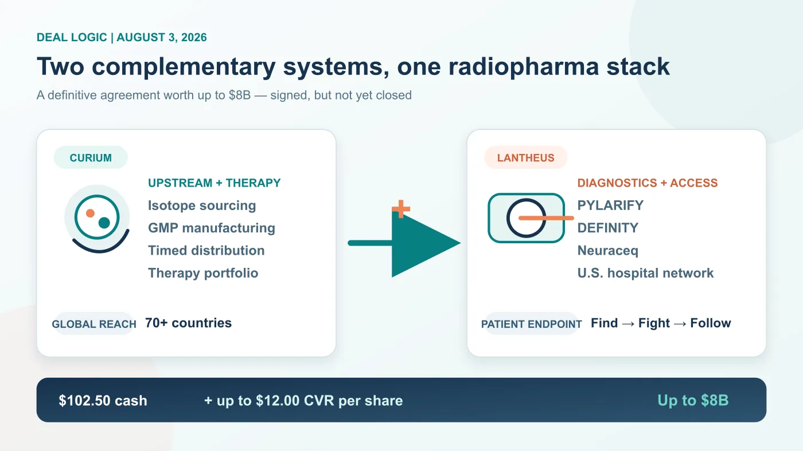
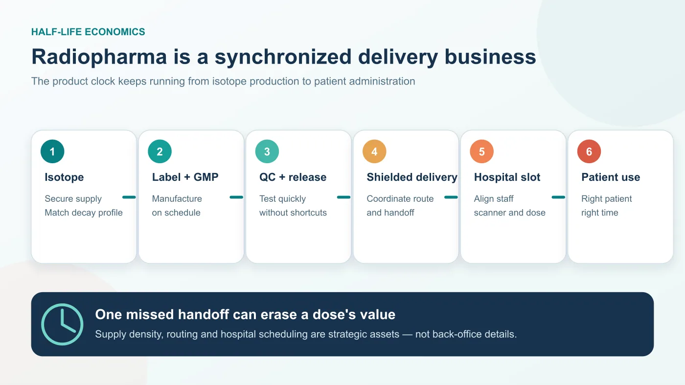
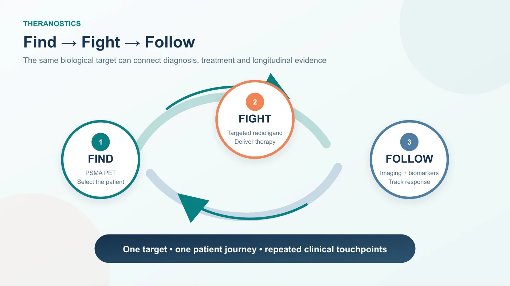
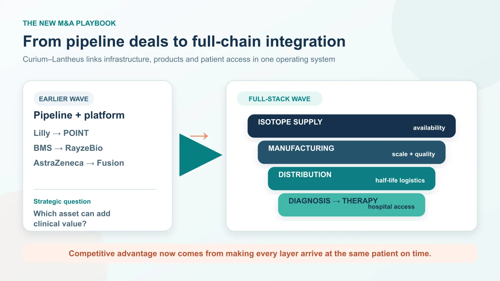

# Curium and Lantheus Agree to an Up-to-$8 Billion Merger: Radiopharma Becomes a Full-Stack Business

## 00 | The story has moved from a $7 billion rumor to a definitive agreement worth up to $8 billion

Radiopharma is entering a different phase of competition.

On August 3, 2026, Curium and Lantheus Holdings announced that they had signed a definitive merger agreement. Under the agreement, Lantheus shareholders would receive $102.50 per share in cash at closing, together with contingent value rights worth up to another $12.00 per share if specified commercial milestones are achieved. The maximum aggregate transaction value is approximately $8.0 billion.

The status boundary matters. **A definitive agreement is not a completed acquisition.** The transaction still requires approval by Lantheus shareholders, regulatory clearances and other customary closing conditions. The CVR milestones may never be achieved, so the additional $12.00 per share should not be treated as certain consideration.

[Drugnews' June 9 article](https://drugnews.com.tw/articles/2026-06-09-curium-lantheus-radiopharma-acquisition-en.html) analyzed the earlier report that Curium might acquire Lantheus for roughly $7 billion. This article is the next chapter after the August 3 agreement: price, structure and strategic intent are now clearer, even though the merger has not yet closed.

The central issue is not the headline price. It is the way radiopharma acquisition logic is evolving.

Eli Lilly's acquisition of POINT Biopharma, Bristol Myers Squibb's purchase of RayzeBio and AstraZeneca's acquisition of Fusion Pharmaceuticals each added a radiopharmaceutical platform, pipeline or isotope-linked capability to a much larger oncology portfolio. Curium-Lantheus is different. It combines two nuclear-medicine specialists and attempts to connect isotope access, manufacturing, distribution, commercial diagnostics, hospital channels and therapeutic programs inside one operating system.

Radiopharma competition is therefore becoming less about owning one attractive molecule and more about controlling the entire theranostic chain.

## 01 | Curium needs the U.S. endpoint; Lantheus needs upstream depth and a stronger therapy arm

Curium's advantage sits upstream. The company is focused entirely on nuclear medicine and operates a vertically integrated radiopharmaceutical manufacturing and distribution network. Its infrastructure spans isotope production, reactor- and cyclotron-based manufacturing, radiopharmacies and specialized logistics. The merger announcement says the combined company would serve oncology, neurology and cardiology patients in more than 70 countries.

Curium also brings therapeutic development assets. One of the most important is 177Lu-PSMA-I&T, a PSMA-targeted radioligand therapy being studied in metastatic castration-resistant prostate cancer. ECLIPSE, ClinicalTrials.gov identifier NCT05204927, is a randomized phase 3 trial sponsored by Curium US.

Curium's weakness is equally visible. It has isotope, manufacturing, distribution and therapeutic depth, but it does not possess a U.S. diagnostic franchise and hospital commercialization network comparable with Lantheus.

Lantheus offers the mirror image.

PYLARIFY, or piflufolastat F 18, is the leading PSMA PET imaging agent in the United States. When Lantheus announced FDA approval of the new PYLARIFY TruVu formulation in March 2026, it said that more than 760,000 people with prostate cancer had received PSMA PET scans with PYLARIFY since the original product's 2021 approval. TruVu is designed to preserve diagnostic performance while supporting larger batches and greater patient availability; Lantheus expects a phased U.S. launch beginning in the fourth quarter of 2026.

The company also markets DEFINITY, an ultrasound-enhancing agent used in echocardiography, and Neuraceq, or florbetaben F 18, a beta-amyloid PET imaging agent. Lantheus' 2025 shareholder materials described Neuraceq as the second most utilized and fastest-growing commercial amyloid PET agent in the United States.

The strategic complement is straightforward. Curium supplies upstream production, logistics and a therapeutic arm. Lantheus supplies established radiodiagnostics and a U.S. hospital entry point. The merger is not filling one product gap; it is attempting to join the hardest parts of the radiopharma value chain.

## 02 | Half-life does not merely constrain radiopharma; it determines the business model

A conventional small molecule or antibody can often be manufactured, stored and shipped over long distances with a reasonably forgiving clock. A radiopharmaceutical cannot be managed in the same way.

Radioactive isotopes decay continuously. A short half-life means that production, labeling, quality testing, release, shielded transportation and hospital scheduling must be synchronized. Inventory is perishable by design. A delayed shipment does not simply arrive late; it may arrive with insufficient activity for the planned procedure.

That is why radiopharma's competitive barrier begins well before clinical efficacy. A company must secure reliable isotope supply, manufacture sterile products under GMP conditions, operate or coordinate specialized transport, work with nuclear-medicine departments and deliver the correct activity to the correct patient at the scheduled time.

Therapeutic radiopharmaceuticals add another layer. Products such as Pluvicto, or lutetium Lu 177 vipivotide tetraxetan, require manufacturing and distribution to align with a named patient's treatment slot. Half-life, batch quality, hospital capacity and patient readiness all affect whether a dose can be used. The moat is therefore not a molecular structure in isolation. It is the ability to make the isotope, build the product, release it, move it and administer it as one dependable process.

The Curium-Lantheus combination is an attempt to turn that operational chain into a strategic platform.

## 03 | Theranostics creates radiopharma's most valuable commercial loop

Radiopharma can connect diagnosis and treatment around the same biological target. A diagnostic isotope is used with PET or SPECT to identify patients whose tumors express the target. A therapeutic isotope can then deliver radiation near those tumor cells. This is the foundation of theranostics.

PSMA in prostate cancer is the most mature example.

Novartis uses Locametz, or gallium Ga 68 gozetotide, for PSMA PET imaging and Pluvicto for PSMA-positive prostate cancer. The sequence is clinically intuitive: identify the right patient, administer targeted therapy and use subsequent imaging and biomarkers to follow disease. Novartis reported full-year 2025 Pluvicto sales of $1.994 billion, up 42% at constant currencies. That commercial performance shows that nuclear medicine can become a global blockbuster business rather than remain a specialist diagnostic niche.

Lantheus is strongest at the diagnostic gateway. Curium has upstream capabilities and therapeutic assets including 177Lu-PSMA-I&T. If the merger closes and integration works, Curium may be able to connect isotope supply and therapeutic development to Lantheus' established U.S. PSMA imaging network. Lantheus, in turn, may gain a more credible path from imaging revenue toward therapy economics.

This is the meaning of Lantheus' "Find, Fight and Follow" positioning. Find the patient through imaging. Fight the disease with a targeted therapy. Follow the patient with continued imaging and disease management. The value lies in owning more than one transaction across that cycle.

Execution, however, is not automatic. Diagnostic adoption does not guarantee that a therapeutic asset will succeed clinically or win approval. Hospital relationships do not eliminate manufacturing constraints. The strategic fit is strong, but the therapeutic and integration risks remain real.

## 04 | The competitive rule is changing from pipeline assembly to full-chain integration

Recent radiopharma M&A has often looked like a set of puzzle pieces being added to Big Pharma.

Bristol Myers Squibb acquired RayzeBio and its actinium-based radiopharmaceutical platform. AstraZeneca acquired Fusion Pharmaceuticals to add next-generation radioconjugates and actinium-225 capabilities. Lilly acquired POINT Biopharma to enter clinical and preclinical radioligand therapy.

Those transactions treated radiopharma as a new oncology modality. Curium-Lantheus looks more like consolidation within the modality itself. It brings isotope supply, radiopharmaceutical manufacturing, diagnostics, U.S. hospital access, therapeutic programs and commercialization infrastructure into one corporate structure.

A company that owns only one candidate may find it increasingly difficult to build a durable advantage. The more demanding questions are operational.

Where will the isotope come from? Which facilities can manufacture the dose? How wide is the practical distribution radius? Will nuclear-medicine departments adopt the workflow? Can diagnostics establish a patient funnel before therapy launches? Can the therapeutic product create recurring economics? Can follow-up imaging deepen physician and patient relationships?

Traditional drugmakers do not always possess these capabilities. For a radiopharma company, they are fundamental.

## 05 | Taiwan has few direct radiopharma equities, but it does have imaging and nuclear-medicine infrastructure

Taiwan's listed market contains few companies that directly resemble Curium, Lantheus or Novartis' radioligand-therapy franchise. The local ecosystem is distributed across nuclear pharmacies, radiopharmaceutical manufacturing and delivery, hospital nuclear-medicine departments, imaging software and interpretation tools.

Taiwan Global Medical Solutions, or GMS, is one example of infrastructure close to the physical radiopharma chain. The company describes a nationwide network for nuclear-medicine pharmacy and logistics, and its Taichung plant has passed PIC/S GMP inspection. Taiwan's FDA lists the facility as approved to manufacture sterile radiopharmaceutical injections. This is the unglamorous but indispensable part of nuclear medicine: a product must not only be made; it must arrive on time and remain usable.

Among listed companies, the more defensible observation is imaging and information infrastructure—not a claim that Taiwan already has its own Lantheus.

Acer Medical, ticker 6841 in Taiwan, has a TFDA-cleared computer-aided detection platform for brain dopamine-transporter SPECT imaging. It uses AI to analyze Tc-99m dopamine-transporter scans and therefore sits at the intersection of nuclear imaging and assisted interpretation. It is not a radiopharmaceutical company.

EBM Technologies, ticker 8409, provides PACS, RIS, DICOM, FHIR and AI-imaging integration. As theranostics moves from isolated scans toward longitudinal patient management, image flow, cross-institution exchange, quantitative analysis and workflow integration may become more important. There is currently no public evidence that the Curium-Lantheus transaction itself creates a specific order or revenue stream for EBM.

The investment boundary is important. A thematic connection to nuclear imaging is not the same as direct transaction exposure, a commercial contract or a radiopharma pipeline.

## Conclusion | Radiopharma is no longer a one-pipeline competition

The Curium-Lantheus agreement matters because it makes the next stage of nuclear medicine visible.

Radiopharmaceuticals have half-life constraints, radiation-handling requirements, specialized manufacturing and distribution, and hospital workflows that must coordinate diagnosis with therapy. Future competition will not be determined only by who owns a promising drug candidate. It will also depend on who can use diagnostics to enter hospitals, secure and manufacture isotopes, connect therapy to an existing patient funnel and retain the relationship through follow-up imaging.

That is the larger message behind the transaction. Radiopharma is moving from competition among individual molecules toward competition among full-chain systems.

For any company seeking to enter the field, the question is no longer just whether the drug works. The company must also show that it can deliver the dose to the patient safely, reliably and on time.

## References

1. [Facebook | Original Drugnews long-form post, August 24, 2026](https://www.facebook.com/61568446257142/posts/122183498798614875)
2. [Lantheus | Curium Announces Definitive Agreement to Merge with Lantheus, August 3, 2026](https://investor.lantheus.com/node/17091)
3. [Curium | How we work: manufacturing and distribution network](https://www.curiumpharma.com/about/how-we-work/)
4. [ClinicalTrials.gov | ECLIPSE phase 3 study, NCT05204927](https://clinicaltrials.gov/study/NCT05204927)
5. [Lantheus | FDA Approval of PYLARIFY TruVu, March 6, 2026](https://investor.lantheus.com/news-releases/news-release-details/lantheus-announces-fda-approval-pylarify-truvutm-piflufolastat-f)
6. [Lantheus | 2025 shareholder materials: Neuraceq and commercial portfolio](https://investor.lantheus.com/static-files/65cb003c-d33a-441c-b1f7-c6ea7768da2a)
7. [Novartis | Full-year 2025 results and Pluvicto sales](https://www.novartis.com/news/media-releases/novartis-delivered-high-single-digit-sales-growth-achieved-40-core-margin-and-further-advanced-pipeline-2025)
8. [Eli Lilly | Lilly Completes Acquisition of POINT Biopharma](https://investor.lilly.com/news-releases/news-release-details/lilly-completes-acquisition-point-biopharma)
9. [Taiwan GMS | Company profile and nuclear-medicine manufacturing and distribution](https://www.gmstw.com.tw/about.php)
10. [Taiwan FDA | Approved AI and machine-learning medical devices](https://www.fda.gov.tw/tc/includes/GetFile.ashx?id=f639083041331900606&type=1)
11. [EBM Technologies | PACS, RIS, DICOM and AI medical-imaging services](https://www.ebmtech.com/tw/services)

---

Facts checked through August 24, 2026. The transaction remains subject to shareholder approval, regulatory clearances and other closing conditions, and the CVR milestones may not be achieved. Investigational products carry clinical, regulatory and commercial uncertainty. This article is provided for industry research and education only; it does not constitute investment, medical, fundraising or securities advice.
