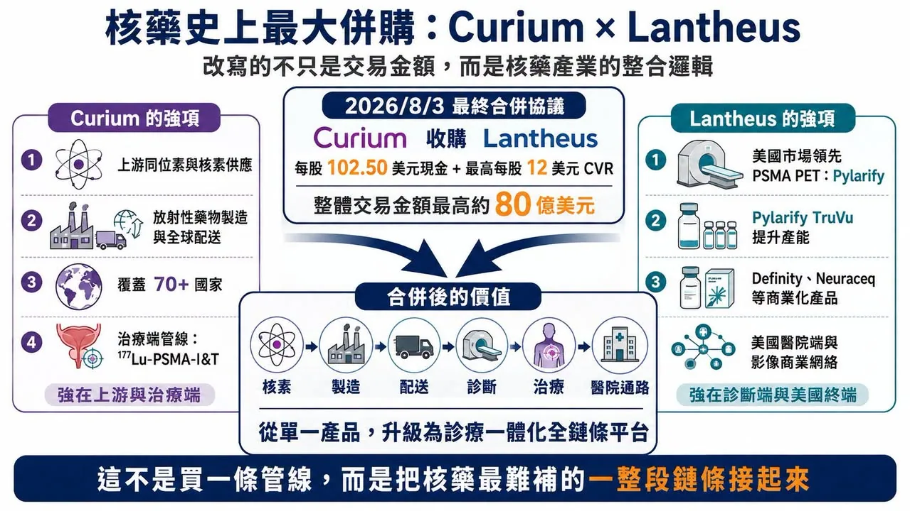
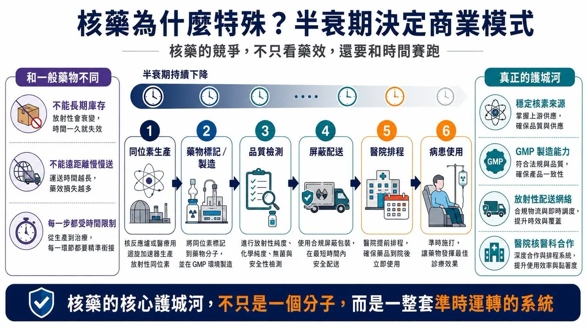
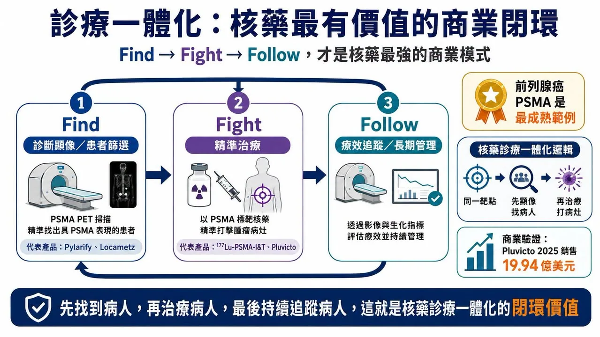
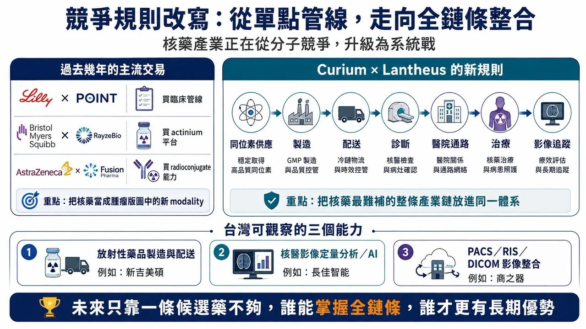

# 核藥史上最大併購：Curium 與 Lantheus 合併，改寫的不只是交易金額

## 00｜從 70 億美元傳聞，走到最高 80 億美元最終協議

核藥產業的競爭，正在進入新的階段。

2026 年 8 月 3 日，Curium 與 Lantheus Holdings 宣布簽署最終合併協議。依協議，Lantheus 股東在交易完成時可取得每股 102.50 美元現金，另有最高每股 12 美元、綁定特定商業里程碑的或有價值權利（CVR）；總交易價值最高約 80 億美元。

這裡先把狀態說清楚：**簽署最終協議不等於交易已完成**。交易仍須經 Lantheus 股東表決、監管核准與其他成交條件；CVR 對應的里程碑也不保證達成。

[藥時事 6 月 9 日的早期文章](https://drugnews.com.tw/articles/2026-06-09-curium-lantheus-radiopharma-acquisition.html)討論的是 Curium 擬以約 70 億美元收購 Lantheus 的傳聞與產業邏輯。本篇則是 8 月 3 日最終協議公布後的後續：價格、交易結構與雙方整合方向都已進一步明確，卻仍不是已交割併購。

這筆交易真正值得看的，不是 80 億美元本身，而是核藥產業的併購邏輯正在改變。過去幾年，Eli Lilly 收購 POINT Biopharma、Bristol Myers Squibb 收購 RayzeBio、AstraZeneca 收購 Fusion Pharmaceuticals，主要是在大型藥廠的腫瘤版圖中補進一個放射性藥物平台、一組候選管線或特定核素技術。

Curium 與 Lantheus 不太一樣。這不是大型藥廠買一條管線，而是兩家核藥公司把上游同位素、製造、配送、診斷產品、美國醫院通路與治療資產直接接起來。核藥競爭已經不再只是誰有一個好分子；真正的關鍵，開始變成誰能掌握整條診療一體化產業鏈。

## 01｜Curium 缺的是美國終端，Lantheus 缺的是上游與治療端

Curium 的強項在上游。公司長期專注核醫藥物的開發、製造與供應，擁有大型垂直整合製造與配送網絡。交易公告指出，合併後公司將服務超過 70 個國家的腫瘤、神經與心血管患者。

Curium 也正在推進 177Lu-PSMA-I&T。這是一款 PSMA 靶向放射性配體治療候選藥，用於轉移性去勢抗性前列腺癌；ECLIPSE 是由 Curium US 贊助的隨機 Phase 3 研究，ClinicalTrials.gov 登記號為 NCT05204927。

Curium 的短板也很明顯：它有核素、製造、全球配送與治療端資產，卻缺少 Lantheus 在美國已經跑通的診斷產品與醫院端商業網絡。

Lantheus 的強項剛好相反。PYLARIFY（piflufolastat F 18）是美國市場領先的 PSMA PET 前列腺癌影像產品。Lantheus 在 2026 年 3 月公布 PYLARIFY TruVu 獲 FDA 核准時表示，自 2021 年原產品獲准以來，已有超過 76 萬名患者接受 PYLARIFY PSMA PET 掃描。TruVu 新配方的重點，則是支援更大批次與更高患者可近性；公司規劃在 2026 年第四季分階段推出。

此外，Lantheus 還有心臟超音波造影劑 DEFINITY，以及 β-amyloid PET 顯像劑 Neuraceq（florbetaben F 18）。公司 2025 年股東資料指出，Neuraceq 在美國已是使用量第二、成長最快的 amyloid PET 顯像劑。

所以這筆交易的互補性很清楚：Curium 有上游核素、製造、配送與治療端；Lantheus 有診斷產品與美國市場入口。兩家公司合在一起，補的不是單一產品，而是核藥產業最難補的一整段鏈條。

## 02｜核藥為什麼特殊？因為半衰期決定商業模式

核藥和一般藥物最大的不同，在於它不是只看藥效，還要看時間。

許多放射性核素半衰期很短，無法像一般小分子或抗體藥一樣長期庫存、再慢慢送往遠方。核藥從核素生產、放射標記、GMP 製造、品質檢測、屏蔽運輸到醫院排程，每一步都受到時間限制。

這也是為什麼核藥的競爭壁壘從一開始就不只是研發。企業需要穩定的同位素來源、符合規範的無菌製造、放射性物質運輸經驗、核醫科合作網絡，以及把正確活度的產品在正確時間送到正確患者身上的調度能力。

治療用核藥更難。以 Pluvicto（lutetium Lu 177 vipivotide tetraxetan）這類放射性配體治療為例，產品製造與配送必須配合患者排程；半衰期、批次品質、醫院治療時間與患者狀態都會影響最終使用。核藥的核心護城河不是一個分子，而是能不能把分子、核素、製造、配送、診斷、治療與院端流程串成穩定系統。

Curium 與 Lantheus 的合併，正是朝這個系統化方向前進。

## 03｜診療一體化，才是核藥最有價值的商業閉環

核藥最有價值的特性之一，是同一個生物靶點可以連接診斷與治療。先用診斷性核素做 PET 或 SPECT 顯像，找出表達目標靶點的患者；再用治療性核素把放射能量送到腫瘤附近。這就是 theranostics，也就是診療一體化。

前列腺癌 PSMA 是目前最成熟的例子。Novartis 以 Locametz（gallium Ga 68 gozetotide）做 PSMA PET 顯像，再以 Pluvicto 治療 PSMA-positive 前列腺癌，形成「先顯像篩選、再精準治療」的模式。Novartis 公布的 2025 年全年 Pluvicto 銷售額為 19.94 億美元，年增 42%，證明核藥可以做成全球重磅產品。

Lantheus 的主要優勢仍在診斷端；Curium 則擁有 177Lu-PSMA-I&T 等治療端資產。合併後，Curium 有機會把上游核素與治療管線接到 Lantheus 已建立的美國 PSMA 診斷網絡；Lantheus 也有機會從影像診斷進一步接近治療端收入。

這不是單純併購產品，而是把「Find, Fight, Follow」變成商業閉環：先找到病人，再治療病人，最後用影像追蹤病人。

## 04｜競爭規則改寫：從單點管線，走向全鏈條整合

過去幾年的核藥交易，多半像大型藥廠補拼圖：BMS 買 RayzeBio，取得 actinium-based radiopharmaceutical 平台；AstraZeneca 買 Fusion Pharmaceuticals，補進 next-generation radioconjugates 與 actinium-225 能力；Lilly 買 POINT Biopharma，切入臨床與臨床前放射性配體治療管線。

這些交易的共同點，是把核藥當成腫瘤版圖中的新 modality。Curium 與 Lantheus 的交易更像產業升級：它把同位素供應、放射性藥物製造、診斷顯像、醫院准入、治療管線與商業通路放進同一體系。

未來只靠一條候選分子，可能很難形成長期優勢。真正有價值的公司，要同時回答幾個問題：核素從哪裡來？製造基地在哪裡？配送半徑多大？醫院核醫科願不願意用？診斷端能不能建立患者入口？治療端能不能形成收入？後續影像追蹤能不能留下資料與醫師黏著度？

這些問題，傳統藥廠不一定熟悉，卻是核藥公司生死攸關的基本功。

## 05｜台灣直接核藥個股少，但影像與核醫基礎設施值得觀察

台灣上市櫃市場裡，直接對標 Curium、Lantheus 或 Novartis 放射性配體治療的公司不多。核醫藥物產業更多分布在核醫藥局、放射性藥品製造與配送、醫院核醫部、影像資訊與判讀工具。

臺灣新吉美碩長期布局核醫藥品調製、製造與物流。公司資料顯示，其運輸網絡覆蓋台灣各地，臺中藥廠通過 PIC/S GMP；TFDA 也列出該廠核定製造放射性無菌注射液。這類能力非常貼近核藥「做得出來，也要準時送得到」的本質。

上市櫃公司中，可觀察的是核醫影像與資訊基礎設施，而不是把任何公司硬說成下一個 Lantheus。

第一個是長佳智能（6841）。TFDA 公布的 AI／機器學習醫材許可資料列有「長佳智能腦部多巴胺轉運體斷層掃描電腦輔助偵測平台」。它分析 Tc-99m 多巴胺轉運體掃描影像，站在核醫影像判讀與 AI 輔助分析的交會點；但它不是核藥本身。

第二個是商之器（8409）。公司長期提供 PACS、RIS、DICOM、FHIR 與 AI 醫療影像整合。當核藥從單點檢查走向診療一體化，影像資料流、跨院交換、定量分析與院端流程整合都會變得更重要；但目前沒有公開證據顯示本次 Curium–Lantheus 交易直接帶給商之器特定訂單。

## 結語｜核藥競爭，已經不是一條管線的競爭

Curium 與 Lantheus 簽署最終合併協議，之所以重要，是因為它把核藥產業的下一階段講得很清楚。

核藥有半衰期限制、放射性物質管理、製造配送難題與醫院核醫科流程，診斷與治療還必須互相配合。未來的競爭不會只看誰有一款候選藥，而會看誰能先用診斷產品打進醫院、穩定供應核素與藥物、把治療產品接上患者入口，再以影像追蹤形成長期閉環。

這才是 Curium 與 Lantheus 交易背後最大的啟示：核藥產業正在從「單點分子競爭」，進入「全產業鏈系統戰」。對任何想進入核藥的公司來說，問題不只是藥有沒有用，還要問有沒有能力把它準時、穩定、安全地送到病人身上。

## 參考資料

1. [Facebook｜藥時事原始公開長文，2026-08-24](https://www.facebook.com/61568446257142/posts/122183498798614875)
2. [Lantheus｜Curium Announces Definitive Agreement to Merge with Lantheus, 2026-08-03](https://investor.lantheus.com/node/17091)
3. [Curium｜How we work：全球製造與配送網絡](https://www.curiumpharma.com/about/how-we-work/)
4. [ClinicalTrials.gov｜ECLIPSE Phase 3, NCT05204927](https://clinicaltrials.gov/study/NCT05204927)
5. [Lantheus｜FDA Approval of PYLARIFY TruVu, 2026-03-06](https://investor.lantheus.com/news-releases/news-release-details/lantheus-announces-fda-approval-pylarify-truvutm-piflufolastat-f)
6. [Lantheus｜2025 shareholder materials：Neuraceq 與產品組合](https://investor.lantheus.com/static-files/65cb003c-d33a-441c-b1f7-c6ea7768da2a)
7. [Novartis｜Full-year 2025 results：Pluvicto sales](https://www.novartis.com/news/media-releases/novartis-delivered-high-single-digit-sales-growth-achieved-40-core-margin-and-further-advanced-pipeline-2025)
8. [Eli Lilly｜Lilly Completes Acquisition of POINT Biopharma](https://investor.lilly.com/news-releases/news-release-details/lilly-completes-acquisition-point-biopharma)
9. [臺灣新吉美碩｜公司簡介與核醫藥品製造配送](https://www.gmstw.com.tw/about.php)
10. [TFDA｜AI／機器學習醫療器材許可證資料](https://www.fda.gov.tw/tc/includes/GetFile.ashx?id=f639083041331900606&type=1)
11. [商之器｜PACS、RIS、DICOM 與 AI 醫療影像服務](https://www.ebmtech.com/tw/services)

---

資料查核至 2026 年 8 月 24 日。交易仍待股東表決、監管核准與其他成交條件；CVR 里程碑可能無法達成。研究中候選藥的臨床、監管與商業結果均有不確定性。本文僅供產業研究與知識分享，不構成投資、醫療、募資或個股建議。
