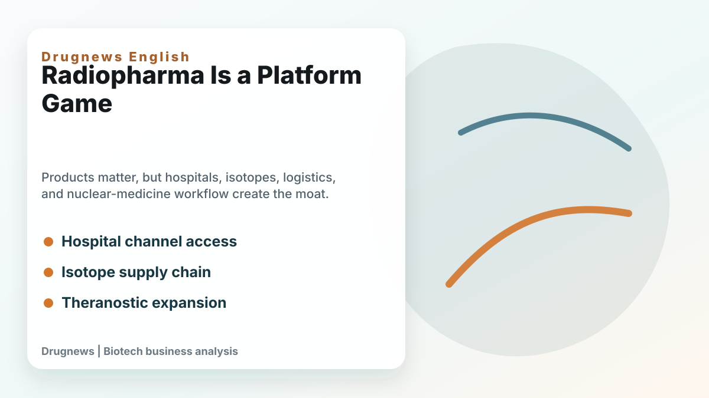

# The US$7 Billion Radiopharma Deal Rumor: Curium Wants Lantheus, but the Real Prize Is a Ticket to the Nuclear-Medicine Era

# US$7 billion nuclear medicine merger and acquisition rumors: Curium wants to buy Lantheus, but what it really buys is a ticket to the nuclear medicine era

The nuclear weapons circuit has dropped another big news in the past few days.

According to media reports, Curium Pharma, backed by private equity fund CapVest, is rumored to have made an acquisition offer to Lantheus Holdings, with a potential transaction valuation of approximately US$7 billion. Let me make it clear first that this case is not yet a signed merger and acquisition, and Lantheus is still evaluating various possible sales options, so it cannot be treated as a final decision.

But if you just regard it as "another nuclear medicine merger," you will actually miss a more important signal. The most noteworthy thing this time is not just the figure of US$7 billion, but the fact that the buyer Curium itself was valued by the market at almost US$7 billion during its capital restructuring in 2025. In other words, this is not a large pharmaceutical company buying a small company with pocket money, but a possible industrial integration between two heavyweight nuclear medicine platforms.

If the deal is finally completed, it will not only set a new record for the value of nuclear medicine M&A, but also tell the market one thing: the valuation logic of nuclear medicine no longer only depends on "how many pipelines are on hand", but begins to look at who can string together diagnosis, manufacturing, distribution, hospital-side network and treatment-side capabilities into a truly amplified platform.

## 01｜Lantheus is valuable, not just a prostate cancer PET drug

The core asset of Lantheus is PYLARIFY (piflufolastat F 18), a PSMA PET prostate cancer imaging drug whose main purpose is to help doctors find prostate cancer lesions more accurately. To put it in a more vernacular way, what PYLARIFY does is "first see where the cancer cells are." In the treatment of prostate cancer, whether the lesions can be clearly seen directly affects how to choose the treatment strategy, how to judge the staging, and how to take subsequent medications.

In the first quarter of 2026, Lantheus’ revenue was approximately US$377.3 million, of which PYLARIFY contributed US$240.9 million. Although PYLARIFY fell 6.5% year-on-year, it is still Lantheus's most important commercial asset and the key to the company's position in the US PSMA PET imaging market.

One detail should be noted here: PYLARIFY is not a drug that “sell it once and end it” in the traditional sense. Behind it are the hospital's nuclear medicine department, PET scanning procedures, doctors' diagnostic habits, insurance payment paths, and radiopharmaceutical distribution and manufacturing schedules. As long as this system is established, the treatment side will be connected later, and the indications will be expanded, the value of the platform will slowly grow.

This is why the value of Lantheus cannot be judged solely by the annual sales of one product. What the market is really looking at is: it has secured a position at the hospital end, and it is the most important entrance to nuclear medicine.

## 02｜The focus of PYLARIFY TruVu is not the new name, but the industrialization capabilities of radiopharmaceuticals

Lantheus also made another key development this year: PYLARIFY TruVu received FDA approval. To readers, TruVu may sound like just a new formula for PYLARIFY. But from an industrial perspective, this matter is actually very important, because it points to manufacturing efficiency, batch size and supply elasticity.

Nuclear drugs are very different from ordinary drugs. Generally, small molecule drugs or antibody drugs can be produced, stored, and distributed relatively stably; however, radioactive drugs have a half-life, and time is not a background condition, but a part of the business model itself.

Nuclear medicine companies do not just have to have "well-designed molecules" to get through. It also needs to answer a series of very practical questions:

- Is the source of the nuclide stable?
- Can radiochemical preparation be standardized?
- Can GMP aseptic manufacturing be scaled up?
- Can radiation safety and regulatory transport be implemented across regions?
- Does the hospital have the ability to receive, administer or scan on time?

The most difficult thing for many innovative drug companies is clinical data; in addition to clinical data, nuclear drug companies also need to manage "time" well. If the drug delivery is slow, the activity will be attenuated; if the schedule is messed up, the hospital cannot use it; if the production capacity is insufficient, commercialization will not be carried out. Therefore, the focus of PYLARIFY TruVu is not "one more version", but Lantheus is trying to advance the commercialized PSMA PET assets in the direction of industrialization with larger batches, higher supply efficiency, and more replicable. This ability is very valuable in the nuclear medicine industry.

## 03｜Curium buys Lantheus. What it buys is not a product, but an import from the US hospital.

Curium Pharma itself is a veteran player in nuclear medicine, with its strengths in radiopharmaceutical manufacturing, nuclide supply and global distribution network. It did not enter the market suddenly after seeing the popularity of nuclear medicine, but has been engaged in supply chain and commercialization in this field for a long time.

So if Curium really wants to buy Lantheus, the logic behind it is actually very clear. What it lacks is not “whether it can make nuclear drugs”, but a commercial platform that is closer to US hospitals, closer to PET diagnosis usage scenarios, and closer to the entrance to accurate diagnosis of prostate cancer. And Lantheus just makes up for this. If this deal takes shape, it can be understood as the merger of two capabilities:

- Curium’s underlying capabilities are nuclides, manufacturing, supply, and distribution;
- Lantheus' front-end capabilities are PSMA PET commercialization, hospital network, diagnostic portal, and treatment extension.

The most important competition in the nuclear medicine industry in the future will not be just "whose molecule is more beautiful." What will really be revalued by the market is who can connect the supply chain with clinical scenarios.

Because the logic of integrated diagnosis and treatment is very simple: first use PET or SPECT imaging to confirm whether the tumor has a target, then use a therapeutic dose of radiopharmaceuticals to treat it, and then use imaging to track the response. Only when we can see clearly can we achieve accurate treatment; only when we can get it to the hospital can we commercialize it; only when we can stabilize the supply can we have the possibility of enlarging the valuation.

## 04｜Nuclear drug mergers and acquisitions are not single-point events, but an arms race among large pharmaceutical companies.

This is why nuclear medicine mergers and acquisitions have become increasingly intensive in recent years.

In the early years, Novartis successively acquired Advanced Accelerator Applications and Endocyte, and acquired Lutathera and Pluvicto, which is equivalent to the first commercialization story of nuclear medicine at the level of a large pharmaceutical company. Pluvicto's sales in 2024 have reached US$1.392 billion, and Lutathera's sales have reached US$724 million, with the two totaling more than US$2.1 billion. This allowed the market to intuitively see for the first time that nuclear medicine does not just stay in academic research or niche treatments, it can really become a billion-dollar product.

- BMS acquired RayzeBio for US$4.1 billion, acquiring Actinium-225 (actinium-225) related platforms, radioactive conjugation technology and next-generation therapeutic assets.
- Eli Lilly bought Point Biopharma and cooperated with companies such as Aktis and AdvanCell to use nuclear medicine as a new growth engine in the tumor landscape.
- AstraZeneca acquires Fusion Pharmaceuticals, looking at FastClear technology, PSMA assets and radiopharmaceutical platform.
- GE HealthCare strengthened its regional diagnostic, nuclear medicine and manufacturing network through the acquisition of Japan's NMP.

On the surface, these transactions appear to be separate. But in fact, they are competing for the same thing: tickets for the industrialization of nuclear medicine. Whoever can master the target, nuclide, connection technology, manufacturing, distribution, hospital network and payment path at the same time is not just a nuclear medicine company, but a nuclear medicine platform company. This is also the most interesting part of the Curium-Lantheus rumor. It is not a single product valuation, but a platform valuation.

## 05｜Why nuclear weapons now? Because the business model has been verified, but the supply bottleneck has not yet been solved

Nuclear medicine used to be regarded as a field that is "very scientific but difficult to commercialize". The reason is simple: high technical threshold, complex supervision, limited nuclide supply, and high operational threshold at the hospital. But Novartis's Pluvicto and Lutathera have proven that as long as the products, diagnosis, payment and supply chain can be connected, nuclear drugs can enter the income sheets of large pharmaceutical companies. Once this is verified, the capital market's view will change.

- In the past, the market asked: Can nuclear weapons be sold?
- What the market is asking now is: Who can sell stably, sell big, and replicate across cancer types?

The difficulty of these two questions is completely different. The first stage is scientific verification; the second stage is industrial verification. Now nuclear weapons are moving from the first stage to the second stage. Therefore, the truly valuable company is not necessarily the company with the most beautiful story, but the company that can solve several problems at the same time:

- Can the key nuclides be obtained?
- Can it be stably prepared under GMP conditions?
- Can cross-regional distribution be completed?
- Can it be used smoothly by the nuclear medicine department of the hospital?
- Can the diagnostic end and treatment end be directed to each other?

The moat of nuclear medicine is often not found in the molecular structure on the cover of the briefing, but in the invisible supply chain, pharmacy network, hospital procedures and regulatory experience.

## 06｜Taiwanese investors should not just ask “Which is a nuclear medicine concept stock?”

If we look at the case of Curium-Lantheus, nuclear medicine is not the subject of a single company, but an entire ecosystem. What is really worth seeing in Taiwan is who plays a role in the manufacturing, supply, distribution, clinical use and research and development services of nuclear medicine drugs.

- Jisheng Biotechnology (7762, Xinggui) is Taiwan's first nuclear pharmaceutical company to enter the capital market. It has PIC/S GMP radioactive sterile preparation capabilities and has also planned a new plant in Miaoli and a medium-sized cyclotron. This means that it is not just about the subject matter, but is really building towards the production and supply capabilities of nuclear medicine drugs.
- Primer Biotech focuses on nuclear medicine radiopharmaceuticals, RDC/RLT technology, radioligand diagnostic and therapeutic drugs and process services. It is more like standing on the R&D and process technology side. If Taiwan is to undertake more clinical trials or early development of nuclear drugs in the future, such capabilities will become increasingly important.
- Taiwan Xinjimeshuo is an important player in the supply and distribution of nuclear medicine and radioactive drugs, and has long-term cooperation with major medical institutions. In the nuclear medicine industry, this seemingly unsexy ability to “deliver, prepare, and use in compliance with regulations” is actually the foundation for commercialization.
- The National Institute of Atomic Energy Science and Technology cannot be ignored either. Taiwan already has the ability to supply medium-sized cyclotrons and nuclear medical drugs. In recent years, it has also promoted the construction of 70 MeV cyclotrons with the goal of strengthening its independent supply of key medical isotopes. This matter looks like public scientific research construction, but to the industry, it means that Taiwan still has its own foundation in the nuclear medicine supply chain.

Looking further at the clinical side, the nuclear medicine departments, PET centers, radiochemistry and clinical trial capabilities of medical centers such as National Taiwan University, Chang Gung Memorial Hospital, Third General Hospital, Wing General Hospital, China Medical Center, E-Daily University, Shin Kong and Tzu Chi and large hospitals are also the key to whether the nuclear medicine industry can be established in Taiwan.

Therefore, it is not that Taiwan does not have a nuclear medicine ecosystem, but that in the past, the capital market rarely used the perspective of a complete industrial chain.

## 07｜What Taiwanese companies should really be re-evaluated is not just whether they have nuclear weapons, but whether they have "scalable capabilities."

Taiwan should look at several capabilities:

- First, sterile preparation and GMP capabilities.

Nuclear drugs cannot be made in a laboratory and then put on the market. For radiopharmaceuticals to enter the human body, manufacturing quality, sterility standards, batch stability and regulatory documents must be passed. Any company in Taiwan with experience in special preparations, sterile manufacturing, and CDMO may be re-evaluated if it can enter the nuclear medicine supply chain in the future.

- Second, hospital network and distribution capabilities.

Nuclear chemicals are not placed in warehouses waiting for customers to place orders. It requires hospital-side scheduling, nuclear medicine department operations, transportation time control and radiation safety management. This makes medical access, special drug distribution, and experience in cooperation between nuclear medicine bureaus and hospitals very important.

- Third, clinical translation capabilities.

Nuclear medicine is very popular in clinical scenarios. Not every beautiful target can be turned into a product. The key lies in whether reasonable imaging enrollment, dosage strategy, efficacy evaluation and safety monitoring can be designed. If Taiwan can connect the clinical capabilities of medical centers with early-stage R&D companies, it will have a chance to find a place in Asia's nuclear drug development.

- Fourth, international cooperation capabilities.

The nuclear medicine supply chain is inherently transnational. Nuclide sources, authorized assets, clinical trials, manufacturing standards and regulatory documents are all difficult to complete by relying on a single market. If Taiwanese companies want to be seen by international capital on this track, they must not just talk about the local market, but must be able to clearly explain which part of the global supply chain they are filling.

## Conclusion｜Nuclear medicine is not just a story, it will eventually return to the supply chain and clinical site

Rumors of $7 billion in mergers and acquisitions are eye-catching, but what’s really important is this: the market is understanding nuclear weapons in a more rigorous way.

Instead of having a target, it’s called a platform. If there is not one molecule, it is called commercialization. Just because the word "nuclear" appears in the news doesn't mean the valuation should be revalued.

Nuclear drugs will ultimately return to a very simple question: Can patients get drugs that are stably manufactured, delivered on time, and can be used clinically at the right time and in the right place? Can the doctor see clearly first and then choose the right treatment? Can the company connect the diagnostic, treatment, manufacturing and hospital processes into a replicable system?

When Curium wants to buy Lantheus, what it really wants to buy is not a PET drug for prostate cancer, but a ticket to the era of nuclear drug industrialization.

For Taiwanese investors, the next time you see news about nuclear weapons, don’t just ask who is involved in the subject matter. Rather, we should ask: Who is really in this supply chain? Who has the ability to be needed by the international platform? Whose character is not a story but can’t run without it?

These issues are the starting point for revaluation of nuclear medicines.

References:

Fierce Pharma｜Lantheus considers potential $7B Curium buyout proposal

Lantheus｜Q1 2026 Financial Results and Business Update

Lantheus｜FDA Approval of PYLARIFY TruVu

Novartis｜Product Sales, Full Year 2024

----------

This article is for industrial research and knowledge sharing only and does not constitute investment, medical, fund-raising or individual stock advice.
