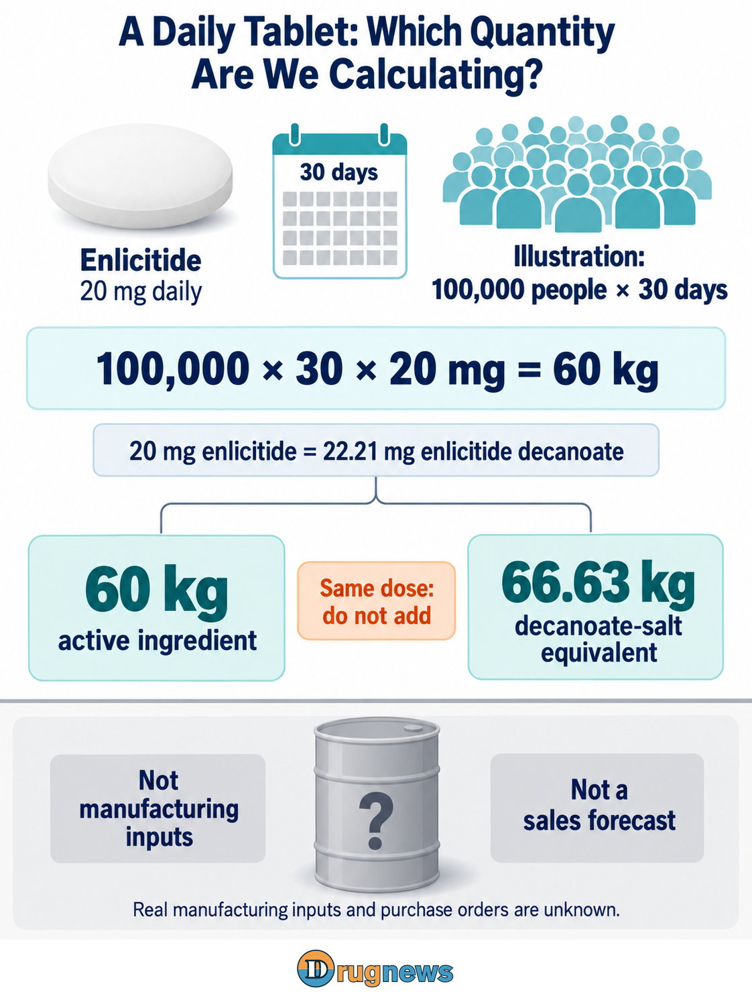
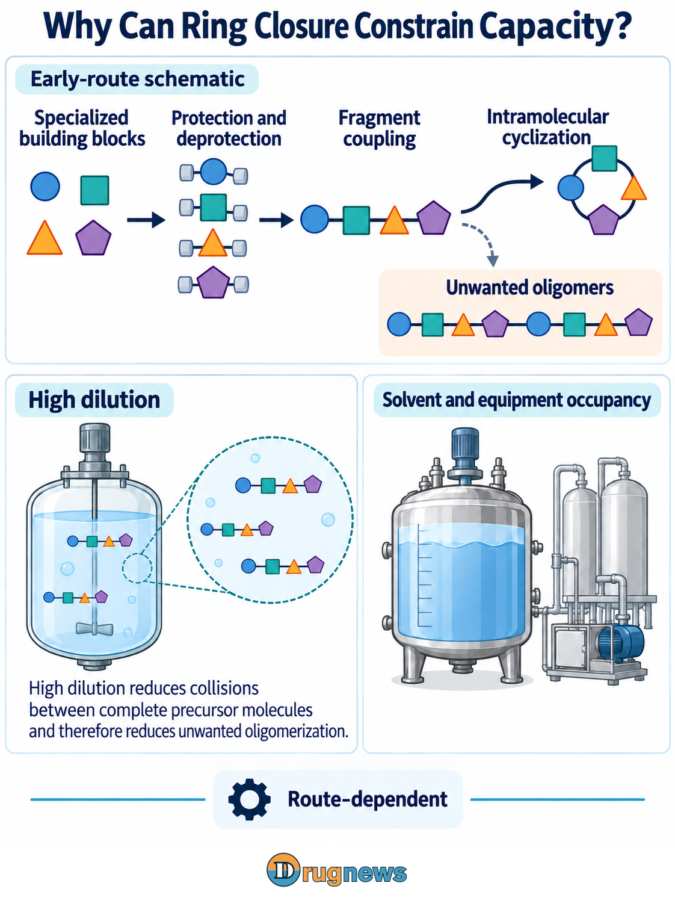
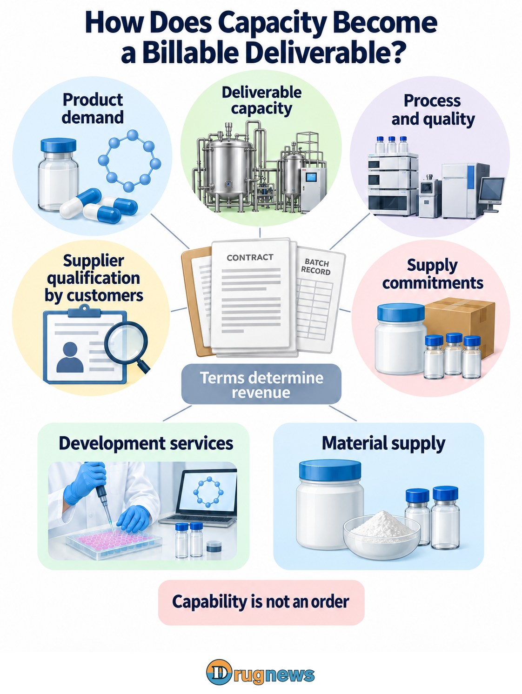

# From a Daily Tablet to Factory Orders: Who Can Profit from Oral Cyclic Peptides?

On September 17, 2026, Novo Nordisk and Orbis Medicines announced a collaboration to develop oral macrocycles for cardiometabolic diseases. Upfront payments and potential development and commercial milestones total up to US$1.4 billion, with additional sales royalties; Novo will also make a strategic investment in Orbis. A large drugmaker is buying opportunities to discover new medicines. That headline ceiling is not yet an order held by a raw-material factory, and the announcement does not disclose commercial purchase volumes or suppliers.

At the product end, Merck’s oral cyclic peptide enlicitide, marketed as Lipfendra, received U.S. FDA approval on July 15 to lower LDL cholesterol in adults with hypercholesterolemia. It provides a defined product and dose for analysis; commercial uptake and cardiovascular-event benefits remain separate questions.

Making a medicine oral may appear to create more raw-material business, but the manufacturing process can change that calculation first. Enlicitide research has already demonstrated fewer assembly steps, potentially changing both materials and working time per kilogram of acceptable product. The question worth following is who can evolve with the new route, not simply who owns a raw-material plant.

# One Tablet a Day: First Calculate What the Finished Product Contains

Enlicitide binds PCSK9, preventing it from promoting degradation of LDL receptors in the liver and allowing more receptors to participate in cholesterol clearance. This illustrates how macrocycles can target interactions between proteins. For upstream analysis, the approved product’s dose provides a concrete starting point for quantification.

The U.S. label specifies one tablet containing 20 mg of enlicitide daily. Assuming 100,000 people use it continuously for 30 days, the calculation is 20 mg × 30 days × 100,000 people = 60 kg of active ingredient. The population and duration form a transparent demand scenario, not a company sales forecast.

The label contains another conversion: 20 mg of enlicitide is equivalent to 22.21 mg of its decanoate salt. The same scenario therefore corresponds to 66.63 kg on a salt-form basis. These are two mass expressions of the same dose and must not be added together.

The approved oral dose already specifies the amount actually administered; it does not require another bioavailability adjustment. Moving from that quantity to factory purchasing requires the actual route, individual-step yields, purification recovery and formulation losses. The active pharmaceutical ingredient (API) provides the pharmacological activity, while a finished tablet also contains excipients and involves processing. They are different cost categories.

The demand scenario completes only the first layer of calculation. The number of users and persistence determine finished-product requirements; the manufacturing method determines material inputs and equipment occupancy. The finished medicine’s price also includes R&D, commercialization and other costs. Taking a fixed percentage of it does not establish upstream orders.

*Figure 1 | Assuming 100,000 people treated for 30 days, 20 mg of enlicitide daily equals 22.21 mg of its decanoate salt: 60 kg of active ingredient equals 66.63 kg on a salt basis. These express the same dose. *

# Closing a Chain into a Ring Is Not Just a Final-Step Problem

The enlicitide synthesis paper published in the Journal of the American Chemical Society in 2025 revealed a structure considerably more complex than joining a few amino acids: six of its eight amino acids are noncanonical, and it also contains substantial nonpeptidic structural elements.

These specialized building blocks bring supply-chain questions into development early. Process designers must decide which materials to make internally and which to outsource. Suppliers must control stereochemical configuration and impurities, not merely deliver a compound. Even with the same atom connectivity, a different spatial arrangement can produce stereoisomers that must be controlled. If batch quality varies, a deviation may become apparent only after assembly, when earlier materials and processing time have already been consumed.

The paper’s early route used protecting groups to temporarily mask reactive sites, prevent unwanted connections and then expose those sites when needed. Every additional operation creates another opportunity for transfer, separation or material loss. Individual steps may look acceptable while cumulative recovery across a long route becomes the factory’s real burden.

Cyclization poses another challenge. The aim is to connect positions within the same molecule, but they may instead react with another molecule and form unwanted larger products. The study’s early Northern-fragment ring closure used high dilution to reduce such oligomerization—a choice specific to the precursor and route.

If obtaining the same amount of product requires more solvent per batch, reactor volume, solvent recovery and batch time are all consumed. However large the plant, capacity must ultimately be translated into kilograms of acceptable product deliverable each month—not simply liters of installed equipment.

Manufacturing competition is therefore not just a race to expand capacity. A shorter route to the same product could save batch time and free space in existing equipment. A supplier participating in those improvements offers more than kilograms of a material: it can help make the customer's production schedule more reliable. Whether the supplier retains that value still depends on service scope and contractual allocation.

*Figure 2 | An assembled precursor can undergo intramolecular cyclization or form intermolecular oligomers. High dilution in the early route reduced the latter at the cost of solvent and equipment occupancy. *

# An Enzymatic Route May Change Material Demand and Bargaining Positions

Enlicitide process research published in Science in May 2026 used engineered enzymes for fragment formation, coupling and macrocyclization. These assembly steps did not rely on protecting groups, and crystallization replaced chromatography. The number of steps was reduced by more than half relative to previous methods.

Chromatography separates components of a mixture through a separation system; crystallization uses suitable conditions to form an isolable solid product. Whether one can replace the other depends on the molecule and its impurities. When it is feasible, production scheduling, solvent handling and recovery can all change.

For upstream investors, the purchasing mix behind each kilogram of acceptable API may be rewritten. If a route reduces the use of a particular protected intermediate, end-market growth will not flow proportionally into that material. Fewer steps may also allow more product to be delivered from existing equipment, reducing the need for expansion.

A supplier limited to building blocks for an older route therefore faces different bargaining conditions from one participating in enzyme, reaction and purification optimization. The former depends on continued use of its material; the latter can create value by improving deliverable output and managing batch failure and switching costs.

Halving the steps still does not mean halving costs. Enzyme development, production and downstream processing carry costs, and the remaining steps may concentrate much of the expense. The material cited here is insufficient to estimate commercial cost per kilogram. What can be established is progress in process methods and the need to revisit earlier assumptions about material consumption.

*Figure 3 | Engineered enzymes support protecting-group-free fragment formation, coupling and macrocyclization, alongside crystallization. Steps are reduced by more than half relative to prior methods; route changes may affect material demand. *

# Once Capacity Exists, Why Would a Customer Choose It?

An initial hurdle for an order is whether the material meets the product’s specifications. The FDA-published ICH Q7 API guidance recommends systems for supplier evaluation, material specifications, quality release and process validation. The document explicitly states that its recommendations are not independently legally binding; actual obligations depend on applicable law and filing commitments. The practical objective of quality management is consistent delivery of acceptable product.

For an API manufacturer, producing the correct main ingredient is only the starting point. Which impurities arise, whether analytical methods can identify them and whether scale-up remains consistent all influence the customer’s assessment. Process reproducibility lies between an attractive laboratory yield and sustained delivery on a contractual schedule.

A drug developer also may not outsource everything. Early work could involve purchasing specialized building blocks, commissioning process development or ordering small clinical batches, followed later by decisions about internal production, outsourcing or multiple sources. Development fees, batch-manufacturing revenue and long-term purchase contracts represent different degrees of demand commitment; they should not be collapsed into a single confirmed commercial order.

Even after a customer adopts a supplier, the contractual commitment matters. Forecast demand, reserved capacity and committed purchase volume are not identical. If equipment is installed without corresponding commitments and end-market sales fall short, the upstream company may bear the idle-capacity cost first.

Once a customer has validated a route and source, switching requires reassessment and can create some stickiness. But more qualified suppliers or an improved process at the originator can put pressure on prices. What manufacturers need to preserve is bargaining power supported by delivery capability, not simply more kilograms passing through the revenue line.

# In Taiwan, Look First at Deliverable Capabilities, Then at Product-Specific Adoption

ScinoPharm Taiwan (1789) lists solid-phase, solution-phase and hybrid synthesis on its official peptide-services page, alongside process optimization, analytical-method validation, clinical material manufactured under current GMP and commercial production. These are concrete capabilities adjacent to cyclic-peptide manufacturing needs. That service page does not disclose supply of enlicitide, participation in the Orbis–Novo collaboration or commercial delivery using the cyclization route discussed here.

If it participates in development services, value initially lies in solving route and analytical problems. If it moves into supply, product qualification, acceptable batches and contractual terms are then needed to establish recurring revenue.

*Figure 4 | Product demand, delivery and quality, supplier qualification by customers and supply commitments are distinct commercial conditions. Development services and material supply require separate consideration of revenue terms. *

As drugmakers try to put complex molecules into a daily tablet, factories could move from selling materials toward solving route and delivery problems. For an upstream company, the next announcement with real weight is not merely another piece of equipment. It is which process, which specification and which batches of acceptable product a customer is willing to entrust to it on an ongoing basis.

This article provides industry information and business analysis and does not constitute individualized medical or investment advice.

# Sources

[Orbis Medicines: Multi-target drug-discovery partnership with Novo Nordisk — 2026-09-17](https://www.orbismedicines.com/news/orbis-medicines-enters-multi-target-drug-discovery-partnership-with-novo-nordisk-worth-up-to-usd-14-billion)

 [FDA: Lipfendra approval letter, NDA 220848 — 2026-07-15](https://www.accessdata.fda.gov/drugsatfda_docs/appletter/2026/220848Orig1s000ltr.pdf)

 [FDA: Lipfendra prescribing information — Revised July 2026](https://www.accessdata.fda.gov/drugsatfda_docs/label/2026/220848Orig1s000lbl.pdf)

 [Journal of the American Chemical Society: Total Synthesis of Enlicitide Decanoate — 2025-03-24](https://doi.org/10.1021/jacs.4c15966)

 [Science: Biocatalytic cascades enable manufacture of the macrocyclic peptide enlicitide — 2026-05-07](https://pubmed.ncbi.nlm.nih.gov/42096573/)

 [FDA/ICH Q7: Good Manufacturing Practice Guidance for Active Pharmaceutical Ingredients — September 2016, Revision 1](https://www.fda.gov/media/71518/download)

 [ScinoPharm Taiwan: Peptide synthesis and process-development services — Undated service page](https://www.scinopharm.com/tw/products-detail/54/)

 [Merck: FDA approval of Lipfendra to reduce LDL cholesterol — 2026-07-16](https://www.merck.com/news/mercks-lipfendra-enlicitide-is-the-first-and-only-once-daily-oral-pcsk9-inhibitor-approved-by-the-u-s-fda-to-reduce-ldl-c-in-adults-with-hypercholesterolemia/)

[S4 full-paper public mirror on the Aarhus University server](https://maillist.au.dk/hyperkitty/list/hauser.chem%40maillist.au.dk/message/RWSJBSY53CCDATJCHCKPUXW4QBJVKMR3/attachment/6/total-synthesis-of-enlicitide-decanoate.pdf)
