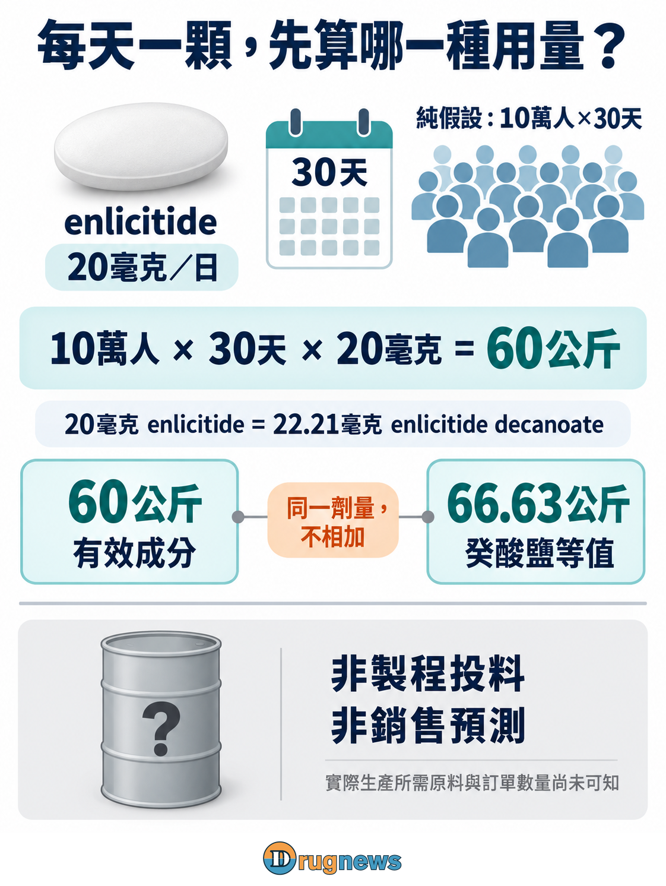
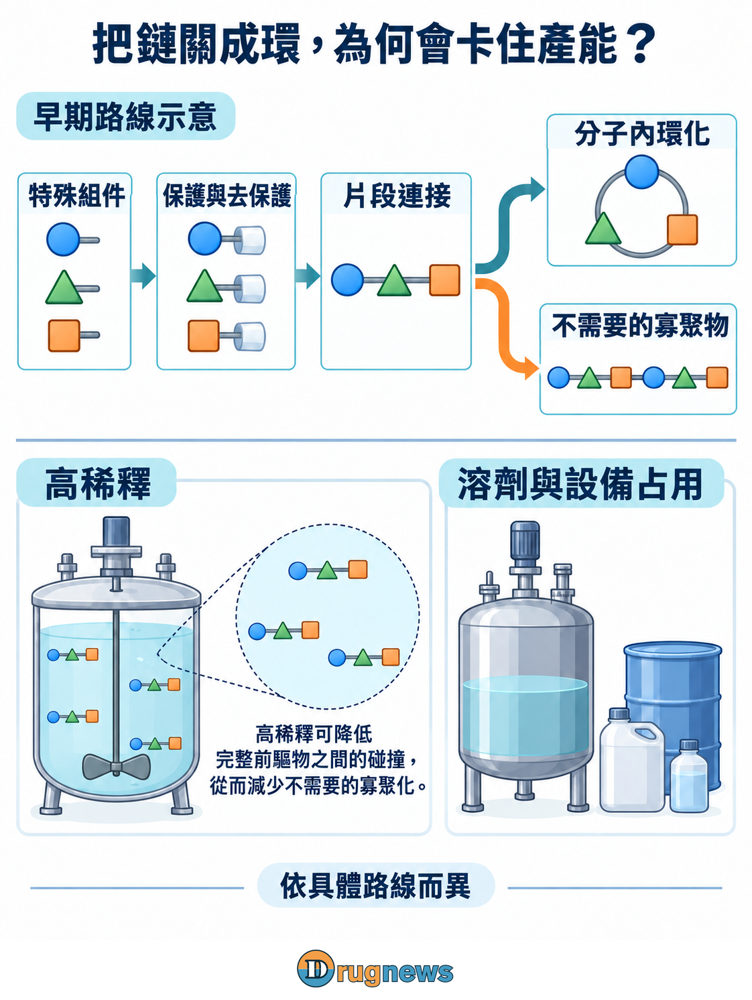
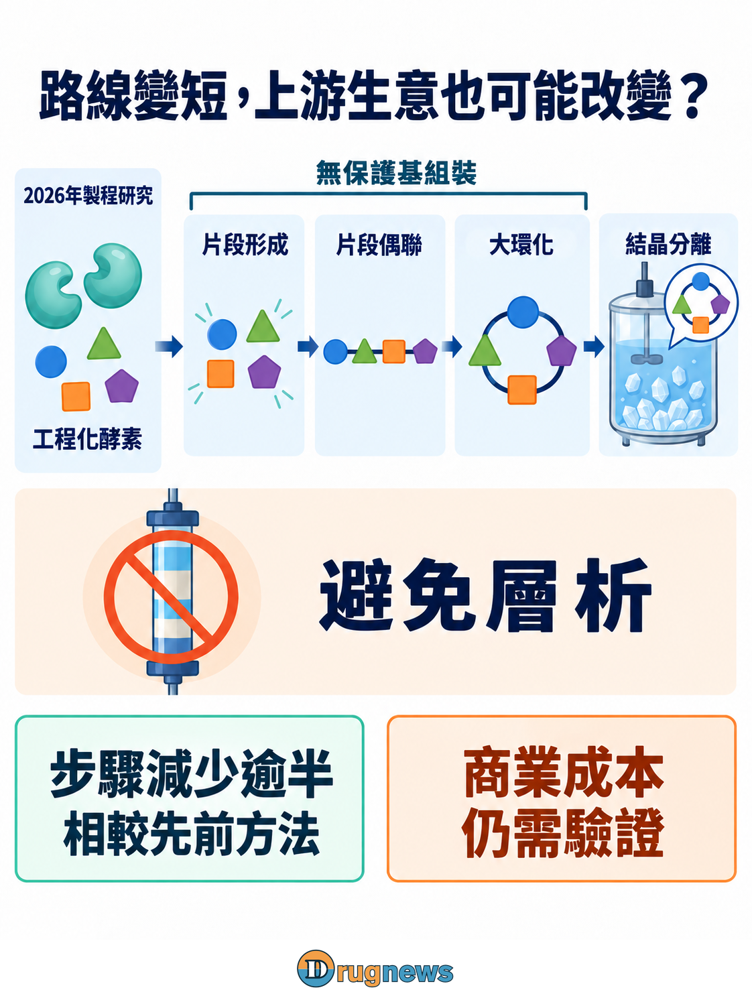
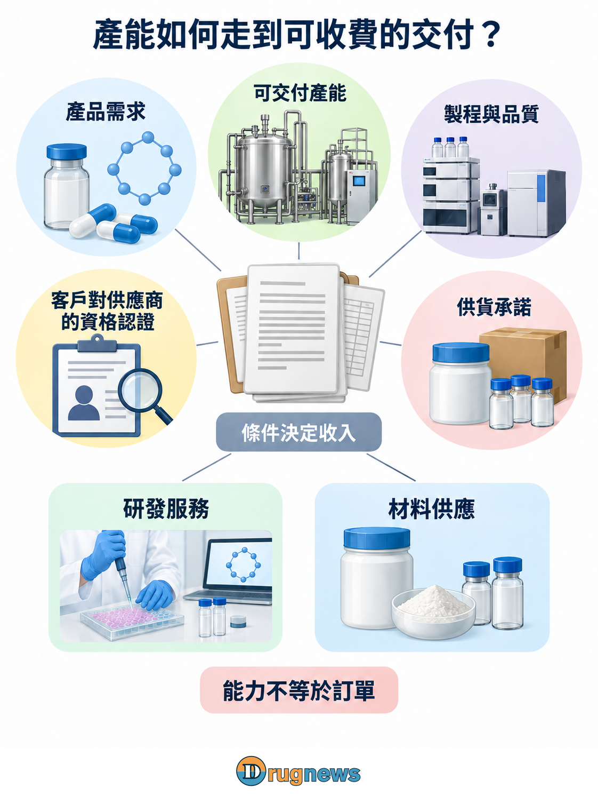

# 從每天一顆藥到工廠訂單：口服環肽的錢，誰賺得到？

2026年9月17日，諾和諾德（Novo Nordisk）與Orbis Medicines宣布合作，開發心血管代謝疾病的口服大環肽。前期款與可能達成的開發、商業里程碑合計最高14億美元，另計銷售權利金，Novo亦將策略投資Orbis。

大藥廠正在買新的藥物發現機會；這筆上限金額，還不是原料工廠手上的訂單，公告也未披露商業採購量或供應商。

另一端，Merck的口服環肽enlicitide，商品名Lipfendra，已在7月15日獲美國FDA核准，用於降低成人高膽固醇血症患者的低密度脂蛋白膽固醇。它提供了可核的產品與劑量；實際放量及心血管事件效益則是另外的問題。

一顆藥走向口服，看起來會帶動更多原料生意，製程卻可能先把這個算式改掉。Enlicitide的研究已展示如何減少組裝步驟；同樣一公斤合格產品，材料與工時都可能不同。真正值得追的，是誰能跟著新路線一起進化，而不只是誰有一座原料工廠。

# 每天一顆，先算成品需要多少

Enlicitide藉由結合PCSK9，阻止它促使肝臟的低密度脂蛋白受體降解，讓更多受體參與清除膽固醇。這說明大環肽可以瞄準蛋白質之間的作用；對上游而言，真正能開始計量的是正式產品的劑量。

依美國標籤，每日一顆含20毫克enlicitide的錠劑。假設有10萬人連續使用30天，用量就是20毫克×30天×10萬人＝60公斤有效成分。10萬人與30天只是透明的需求情境，不是公司銷售預測。

標籤還有一個換算：20毫克enlicitide相當於22.21毫克的癸酸鹽形式，因此同一情境的鹽形式含量相當於66.63公斤。這是同一劑量的不同質量口徑，兩者不能相加。

正式口服劑量已是產品實際使用的量，不必再按生物利用度放大。從這裡推到工廠採購，才需要加入實際路線、各步收率、純化回收與製劑損耗。原料藥（API）是發揮藥理作用的成分；最終錠劑還包含賦形劑與加工，兩者也不是同一成本項目。

需求情境只完成第一層計算。用藥人數與持續使用時間決定成品需要多少，製造方法才決定要投入多少材料、占用多少設備。終端藥價還包含研發、商業化與其他成本，不能直接抽一個固定百分比當作上游訂單。

圖1｜假設10萬人服藥30天：每日20毫克enlicitide＝22.21毫克癸酸鹽，對應60公斤有效成分＝66.63公斤鹽形式；兩者是同一劑量的質量換算。

# 把一條鏈關成環，難處不只在最後那一步

2025年《美國化學會誌》的enlicitide合成論文，揭露了比「幾個胺基酸串起來」複雜得多的結構：八個胺基酸中有六個屬非標準胺基酸，另含重要的非胜肽結構。

這些特殊組件讓供應鏈問題提早出現。製程設計者得決定哪些原料自行製備、哪些委外；供應商除了交出化合物，還得控制立體構型與雜質。即使原子連接方式相同，空間排列不同，也可能形成必須控制的立體異構物。若原料批次品質不穩，下游可能直到組裝後才發現偏差，前面的材料與時間已經消耗。

論文的早期路線使用保護基，暫時遮住某些反應位置，避免接錯地方，再於需要時移除。每多一道處理，就多一次轉移、分離或損耗的機會；單步看似可接受，串成長路線後，累積回收才是工廠要承擔的結果。

環化還有另一個難題：希望同一分子的兩端接起來，卻可能接到別的分子，形成不需要的較大產物。該研究早期北端片段的關環，採高稀釋條件降低這類寡聚化；這是特定前驅物及路線的選擇。

若每批需要更多溶劑才能取得同樣產物，反應槽容積、溶劑回收與批次時間都會被占用。工廠再大，也要換算成每月能交付多少合格公斤，而不只是設備有幾公升。

也因此，製造競爭不只是一場擴產競賽。能把同樣的產品做在較短路線裡，可能讓客戶省下批次時間，也可能讓既有設備釋出空間。供應商若參與這種改進，賣的就不只是某公斤材料，而是客戶更可靠的生產安排；價值能否留下來，還要看服務範圍與合約如何分配。

圖2｜已連接的前驅物可以進行分子內環化，也可能形成分子間寡聚物；早期路線以高稀釋降低後者，代價是溶劑與設備占用。

# 酵素路線改變的，可能是材料需求與議價位置

2026年5月《Science》的enlicitide製程研究，用工程化酵素進行片段形成、連接與大環化。這些組裝步驟不依賴保護基，再以結晶取代層析；相較先前方法，步驟數減少超過一半。

層析像是把混合物沿分離系統拆開；結晶則利用條件讓目標物形成可分離的固體。能不能替換，取決於分子與雜質的性質。一旦可行，生產排程、溶劑處理及回收方式都可能改變。

對上游投資人，重點是每公斤合格API背後的採購組合可能被重寫。路線若減少某種受保護中間體的使用，終端成長不會等比例流向那項材料；節省的步驟也可能讓同一設備交付更多產物，降低擴建需求。

這使單純供應舊路線組件，與能參與酵素、反應及純化優化的廠商，面臨不同的議價條件。前者依賴原材料持續被使用，後者的價值則在於替客戶提高可交付產量、控制批次失敗與轉換成本。

步驟減半仍不等於成本減半。酵素開發、製備與後處理都有成本，剩餘步驟也可能集中主要費用。目前引用的資料不足以推算商業每公斤成本；能確認的是製程方法進步，以及它要求投資人重新檢查原來的耗料假設。

圖3｜工程化酵素支援無保護基的片段形成、連接與大環化，搭配結晶分離，步驟較先前方法減少逾半；路線改變可能影響材料需求。

# 有產能之後，客戶為什麼選你？

訂單的第一個門檻，是材料能否符合特定產品的規格。FDA公布的ICH Q7提供原料藥GMP指引，建議建立供應商評估、材料規格、品質放行與製程驗證制度。文件明示建議本身不具獨立法律約束力，實際義務仍依適用法規與申報承諾；品質管理的核心，是能否持續交出合格產品。

對原料藥廠，合成出正確主成分只是起點。哪些雜質會一起形成、分析方法能否辨認、放大後是否仍穩定，都會影響客戶的評估。一次漂亮的實驗收率，與可依合約排程持續交貨之間，還有製程重現性要建立。

藥廠也未必把全部工作外包。早期可能購買特殊組件、委託製程開發或小量臨床用料，後期再評估自製、委外或多來源配置。開發服務費、批次製造收入與長期採購合約，代表不同程度的需求承諾，不能合成一筆確定的商業訂單。

即使獲得客戶採用，也要看合約承諾了什麼。預估需求、產能預留與確定採購量並不相同；若先投入設備卻沒有相應承諾，終端銷售落後預期時，閒置成本可能先留在上游。

客戶驗證過一條路線與來源後，切換需要重新評估，會形成一定黏著度。但更多供應商合格、或原廠改善路線，都可能帶來價格壓力。製造商要保住的是交付能力所帶來的議價空間，而不只是營收帳上增加的公斤數。

# 台灣先看可交付能力，再看特定產品採用

台灣神隆（1789）的官方胜肽服務頁列有固相、液相及混合式合成，以及製程優化、分析方法確效、符合現行優良製造規範的臨床用原料與商業量產。

這是與環肽上游需求相鄰的具體能力；該服務頁未披露供應enlicitide或參與Orbis／Novo合作，也未列出本文所述環化路線的商業交付紀錄。

若參與開發服務，價值先落在解決路線與分析問題；若進一步承接供應，才需要用產品資格、合格批次與合約條件確認持續收入。

圖4｜產品需求、交付與品質、客戶對供應商的資格認證及供貨承諾，是不同商業條件；研發服務與材料供應的收費安排需分開看。

當藥廠想把複雜分子裝進每天一顆的錠劑，工廠也有機會從材料賣方，走向路線與交付問題的解決者。對上游企業，下一份真正有分量的消息，不只是又多了一項設備，而是客戶願意把哪一段製程、哪一種規格與哪一批合格產品，交給它持續完成。

本文提供產業資訊與商業分析，不構成個別化醫療或投資建議。

# 參考來源

Orbis／Novo：口服大環肽合作公告（2026-09-17）
https://www.orbismedicines.com/news/orbis-medicines-enters-multi-target-drug-discovery-partnership-with-novo-nordisk-worth-up-to-usd-14-billion

 FDA：Lipfendra核准信（NDA 220848）（FDA簽署2026-07-15）
https://www.accessdata.fda.gov/drugsatfda_docs/appletter/2026/220848Orig1s000ltr.pdf

 FDA：Lipfendra正式標籤（Revised 2026-07）
https://www.accessdata.fda.gov/drugsatfda_docs/label/2026/220848Orig1s000lbl.pdf

 JACS：Enlicitide癸酸鹽全合成原始論文（2025-03-24）
https://doi.org/10.1021/jacs.4c15966

 Science：Enlicitide生物催化製造研究摘要（2026-05-07）
https://pubmed.ncbi.nlm.nih.gov/42096573/

 FDA／ICH Q7：原料藥GMP產業指引（2016-09，Revision 1）
https://www.fda.gov/media/71518/download

 台灣神隆：胜肽合成與製程服務（頁面未標發布日；查閱2026-09-27）
https://www.scinopharm.com/tw/products-detail/54/

 Merck：Lipfendra核准公告（2026-07-16）
https://www.merck.com/news/mercks-lipfendra-enlicitide-is-the-first-and-only-once-daily-oral-pcsk9-inhibitor-approved-by-the-u-s-fda-to-reduce-ldl-c-in-adults-with-hypercholesterolemia/

S4原論文全文公開鏡像（Aarhus大學伺服器）
https://maillist.au.dk/hyperkitty/list/hauser.chem%40maillist.au.dk/message/RWSJBSY53CCDATJCHCKPUXW4QBJVKMR3/attachment/6/total-synthesis-of-enlicitide-decanoate.pdf
