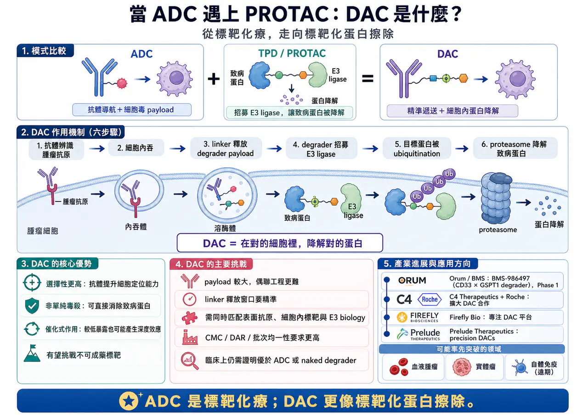
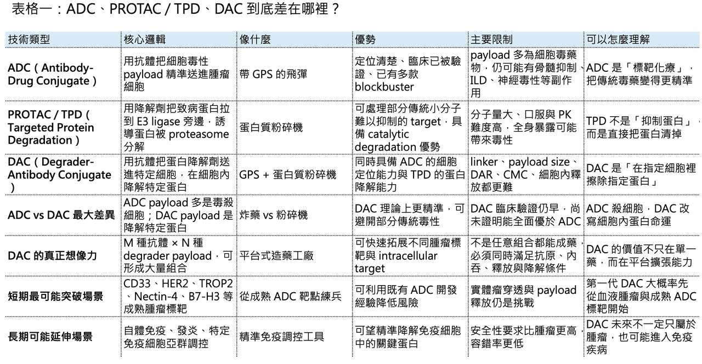
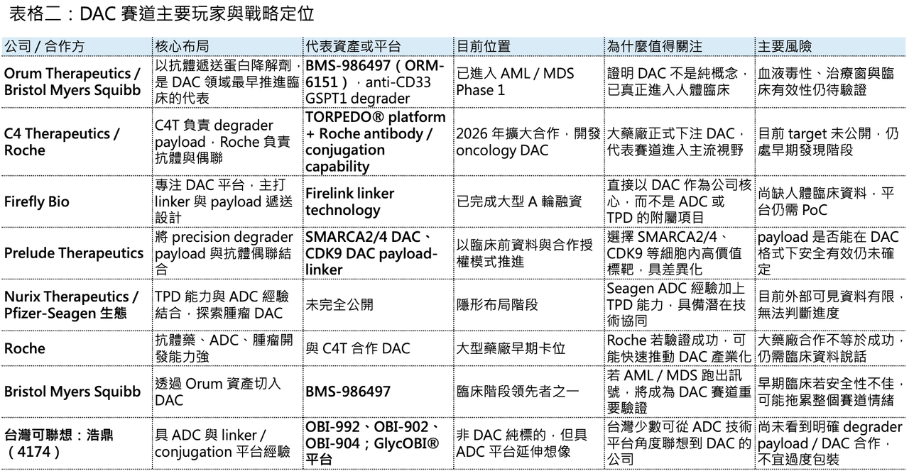

# DAC（降解劑－抗體偶聯藥物）會是下一代標靶藥物的新引爆點嗎？

【強強聯手！當 ADC 遇上 PROTAC】

生醫圈有兩個絕對頂流。

📌 一個是 ADC（Antibody-Drug Conjugate，抗體藥物複合體）。

📌 另一個是以 PROTAC（Proteolysis Targeting Chimera）、molecular glue 為代表的 TPD（Targeted Protein Degradation，標靶蛋白降解）。

前者像一枚有導航系統的飛彈，負責把高毒性 payload 精準送進癌細胞。後者像一台蛋白質粉碎機，不是單純抑制致病蛋白，而是直接把它送進細胞裡的蛋白酶體系統，讓它被分解、消失。

那麼問題來了：如果把 ADC 的「精準遞送」和 PROTAC / TPD 的「蛋白降解」結合在一起，會發生什麼？

答案就是近年開始被大型藥廠和前沿 biotech 盯上的新興 modality：DAC（Degrader-Antibody Conjugate，降解劑－抗體偶聯藥物）。

這個概念聽起來像是把兩個熱門技術硬湊在一起，但如果拆開來看，它其實有很清楚的藥物開發邏輯：用抗體負責找細胞，用 linker 負責運輸與釋放，用 degrader payload 負責在細胞內摧毀特定致病蛋白。

📌 簡單說，ADC 是「標靶化療」。

📌 DAC 則更像是「標靶化蛋白擦除」。

這個差別，可能會決定下一代腫瘤藥物、甚至部分自體免疫疾病治療的走向。

## 01｜什麼是 DAC？ADC 的 GPS，加上蛋白降解劑的粉碎機

🧬 理解 DAC，最好的方式是先從 ADC 開始。

傳統 ADC（Antibody-Drug Conjugate） 由三個部分組成：抗體、linker、payload。抗體負責辨識腫瘤細胞表面的抗原，例如 HER2、TROP2、Nectin-4、CD33；linker 負責把 payload 穩定接在抗體上，並在細胞內適當釋放；payload 通常是高毒性的細胞毒藥物，例如 microtubule inhibitor 或 topoisomerase I inhibitor。

它的邏輯很直覺：抗體是 GPS。payload 是炸藥。找到癌細胞後，把炸藥送進去，引爆。

DAC 的抗體與 linker 角色大致相似，但 payload 被換成了靶向蛋白質降解劑。

也就是說，DAC 不是把傳統毒素送進細胞，而是把一個能招募 E3 ubiquitin ligase 的小分子降解劑送進去。這個降解劑進入目標細胞後，會把致病蛋白和 E3 ligase 拉到一起，使致病蛋白被 ubiquitination，最後進入 proteasome 被降解。所以 DAC 的核心不是「毒殺細胞」，而是「在特定細胞裡消除特定蛋白」。

這點非常重要。

因為許多致癌蛋白、轉錄因子、支架蛋白、表觀遺傳調控蛋白，本來不是傳統小分子很好處理的標靶。小分子抑制劑通常要找到酵素活性位點，抗體通常只能打細胞外或細胞表面目標；但 TPD 的優勢在於，它有機會處理過去所謂的不可成要靶點。

DAC 進一步把這個概念加上「細胞選擇性」。換句話說，TPD 解決的是「蛋白能不能被降解」。ADC 解決的是「藥物能不能被送到特定細胞」。DAC 則試圖同時解決兩件事：在對的細胞裡，降解對的蛋白。這就是 DAC 最性感的地方。

## 02｜為什麼需要 DAC？因為單純 PROTAC 太難全身給，單純 ADC 又太像化療

💡 TPD 很強，但它有一個很現實的問題：全身暴露。

PROTAC 分子通常比傳統小分子更大，口服與藥物動力學開發難度高；如果全身暴露太高，可能會在不該降解的組織裡造成 on-target 或 off-target toxicity。尤其當 target 在正常細胞也有表達時，治療窗就會變窄。

ADC 則有另一個問題：payload 多半仍然是細胞毒藥物。

近年 ADC 的成功已經證明，精準遞送可以大幅改善傳統化療的治療窗；但 ADC 本質上仍常常依賴細胞毒性 payload。這帶來兩個限制：第一，腫瘤細胞會透過 payload resistance、drug efflux、DNA repair pathway 等方式產生抗藥性；第二，毒性管理仍然是 ADC 臨床開發最難的部分之一。

DAC 的出現，就是想在這兩個限制中間找到新解法。

它希望保留 ADC 的定位能力，又避免傳統 cytotoxic payload 的某些缺點；同時把 TPD 的 catalytic degradation 帶進特定細胞，降低全身暴露造成的副作用。如果這件事能做成，DAC 的想像空間會非常大。因為理論上，只要有 M 種抗體導航系統，又有 N 種 degrader payload，就可以組合出 M × N 種候選藥物。這種平台式擴張能力，正是大型藥廠和創投最喜歡的地方。

## 03｜Orum Therapeutics：DAC 領域最早跑進臨床的先鋒

🚀 談 DAC，繞不開韓國 biotech Orum Therapeutics。

Orum 幾乎是 DAC 領域最早把概念推進臨床的公司之一。它的代表性資產是 BMS-986497（ORM-6151），一款 anti-CD33 antibody-enabled GSPT1 degrader，用於 acute myeloid leukemia（AML）與 high-risk myelodysplastic syndromes（MDS）。BMS-986497 透過 CD33 抗體將 GSPT1 degrader payload 遞送至 CD33-positive tumor cells，細胞內釋放後促使 GSPT1 透過 E3 ubiquitin ligase pathway 被降解，進而抑制腫瘤細胞增殖並誘導 apoptosis。美國 National Cancer Institute 也將其定義為 anti-CD33 GSPT1 degrader。

這條管線的交易也很有代表性。Bristol Myers Squibb 先前以 1 億美元 upfront 取得 Orum 的 ORM-6151，之後更名為 BMS-986497，目前已進入 Phase 1，用於 AML 與 MDS。近期對 DAC 賽道的綜述也指出，BMS 已把這款候選藥推進 Phase 1，是 DAC 領域最受關注的臨床資產之一。

Orum 的意義不只是做出一個藥，而是讓整個產業看到 DAC 可以從概念走向臨床。

但這條路也不是沒有挫折。Orum 另一款 HER2-targeting、GSPT1 degrader-based DAC ORM-5029 曾進入臨床，但後續試驗終止。這提醒我們：DAC 不是把抗體和 degrader 接起來就成功，payload、linker、DAR、target expression、internalization、釋放動力學與安全性都要一起成立。DAC 的門檻，可能比 ADC 更高。

## 04｜C4 Therapeutics + Roche：大型藥廠開始正式下注 DAC

🤝 2026 年 4 月，DAC 賽道迎來一個很重要的訊號：C4 Therapeutics 與 Roche 擴大長期合作，簽署新的 DAC 研發協議，聚焦 degrader-antibody conjugates。依照公告，雙方將合作開發兩個 oncology target 的 DAC，並保留第三個 target option；C4T 將利用其 TORPEDO® platform 設計 degrader payload，Roche 則負責 antibody selection、antibody design、conjugation，以及後續臨床前、臨床開發與商業化。

這筆合作的意義很清楚。

Roche 是全球最懂抗體與 ADC 的公司之一。從 HER2 抗體到 ADC，再到免疫腫瘤與精準腫瘤治療，Roche 長期站在抗體藥物開發的核心位置。當 Roche 願意把 C4T 的 TPD payload 設計能力和自己的抗體偶聯能力結合起來，代表 DAC 已經不再只是小公司實驗室裡的概念，而是進入大型藥廠的正式技術選項。

C4T 的角色也很關鍵。它不是傳統 ADC 公司，而是 TPD 公司。這代表 DAC 的成功，很可能需要 ADC 公司與 TPD 公司真正跨界合作：ADC 公司懂抗體、linker、偶聯、製程和腫瘤抗原。TPD 公司懂 degrader payload、E3 ligase、target degradation、分子設計與蛋白降解動力學。

單邊能力可能不夠。DAC 需要的是兩邊都懂，而且要懂怎麼把兩邊湊在一起。

## 05｜Firefly Bio、Prelude Therapeutics：新銳黑馬已經開始搶位

🔥 除了 Orum、C4T 和 Roche，另一個值得關注的名字是 Firefly Bio。

Firefly Bio 在 2024 年以 9400 萬美元 Series A 融資正式亮相，專注於 DAC，投資人包括 Versant Ventures、MPM BioImpact、Decheng Capital 與 Eli Lilly and Company。公司表示其平台透過 Firelink linker technology，把 ADC 的特性與 selective protein degraders 結合，降低血液中 free payload，並限制健康細胞攝取，從而希望用較低劑量達到最佳療效。

這個設計方向正好戳中 DAC 的核心痛點：payload 太強，必須精準；linker 不穩，會出事；健康組織攝取太多，治療窗就消失。

另一家值得看的公司是 Prelude Therapeutics。Prelude 正在探索 precision DACs，已開發 SMARCA2/4 與 CDK9 degrader payloads，並將其優化為可和多種抗體偶聯的 payload-linker。公司資料顯示，這些 payloads 目標是用於下一代 DAC，並可透過授權方式與 partner 合作。

Prelude 先前也發布過 SMARCA2/4 degrader-antibody conjugates 的臨床前資料，指出相較傳統 cytotoxic ADC，在 xenograft models 中可能展現更好的 in vivo efficacy 與 tolerability。這些公司共同說明一件事：DAC 的競爭焦點還沒有完全落在「誰有一個臨床資產」，而是落在「誰能做出可反覆搭配抗體的 degrader payload 與 linker 系統」。這很像早期 ADC 的競爭。真正值錢的不只是某個抗體或某個 payload，而是平台能不能連續做出多個可成藥的分子。

## 06｜DAC 的三個核心優勢：不只是殺細胞，而是改寫細胞內蛋白命運

🧩 DAC 的第一個優勢，是選擇性。傳統 PROTAC 或 molecular glue 如果全身暴露，可能在多種正常組織中產生 target degradation。DAC 則用抗體把 payload 帶到表現特定抗原的細胞中，理論上可以讓降解事件主要發生在目標細胞裡。

🧩第二個優勢，是 catalytic mechanism。傳統小分子抑制劑通常需要持續占據 target。TPD 的邏輯不同，degrader 只要把 target 和 E3 ligase 拉到一起，誘導 target 被降解，本身理論上可以反覆作用。這種 catalytic 特性，可能讓較低 payload exposure 產生較深的生物效應。

🧩第三個優勢，是對抗不可成藥標靶。許多癌症相關蛋白不是傳統抑制劑很好處理的 target，尤其是某些 支架蛋白、轉錄調控因子、表觀遺傳複合物成分。DAC 如果能把 degrader payload 送進特定細胞，就有機會處理過去 ADC payload 或小分子難以覆蓋的疾病機制。這也是為什麼 DAC 不應只被理解成「ADC 換 payload」。

它本質上是把 ADC 從細胞毒藥物時代，推向 細胞內標靶編輯 的時代。

## 07｜但 DAC 的挑戰也很硬：CMC、生物學與治療窗，沒有一關容易

DAC 聽起來很漂亮，但它目前仍處於嬰兒期。

⚠️第一個挑戰是 payload size。PROTAC 分子通常比傳統 ADC payload 大很多。這會影響 conjugation、DAR control、抗體穩定性、血中半衰期、細胞內釋放與 payload diffusion。ADC payload 通常已經經過多年篩選，分子量、疏水性、毒性與 linker 兼容性都相對成熟；但 degrader payload 要真正適配抗體偶聯，還需要大量工程化優化。

⚠️第二個挑戰是 linker。DAC 的 linker 不能太早斷，否則 degrader payload 在血液中釋放，可能帶來全身毒性；但也不能太穩，否則進入細胞後釋放不足，target degradation 不夠。這比傳統 ADC 更複雜，因為 payload 不只是要毒殺細胞，而是要在細胞內精準抵達能招募 E3 ligase 的有效位置。

⚠️第三個挑戰是 target biology。DAC 需要細胞表面抗原能把藥物帶進細胞，也需要細胞內 target 對降解敏感，還需要 E3 ligase 在該細胞中表達並可被利用。這代表 DAC 的適應症選擇，不只是看表面抗原，而是要同時看 intracellular degradation biology。

⚠️第四個挑戰是 CMC。抗體、linker、degrader payload、DAR、偶聯位置、批次均一性，每一個都可能影響療效與安全性。對藥廠來說，DAC 不是簡單的新概念，而是一個製造和質量控制都更複雜的新 modality。

⚠️第五個挑戰是臨床證明。DAC 到底能不能比 ADC 更安全？能不能比 naked degrader 更有效？能不能處理傳統 ADC 失敗的抗藥性？能不能在實體瘤中展現清楚療效？能不能把治療窗做大？

這些都要靠臨床資料回答。

在沒有足夠臨床資料前，DAC 仍然是高潛力、高不確定性的前沿賽道。

## 08｜DAC 最可能先在哪些疾病突破？

🧪 第一代 DAC 最有可能先從血液腫瘤開始。原因很簡單：血液腫瘤標靶清楚、細胞可及性高、臨床反應判讀相對快，像 CD33-positive AML / MDS 就是合理起點。BMS-986497 選擇 CD33 與 GSPT1 degrader，本質上就是用一個已知血液腫瘤抗原，測試 DAC 能不能安全有效地把降解劑送進癌細胞。

🧪第二個方向是實體瘤。這裡的想像空間最大，但難度也最高。實體瘤要面對腫瘤異質性、抗原表達不均、tumor penetration、payload diffusion、bystander effect 以及腫瘤微環境限制。DAC 如果能在 TROP2、HER2、Nectin-4、PSMA、B7-H3 等成熟 ADC 標靶上跑出優勢，才會真正打開市場。

🧪第三個方向是自體免疫與發炎。這是比較遠期、但非常值得看的一塊。如果 DAC 能把 degrader payload 精準送到特定 immune cell subset，降解某些關鍵免疫訊號蛋白，理論上可能成為比全身免疫抑制更精準的新療法。但這條路比 oncology 更早期，安全性要求也更高。

所以 DAC 的短中期主戰場仍然會是腫瘤，尤其是血液腫瘤與成熟 ADC 標靶實體瘤；長期才可能擴展到免疫疾病。

## 09｜台灣並的 ADC 與偶聯平台

🌏  DAC 台灣暫時沒有成熟 DAC 公司。台灣目前最接近 DAC 上游概念的公司，仍然是具備 ADC 技術與抗體偶聯平台的公司。

其中最值得放進觀察名單的是 浩鼎（4174）。

浩鼎已公開布局多款 ADC。公司資料顯示，OBI-992 是 TROP2-targeted ADC；OBI-902 是採用 GlycOBI® 醣鍵結技術平台建構的新一代 TROP2 ADC；OBI-904 則是 Nectin-4-targeted ADC。浩鼎也提到 GlycOBI® 平台整合酵素技術與創新 linker，可製備高均一性、高穩定性並具可控 DAR 的 ADC 產品。

這和 DAC 的關係在哪裡？

DAC 的成功需要三個能力：抗體選擇、linker / conjugation、payload engineering。浩鼎目前更接近 ADC 與 linker / conjugation 端，而不是 TPD payload 端。因此，若未來要往 DAC 方向延伸，關鍵不在於「我有 ADC」，而在於能否取得或共同開發合適的 degrader payload，並把現有偶聯平台與降解劑 payload 兼容。

換句話說，浩鼎不是 DAC 純標的，但它是台灣少數可以用「ADC 平台升級」角度去聯想 DAC 趨勢的公司。

【結語｜ADC 是標靶化療，DAC 是標靶化蛋白擦除】

✨ ADC 讓腫瘤治療進入標靶化療時代。

✨ TPD 讓藥物開發開始挑戰過去不可成藥的蛋白。

✨ DAC 則試圖把兩者合在一起：讓抗體負責找細胞，讓 degrader 負責消除細胞內的致病蛋白。

這是一個非常漂亮的概念。但漂亮概念不等於成功藥物。

DAC 要真正爆發，至少要回答四個問題：

✨ 第一，能否證明 degrader payload 比傳統 cytotoxic payload 有更好的治療窗？

✨ 第二，能否克服 payload size、linker release、DAR control 和 CMC 的巨大挑戰？

✨ 第三，能否在臨床上展現比 ADC 或 naked degrader 更清楚的差異化？

✨ 第四，能否找到最適合 DAC 的 target pair：表面抗原加細胞內降解標靶？

目前答案還沒有完全出來。

但從 Orum / BMS 的臨床推進，到 C4T / Roche 的 DAC 合作，再到 Firefly Bio、Prelude Therapeutics 等新銳公司的布局，這條賽道已經從概念走向真實產業競爭。如果 ADC 是 1.0 時代的「標靶化療」，那麼 DAC 很可能是 2.0 時代的「標靶蛋白擦除」。未來誰能第一個拿出乾淨、有效、可重複的臨床數據，誰就有機會在下一代 ADC 競爭裡，搶先拿到一張新門票。

--------------

參考資料：

[0]: 各公司官網＆公開資料

[1]:

Linkedin

Find technical definitions and synonyms by letter for drugs/agents used to treat patients with cancer or conditions related to cancer. Each entry includes links to find associated clinical trials.

www.cancer.gov

[2]:

The emerging field of degrader-antibody conjugates

Discover the emerging class of degrader-antibody conjugates – a modality that is drawing increasing interest from biotech companies.

www.labiotech.eu

[3]:

C4 Therapeutics Expands Long-Term Partnership with Roche

Agreement Focused on Developing DACs With Payloads For Two Oncology Targets, With an Option for a Third Target C4T to Develop Degraders With Payload...

www.globenewswire.com

[4]:

Press Release | Firefly Bio Debuts With $94 Million Series A Financing

Transformational degrader antibody conjugate company backed by founding investor Versant Ventures, MPM BioImpact, Decheng Capital and Eli Lilly

fireflybiologics.com

[5]:

Precision DACs - Prelude Therapeutics

https://preludetx.com/science/precisiondacs/

preludetx.com

本文僅供產業研究與知識分享，不構成投資、醫療、募資或個股建議。
