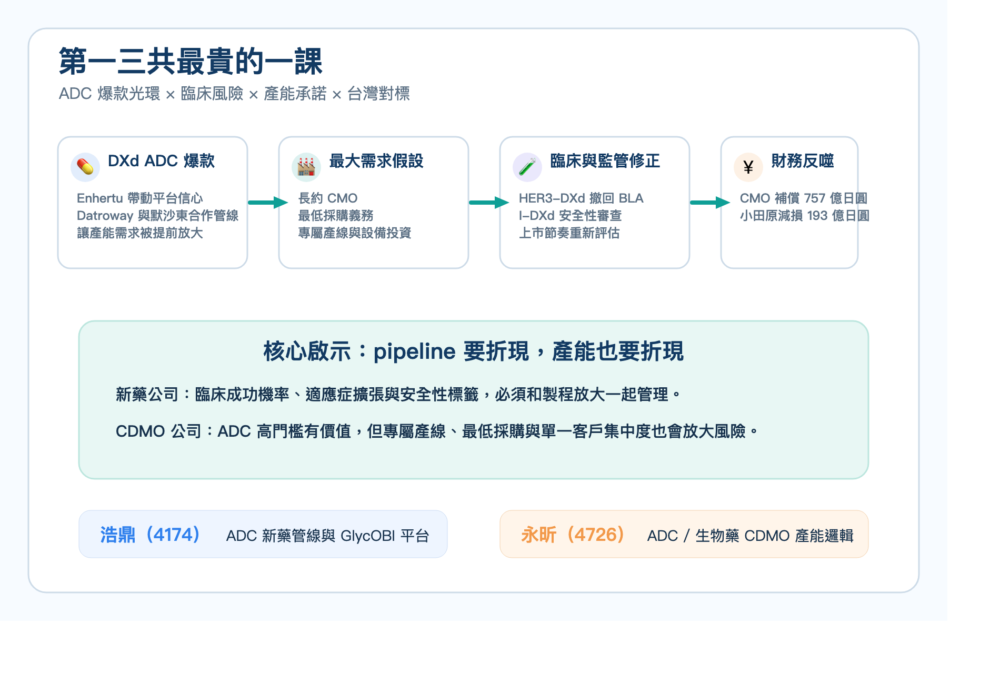
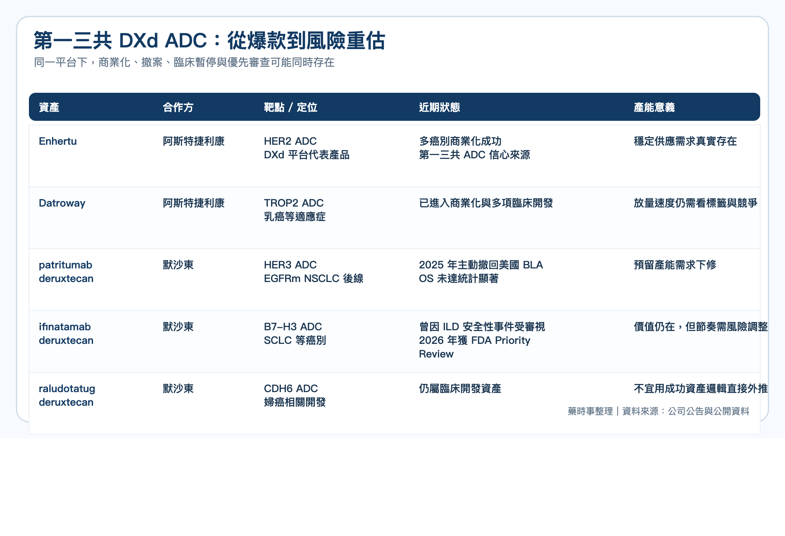
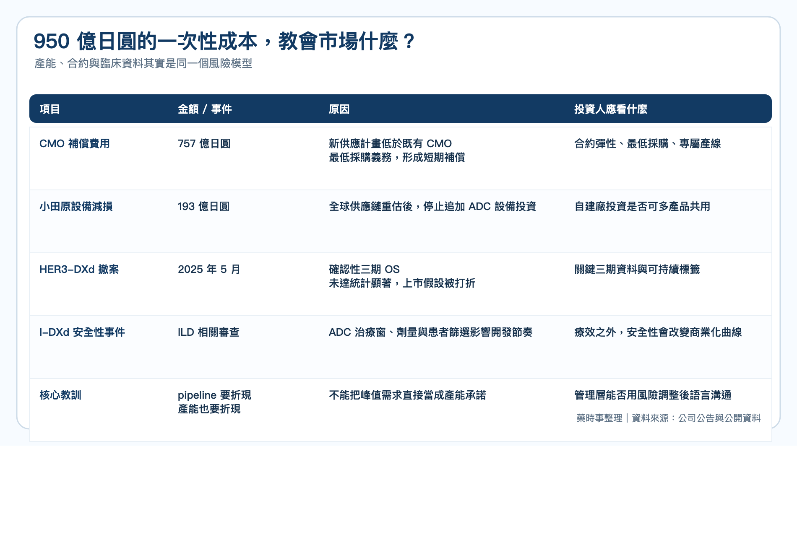
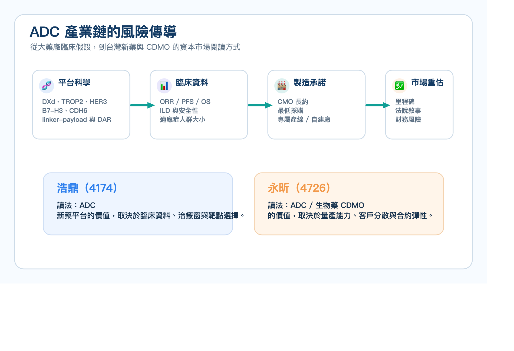
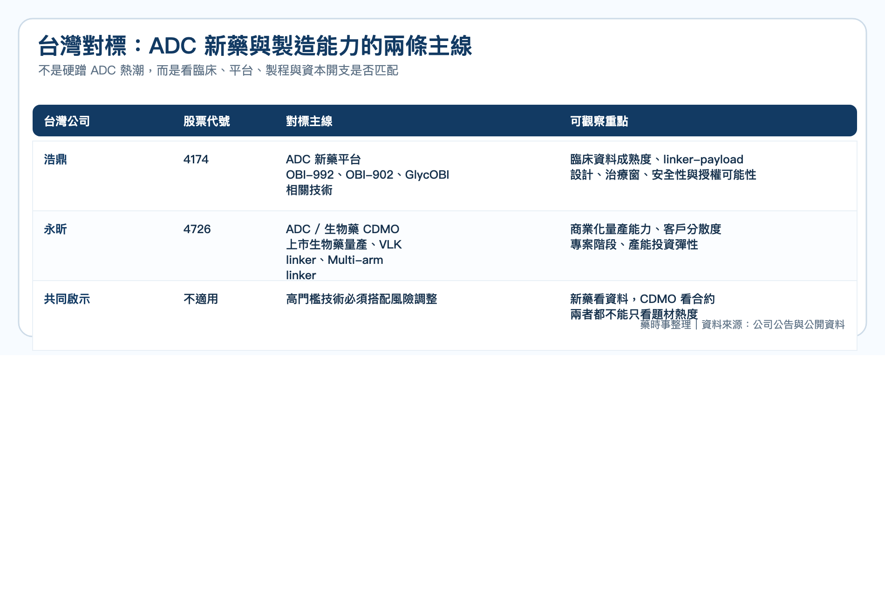

# 第一三共最貴的一課：ADC 爆款之後，產能豪賭如何反噬？

## ADC 不只比臨床，也比產能

ADC 這幾年是全球腫瘤新藥最熱的賽道之一。

第一三共靠著 DXd ADC 平台，把 Enhertu 推成全球最成功的 ADC 之一，也讓 Datroway、patritumab deruxtecan、ifinatamab deruxtecan、raludotatug deruxtecan 這些後續管線成為市場關注焦點。

但 2026 年 5 月 8 日，第一三共給市場上了很貴的一課。

公司下修截至 2026 年 3 月 31 日財年的合併財測，營業利益從原先預估的 3,350 億日圓降至 2,290 億日圓，差額高達 1,060 億日圓。

真正刺眼的不是營收，而是兩筆與 ADC 供應鏈有關的成本：

◆ CMO 補償費用準備金：757 億日圓  
◆ 日本小田原工廠 ADC 相關資本設備減損與補償費用：193 億日圓  

合計 950 億日圓的費用，指向同一件事：第一三共曾經為 DXd ADC 的爆發式成長預先鎖下產能，如今卻因臨床與上市節奏修正，被迫重新估算供應需求。

## 第一三共押注的不是一條產品線，而是一整套 DXd 帝國

第一三共的擴產並不是毫無理由。

Enhertu 已經證明 DXd 平台能改寫 HER2 腫瘤治療格局，並與阿斯特捷利康共同推進多個適應症。Datroway 則讓 TROP2 ADC 進入商業化階段。

更大的期待，來自第一三共與默沙東在 2023 年簽下的大型合作。默沙東取得三款 DXd ADC 的共同開發與商業化權利，包括：

▸ patritumab deruxtecan（HER3-DXd）  
▸ ifinatamab deruxtecan（I-DXd）  
▸ raludotatug deruxtecan（R-DXd）  

對第一三共來說，如果這些資產按預期接力上市，產能就會變成競爭優勢。ADC 製造不像傳統小分子藥，只要有原料藥與製劑產能就能快速拉升。

它同時牽涉抗體生產、linker-payload、偶聯、純化、分析方法、無菌製劑與高度細胞毒性物質管理。能夠合規承接完整 ADC 製造的 CMO / CDMO 供應商本來就有限，熱門賽道中，早一步鎖產能也代表早一步鎖住上市節奏。

問題在於，當一家公司用「最大需求」去配置供應鏈，等於把臨床成功、適應症擴張、監管審查與商業化放量，都先當成較高機率事件處理。

這在上升週期看起來是進攻；在臨床不確定性回來時，就會變成成本。

## 臨床失利如何變成產能成本

第一三共公告中最關鍵的一句話，是公司承認過去採取「足以涵蓋最大需求、且未進行風險調整」的製造能力確保策略。

這句話其實就是整起事件的核心。

HER3-DXd 原本被視為 EGFR 突變非小細胞肺癌後線治療的重要資產。2025 年 5 月，第一三共與默沙東主動撤回美國 BLA，原因是確認性 HERTHENA-Lung02 三期試驗的 overall survival 未達統計顯著。

I-DXd 的故事更複雜。2025 年底，針對小細胞肺癌的三期研究因 interstitial lung disease（ILD）相關安全性事件出現，曾遭 FDA 部分臨床暫停。到 2026 年 4 月，FDA 又接受 I-DXd 用於既往接受含鉑治療後進展的 extensive-stage small cell lung cancer BLA，並給予 Priority Review，PDUFA 日期為 2026 年 10 月 10 日。

這說明 ADC 研發不是單純的成功或失敗二分法。

一個資產可能在某個適應症撤案，在另一個適應症仍被優先審查；一個試驗可能因安全性暫停，同時仍保有繼續開發的臨床價值。

但對產能規劃來說，這些不確定性都會變成非常現實的問題。

如果預期上市時間延後、適應症人群縮小、標籤使用受限，原先簽下的最低採購量、專屬生產線與廠房投資，就可能與新的需求曲線出現落差。

這次第一三共認列的 757 億日圓 CMO 補償費用，正是新供應計畫與既有 CMO 合約義務之間的落差。小田原工廠 193 億日圓損失，則是公司重新檢討全球供應鏈後，決定停止追加 ADC 設備投資所產生的減損與合約補償。

## 第一三共最貴的一課：供應鏈也需要風險折現

這件事最值得台灣新藥公司讀的地方，不是「不要擴產」。

對腫瘤新藥公司來說，若沒有足夠穩定的供應能力，即使臨床成功，也可能在查廠、放大製程、上市供貨或全球授權時卡住。patritumab deruxtecan 早在 2024 年就曾因第三方製造廠檢查問題收到 FDA complete response letter，這也提醒市場：製造能力本身就是新藥價值的一部分。

真正的問題是，供應鏈決策不能只看峰值需求，也要看臨床成功機率、適應症擴張速度、安全性標籤、監管審查時間與商業化爬坡曲線。

換句話說，pipeline 要折現，產能也要折現。

第一三共過去的邏輯，是把「確保所有患者穩定供應」放在最高優先級。這個出發點並不錯，甚至很符合藥廠責任。

但資本市場看的是另一件事：當臨床試驗沒有照劇本走，管理層是否能把科學風險、供應鏈風險與財務承諾放在同一張圖上說清楚。

## 台灣可以對照誰？

這篇不應該被簡化成「ADC 熱潮降溫」。

ADC 仍然是腫瘤治療最重要的新藥平台之一，第一三共也沒有失去 DXd 平台的核心地位。真正被修正的是市場過去對 ADC 的線性想像：只要有漂亮平台、重磅合作與爆款先例，後續管線就會順利接力，產能就應該提前全部卡位。

放到台灣，可以自然對照兩條主線。

第一條是 ADC 新藥開發。

浩鼎（4174）是台灣少數把 ADC 放在核心研發產品線的公司。公司管線包括 TROP2 ADC OBI-992、次世代 TROP2 ADC OBI-902，以及 Nectin-4、TROP2 x HER2、cMET x HER3 等 ADC 或雙抗 ADC 早期資產。OBI-992 已進入 Phase 1，OBI-902 也已在美國與台灣推進 Phase 1/2。

第一三共事件給浩鼎這類公司最大的提醒，不是 ADC 不能做，而是 ADC 的價值敘事必須同時回答三個問題：

▸ 靶點與適應症是否夠清楚？  
▸ linker-payload 與 DAR 設計是否能真正改善安全性與治療窗？  
▸ 臨床推進速度、製程放大與未來供應安排是否與資料成熟度相匹配？  

第二條是 ADC / 生物藥製造與 CDMO。

永昕（4726）近年從生物藥開發與臨床階段 CDMO，逐步走向國際上市生物藥品的商業化量產供應商。公開資料也提到，永昕自 2021 年起拓展 ADC 新興生物藥領域，2025 年取得日本 RIN Institute 的 VLK linker 技術獨家授權，並以自研 Multi-arm linker 技術建構次世代 ADC 一站式服務。

永昕和第一三共不是同一種公司，但它們站在同一條產業鏈的兩端。

第一三共的案例提醒 CDMO：ADC 產能很有價值，但客戶管線的不確定性、最低採購義務、專屬產線與設備投資，都需要被設計成更有彈性的商業模式。

對投資人而言，ADC 題材不能只看「有沒有接到案子」，還要看案子處於臨床前、臨床、上市前或商業量產哪個階段，以及產能投資是否能被多個客戶、多種 modality 或多區域供應需求分散風險。

## 真正的重點

第一三共這次不是因為 ADC 不行而受傷，而是因為 ADC 太成功之後，管理層把部分未來需求提前當成確定性來配置。

這也是所有創新藥公司最容易犯的錯：科學突破會讓人相信下一個里程碑只是時間問題，但臨床資料、監管審查、安全性事件與商業化放量，沒有一個會保證照劇本走。

對台灣生技公司來說，這篇最大的啟發不是保守，而是成熟。

新藥公司要敢於押注，但也要讓市場看見風險調整後的開發節奏；CDMO 公司要抓住高門檻製造機會，也要避免用單一客戶或單一管線承擔過度固定成本。

ADC 仍然值得期待。

但從第一三共這堂課開始，市場會更仔細問：一家公司押注的，到底是經過風險折現的產業能力，還是被爆款光環放大的過度樂觀？

## 參考資料 / 延伸閱讀

1. Daiichi Sankyo：FY2025 Consolidated Financial Forecast Revision，2026/5/8  
2. Daiichi Sankyo Group Value Report 2025  
3. Merck / Daiichi Sankyo：patritumab deruxtecan BLA voluntary withdrawal，2025/5/29  
4. Merck / Daiichi Sankyo：ifinatamab deruxtecan Priority Review，2026/4/13  
5. BioPharma Dive：Patient deaths put Merck, Daiichi’s ADC trial on partial hold，2025/12/19  
6. OBI Pharma：Pipeline overview  
7. 永昕生醫：2026 亞洲生技大展參展商新聞稿、公開營運資料  

本文僅作為產業研究與醫藥趨勢分享，不構成任何投資建議。