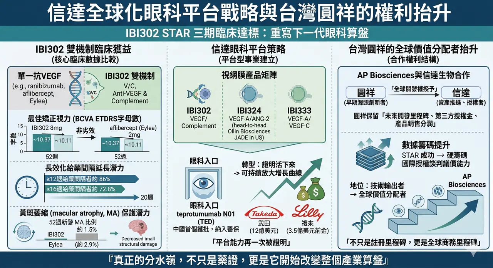
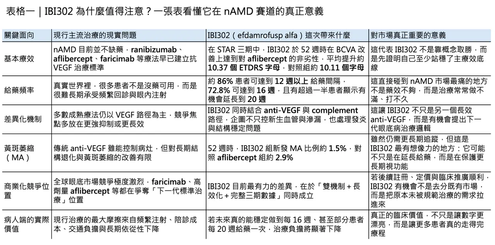
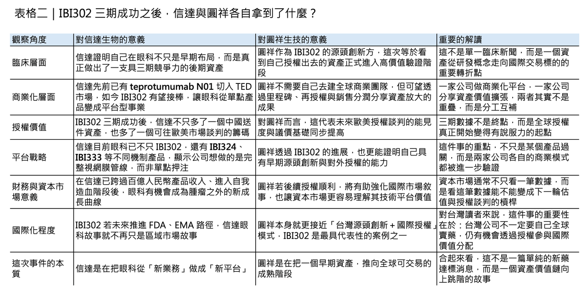

# 信達的全球化列車，台灣的圓祥搭上了？

## 當 IBI302 三期達標，信達與圓祥真正想拿下的，不只是中國藥證
3 月 24 日，信達生物公布 efdamrofusp alfa（IBI302） 在中國新生血管型老年黃斑部病變（nAMD）關鍵三期 STAR 試驗達成 52 週主要終點。乍看之下，這像是一則典型的臨床里程碑新聞；但若把它放回全球眼科產業的競爭結構裡看，這件事的重要性遠不只是一款新藥在單一市場報捷。對信達而言，這是它把眼科從「附屬業務」做成「平台型事業」的關鍵一步；對台灣的圓祥生技（AP Biosciences）而言，這則數據則等於替 IBI302 從中國敘事推向國際授權敘事，補上了最硬的一塊臨床籌碼。

真正值得注意的是，nAMD 從來不是一個「缺藥」的市場。過去十多年，ranibizumab、aflibercept、conbercept，再到近年的 faricimab，已經把抗 VEGF 眼底治療推到相當成熟的階段。問題從來不是有沒有藥，而是現實世界裡太多患者撐不到理想治療強度：需要反覆玻璃體內注射、頻繁回診、家庭陪病與長期自費或共付壓力，最後把理論上的療效折損成「治療不足」。也因此，下一代眼底藥物真正的競爭點，早就不只是視力字母數能不能再多幾個，而是能不能把給藥間隔拉長、把長期結構傷害壓低，讓更多患者真的走得完治療路徑。AP Biosciences 也在其公司資料中明確把 AMD 描述為高齡族群失明的重要來源，而濕性 AMD 雖然占比沒有乾性 AMD 高，卻造成了大部分嚴重中央視力喪失。
## IBI302 的關鍵，不只是達標，而是它想改寫下一代眼底藥的競爭邏輯

這正是 IBI302 有意思的地方。它不是再做一個單純更強的 anti-VEGF，而是用雙機制去重新定義視網膜疾病的處理邏輯。根據信達公布的 STAR 結果，這項三期研究共納入 600 名中國 nAMD 受試者，1:1 隨機分派至 IBI302 8 mg 與 aflibercept 2 mg 組。52 週時，IBI302 在最佳矯正視力（BCVA）改善上達到對 aflibercept 的非劣性：兩組平均分別增加 10.37 與 10.11 個 ETDRS 字母。這代表它首先已經站穩了最基本的一條線：至少在主療效上，它沒有掉隊。

但如果只看到「非劣效」，其實低估了這支藥真正的戰略價值。STAR 最打動市場的，不是它證明自己能接住 aflibercept，而是它把長效化與結構保護兩件事，同時往前推。研究顯示，約 86% 的 IBI302 患者在維持期可達到 12 週或更長的給藥間隔，72.8% 可達到 16 週，且有 56.3% 患者在第 24 週時未見疾病活動度，顯示存在進一步延長到 20 週給藥的潛力。這不是單純把「打針次數變少」這麼簡單，而是直接碰到 nAMD 市場最難解的核心矛盾：如何把理論療效真正轉化為可執行的長期治療。

✨ 更有想像空間的是黃斑萎縮（macular atrophy, MA）。在 STAR 的 52 週資料中，IBI302 組新發 MA 比例為 1.5%，對照 aflibercept 組為 2.9%。這個差距目前仍然需要更長時間追蹤才能判定它是否足以改寫臨床實務，但它至少已經把一個長期以來被視為 anti-VEGF 時代灰色地帶的問題拉上檯面：如果視網膜疾病治療的下一步不只是控滲漏、消水腫，而是保護更長期的組織穩態與視功能，那麼 anti-VEGF + complement 這條路徑就不再只是新分子故事，而是有機會變成下一代治療標準的雛形。
## 這不是只在中國對標 Eylea，而是開始往全球下一代眼科賽道卡位

這也是為什麼 IBI302 的勝利不能只用「在中國市場對標 Eylea」來理解。從國際競爭來看，全球眼底賽道這幾年最明確的方向，就是把長效給藥與多機制整合做得更徹底。faricimab 已經把 VEGF/Ang-2 的敘事打進主流臨床，而信達自己也不是只壓一張牌：2025 年半年報顯示，信達的眼科管線除了 IBI302（VEGF/Complement） 之外，還有 IBI324（VEGF-A/ANG-2） 以及 IBI333（VEGF-A/VEGF-C）；其中 IBI324 還與美國 Ollin Biosciences 合作推進，且 Ollin 在 2026 年初公布的 JADE 研究 topline 中，已經把 OLN324／IBI324 直接拿去和 faricimab 做 head-to-head 比較，並表態將加快推向全球三期。

這說明信達眼科已經不是單一資產衝藥證，而是在用不同機制佈一整個視網膜產品矩陣。
## 對圓祥而言，這不只是臨床好消息，而是國際授權談判桌上的硬籌碼

如果把這個脈絡再拉回台灣，IBI302 的三期達標，對圓祥生技的意義其實更值得細看。根據 AP Biosciences 官網，IBI302 最早由圓祥於前期開發完成，之後已將其全球開發權授予信達；但圓祥仍保有未來開發里程碑、第三方授權金以及產品銷售分潤。

這意味著，圓祥現在不是自己去送 FDA 或 EMA，而是站在一個「早期源頭創新者」的位置，等待資產在更大市場被信達推進、授權、甚至再授權。從這個權利結構推論，STAR 三期成功的真正價值，不只在於中國申報 NMPA 的路被打開，而在於 IBI302 作為國際授權標的的議價能力，現在終於有了足夠厚的後期臨床數據做支撐。

也就是說，這不只是信達的註冊里程碑，同時也是圓祥的全球商務里程碑。
## 信達現在要做的，不只是多一支眼科藥，而是建立整條眼科平台
而且，信達如今也已經不是只能用腫瘤公司眼光來看的公司了。2025 年 3 月，信達的 SYCUME（teprotumumab N01） 獲批用於 thyroid eye disease（TED），成為中國首個獲批的 IGF-1R 抗體藥物；同年 12 月，它又被納入最新版國家醫保目錄。

對信達來說，teprotumumab N01 的價值不只在於打開 TED 市場，而在於它讓公司第一次真正建立起眼科商業化入口：你有了專科醫師教育、病人管理、支付溝通與市場准入經驗，後續再推進 IBI302，就不再是從零開始。眼科平台之所以重要，不在於你有幾個分子，而在於你是否已經開始形成一套可複製的商業與臨床運營基礎。

📌 這種「把蛋糕做大」的能力，放在整個信達身上其實更明顯。公司在 2025 年初公告，全年產品收入約人民幣 119 億元、年增約 45%，首度跨過百億人民幣門檻；在 2025 年上半年，公司總收入為人民幣 59.53 億元，產品收入 52.34 億元，並已錄得 IFRS 淨利與 Non-IFRS 淨利。這組數字的意義很直接：信達已經不在「證明自己能不能活下來」的階段，而是在思考下一個問題——在腫瘤、自免、代謝之外，還能不能用眼科再複製一條可持續放大的增長曲線。
## 國際藥廠已經不再只把信達當中國公司看待
更進一步看，信達近兩年的跨國合作，也讓這個故事不再只是單一市場擴張，而是全球研發能力被重新定價。2025 年 10 月，武田與信達簽下全球腫瘤合作，涵蓋 IBI363 與 IBI343 等資產，前期付款高達 12 億美元，總交易價值最高可達 114 億美元；2026 年 2 月，禮來又與信達達成新的全球腫瘤與免疫合作，支付 3.5 億美元前金，總里程碑上看 85 億美元。

這些交易本身與 IBI302 並不在同一適應症，但它們共同傳遞了一個更重要的訊號：國際藥廠已經不再只把信達視為中國市場銷售公司，而是開始把它視為可以持續輸出全球可交易資產的平台型公司。在這種背景下，IBI302 的三期成功，自然不會只被看成一個眼科項目過關，而會被看成信達平台能力又一次被證明。
## 這次 STAR 成功，其實一次回答了三個問題
所以，這次真正值得記住的，不是「信達的眼科新藥又過了一關」這麼簡單。更深一層看，IBI302 的 STAR 成功，其實一次同時回答了三個問題。

🌿 第一，nAMD 下一代產品到底還有沒有差異化空間？

答案是有，而且不只在視力，更在給藥頻率與黃斑萎縮這些長期結局。

🌿 第二，信達的眼科布局是不是單點運氣？

現在看起來不是，因為 teprotumumab N01、IBI302、IBI324、IBI333 已經構成一個相對完整的眼科矩陣。

🌿 第三，台灣的源頭創新公司能不能透過授權模式，在國際舞台上真正分到蛋糕？

從 AP Biosciences／圓祥 與 IBI302 的權利結構來看，答案也正在逐步變成肯定。
## 結語：真正的分水嶺，不是藥證，而是它開始改變整個產業算盤
換句話說，信達這次真正做的，不是去搶別人桌上已經切好的那塊蛋糕，而是試圖把整張桌子的尺寸往外推。

對病人來說，這代表未來眼底病治療可能不只是「看得到藥」，而是「更有機會把療程走完」。

對信達來說，這代表眼科終於開始從輔助敘事變成主體敘事。

對圓祥來說，這則是從技術輸出者，正式走向全球價值分配者的一次抬升。

真正的分水嶺，往往不是藥證核准那一天，而是市場第一次發現：這個資產已經不只是一個臨床代號，而是一個能夠改變整個產業算盤的商品。

IBI302 現在，正走到這個位置。
-------
參考文獻：

[0]: 公開資料＆各公司官網

[1]:

The Phase 3 Registration STAR Study of Efdamrofusp Alfa (IBI302) Met its Primary Endpoint, Making it the First Self-developed Extended-interval Treatment for nAMD in China

/PRNewswire/ -- Innovent Biologics, Inc. ("Innovent") (HKEX: 01801), a world-class biopharmaceutical company that develops, manufactures and commercializes...

www.prnewswire.com

[2]:

Technology ∣ 圓祥生技

圓祥生技

www.apbioinc.com

[3]:

investor.innoventbio.com

https://investor.innoventbio.com/media/1325/innovent-biologics_2025-semi-annual-results_website.pdf

investor.innoventbio.com

"

[4]:

China's First IGF-1R Monoclonal Antibody: Innovent Announces NMPA approval of SYCUME® for the Treatment of Thyroid Eye Disease - BioSpace

https://www.biospace.com/press-releases/chinas-first-igf-1r-monoclonal-antibody-innovent-announces-nmpa-approval-of-sycume-for-the-treatment-of-thyroid-eye-disease

www.biospace.com

[5]:

Document

https://news.futunn.com/en/notice/306425532/innovent-bio-inside-information-announcement-robust-growth-achieved-in-product

news.futunn.com

[6]:

YouTube

Learn more about Takeda's collaboration with Innovent to expand its late-stage oncology pipeline and advance treatments for patients with solid tumors.

www.takeda.com

---

本文僅供產業研究與知識分享，不構成投資、醫療、募資或個股建議。
