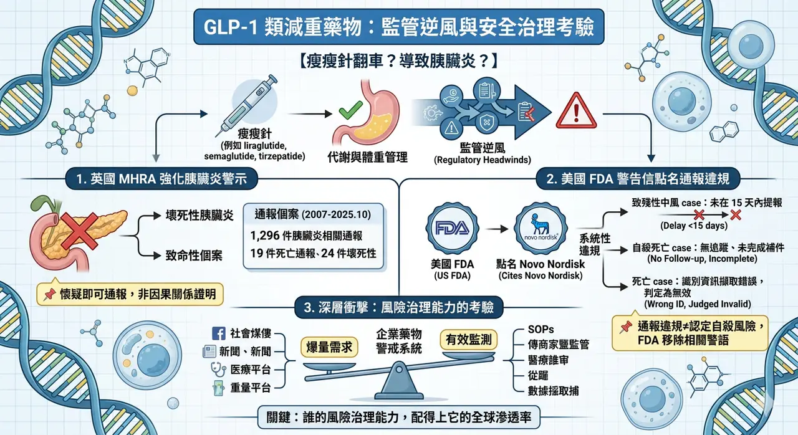
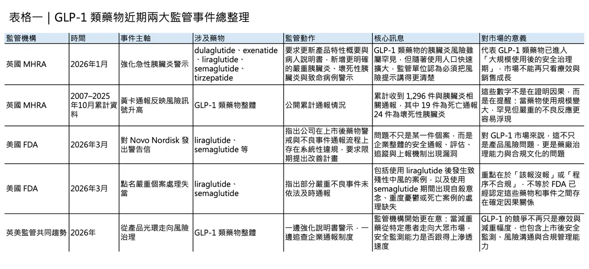
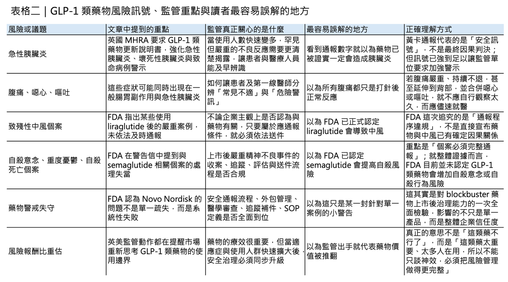

# 瘦瘦針翻車？導致胰臟炎？

## 當減重神藥撞上監管逆風：英國強化致命胰臟炎警示，FDA 點名 Novo Nordisk（諾和諾德）藥物警戒失靈
GLP-1 類藥物近兩年幾乎成了全球醫療市場最耀眼的明星。從 liraglutide（利拉魯肽）、semaglutide（司美格魯肽），到雙重受體機制的 tirzepatide（替爾泊肽），這一波藥物不只改變了第二型糖尿病治療，也快速跨入體重管理、心血管風險降低等更大的市場。也正因為使用人數急速放大，監管機構如今開始更用力地追問同一件事：當一款藥從特定代謝疾病用藥，變成被廣泛討論、甚至被當成生活型態干預工具時，它的安全監測體系，究竟有沒有跟上成長速度？
## 英國先出手：不只是提醒，而是把警示門檻整體往前拉

2026 年 1 月 29 日，英國藥品暨醫療產品管理局（MHRA）更新整個 GLP-1 類與 GLP-1/GIP 雙重受體藥物的安全資訊，點名 dulaglutide（度拉糖肽）、exenatide（艾塞那肽）、liraglutide（利拉魯肽）、semaglutide（司美格魯肽） 與 tirzepatide（替爾泊肽），要求進一步強化「急性胰臟炎」風險警示，特別是壞死性與致命性個案。
MHRA 公布的資料顯示，英國在 2007 年到 2025 年 10 月之間，累計收到 1,296 件與這類藥物相關的胰臟炎黃卡通報，其中 19 件為死亡通報，24 件為壞死性胰臟炎。更重要的是，MHRA 不只是提醒，而是要求英國已核准產品的專業仿單與病人說明書同步更新，代表監管機構認為，既有風險揭露已不足以支撐當前使用規模。
📌 這裡最需要先說清楚的一點是：黃卡通報數字本身，不等於已經證實因果關係，也不能直接拿來推算發生率。
英國 MHRA 本身就強調，不需要先「證明」因果關係，懷疑即可通報；美國 FDA 也明確指出，不良事件通報的存在，不代表該藥物一定造成了該事件。換句話說，這 1,296 件通報不是在說「GLP-1 一定造成了多少胰臟炎」，而是在說：在使用量大幅上升之後，監管系統觀察到足夠多、而且足夠嚴重的訊號，必須把警示門檻再往前拉。
真正值得注意的，不只是分子本身，而是訊號密度、嚴重程度，以及風險溝通方式的升級。
## 真正棘手的地方：胰臟炎早期症狀，和常見腸胃副作用太像

MHRA 這次動作之所以重要，還在於它揭露了一個臨床上很棘手的問題：胰臟炎的早期表現，和 GLP-1 類藥物常見的腸胃道副作用太像了。
監管文件反覆提醒，若患者出現「嚴重且持續的腹痛，可能延伸到背部，並伴隨噁心、嘔吐」，就必須立即就醫；但偏偏這些症狀，和許多使用者在起始治療、劑量上調期間常見的不適高度重疊。
也因此，真正的風險不只是「有沒有副作用」，而是患者與第一線臨床人員能否在一堆看似常見的不舒服之中，及時辨識出少數可能演變為急症的個案。MHRA 甚至特別提醒，在英國以自費方式取得的減重針劑，不一定會完整出現在病歷上，這使得急診或一般門診對症狀判讀更加困難。
⚠️ 若把視角拉高，英國這次不是在否定整個藥物類別的價值，而是在修正市場曾經過度簡化的敘事。GLP-1 類藥物當然仍然是重要創新，MHRA 也沒有說這些藥應該停用；它真正做的是把市場從「神藥神話」拉回醫療現實：所有大規模使用的藥物，最終都要回到上市後風險治理。
過去，這類藥物主要集中在糖尿病照護；現在，它們被帶進肥胖管理、心血管風險控制、長期體重維持等更廣的適應場景，接觸到的人口更大、年齡層更廣、共病更多，原本在臨床試驗中不易看清的低頻但高嚴重度事件，自然更有機會浮上檯面。
## 美國 FDA 的重點更狠：不是只看藥，而是直接質疑藥物警戒系統

而在大西洋另一端，美國 FDA 的動作則把問題往更深一層推進。2026 年 3 月 5 日，FDA 對 Novo Nordisk（諾和諾德） 發出警告信，核心不是直接宣稱 liraglutide（利拉魯肽） 或 semaglutide（司美格魯肽） 已被證明造成特定嚴重事件，而是指出 Novo Nordisk 在上市後不良事件通報制度上出現了系統性違規。
FDA 文件明確寫到，公司程序竟允許把某些嚴重且非預期的不良事件，因為「通報者認為與產品無關」而被取消或拒絕送件；例如，一名使用 liraglutide（利拉魯肽） 的患者發生致殘性中風，由於通報者表示認為和藥物無關，該案竟未依法在 15 天內提報 FDA。FDA 直言，這樣的定義違反美國法規，因為美國要求的是「只要與用藥相關聯的不良事件，不論是否被認定與藥物有因果關係，都必須依規處理」。
## 更嚴重的是：連自殺意念與死亡個案，都曾被延遲或錯誤處理
更嚴重的是，FDA 還舉出數個與 semaglutide（司美格魯肽） 相關的處理失當案例。
🔹 其中一件，是消費者通報的自殺意念案例，在系統內進入 medical review 後長時間延宕，直到 FDA 稽查中被點出，才補做醫學審查並送件。另一件，是醫師通報的死亡案例：醫師告知 Novo Nordisk 代表，一名使用 semaglutide（司美格魯肽） 的患者出現憂鬱，之後自殺身亡，但公司未留下任何有效追蹤紀錄，也未完成必要補件，截至警告信發出時仍未送交 FDA。
🔹 還有另一件死亡案例，則因公司未正確擷取病人識別資訊而被錯誤判為無效。
這一連串問題指向的不是單一疏失，而是從 SOP、委外管理、資料擷取、醫學審查到追蹤流程，整條藥物警戒鏈條都出現了漏洞。FDA 甚至在信中直言，這些缺失讓官方對 Novo Nordisk 整體產品組合的安全監測能力產生嚴重疑慮，並要求公司在收到信後 15 個工作天內提出改善方案。
## 這裡最容易被誤讀：通報違規，不等於 FDA 已認定 GLP-1 會增加自殺風險
不過，這裡也有一個非常關鍵、但最容易被外界混淆的地方：「未依規定通報自殺意念或自殺死亡個案」，不等於 「FDA 已認定 GLP-1 類藥物會增加自殺風險」。
事實上，就在 2026 年 3 月 12 日，FDA 另行發布安全說明，表示在完成更全面的審查後，並未發現 GLP-1 receptor agonist（GLP-1 受體促效劑） 類藥物會增加自殺意念或自殺行為風險，並要求把原本出現在部分減重適應症標示中的相關警語移除。
FDA 公布，其分析涵蓋 91 項安慰劑對照試驗、共 107,910 名受試者，另也利用 Sentinel 資料系統分析超過 224 萬名新使用者。
這代表目前的監管結論其實分成兩層：
🔹 第一，個別嚴重案例必須依法完整通報。
🔹 第二，從整體證據來看，FDA 目前並未認定這一整類藥物會提高自殺風險。
這種「個案必須嚴肅處理，但總體因果仍需依完整證據判讀」的雙軌邏輯，正是現代藥物警戒最容易被市場誤讀的地方。
## 真正值得警惕的，不只是某個分子，而是整套藥物警戒能不能承受爆量
也因此，真正值得警惕的，未必只是某一個分子會不會再冒出新風險，而是重磅藥物商業化之後，企業的藥物警戒系統能不能承受爆量需求。
當一款藥從專科醫師管理下的代謝用藥，變成被社群、媒體、遠距醫療、自費診所、體重管理平台大量推廣的熱門產品，安全資訊不再只來自醫院，也可能來自客服、外包 call center、病患家屬、社群留言、跨國合作夥伴與各地分公司。
這時候，藥物警戒失敗往往不是因為沒人看到訊號，而是因為訊號在流程中被錯誤分類、被延後、被低估，或被層層外包之後失真。FDA 在這封信裡反覆點出的，也正是 vendor oversight、medical review 延遲、追蹤機制缺失與程序定義錯誤等問題。
換句話說，這不是一封只屬於 Novo Nordisk 的警告信，而是整個全球代謝藥物產業都該讀懂的一次壓力測試。
## 把英國與美國放在一起看，監管核心其實很一致
若把英國與美國兩起事件放在一起看，會更清楚看到監管邏輯的核心其實一致。
🇬🇧 英國 MHRA 處理的是已知風險的溝通升級：胰臟炎原本就不是新議題，但在壞死性與死亡個案累積後，必須更強烈、更明確地提醒。
🇺🇸 美國 FDA 處理的則是風險訊號能否被正確送進監管系統：即便個案最終未必證明因果，只要它符合法定條件，就不能因主觀判斷被擋在門外。
前者在問「我們有沒有把風險說清楚」，後者在問「我們有沒有把風險看見」。而一旦這兩件事任何一件沒做到，市場對所謂「安全有效」的信心，就會開始鬆動。
## 下一輪競爭，不只比減重幅度，還要比風險治理能力
這對臨床醫師、投資人、患者，甚至對仍在追趕下一代減重藥物的國際藥廠而言，都是一次很實際的提醒：未來 GLP-1 類藥物的競爭，不會只發生在減重幅度、給藥頻率、口服化或合併機制上，更會發生在誰能建立更可信的長期安全監測與風險溝通能力。
當市場已不再只是治療糖尿病，而是要服務更大量、使用時間更長、期望值更高的人群，藥物的價值就不只由臨床療效決定，也由上市後能否承受現實世界壓力決定。
真正成熟的 blockbuster，不只是賣得快，而是出了事也能被看見、被追蹤、被解釋、被及時修正。
## 寫在最後：GLP-1 不會退場，但監管已經進入更成熟、更殘酷的下一階段
GLP-1 類藥物當然不會因為這兩起事件就退出舞台。無論是 liraglutide（利拉魯肽）、semaglutide（司美格魯肽），還是 tirzepatide（替爾泊肽），它們仍然在肥胖與代謝疾病治療史上占有重要位置。
只是到了今天，全球市場恐怕必須承認一件事：這些藥已經大到不能只用「神藥」二字概括。它們現在面對的，不再只是療效競爭，而是進入了一個更成熟也更殘酷的階段——
誰的風險治理能力，配得上它的全球滲透率。
------------
參考資料：
0. 各公司官網＆公開資料
1.
Novo Nordisk Inc. - 717576 - 03/05/2026 | FDA
Postmarketing Adverse Drug Experience Reporting Requirements
www.fda.gov
2.
GOV.UK
Updated product information for healthcare professionals and patients regarding the small risk of severe acute pancreatitis in patients taking GLP-1s.
www.gov.uk
3.
GOV.UK
The product information for all Glucagon-Like Peptide-1 (GLP-1) receptor agonists and dual GLP-1/glucose-dependent insulinotropic polypeptide (GIP) receptor agonists has been further updated to highlight the potential risk of severe acute pancreatitis wit
www.gov.uk

---

本文僅供產業研究與知識分享，不構成投資、醫療、募資或個股建議。
