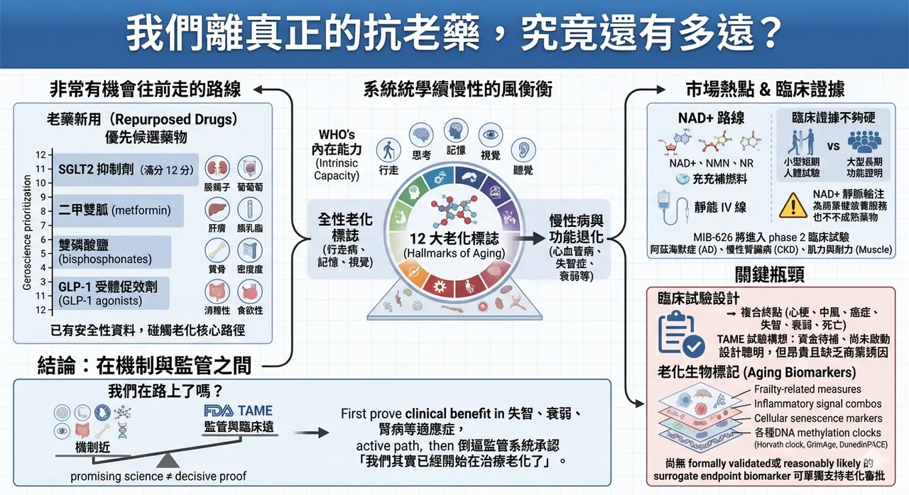
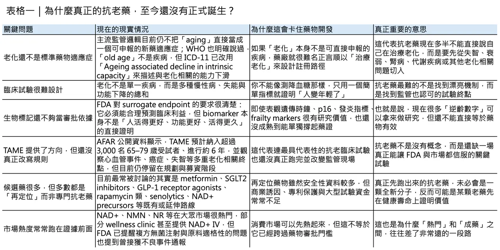
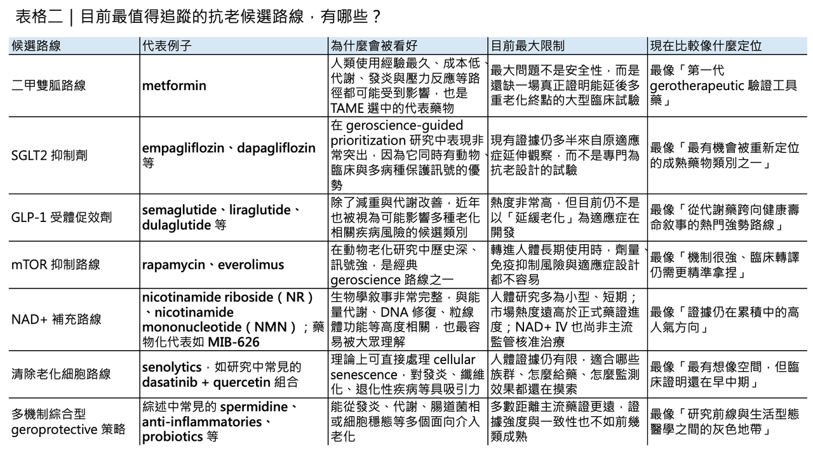

# 我們離真正的抗老藥，究竟還有多遠？

週末大家好！我們剛好聊點輕鬆的！
「抗老化」這三個字，很容易讓人聯想到不老神話、富人專屬科技，甚至公平性與可近性的爭議。
但若把問題問得更精準，真正值得討論的其實不是「人能不能活到 150 歲」，而是能不能把失能、慢性病纏身、長期照護依賴的時間往後推。
換句話說，抗老藥物真正想處理的核心，不是單純延長壽命，而是延長 healthspan（健康壽命）。
WHO 對 healthy ageing（健康老化）的定義，本來就不是「完全沒有疾病」，而是盡可能維持一個人能夠生活、移動、思考、做決策、維持關係與參與社會的 functional ability（功能能力）。
這也是為什麼 geroscience（老化生物醫學）近年會快速升溫：它想處理的是高齡社會最現實的問題，而不是科幻式的長生不老。
## 問題的第一道門檻：老化還不是一個成熟的藥物適應症

真正的難題在於，老化在監管上還不是一個成熟的藥物適應症。
現有回顧指出，FDA、EMA 與 Health Canada 目前都沒有把 aging（老化）正式視為疾病，這使得開發者很難直接以「治療老化」作為新藥申報路徑；臨床試驗多半只能改以糖尿病、心血管疾病、失智症、衰弱、肌少症或其他老化相關疾病為切入點。
也就是說，科學界已經越來越相信「老化機制可以被干預」，但監管體系仍然主要是以單一疾病為單位在運作。
這不是語言遊戲，而是整個產業能不能被資本支持、能不能設計臨床終點、能不能拿到適應症的根本差異。
## WHO 的語言正在鬆動，但還沒真的把老化醫療化

不過，這個局面並非完全沒有鬆動。
WHO 在 ICD-11 已經明確表示，「old age（老年）」不是疾病；但同時又把相關類別重新命名為 “Ageing associated decline in intrinsic capacity”，也就是與老化相關的內在能力下降。
這個調整的象徵意義很大，因為它反映出全球健康治理的焦點，正從「你得了哪一種病」慢慢轉向「你的能力儲備是不是正在系統性下滑」。
而 WHO 所說的 intrinsic capacity（內在能力），指的是一個人在任何時間點可以動用的所有身體與心理能力，包括行走、思考、視覺、聽覺與記憶。
它還不是把老化正式醫療化，但至少替未來的預防、早期辨識與功能導向介入，開了一扇門。
## 從生物學來看，老化根本不是單一路徑失控

若從生物學來看，老化之所以難治，正是因為它從來不是單一路徑失控，而是一整個系統層級的慢性失衡。López-Otín 團隊在 2023 年把 hallmarks of aging（老化標誌） 從最初的 9 項擴充到 12 項，包括：
✦ genomic instability（基因體不穩定）
✦ telomere attrition（端粒耗損）
✦ epigenetic alterations（表觀遺傳改變）
✦ loss of proteostasis（蛋白質恆定失衡）
✦ disabled macroautophagy（巨自噬失能）
✦ deregulated nutrient sensing（營養感知失調）
✦ mitochondrial dysfunction（粒線體功能障礙）
✦ cellular senescence（細胞衰老）
✦ stem cell exhaustion（幹細胞耗竭）
✦ altered intercellular communication（細胞間通訊改變）
✦ chronic inflammation（慢性發炎）
✦ dysbiosis（菌相失衡）
這套框架重要的地方，不在於把老化切成 12 個名詞，而在於它說明了：同一個老化標誌，往往會同時推動多種慢性病與功能退化；反過來說，若一種藥能打到關鍵機制，也可能不只影響一個器官或一個疾病。
這正是 geroscience 最吸引人的地方，也是它和傳統單病種研發最大的不同。
## 現在最有機會往前走的，很多其實是「舊藥新用」
也因為如此，現在大家談的「抗老候選藥物」，本質上大多不是全新的 magic bullet，而是既有藥物的再定位。2024 年《Cell Metabolism》的綜述把目前臨床上最常被討論的 8 大方向整理得很清楚：
✦ metformin（二甲雙胍）
✦ NAD+ precursors（NAD+ 前驅物）
✦ GLP-1 receptor agonists（GLP-1 受體促效劑）
✦ TORC1 inhibitors（TORC1 抑制劑）
✦ spermidine（亞精胺）
✦ senolytics（清除衰老細胞藥物）
✦ probiotics（益生菌）
✦ anti-inflammatories（抗發炎藥物）
這份回顧的重點並不是宣告哪一個已經成功，而是提醒我們：現階段最有機會往前走的，往往不是「宣稱逆轉年齡」的驚人新分子，而是那些已經有人體安全性資料、又能碰觸老化核心路徑的既有治療。
## 真正被高分看好的，未必是市場最愛講故事的那一批
這也是為什麼一些看起來原本與「抗老」沒那麼直接相關的藥，反而在 geroscience 評分中表現很強。2022 年的 geroscience-guided prioritization 研究用 12 分制去評估 FDA 已核准藥物的抗老再定位潛力，結果 SGLT2 inhibitors（SGLT2 抑制劑） 拿到滿分 12 分，高於 metformin（二甲雙胍）、rapamycin（雷帕黴素） 或 acarbose（阿卡波糖）。
到 2024 年的更新版，作者進一步把 bisphosphonates（雙磷酸鹽）、GLP-1 receptor agonists（GLP-1 受體促效劑）、beta blockers（乙型阻斷劑） 納入，並指出最值得優先推進的前四類，是：
✦ SGLT2 inhibitors（SGLT2 抑制劑）
✦ metformin（二甲雙胍）
✦ bisphosphonates（雙磷酸鹽）
✦ GLP-1 receptor agonists（GLP-1 受體促效劑）
這個結果很重要，因為它顛覆了大眾對抗老藥的想像：未來最先走向大規模驗證的，不一定是新創公司最會講故事的分子，而可能是糖尿病、骨代謝或代謝疾病領域裡，那些已經累積大量真實世界資料的老藥或熟藥。
## NAD+、NMN、NR 很紅，但臨床證據其實還不夠硬
當然，市場熱度最高的，往往不是 SGLT2 inhibitors（SGLT2 抑制劑），而是 NAD+、NMN（β-煙醯胺單核苷酸） 與 NR（菸鹼醯胺核糖）。
這條路之所以特別受歡迎，是因為它有一個非常直觀的敘事：年齡上升後 NAD+ 水平下降，而 NAD+ 又和能量代謝、DNA 修復、sirtuin 活性與粒線體功能有關，因此補 NAD+ 或其前驅物，看起來就像是在補老化的底層燃料。
問題在於，這套敘事的生物學合理性很高，臨床證據卻還不夠硬。
2024 年的回顧已明確指出，NAD+ boosters（NAD+ 增強劑）確實是重要方向，但迄今多數人體研究仍偏小型、短期，而且主要在看 NAD+ 濃度、代謝指標或部分功能訊號，距離真正證明它能穩定改善多重老化相關臨床結果，還有相當距離。
以 NMN（β-煙醯胺單核苷酸） 為例，現有整理顯示，已發表的人體臨床試驗數量其實不算少，但樣本數普遍有限，很多研究只有幾十人、觀察期也不長。這些研究大致支持口服 NMN 在短期內耐受性尚可，也能提升部分受試者的 NAD+ 或相關代謝物；但對於長期安全性、最佳劑量、是否真的能轉化成更低的失能風險或更長的健康壽命，答案仍然遠遠不夠。
更麻煩的是，已完成但未發表的試驗仍不少，這使得外界很容易看到市場宣傳，卻看不到完整結果。
## NAD+ 靜脈輸注現在更像 wellness 服務，不是成熟藥物治療
至於 NAD+ 靜脈輸注，現實更值得降溫。
它在美國與其他地區確實已經被不少 wellness clinic 或複方藥局操作成熱門療程，但 FDA 在 2024 年已公開提醒，部分複方單位拿 food-grade 的 NAD+ 去配製無菌注射產品並不適當，而且官方已收到多起不良事件通報，包括發冷、顫抖、嘔吐與疲倦，部分病人甚至需要醫療處置。
這代表一件事：NAD+ IV 現在更接近商業化 wellness service，而不是已被主流監管體系承認的標準藥物治療。
## 真正值得追蹤的 NAD+ 路線，反而是先走疾病適應症
如果把目光放回真正的藥物開發，MIB-626 倒是一個值得持續追蹤的例子。
MetroBiotech 目前把它定位為一種專利化的 crystalline NAD+ booster，官方資料顯示它已進入 3 項 Phase 2 試驗，適應症分別涵蓋 Alzheimer’s disease（阿茲海默症）、chronic kidney disease（慢性腎臟病），以及 muscle strength and endurance（肌力與耐力）。
這種路徑其實很能代表整個領域的現實：最有機會走向藥物化的 NAD+ 路線，往往不是直接打「anti-aging（抗老）」招牌，而是先在明確疾病或功能缺損場景裡證明臨床效益，再回頭討論它是否具有更廣的 gerotherapeutic（老化治療）意義。
## 真正把整個領域卡住的，還是臨床試驗設計
真正把整個領域卡住的，還是臨床試驗設計。
TAME（Targeting Aging with Metformin） 之所以經典，不是因為 metformin（二甲雙胍）一定會成為第一個抗老藥，而是因為它第一次把試驗問題問對了：它不是想證明 metformin 能治好哪一種病，而是想測試它能不能延後多種老化相關事件的發生。
根據目前公開資訊，TAME 的構想是納入約 3,000 名 65 至 79 歲受試者，在 14 個美國研究中心進行長達 6 年的研究，主要終點不是單一疾病，而是心肌梗塞、中風、癌症、心衰竭、輕度認知障礙／失智與死亡等複合終點。
這種設計非常聰明，因為它更貼近老化在真實世界中的樣子：老化不是一張病名，而是一串風險聚合。
只是截至 2026 年 3 月，TAME 仍處於「設計完成、資金待補、尚未正式啟動」的狀態。這恰好說明了 geroscience 最大的現實困境：科學問題愈來愈清楚，但把它做成一場足以改變監管與支付邏輯的大型試驗，仍然非常昂貴。
## 我們已經有很多「時鐘」，但還沒有一個能單獨說服 FDA
再往前一步，生物標記也還沒有成熟到可以單獨撐起審批。
現在大家最常提的 aging biomarkers（老化生物標記），包括：
✦ frailty-related measures（衰弱相關指標）
✦ 發炎訊號組合
✦ p16INK4A 這類細胞衰老標記
✦ 各種 DNA methylation clocks（DNA 甲基化時鐘），例如 Horvath clock、GrimAge、DunedinPACE
這些工具對研究非常重要，也愈來愈常被拿來做短中期反應監測；但 FDA 對 biomarker 與 surrogate endpoint 的立場很清楚：真正可用來支持審批的 surrogate endpoint（替代終點），必須能預測臨床利益，而臨床利益最後仍要回到病人是否活得更久、功能是否更好、生活是否更能自理。
現階段，針對 aging 本身，還沒有任何 formally validated 或 reasonably likely 的 surrogate endpoint biomarker 被正式建立。
換句話說，我們現在已經有不少「可能很有用的時鐘」，但還沒有任何一個時鐘，足以單獨說服監管者你真的讓人老得更慢。
## 所以，我們到底離真正的抗老藥還有多遠？
所以，回到最一開始的問題：我們離真正的抗老藥還有多遠？
答案恐怕是：從機制上看，已經不算太遠；從監管與臨床證明上看，仍然相當遠。老化作為可被干預的生物學過程，今天已經不是邊緣想法；但要把它變成一個可以被核准、被支付、被廣泛臨床使用的藥物類別，還需要三件事同時到位：
🔹 第一，找到能穩定轉譯到人體臨床結果的介入。
🔹 第二，建立被監管接受的終點與 biomarkers。
🔹 第三，解決 repurposed drugs（老藥新用）在商業誘因與大型試驗資金上的結構性缺口。
換句話說，抗老藥不是沒有在路上，而是還卡在「有很多 promising science，卻還沒有 decisive proof」的階段。
真正可能最先改變世界的，也未必是一顆直接名為 anti-aging（抗老）的藥，而是某些已存在的藥物，先在失智、衰弱、腎病、心血管或功能退化上證明它們能同時改寫多個老化終點，然後再倒逼監管體系承認：
我們其實已經開始在治療老化了。
----------
參考資料：
[0]: 各公司官網＆公開資料
[1]:
Healthy ageing and functional ability
https://www.who.int/news-room/questions-and-answers/item/healthy-ageing-and-functional-ability
www.who.int
"Healthy ageing and functional ability"
[2]:
Lock
Aging lacks disease status, but new classifications are opening regulatory dialogue. Regulatory frameworks are limited, yet trial innovations are moving the field forward. Validated biomarkers are needed, and global efforts toward standardization ...
pmc.ncbi.nlm.nih.gov
"
Advancing Geroscience Research – A Scoping Review of Regulatory Environments for Gerotherapeutics - PMC"
[3]:
"Old age"
https://www.who.int/standards/classifications/frequently-asked-questions/old-age
www.who.int
"
\"Old age\""
[4]:
Hallmarks of aging: An expanding universe
Aging is a complex and multifactorial process. This reprise of the 2013 “The hallmarks of aging” reviews conceptual progress, additional hallmarks of aging, their interconnection, and preclinical anti-aging manipulations.
www.cell.com
[5]:
Human trials exploring anti-aging medicines
Here, we summarize the current knowledge on eight promising drugs and natural compounds that have been tested in the clinic: metformin, NAD+ precursors, glucagon-like peptide-1 receptor agonists, TORC1 inhibitors, spermidine, senolytics, probio
pubmed.ncbi.nlm.nih.gov
"Human trials exploring anti-aging medicines - PubMed"

---

本文僅供產業研究與知識分享，不構成投資、醫療、募資或個股建議。
