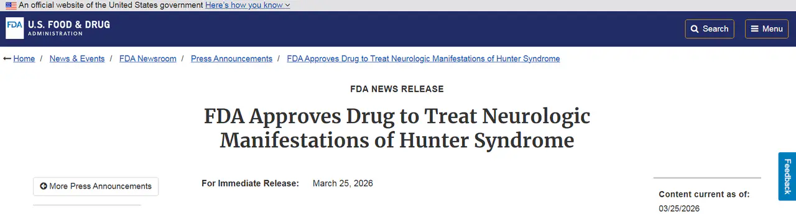
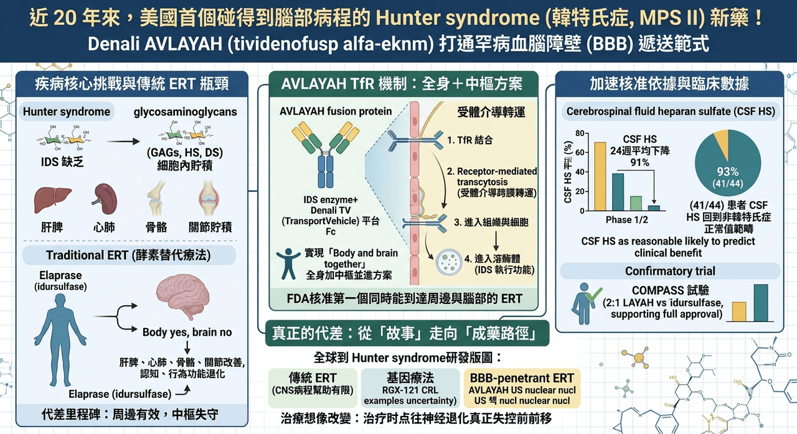

# 這一批罕見病患者終於等來新藥！

## 近 20 年來，美國終於等到一個能碰到腦部病程的 Hunter syndrome 新藥
美國 FDA 近日加速核准 Denali Therapeutics 的 AVLAYAH（tividenofusp alfa-eknm），用於治療 Hunter syndrome （韓特氏症），也就是 mucopolysaccharidosis type II（MPS II） 的神經學表現。

這次核准之所以重要，不只是因為它讓 Denali 拿下第一個美國上市產品，更因為它同時寫下兩個里程碑：

✨ 一是自 Elaprase（idursulfase） 於 2006 年在美國獲批以來，Hunter syndrome 近 20 年終於出現新的 FDA 核准治療選項。

✨ 二是它成為 FDA 首個核准、明確利用 transferrin receptor（TfR） 機制穿越血腦障壁的酵素替代療法。

這代表罕病領域最難翻越的那道牆——不是法規，也不是商業化，而是 blood-brain barrier（血腦障壁）——第一次在美國監管層面被真正打穿。

更準確地說，FDA 這次核准的適應症並不是「所有 Hunter syndrome 患者」，而是體重至少 5 公斤、尚未進入 advanced neurologic impairment 的 presymptomatic 或 symptomatic pediatric patients。也就是說，這張藥證的真正價值，在於它不再只處理周邊器官病變，而是把治療時點往神經退化真正失控之前前移。這是很關鍵的差別，因為在 Hunter syndrome 這種兒童期進展性疾病裡，很多時候不是沒有治療，而是治療到不了最需要被保護的部位，也來不及阻止認知與行為功能一路下滑。
## 為什麼 Hunter syndrome 這麼難治，核心從來不是酵素替代本身不成立

Hunter syndrome （韓特氏症）是一種 X-linked lysosomal storage disorder，病因是 iduronate-2-sulfatase（IDS） 缺乏，導致 heparan sulfate 與 dermatan sulfate 等 glycosaminoglycans 無法被正常分解，最後在全身細胞內逐步堆積。這些底物不是只卡在肝臟或脾臟，而是會一路影響骨骼、心肺、聽力、關節、行為、認知與運動功能。Denali 與 FDA 公開資料都指出，這個疾病在美國大約影響 500 名患者，全球約 2,000 名患者，雖然是超罕病，但神經退化帶來的家庭與照護負擔極重。

過去 20 年，Hunter syndrome 並不是完全沒有藥。美國的標準治療一直是 Elaprase（idursulfase），而韓國則早在 2012 年就已有 Hunterase（idursulfase beta） 作為酵素替代治療選項。這些藥在周邊器官症狀上有明確價值，能改善尿中 GAG、肝脾腫大與部分身體功能表現；問題在於，這一代傳統 ERT 的分子太大，幾乎無法有效跨過血腦障壁，所以它們可以緩解 somatic manifestations，卻無法真正碰到病人最殘酷的那一面：持續發展的神經認知退化。

換句話說，Hunter syndrome 過去的痛點不是「沒有酵素」，而是「酵素進不了腦」。

這也是為什麼這個領域多年來最迫切的未滿足需求，始終不是再做一個周邊更強的 ERT，而是找到一個既能維持全身作用、又能進入中樞神經系統的方案。日本 JCR Pharmaceuticals 其實早一步在 2021 年用 IZCARGO（pabinafusp alfa） 證明，透過 TfR 介導的 BBB transcytosis，靜脈注射酵素是有機會把藥送進腦內的；但那次核准主要發生在日本市場，全球監管與商業影響力終究有限。這次 AVLAYAH 在美國過關，意義就完全不同了，因為它把 BBB-penetrant ERT 從「區域性突破」推進成「美國正式承認的治療類別」。
## AVLAYAH 真正的突破，不只是一支新酵素，而是一種新的遞送設計

AVLAYAH 的本體是 IDS enzyme，但它的關鍵不在 IDS 本身，而在於它被接上了 Denali 的 TransportVehicle（TV） 平台。根據 Denali 公布的機轉說明，這個融合蛋白的 Fc 區段可以結合血腦障壁內皮細胞上的 transferrin receptor，再透過 receptor-mediated transcytosis 把 IDS 送進中樞神經系統；進入組織與細胞後，還能透過 mannose-6-phosphate receptor 進一步被送進 lysosome，執行酵素替代功能。

這個設計的價值在於，它不是把「進腦」和「治病」拆開處理，而是把遞送機制與酵素本體整合成同一個藥。

這種設計讓 AVLAYAH 和傳統 ERT 之間，出現了一個本質上的代差。傳統 ERT 多半只能做到「body yes, brain no」；AVLAYAH 想做到的則是「body and brain together」。Denali 在美國核准公告中也直接把它定義為第一個 FDA 核准、同時能到達周邊與腦部的 Hunter syndrome ERT。這一點很重要，因為在 lysosomal storage disorder 裡，很多產品都可以在周邊器官上看到生化改善，但真正會改寫疾病自然史的，往往是那些能動到中樞神經系統的藥。

FDA 這次之所以給加速核准，關鍵依據不是傳統的長期臨床終點，而是 cerebrospinal fluid heparan sulfate（CSF HS） 的下降。根據 FDA 與 Denali 公告，AVLAYAH 在 Phase 1/2 試驗中於 24 週時讓 CSF HS 相較基線平均下降 91%，而且 93%（41/44） 接受治療的患者，其 CSF HS 值已回到沒有 Hunter syndrome 的個體範圍內。FDA 認定這個 surrogate endpoint「reasonably likely to predict clinical benefit」，因此給予 accelerated approval。

這代表監管機構接受了一個核心判斷：在這種超罕病中，只要 biomarker 與病程機轉足夠緊密，且資料成熟度足夠，核准不一定要等到多年後才看得到的硬終點。

當然，這不代表 FDA 把門檻放低了。AVLAYAH 的正式適應症仍然附帶條件：後續核准是否能維持，仍取決於 confirmatory trial 是否能驗證真正的臨床效益。Denali 目前正在進行的 Phase 2/3 COMPASS 試驗，就是為了完成這件事。根據公司說明，這項全球性研究以 2:1 隨機分派受試者接受 AVLAYAH 或 idursulfase，並在北美、南美與歐洲推進，用來支持後續全球申報與 full approval。

也就是說，現在的 AVLAYAH 已經跨過第一道大門，但真正要從「突破性新療法」變成「穩定的新標準」，還得看 COMPASS 能不能把 biomarker 優勢，進一步轉成醫師與家庭真正感受得到的功能性改善。
## 這次核准，也等於替整個 BBB-penetrant biologics 類別開了一條路
AVLAYAH 的意義之所以超過 Hunter syndrome 本身，是因為它驗證的不只是一個適應症，而是一種藥物遞送範式。Denali 在公告中明講，這次核准同時驗證了 TransportVehicle 平台有能力把 biologics 送到全身與腦部。對產業界而言，這個訊號很重要，因為過去很多神經退化與 lysosomal storage disease 的產品開發都卡在同一個瓶頸：分子有效，但到不了病灶；或腦內有作用，但全身支持不完整。現在 AVLAYAH 至少在 FDA 層面證明，TfR-enabled biologics 可以不只是技術展示，而能成為實際可核准、可商業化的治療形式。

而且這個核准來得很巧，也很有對照意味。就在一個多月前，Regenxbio 的 Hunter syndrome 基因療法 RGX-121（clemidsogene lanparvovec） 才剛收到 FDA 的 Complete Response Letter。FDA 的疑慮包括：試驗納入標準是否足以界定 neuronopathic disease、外部自然病史對照是否可比，以及 CSF HS D2S6 是否足以作為合理預測臨床獲益的 surrogate endpoint。這並不代表基因療法失敗，也不代表一次性治療沒有前景；它更像是在告訴整個產業，FDA 對超罕病的「彈性」並不是無上限的，資料品質、對照設計與生物標記的可信度，仍然要非常扎實。AVLAYAH 的過關與 RGX-121 的受挫放在一起看，更突顯一件事：今天監管機構願意加速，但不願模糊。

這也讓 Hunter syndrome 的全球研發版圖變得更有層次。現在至少已經可以看到三條相對清楚的主路徑。

🔹 第一條，是以 Elaprase、Hunterase 為代表的傳統周邊 ERT，價值穩定，但對 CNS 病程幫助有限。

🔹 第二條，是以 IZCARGO 與 AVLAYAH 為代表的 BBB-penetrant ERT，重點是把酵素真正送進腦部。

🔹 第三條，則是像 RGX-121 這樣的一次性基因療法，試圖直接從源頭補足 IDS，但目前仍面臨較高的長期驗證與監管不確定性。

換句話說，這個領域現在已經不是單線競爭，而是「持續給藥但更完整」與「一次治療但審查更難」兩種路線並行。
## 對患者來說，這次核准真正帶來的是「病程想像」的改變
Hunter syndrome 過去最令人無力的地方，在於家屬明明看到每週輸注能讓孩子某些身體指標穩住，卻也同時知道認知、語言、行為與聽力可能仍會持續往下走。這種「周邊有效、中樞失守」的治療現實，讓很多家庭長年處於一種半進步、半挫敗的狀態。

AVLAYAH 的真正意義，正在於它第一次讓美國臨床現場有機會不再把這兩件事拆開看，而是嘗試用一個全身加中樞並進的方案來處理。FDA 自己也在新聞稿中明說，這是第一個核准用來處理 Hunter syndrome 神經學併發症的產品。這句話看似平淡，實際上已經足夠重。

當然，AVLAYAH 並不是沒有代價。它仍然是每週一次的靜脈輸注，且標示中明確提醒可能出現 hypersensitivity reactions，包括 anaphylaxis，也常見 infusion-associated reactions。從治療體驗來看，這仍然不是輕鬆的療法；從支付與可近性來看，罕病生物製劑一向也不會便宜。Reuters 報導指出，AVLAYAH 單支 150 mg vial 的美國定價為 5,200 美元。

所以它並沒有把 Hunter syndrome 變成一個簡單疾病，而是把這個疾病從「幾乎碰不到腦部病程」往前推進到「至少開始能治療腦部病程」。對這個領域來說，這已經是非常大的位移。

【結語】

AVLAYAH 的核准，不只是 Hunter syndrome 新增一個藥名而已。它真正改變的是整個罕病神經生物製劑開發的判準：一個藥若能同時證明自己到得了腦、碰得到關鍵生物標記，並且在監管上建立起可以接受的 surrogate endpoint 邏輯，那麼過去那些被血腦障壁擋住的罕病治療，也許就不再只能停留在「技術上可能」的階段。

對 Hunter syndrome 患者與家庭而言，這是近 20 年來第一次看到美國市場不只是多一個替代選項，而是第一次真正多了一個可能改寫病程方向的選項。

對產業而言，這則是另一層更大的訊號：

TfR-mediated BBB delivery，從今天起，不再只是平台故事，而是已經被 FDA 蓋章的成藥路徑。
------
參考資料：

[0]:各公司官網＆公開資料

[1]:

FDA Approves Drug to Treat Neurologic Manifestations of Hunter Syndrome | FDA

The U.S. Food and Drug Administration approved Avlayah (tividenofusp alfa-eknm) to treat certain individuals with Hunter syndrome (Mucopolysaccharidosis type II or MPS II).

www.fda.gov

"FDA Approves Drug to Treat Neurologic Manifestations of Hunter Syndrome | FDA"

[2]:

Close banner

https://www.nature.com/articles/s41587-026-03066-8

www.nature.com

"BBB Hunter agent nears FDA decision | Nature Biotechnology"

[3]:

JCR Pharmaceuticals Announces Approval of IZCARGO® (Pabinafusp Alfa) for Treatment of MPS II (Hunter Syndrome) in Japan - Neuro Central

– First Approved Enzyme Replacement Therapy for MPS II to Penetrate Blood-Brain Barrier via Intravenous Administration, Validating JCR’s J-Brain Cargo® Technology – HYOGO, Japan–(BUSINESS WIRE)–JCR Pharmaceuticals Co., Ltd. (TSE 4552; “JCR”) today announc

www.neuro-central.com

"JCR Pharmaceuticals Announces Approval of IZCARGO® (Pabinafusp Alfa) for Treatment of MPS II (Hunter Syndrome) in Japan - Neuro Central"

[4]:

"Denali Therapeutics Announces U.S. FDA Approval of AVLAYAH™ (tividenofusp alfa-eknm) for Treatment of Hunter Syndrome (MPS II) | Denali Therapeutics"

[5]:

"REGENXBIO Announces Regulatory Update on RGX-121 BLA for MPS II | Regenxbio Inc"

[6]:

Safety and efficacy of enzyme replacement therapy with idursulfase beta in children aged younger than 6 years with Hunter syndrome

Idursulfase beta (Hunterase®) has been used for enzyme replacement therapy (ERT) of patients with mucopolysaccharidosis II (MPS II, Hunter syndrome) aged 6 years or older since 2012 in Korea. The objective of this study was to evaluate the safety and effi

pubmed.ncbi.nlm.nih.gov

"Safety and efficacy of enzyme replacement therapy with idursulfase beta in children aged younger than 6 years with Hunter syndrome - PubMed"

[7]:

reuters.com

https://www.reuters.com/business/healthcare-pharmaceuticals/us-fda-approves-denalis-genetic-disorder-therapy-2026-03-25/

www.reuters.com

---

本文僅供產業研究與知識分享，不構成投資、醫療、募資或個股建議。
