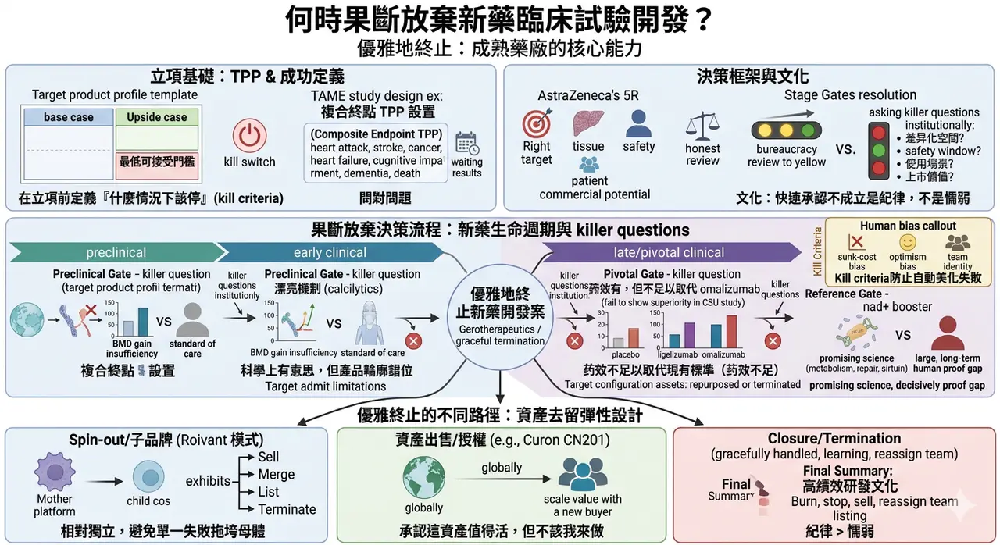
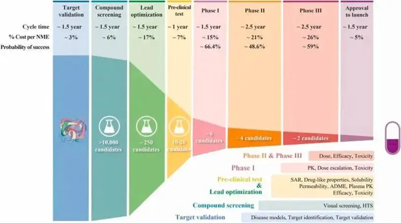
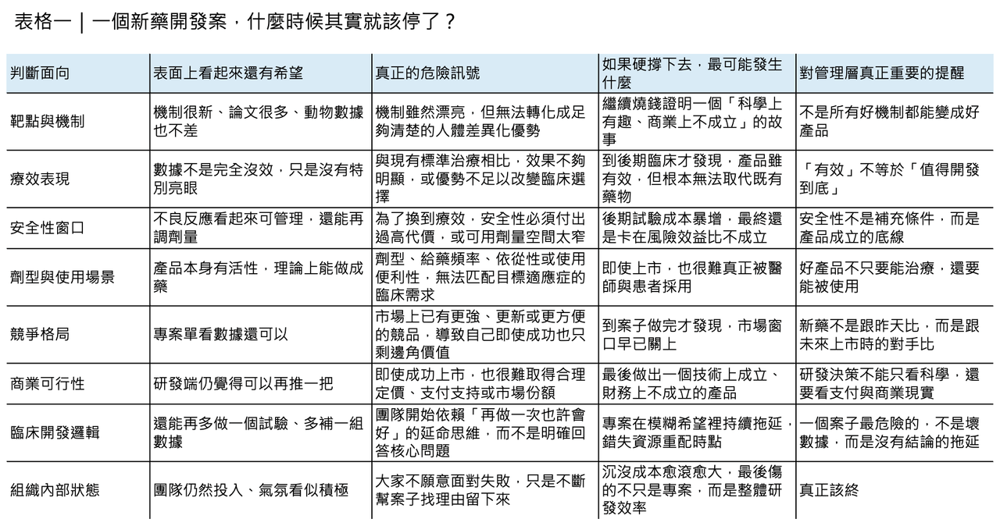
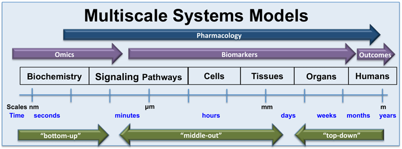
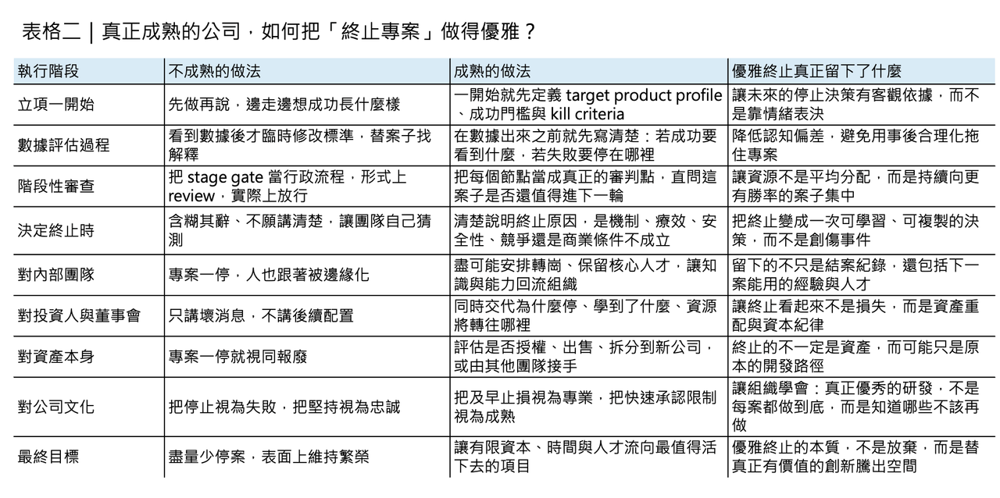

# 何時果斷放棄新藥臨床試驗開發？

## 如何優雅地終止一個新藥開發案：真正成熟的藥廠，懂得在對的時點收手
新藥開發最難的，往往不是立項那一天，而是明明已經看見風險，卻仍不願按下停止鍵的那一天。每一個研發專案開始時，幾乎都帶著同樣的想像：要做到 first-in-class、要走到 pivotal study、要送件、要上市、要成為下一個成長引擎。然而現實比願景殘酷得多。新藥研發通常要走超過十年，成本估計從數億美元到數十億美元不等，而進入臨床的候選藥最終能獲批上市的比例，長期都不到一成。真正穿越週期、持續推出產品的公司，幾乎都不是因為它們「很少失敗」，而是因為它們更早承認限制、更快做出取捨，也更有紀律地把資源撤離那些已經不再值得繼續的案子。
這件事在全球大型藥廠的研發管理邏輯裡，早就不是消極防守，而是核心能力。AstraZeneca 曾把研發決策明確收斂到 5R framework：right target、right tissue、right safety、right patient、right commercial potential，並強調研發團隊必須主動提出會「殺死自己假說」的 killer questions。Pfizer 近十年的公開經驗也很接近：它把 end-to-end success 當成系統工程來管理，到 2020 年時其整體臨床成功率已提升到 21%，遠高於過去 2010 年約 2% 的水準。這些案例的共同點，不是它們比較幸運，而是它們更願意在早期就把不成立的假設處理掉，而不是把壞消息一路拖到最昂貴的臨床後段。
## 先定義成功，才有資格優雅地收手

要做到「優雅地終止」，第一件事不是學會放棄，而是先學會怎麼定義成功。很多專案之所以難以停掉，並不是因為數據真的還有希望，而是因為團隊從一開始就沒有把成功寫清楚。
這也是為什麼 target product profile（TPP）會是成熟研發組織的起手式。TPP 的本質，不只是列出理想標籤，而是把未來產品若要成立，必須滿足哪些臨床、競品、支付與使用情境條件，先在立項時講明白。當一個團隊願意在投入第一筆錢之前，就先定義 base case、upside case 與最低可接受門檻，它其實也同時完成了另一件事：把「什麼情況下該停」寫進了專案的起始文件裡。
這會讓後面每一次數據更新，都不再只是情緒上的辯論，而是對照既定條件做重新判讀。
## 真正難的，從來不是科學，而是人性

這套框架之所以重要，是因為人類天生就不擅長在投入很多之後說停。藥物研發尤其容易落入 sunk-cost bias：因為前面已經燒了那麼多人力、時間與資本，於是每一次看到模稜兩可的結果，團隊都更傾向把它解讀成「也許再做一組實驗就會好」。
研究者也可能被 optimism bias、confirmation bias 或團隊認同綁架，最後不是在追求 truth-seeking，而是在替既有方向尋找延命理由。這也是為什麼真正成熟的決策機制，不只要求看數據，還要求在數據出來之前，就先把要回答的問題、可接受的範圍與不成立的情況寫下來。先寫好 kill criteria，不是悲觀，而是防止人性在壓力下自動美化失敗。
## 真正有效的 stage gate，不是行政流程，而是誠實審判

因此，優雅終止的關鍵，不在於「某一天突然發現這案子不行」，而在於沿途就設好一連串讓它有機會被誠實審判的節點。
最常見的錯誤，是把 stage gate 變成行政流程：每一季開會、每一階段 review、最後大家在簡報裡把紅燈修成黃燈，再把黃燈說成「仍值得觀察」。真正有效的 stage gate 則完全相反。它要求團隊在進入下一階段前，把核心問題講得非常殘酷：
🔹 這個靶點到底還有沒有差異化空間？
🔹 這個安全窗能不能支撐目標適應症？
🔹 這個劑型是否真的符合病人的使用場景？
🔹 這個候選藥到了上市那一天，面對已存在的標準治療還剩什麼價值？
AstraZeneca 所謂的 killer questions，本質上就是把這些問題制度化，不讓專案在舒適區裡自我繁殖。
## 最該停的，常常不是完全沒活性的案子

在臨床前與早期人體研究階段，最值得終止的，往往不是「完全沒活性」的項目，而是那些機制漂亮、資料不差、但整體產品輪廓已經開始和未來市場需求錯位的項目。
骨鬆領域的 calcium-sensing receptor antagonists 就是一個很有代表性的提醒。像 ronacaleret 與 MK-5442 這類 calcilytic 機制，從生物學上看非常迷人：它們能透過短暫刺激內源性 PTH 釋放來推動骨生成，看起來像是口服骨合成藥的理想路徑。
但到了人體研究後，問題逐步浮現。ronacaleret 在骨密度表現上並沒有形成足夠優勢，某些部位甚至不如既有標準；MK-5442 雖然能誘發預期中的 PTH pulse，也一度呈現出類似 anabolic window 的生物標記變化，但最終並沒有帶來優於 placebo 的骨密度提升。
這類項目的真正教訓是：漂亮機制不等於可商業化產品，而越早看懂這種 mismatch，越能避免把「科學上有意思」一路做成「財務上不堪承受」。
## 臨床階段最難停的，是那種「不是沒效，只是不夠好」的藥

進入臨床之後，終止決策會更痛，因為這時候付出的已不只是研發費，還包括公司敘事、團隊士氣與外部市場期待。
但臨床階段同樣也有一種常見幻覺：只要開發方法夠先進，專案就應該有更高機率穿越終點。Novartis 的 ligelizumab 很適合拿來提醒這件事。這個 anti-IgE 抗體在慢性自發性蕁麻疹（CSU）開發過程中，採用了相當完整的 model-informed drug development 方法，團隊用暴露反應模型、基線 IgE 分層與兒科外推去優化劑量與試驗設計，整體開發邏輯相當嚴謹。
問題是，方法再精密，也無法替產品跨越臨床競爭門檻。最終兩項關鍵三期試驗顯示，ligelizumab 雖然優於 placebo，卻未能優於已上市的 omalizumab。也就是說，它不是「沒有藥效」，而是「藥效不足以支撐取代現有標準治療」。
這類案子最難停，因為它不像明顯失敗那麼乾脆；但從資本配置角度看，它其實更應該停，因為繼續投入通常只是在用更多錢證明一個已經呼之欲出的答案。
## 真正優雅的終止，不一定是關掉，而可能是換人做
然而，終止研發不等於讓資產歸零。這也是近十年生技業最值得學的一課：真正優雅的終止，很多時候不是把案子「關掉」，而是把它從不適合的組織結構中移出，放到更適合的架構裡重估價值。
Roivant 的 Vant 模式就是最典型的例子。Roivant 從一開始就不是把所有專案塞進同一家公司裡硬扛，而是建立一個中心—輻射式結構：母體提供平台與資本配置能力，各子公司則像相對獨立的生技公司，擁有自己的管理團隊、股權激勵與發展路徑。
這種設計的厲害之處在於，它讓單一專案的失敗不會自動拖垮整個母體，也讓資產出售、授權、合資、上市甚至關閉，都變成可以常態化操作的資產組合動作，而不是公司命運式的大災難。
更進一步看，有時候最優雅的終止，其實是承認「這個資產值得活下去，但不該繼續由我來做」。2024 年，Merck 以 7 億美元前金、外加最高 6 億美元里程碑，取得 CN201 的全球權利，就是一個很有代表性的案例。
對賣方來說，這未必代表公司失敗；相反地，它可能意味著管理層做出一個很清楚的判斷：在自己現有的資本、臨床開發能力與組織規模下，最能放大資產價值的做法，不是硬把後續路走完，而是讓更有全球開發能力的買方接手。
從這個角度看，資產出售其實是一種高度成熟的終止方式——終止的是「由原團隊繼續開發」這件事，而不是終止資產本身的生命。
## 最後真正決定能不能停的，還是文化
真正困難的，最後還是人。再好的決策框架、再清楚的數據、再靈活的交易設計，若組織文化本身把專案終止視為丟臉、失敗或政治責任，那麼所有人都會本能地選擇拖延。
這也是為什麼高績效研發組織一定會刻意培養一種文化：快速承認不成立，不是懦弱，而是紀律。AstraZeneca 在公開談 5R framework 時特別強調，研發團隊必須被鼓勵去挑戰自己的假說，而不是只替它找支持證據；Pfizer 的經驗也顯示，當組織把決策品質、病人價值與資本效率綁在一起，成功率才會真正改善。
說到底，優雅終止不是一套流程文件，而是一種集體信念：我們的任務不是替每一個案子找活路，而是替最值得活下去的案子騰出空間。
【結語】
所以，如何優雅地終止一個新藥開發案？
答案其實不是「更勇敢地放棄」，而是更早把成功定義清楚，更誠實地讓數據說話，更有彈性地設計資產去留，也更體面地對待那些投入過的人。
真正成熟的藥廠，不是每個案子都能走到上市，而是它知道：
✦ 哪些案子值得繼續燒
✦ 哪些案子應該停
✦ 哪些案子該賣
✦ 哪些團隊該被重新部署
當一家公司能平靜地說出「我們終止了這個專案」，同時也能清楚交代為什麼停、學到了什麼、資源接下來會去哪裡，它展現的不是失敗，而是罕見的管理成熟度。
對新藥研發這個高風險產業而言，這種成熟，往往比多撐一季、更能決定誰能活到下一輪。
---------
參考資料：
[0]: 各公司官網＆公開資料
[1]:
Lock
Ninety percent of clinical drug development fails despite implementation of many successful strategies, which raised the question whether certain aspects in target validation and drug optimization are overlooked? Current drug optimization overly ...
pmc.ncbi.nlm.nih.gov
[2]:
Impact of a five-dimensional framework on R&D productivity at AstraZeneca
In 2011, AstraZeneca embarked on a major revision of its research and development (R&D) strategy with the aim of improving R&D productivity, which was below industry averages in 2005-2010. A cornerstone of the revised strategy was to focus decision-making
pubmed.ncbi.nlm.nih.gov
[3]:
Lock
https://pmc.ncbi.nlm.nih.gov/articles/PMC5478920/
pmc.ncbi.nlm.nih.gov
[4]:
Lock
Decades of research have demonstrated that a variety of cognitive biases can affect our judgment and ability to make rational decisions in personal and professional environments. The lengthy, risky, and costly nature of pharmaceutical research and ...
pmc.ncbi.nlm.nih.gov
[5]:
The Effects of Ronacaleret, a Calcium-Sensing Receptor Antagonist, on Bone Mineral Density and Biochemical Markers of Bone Turnover in Postmenopausal Women with Low Bone Mineral Density
AbstractContext:. Ronacaleret, a calcium-sensing receptor antagonist that stimulates PTH release from the parathyroid glands, was evaluated as an oral oste
academic.oup.com
[6]:
Lock
Model‐informed drug development (MIDD) has been increasingly applied to guide decision‐making, ameliorate efficiency, and enhance the likelihood of successful trials. The development of ligelizumab, a humanized anti‐IgE monoclonal antibody, in ...
pmc.ncbi.nlm.nih.gov
[7]:
Company Overview | Roivant
https://www.roivant.com/about/company
www.roivant.com
[8]:
Merck to Acquire Investigational B-Cell Depletion Therapy, CN201, from Curon Biopharmaceutical - Merck.com
CN201 is a next generation CD3xCD19 bispecific antibody that augments and diversifies Merck’s pipeline, with potential applications in B-cell malignancies and autoimmune diseases Merck (NYSE: MRK), known as MSD outside of the United States and Canada, and
www.merck.com
[9]:
www.astrazeneca.com
https://www.astrazeneca.com/what-science-can-do/topics/disease-understanding/transforming-astrazenecas-rd-productivity.html
www.astrazeneca.com

---

本文僅供產業研究與知識分享，不構成投資、醫療、募資或個股建議。
