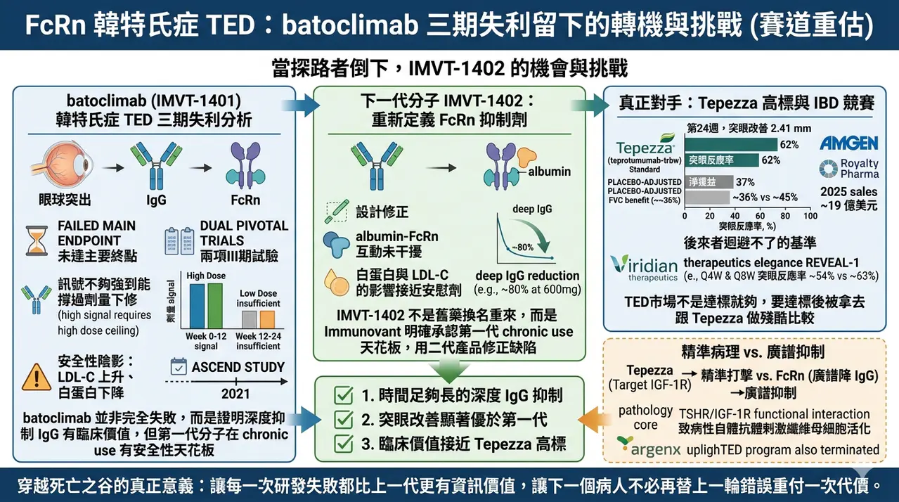
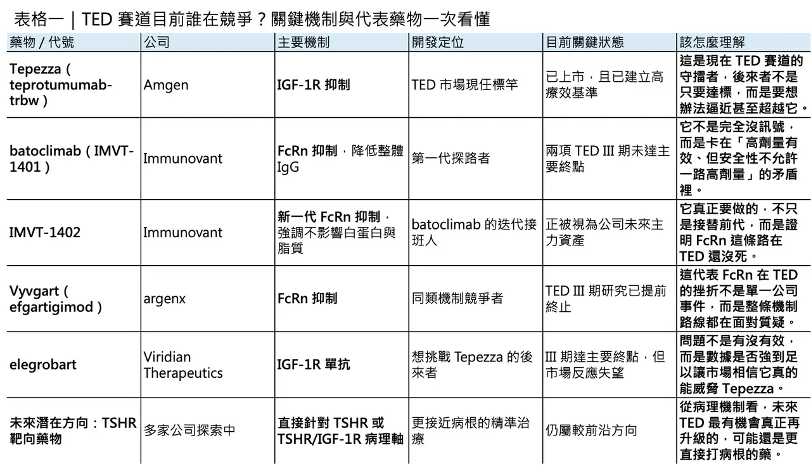
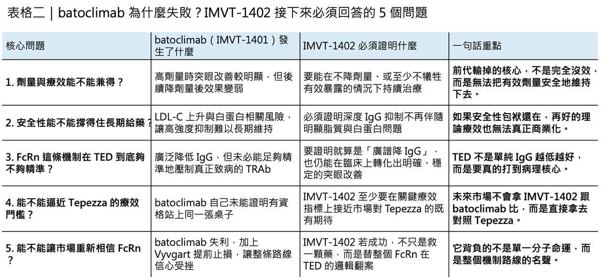

# 這家公司臨床試驗失敗，反而被更加看好？

## III 期失利不是句點：當 batoclimab 倒下，IMVT-1402 還有機會挑戰 Tepezza 嗎？
甲狀腺相關眼疾（thyroid eye disease, TED）這條賽道，最近又迎來一次很典型、也很殘酷的產業教育。2026 年 4 月 2 日，Immunovant 宣布其第一代 FcRn 抑制劑 batoclimab（IMVT-1401） 在兩項 TED 的 III 期試驗中雙雙失利，未達主要終點。對一家押注自體抗體清除邏輯的公司來說，這當然不是好消息；但更值得玩味的是，這場失敗很可能不只是終點，而是一次把機制邊界、臨床門檻與下一代產品策略全部照亮的事件。
✦【batoclimab 為什麼輸？問題不是沒有訊號，而是訊號不夠強到能撐過劑量下修】
從試驗設計來看，batoclimab 的 TED III 期研究其實不是單純「藥物完全沒作用」。兩項試驗的主要終點，都是在第 24 週評估眼球突出改善至少 2 mm 的反應率；而給藥策略則是先用 12 週高劑量，再接 12 週低劑量。根據 Immunovant 自己的說明，兩項研究雖然都沒有達標，但病人在前 12 週高劑量期間的突眼改善，明顯優於後 12 週低劑量階段。這一點很關鍵，因為它代表失敗的本質並不是「FcRn 壓低 IgG 完全沒有臨床價值」，而是需要更深 IgG 抑制時，安全性卻不允許你把高劑量一路維持下去。
而這個安全性陰影，其實早在 2021 年就已經出現。當年 ASCEND GO-2 研究中，接受 680 mg batoclimab 的 TED 病人，12 週時 LDL-C 平均上升約 65%；340 mg 劑量組也上升約 40%。正因如此，Immunovant 當時主動暫停了相關臨床給藥。也就是說，這次 III 期失利並不是突然爆雷，而是第一代分子從很早以前就已暴露出的根本矛盾：你要療效，就得把 IgG 壓得夠深；但你一旦把 IgG 壓得夠深，脂質與白蛋白相關風險就會開始逼你退回來。
所以，batoclimab 這次最值得記住的，不是「完全失敗」，而是它把一個很清楚的臨床訊號留下來：在 TED 這種疾病裡，更深度的 IgG 抑制可能確實換得到更好的突眼改善，但如果這個深度是用不可接受的代價換來，那麼在商業與監管上就很難站得住腳。換句話說，batoclimab 並沒有幫 Immunovant 證明 TED 這條路可以輕鬆走通；它證明的，是這條路要走通，第一代分子恐怕不夠。
✦【batoclimab 的真正角色，可能更像「探路者」而不是最終產品】
這也是為什麼，Immunovant 很早就開始把資源往下一代分子 IMVT-1402 移轉。從分子設計上看，IMVT-1402 與 batoclimab 最大的差別，在於它被設計成能深度抑制 IgG，卻儘量不干擾 albumin–FcRn 互動。官方在 I 期資料中已經明確指出，IMVT-1402 能做到與 batoclimab 類似的深度 IgG 降低，但對白蛋白與 LDL-C 的影響接近安慰劑；而公司在 2025 年與 2026 年對外文件裡，也反覆強調 600 mg 的 IMVT-1402 有望達到約 80% 的 IgG 降幅，並把這個劑量往更長期的註冊性設計推進。
這裡有個很重要的產業含義：IMVT-1402 不是單純把舊藥換名字重來，而是 Immunovant 明確承認第一代分子在 chronic use 的安全性天花板，並試圖用第二代產品去修正這個結構性缺陷。這也是為什麼，Immunovant 早在 2025 年就算 batoclimab 在全身型重症肌無力（gMG）III 期達標，仍公開表示不會就 gMG 或 CIDP 去尋求上市批准。這不是因為 batoclimab 完全沒有藥效，而是因為公司內部已經做出選擇：真正要扛起 FcRn 商業化野心的，不再是 1401，而是 1402。
因此，若要給 batoclimab 一個更公平的歷史定位，它比較像是 FcRn 平台的探路者。它幫公司找到了一些很重要的臨床規律：例如更深 IgG 抑制與更好臨床獲益之間可能存在關聯、TED 與 Graves’ disease 之間在自體抗體驅動層面有相通處、以及第一代分子在慢性給藥時會被哪一道安全性門檻攔住。這些資訊本身很有價值，只是它們的價值未必會兌現在 batoclimab 身上，而更可能兌現在 IMVT-1402 身上。
✦【但 IMVT-1402 真正要面對的，不是前代藥物，而是 Tepezza】
問題是，就算 IMVT-1402 成功解掉了白蛋白與膽固醇這個包袱，它接下來要挑戰的，也不是 batoclimab 的舊成績，而是 TED 市場已經被 Tepezza（teprotumumab-trbw） 拉高到非常嚴苛的標準。
作為目前唯一獲 FDA 核准治療 TED 的藥物，Tepezza 不只是先行者，更是商業上已被證明的重磅產品。Amgen 2025 年年報顯示，Tepezza 全年銷售約 19.03 億美元。而在其針對 chronic/low-CAS TED 的 Phase 4 研究裡，第 24 週時 Tepezza 組的平均突眼改善達 2.41 mm，安慰劑組則為 0.92 mm；同時，突眼反應率方面，Tepezza 組為 62%，安慰劑組為 25%。這些數字之所以重要，不只是因為漂亮，而是因為它們已經變成後來者幾乎無法迴避的對照基準。
也因此，市場對後來者的要求其實非常直接：你不一定非得在機制上跟 Tepezza 一模一樣，但你至少要在核心療效上交出能讓醫師相信、讓投資人服氣的成績。這一點，最近 Viridian Therapeutics 的經驗就很典型。2026 年 3 月 30 日，Viridian 公布 elegrobart 在 TED 的 III 期 REVEAL-1 試驗達標，表面上看是利多：第 24 週時，Q4W 組與 Q8W 組的突眼反應率分別達 54% 與 63%，優於安慰劑的 18%。但市場的第一反應不是歡呼，而是拋售；分析師與投資人更在意的是 placebo-adjusted 後的淨獲益大約只有 36% 與 45%，仍低於部分市場原先期待的 50%+ 門檻。

這件事的意義很大。它說明 TED 這個市場不是只要「達標」就夠了，而是達標之後，還要被拿去跟 Tepezza 的既有印象做殘酷比較。而且這種比較即使在方法學上有侷限——畢竟不同研究族群、疾病活動度與試驗設計都不完全一樣——市場還是會做。這也意味著，IMVT-1402 未來若要在 TED 真正站穩腳步，不能只是證明自己比 batoclimab 好，而必須證明自己在真實臨床價值上，至少有機會逼近甚至重新定義 Tepezza 所立下的門檻。
✦【為什麼 FcRn 在 TED 屢屢受挫？問題可能不只在分子，而在病理機制的「精準度」】
說到這裡，就不能不問一個更核心的問題：為什麼 FcRn 這條路在 TED 似乎一直走得不順？
答案很可能和 TED 的病理機制本身有關。現有文獻普遍認為，TED 的關鍵病理事件之一，是眼眶纖維母細胞上的 TSHR 與 IGF-1R 之間存在功能性交互作用；致病性自體抗體刺激這個複合訊號軸後，會推動纖維母細胞活化、脂肪細胞分化、玻尿酸堆積與組織重塑，最終導致突眼、複視與視神經壓迫等表現。也就是說，TED 雖然的確和 IgG 類自體抗體有關，但它不是一個「只要把全身 IgG 一路往下壓，臨床就一定同步改善」的疾病。
這正是 FcRn 抑制劑在 TED 面臨的尷尬。它們的策略本質上是「廣譜降低 IgG」，也就是用系統性方式去削減體內整體 IgG 負荷；但 TED 真正的關鍵致病因子，很可能只是其中一小群特定自體抗體，以及它們在 TSHR/IGF-1R 軸上引發的局部病理訊號。換句話說，FcRn 的問題不是完全沒有生物學邏輯，而是它可能不夠精準。你可以把整池水位都降下來，但這不代表你就能最有效率地抽走真正惹事的那一桶水。
從這個角度看，argenx 在 2025 年 12 月終止 efgartigimod SC（Vyvgart） 的 TED III 期 UplighTED 計畫，其實就更有警示意味了。當同一類機制接連在 TED 撞牆，市場自然會開始懷疑：這究竟是分子問題，還是路徑問題？至少就目前資料來看，答案恐怕更偏向後者——在 TED 這個適應症裡，直接打 IGF-1R 或未來可能的 TSHR，仍然比廣譜降 IgG 更貼近病根。
✦【但 IMVT-1402 仍不是沒有機會，只是它的勝法會比原本想像的更苛刻】
那麼，IMVT-1402 還有沒有機會？我認為答案不是零，但它的勝法已經被這幾波事件改寫了。
如果站在 2024 年以前看，你可能會認為只要 FcRn 類藥物能在 TED 達到主要終點，就有機會切進市場；但站在今天回頭看，這個標準已經不夠。對 IMVT-1402 來說，真正需要證明的其實有三件事。
🔹 第一，它能否在不犧牲安全性的前提下，長時間維持足夠深的 IgG 抑制。
🔹 第二，這種更深抑制是否真的能在 TED 換來顯著優於第一代分子的突眼改善。
🔹 第三，也是最難的一點——這樣的改善能否接近或逼近 Tepezza 所代表的臨床與商業門檻。
如果三件事只能做到前兩件，卻無法在第三件事上交出足夠令人信服的結果，那它仍可能只是一顆科學上更漂亮、但商業上不一定站得穩的藥。
也就是說，IMVT-1402 的機會，不在於市場會因為 batoclimab 失敗而自動降低標準；恰恰相反，市場現在反而會要求它一次性回答更多問題。因為前代失敗已經幫所有人把真正的難點找出來了：不是 TED 能不能被 FcRn 路線碰到，而是你是否能在這個適應症裡，同時做到夠深、夠久、夠安全，而且療效夠接近市場龍頭。

✦【結語：batoclimab 輸掉的是一場試驗，IMVT-1402 要回答的卻是一整個產業問題】
如果只看 headline，這件事很簡單：batoclimab 的 III 期 TED 試驗失敗了。
但如果把整件事放回產業脈絡裡，它其實比單純失敗更有意思。
因為 batoclimab 這次輸掉的，不只是一次主要終點，而是把 FcRn 在 TED 這個適應症上的真正難題全部攤開：你必須壓得夠深，但又不能因為壓太深而把安全性拉垮；你即使改善了突眼，也還要面對 Tepezza 已經立下的高標；而且在一個核心病理軸高度聚焦於 TSHR/IGF-1R 的疾病裡，廣譜降 IgG 到底能做到多精準，始終會被反覆追問。
所以，真正值得追蹤的下一個問題不是「batoclimab 為什麼失敗」，而是「IMVT-1402 能不能把這些已知缺點逐一拆掉，並且仍然交出足以撼動 Tepezza 的結果」。如果做得到，它就不只是單純的 next-generation FcRn inhibitor，而會成為證明 FcRn 在 TED 仍有翻身空間的關鍵分子；但如果做不到，那麼市場對這條機制在 TED 的耐心，恐怕會比對 batoclimab 更少。
----------
參考資料：
[0]:  各公司官網＆公開資料
[1]:
Immunovant Announces Phase 3 Study Results for Batoclimab in Thyroid Eye Disease (TED) :: Immunovant, Inc. (IMVT)
Phase 3 studies of batoclimab in thyroid eye disease (TED) each failed to meet their primary endpoint; safety results were consistent with…...
www.immunovant.com
[2]:
Immunovant’s phase 3 trials of batoclimab fail to meet primary endpoints in thyroid eye disease | Ophthalmology Times - Clinical Insights for Eye Specialists

Immunovant, along with partner HanAll, will assess future plans for the development of batoclimab and provide an update at a future, unspecified date
www.ophthalmologytimes.com
[3]:
Immunovant Announces Voluntary Pause in Clinical Dosing of IMVT-1401 :: Immunovant, Inc. (IMVT)
NEW YORK, Feb. 02, 2021 (GLOBE NEWSWIRE) -- Immunovant (Nasdaq: IMVT), a clinical-stage biopharmaceutical company focused on enabling normal…...
www.immunovant.com
[4]:
www.biospace.com
https://www.biospace.com/press-releases/immunovant-announces-phase-3-study-results-for-batoclimab-in-thyroid-eye-disease-ted
www.biospace.com
[5]:
Immunovant Announces Positive IMVT-1402 Initial 600 mg MAD Results that Confirm Best-in-Class Potential :: Immunovant, Inc. (IMVT)
Results from the 600 mg MAD cohort for IMVT-1402 similar to previously disclosed results from the 300 mg MAD cohort for IMVT-1402 IMVT-1402 was…...
www.immunovant.com

---

本文僅供產業研究與知識分享，不構成投資、醫療、募資或個股建議。
