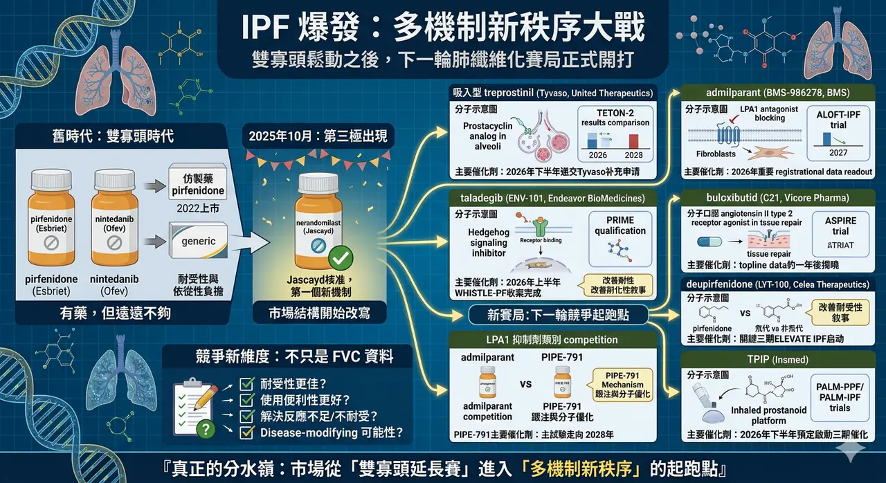
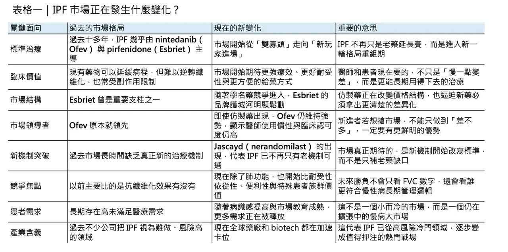
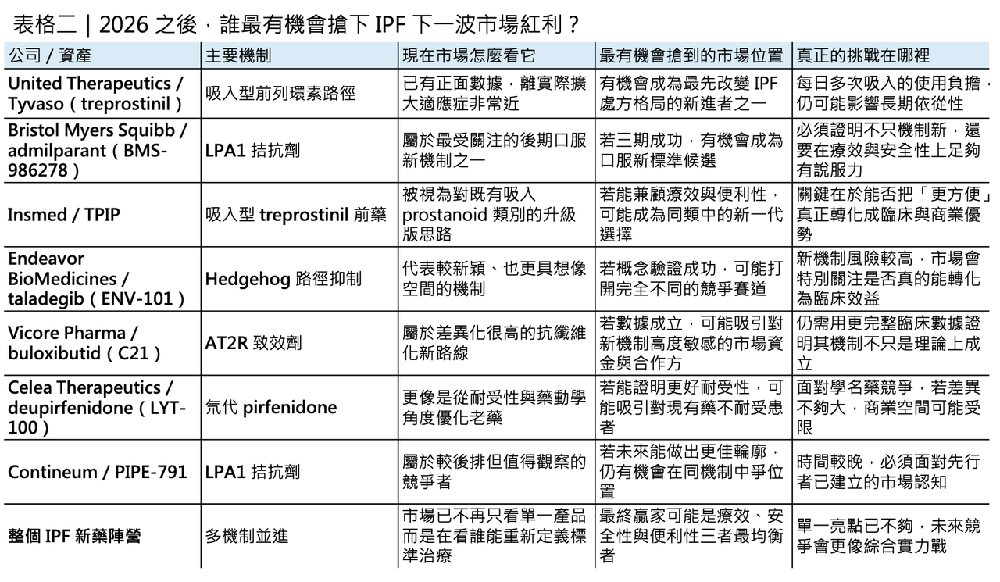

# 特發性肺纖維化 迎來爆發

## IPF 真的要熱起來了：雙寡頭鬆動之後，下一輪肺纖維化大戰已經開打
## 雙寡頭鬆動的起點
特發性肺纖維化，idiopathic pulmonary fibrosis（IPF），從來都不是一個容易講出樂觀故事的領域。這是一種慢性、進行性、不可逆的纖維化肺病，預後差、死亡風險高，過去長年幾乎等同於「只能拖慢，不能扭轉」。現行治療雖然已有 nintedanib（Ofev） 與 pirfenidone（Esbriet） 兩個抗纖維化標準藥物，但兩者本質上都更像是「延緩惡化」而不是真正改寫病程；而且不論是 nintedanib 常見的腹瀉、噁心、嘔吐與肝功能異常，還是 pirfenidone 常見的噁心、皮疹、腹痛、腹瀉與光敏感，都讓耐受性與長期依從性成為臨床現場始終無法迴避的問題。這也是為什麼，儘管肺纖維化在美國約影響 10 萬人、IPF 在全球的整體盛行率並不低，而更廣義的進行性纖維化間質性肺病人群又遠大於 IPF 本身，這個領域至今仍被視為典型的「有藥，但遠遠不夠」的未滿足需求市場。
如果把時間拉長來看，IPF 市場真正的分水嶺其實已經出現。過去十多年，市場基本上由 Ofev 與 Esbriet 兩個品牌主導；但 2022 年起，美國首批 generic pirfenidone 上市，Esbriet 的品牌護城河開始被快速侵蝕。相對之下，Ofev 不只守住了地位，2025 年銷售還進一步成長到 38.25 億歐元，顯示它在醫師採用、患者黏著度與跨適應症延伸上仍然非常強勢。只是，真正改寫市場結構的，不是仿製藥，而是 2025 年 10 月美國 FDA 核准 Jascayd（nerandomilast），讓 IPF 在超過十年後終於迎來第一個新的治療機制與新的品牌藥選項。這意味著，IPF 已正式從「雙寡頭時代」跨入「第三極出現」的新階段，後面的競爭邏輯也會跟著改寫。
也因為 nerandomilast 已經先破局，2026 年的意義不再只是「有沒有新藥會成功」，而是誰能成為下一波真正改變排序的競爭者。
## 2026 年第一梯隊：最接近商業化拐點的玩家

眼下最接近實際商業化拐點的，是 United Therapeutics 的吸入型 treprostinil（Tyvaso）。公司已在 2025 年先公布 TETON-2 成功：52 週時，Tyvaso 組的 FVC 變化中位數為 -49.9 mL，顯著優於 placebo 的 -136.4 mL，同時把臨床惡化事件風險降低 29%。United Therapeutics 也已明確表示，若正在進行中的 TETON-1 讀出順利，將於 2026 年下半年遞交補充申請，把 IPF 納入標示。換句話說，2026 年最需要盯的第一個大事件，不是某個遙遠概念，而是 吸入型 treprostinil 能不能真的從「有潛力的 add-on」變成實際可核准的 IPF 新選項。
第二個不能忽視的名字，是 Bristol Myers Squibb 的 admilparant（BMS-986278）。這是一個口服 LPA1 antagonist，而 LPA1 長期被視為肺纖維化中與纖維母細胞活化、遷移與膠原沉積密切相關的上游路徑。過去一代同類機制曾因安全性與藥物性質卡關，但 admilparant 作為第二代分子，已在二期研究中顯示出放慢肺功能下降的訊號，且目前 ALOFT-IPF 三期正在全球超過 30 國、400 多個據點進行，BMS 自己也在 2026 年 JPM 大會把這項資產列為當年重要 registrational data readout 之一。這讓 admilparant 很可能成為 2026 年下半年另一個改變 IPF 市場預期的關鍵節點。
## 第二梯隊：下一輪賽局參與者已經排隊進場

如果說 Tyvaso 與 admilparant 代表的是最接近結果揭曉的第一梯隊，那麼再往後看，IPF 還有一群更像「下一輪賽局參與者」的資產正在排隊。
Endeavor BioMedicines 的 taladegib（ENV-101） 是其中最有辨識度的一個。它鎖定的是 Hedgehog signaling，這條路徑過去在纖維化領域一直有生物學吸引力，但真正能否被轉譯為臨床可成立的 IPF 機制，始終缺少夠強的後期驗證。Taladegib 目前已進入 WHISTLE-PF 二期後段研究，並拿到歐洲 EMA 的 PRIME 資格；公司指引顯示，該試驗預計在 2026 年上半年完成收案。這代表它未必是 2026 年就讀出完整答案的案子，但很可能在未來一年內開始決定市場到底要不要把 Hedgehog 抑制視為真正可投資的肺纖維化新機制。
另一條被市場高度關注的路徑，是 Vicore Pharma 的 buloxibutid（C21）。它是一個口服 angiotensin II type 2 receptor agonist，企圖利用 AT2R 的抗纖維化、抗發炎與組織修復訊號，去切入 IPF 這個傳統上較少從 renin–angiotensin system 角度處理的疾病。Vicore 的 ASPIRE 二期後段試驗目前已擴充樣本數，並維持在 2026 年上半年完成收案的目標；公司同時表示，topline data 約在一年後揭曉。也就是說，buloxibutid 不一定是 2026 年最早出數據的資產，但它屬於那種一旦成功，就可能因機制差異而迅速放大估值彈性的案子。
如果把「改善耐受性」也視為一條值得下注的路，Celea Therapeutics 的 deupirfenidone（LYT-100） 就很難被忽略。它本質上是 pirfenidone 的氘代版本，目標不是從零創造全新機制，而是在保留抗纖維化效果的同時，透過藥物動力學優化去減少現有 pirfenidone 的 tolerability burden。根據 PureTech 與 Celea 在 2025 年底到 2026 年初的更新，deupirfenidone 的 ELEVATE IPF 二期資料支持其進入關鍵三期，且 SURPASS-IPF 預計於 2026 年上半年啟動，採 head-to-head 方式直接對比 pirfenidone。這類資產的商業吸引力很直接：如果它不能把療效做得明顯更強，至少得把耐受性做得明顯更好，否則在 generics 已經出現的時代，很難單靠「改良版老藥」拿到足夠高的市場溢價。

## 更後排的觀察名單：第二波卡位戰也已經開始
再往更後排看，Contineum 的 PIPE-791 與 Insmed 的 TPIP（treprostinil palmitil inhalation powder），則比較像 2026 年之後的第二波觀察名單。
PIPE-791 同樣鎖定 LPA1，但目前還在全球二期起步階段，公司預估主試驗會走到 2028 年才完成，因此它更像是對 admilparant 的機制跟注與分子優化競爭。
至於 TPIP，Insmed 現在已把它從 PAH 與 PH-ILD 延伸成更大的肺部疾病平台，投資人簡報中甚至把 PALM-PPF 與 PALM-IPF 都列為 2026 年下半年預定啟動的三期催化。也就是說，吸入型 prostanoid 類別的故事不只停在 Tyvaso，而是整個類別都可能從肺血管疾病一路往肺纖維化拓張；真正的問題，將不再只是「這類藥有沒有效」，而是「誰能把 daily burden、裝置體驗與抗纖維化敘事結合得更完整」。
## 真正要開打的，不只是數據，而是新標準治療的位置
所以，IPF 接下來真正會爆發的，不只是新聞流量，而是治療標準的重寫速度。過去十多年，IPF 的競爭重點相對單純：誰能在 nintedanib 與 pirfenidone 之外，再多提供一點緩衰退的價值。現在則完全不同。
當 nerandomilast 已經先打破僵局，接下來的參賽者若想真正搶到市場，不只要在 FVC decline 或臨床惡化風險上拿出更強數據，還得回答幾個更現實的問題：
✦ 能不能讓患者更願意長期用藥？
✦ 能不能在副作用與便利性上明顯優於現有藥？
✦ 能不能對既有藥反應不足、不耐受或病程更快的患者提供新選擇？
✦ 又或者，能不能證明自己不是 another anti-fibrotic add-on，而是真正有機會往 disease-modifying 方向再推一步？
從目前臨床設計與市場位置來看，2026 到 2027 年將不是單一藥物的 readout 年，而是整個 IPF 賽道從「雙寡頭延長賽」進入「多機制新秩序」的起跑點。
------------
參考資料：
[0]:各公司官網＆公開資料
[1]:
Youtube
Idiopathic pulmonary fibrosis (IPF) is a progressive lung disorder characterized by scarring of the lungs from an unknown cause. The condition has a poor long-term prognosis. Classical features of IPF include the gradual onset of shortness of breath, prog
www.ncbi.nlm.nih.gov
[2]:
Sandoz launches first generic pirfenidone in US | Sandoz US
Pirfenidone is used to treat idiopathic pulmonary fibrosis (IPF),1 a progressive disease that causes irreversible lung scarring and makes it difficult to breathe2 Approximately 140,000 Americans live with IPF, a rare disease with no cure, and 50,000 new c
www.sandoz.com
[3]:
United Therapeutics Corporation Announces Full Results of TETON-2 Phase 3 Clinical Trial Published in The New England Journal of Medicine – United Therapeutics Investor Relations
The actual press release articles
ir.unither.com
[4]:
www.bms.com
https://www.bms.com/assets/bms/us/en-us/pdf/investor-info/doc_presentations/2026/BMS-JPM-2026-Presentation.pdf?utm_source=chatgpt.com
www.bms.com
"BMS-JPM-2026-Presentation.pdf"
[5]:
Endeavor BioMedicines Receives Priority Medicines (PRIME) Designation from the European Medicines Agency for Taladegib (ENV-101) for the Treatment of Idiopathic Pulmonary Fibrosis | Endeavor BioMedicines
https://endeavorbiomedicines.com/endeavor-biomedicines-receives-priority-medicines-prime-designation-from-the-european-medicines-agency-for-taladegib-env-101-for-the-treatment-of-idiopathic-pulmonary-fibrosis/
endeavorbiomedicines.com

---

本文僅供產業研究與知識分享，不構成投資、醫療、募資或個股建議。
