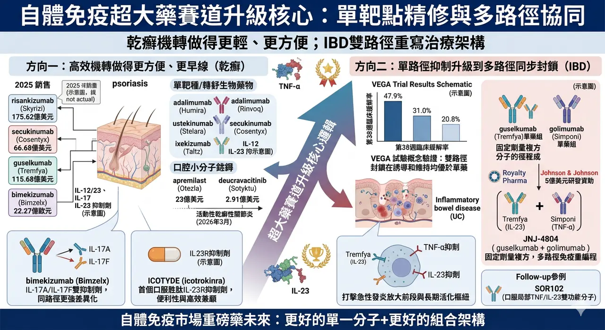
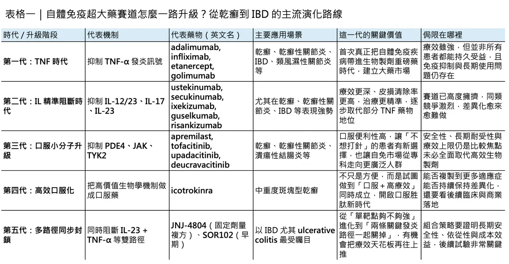
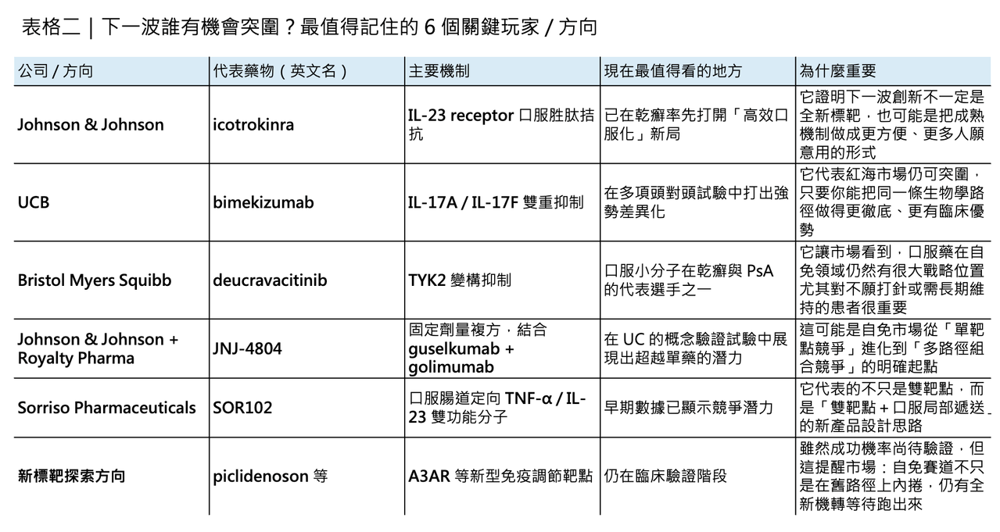

# 投資人請注意，自體免疫超大藥賽道

## 自體免疫超大藥賽道全面升級：從乾癬紅海到 IBD 雙路徑革命
自體免疫藥物市場，從來都不是「穩定但無聊」的成熟市場。恰恰相反，它一直是全球最容易長出重磅藥物的沃土之一，而乾癬（psoriasis），正是這條價值鏈裡最具代表性的試驗場。光看 2025 年幾個關鍵產品的銷售表現，就足以感受到這條賽道的厚度：risankizumab（Skyrizi） 年銷售已達 175.62 億美元，upadacitinib（Rinvoq） 達 83.04 億美元，secukinumab（Cosentyx） 為 66.68 億美元，apremilast（Otezla） 為 23 億美元，bimekizumab（Bimzelx） 也已衝到 22.27 億歐元；即使仍處於放量初期的 deucravacitinib（Sotyktu），2025 年也已做到 2.91 億美元。這不是一個已經飽和、只剩價格競爭的市場，而是一個仍在持續升級、持續長出新機會的市場。
## 乾癬這條線，本來就是一部治療升級史

如果把乾癬藥物的發展史拉長來看，它本質上是一部「治療機轉不斷更新、臨床標準不斷上修」的產業進化史。從早期的 TNF-α inhibitors（腫瘤壞死因子α抑制劑），到後來的 IL-12/23、IL-17、IL-23 生物製劑，再到 PDE4、TYK2 等口服小分子，乾癬治療一路從「能不能壓住發炎」走向「能不能更深度清除病灶、更快起效、更方便長期使用」。這也是為什麼，乾癬雖然表面上已是一片紅海，實際上卻仍持續吸引大藥廠與新創公司投入：因為這條賽道真正競爭的，早已不是單純拿下一個標靶，而是誰能重新定義治療標準。

早期最具代表性的，是 adalimumab（Humira）、infliximab（Remicade）、etanercept（Enbrel） 這類 TNF 抑制劑，它們把乾癬正式拉進生物製劑時代；之後，ustekinumab（Stelara） 把 IL-12/23 軸帶進市場，接著 secukinumab（Cosentyx）、ixekizumab（Taltz） 與 guselkumab（Tremfya）、risankizumab（Skyrizi） 等 IL-17、IL-23 路線陸續把療效與皮損清除率往上推。到口服時代，apremilast（Otezla） 率先證明了小分子在乾癬並非沒有位置，而 deucravacitinib（Sotyktu） 則用 TYK2 這個更精緻的切點，把口服標靶藥重新拉回競爭核心。值得注意的是，FDA 已在 2026 年 3 月將 deucravacitinib（Sotyktu） 的適應症擴大到活動性乾癬性關節炎，這顯示 TYK2 這條線仍在向更大自體免疫場景延伸。
## 第一個升級方向：把高效機轉做得更方便、更早線

但真正值得注意的是，這條賽道現在已經不只是在做「同機轉內部迭代」，而是在進入兩個更高階的升級方向。

第一個方向，是把高效生物學訊號做得更方便、更早線、更貼近一般病人使用情境；第二個方向，則是從單一路徑抑制，升級到多路徑同步封鎖。而這兩件事，剛好分別體現在 icotrokinra（ICOTYDE） 與 JNJ-4804 身上。

先看第一個方向。2026 年 3 月 18 日，Johnson & Johnson 的 icotrokinra（ICOTYDE） 獲 FDA 核准用於中重度斑塊型乾癬，成為首個也是目前唯一一個靶向 IL-23 receptor 的口服胜肽。這件事的意義非常大，因為它不是再做一顆「口服版 me-too」，而是直接把原本屬於生物製劑世代的高價值機轉，做成更接近小分子便利性的治療形式。

更關鍵的是，Johnson & Johnson 在 2025 年公布的頭對頭 Phase 3 結果顯示，icotrokinra（ICOTYDE） 在第 16 與第 24 週的皮膚清除表現優於 deucravacitinib（Sotyktu），而且在一年資料裡仍維持良好耐受性。也就是說，口服化不再只是「方便但療效退一步」，而是開始挑戰「方便與高療效能否同時成立」。
## 第二個升級案例：不是新標靶，而是更強的同路徑差異化

這條升級路線並不是 Johnson & Johnson 獨有。bimekizumab（Bimzelx） 就是另一個很有代表性的例子。這款由 UCB 推進的 IL-17A/IL-17F 雙抑制劑，不是靠完全陌生的新標靶突圍，而是在已經相當擁擠的 IL-17 賽道上，透過雙重封鎖機制拉開差距。UCB 已公開表示，bimekizumab（Bimzelx） 在多項乾癬頭對頭研究中，對 secukinumab（Cosentyx）、ustekinumab（Stelara）、adalimumab（Humira） 都曾展現出優勢；而從商業結果來看，Bimzelx 在 2025 年的淨銷售已達 22.27 億歐元。

這說明了乾癬市場的一個殘酷但真實的邏輯：紅海不是不能做，而是你必須拿出足夠清晰的臨床差異化。
## 第二個真正的大升級：IBD 進入雙路徑時代
如果說 icotrokinra（ICOTYDE） 代表的是「把成熟機轉做得更輕、更方便」，那麼第二個方向——也就是 JNJ-4804——代表的，就是自體免疫賽道接下來可能更劇烈的一次升級：雙路徑同步封鎖。

2026 年 3 月 30 日，Royalty Pharma 與 Johnson & Johnson 達成總額 5 億美元的研發共同資助協議，支持 JNJ-4804 在慢性免疫介導疾病中的開發。這個產品本身並不是雙特異性抗體，而是一個固定劑量複方，由兩個已上市抗體組成：guselkumab（Tremfya） 與 golimumab（Simponi）。前者主打 IL-23，後者主打 TNF-α。Johnson & Johnson 願意把這個組合再往前推，Royalty Pharma 願意拿真金白銀共同下注，本身就說明了一件事：大型資本已經不再只押單靶點，而是開始押注「多路徑協同」能否成為下一波自體免疫重磅藥邏輯。
## VEGA 試驗真正證明了什麼？
為什麼這件事重要？因為 JNJ-4804 所驗證的，不只是某一個產品，而是一種治療哲學：在像 ulcerative colitis（UC，潰瘍性結腸炎） 這樣機制複雜、病人異質性高的疾病裡，單一路徑封鎖未必永遠足夠。

VEGA 這項隨機、雙盲、概念驗證型 Phase 2a 研究已經給出非常清楚的訊號：在 12 週誘導期，guselkumab（Tremfya） + golimumab（Simponi） 的組合，在臨床反應、臨床緩解與內視鏡改善等多項指標上，都優於任一單藥；而到了第 38 週，先以雙藥誘導、後以 guselkumab（Tremfya） 單藥維持的策略，臨床緩解率仍高於單藥組。Johnson & Johnson 當時公布的數字甚至很直白：第 38 週臨床緩解率，組合誘導組為 47.9%，相較於 guselkumab（Tremfya） 單藥組的 31.0% 與 golimumab（Simponi） 單藥組的 20.8%。更重要的是，安全性沒有因為雙路徑封鎖而被明顯犧牲。

這背後其實隱含了一個非常值得投資人與產業觀察者注意的邏輯。TNF-α 比較像急性發炎放大的前段驅動，IL-23 則更接近維持 Th17 軸長期活化的樞紐。把兩條通路一起壓住，本質上就是同時打急性與慢性兩個層面的發炎程式。VEGA 所證明的，某種程度上不是「兩顆藥一起打比較猛」這麼簡單，而是多路徑免疫重編程這件事，真的有機會把 IBD 的療效天花板再往上推一層。
## 這不只是 JNJ 的故事，整個產業都開始跟進
也正因為如此，JNJ-4804 的意義，很可能不只是一個產品的峰值銷售，而是整個 IBD 開發邏輯的拐點。過去幾年，市場對 TL1A、FcRn、JAK1 等新機轉之所以高度興奮，本質上都是因為 IBD 仍缺乏「療效夠強、安全性夠好、依從性夠高」的完美答案。如今 JNJ-4804 用現成的兩顆成熟資產做出了「1+1>2」的概念驗證，下一步自然會帶動更多公司思考：是不是還有其他已被驗證的通路，值得用更聰明的方式組合起來？

而這股熱潮，其實已經開始外溢到更早期的公司。最值得注意的例子之一，是 Sorriso Pharmaceuticals 的 SOR102。這是一款口服、局部腸道遞送的雙功能抗體樣分子，同時抑制 TNF-α 與 IL-23。它不是把兩顆注射抗體硬湊在一起，而是從一開始就把「雙靶點」與「口服腸道定向遞送」整合進一個新分子設計裡。

根據公司在 2024 年底與 2025 年學術會議上公布的資料，在 22 位 UC 病人的 1b 期試驗中，高劑量組的 Mayo response 為 56%，對照安慰劑組的 17%；症狀緩解率則為 56% 對 0%。同時，治療相關不良事件的整體比例並未高於安慰劑。這當然還只是早期數據，但它非常清楚地說明了：IL-23 + TNF 不只是 JNJ 可以玩的組合，這條邏輯已經開始被更小、更靈活的 biotech 拿去做下一代產品化。
## 自體免疫超大藥賽道，真的進入了新週期
自體免疫超大藥賽道，正在從「單一標靶精修」走向「多路徑協同升級」。

乾癬這條線，已經把單靶點競爭推到非常成熟的階段。從 TNF 到 IL-17/23，再到 PDE4 與 TYK2，市場已經證明，只要你能在療效、安全性、便利性三者中重新排出更好的組合，就還有機會在紅海裡殺出血路。icotrokinra（ICOTYDE） 與 bimekizumab（Bimzelx），就是這條邏輯在 2026 年最清楚的兩個案例。

而 IBD 這條線，現在則可能正走向下一個更大的升級週期。JNJ-4804 的出現，讓市場第一次比較具體地看到：成熟生物製劑的下一波進化，不一定是再換一個全新靶點，也可能是把已知有效的通路重新組合，用新的給藥結構、新的依從性設計與新的臨床策略，做出更高一層的療效。若這條路走得通，那麼未來自體免疫市場的重磅藥，不只會從「更好的單一分子」裡長出來，也會從「更好的組合架構」裡長出來。

當然，這不代表新標靶探索就此失去意義。像 piclidenoson 這類口服 A3AR agonist，目前仍在乾癬推進關鍵性 Phase 3，說明小分子新機制依然在找自己的位置。只是站在 2026 年這個時間點回頭看，真正值得注意的已經不是「市場還有沒有空間」，而是空間將優先留給哪一種創新。

答案愈來愈清楚：不是單純更換靶點名稱，而是能同時做到機轉升級、臨床效率升級、依從性升級與商業模型升級的產品。
## 寫在最後
自體免疫賽道的下一個百億美元分子，未必會長得像上一代那樣直線明確。它可能是一顆更方便的口服胜肽，也可能是一個把兩條成熟通路重新編排的複方，更可能是一種把已知生物學與新製劑技術結合後，重新定義治療順序的產品。

乾癬已經把第一波標準立起來，現在，IBD 很可能正在把第二波標準寫出來。

而下一個真正的大贏家，會屬於那些不只會做藥，還會重寫治療架構的公司。
--------------
想看更多進階內容請到方格子：

三張圖，看懂醫藥併購：誰在掃貨、怎麼成交、買了就一定賺嗎？

如果說 2025 年下半年是醫藥併購重新升溫的預備期，那麼 2026 年開年，市場幾乎已經把訊號說得很直白了：大藥廠又開始用真金白銀補管線、搶平台、卡未來。 不是嘴上看好，而是真的下場。光是 2026 年 1 月到 3 月下旬，幾筆已公開的大型交易加總，就已逼近 200 億美元：Gilead 以最高

vocus.cc
--------------
參考資料：

[0]: 各公司官網＆公開資料

[1]:

AbbVie Reports Full-Year and Fourth-Quarter 2025 Financial Results - Feb 4, 2026

Reports Full-Year Diluted EPS of $2.36 on a GAAP Basis, a Decrease of 1.3 Percent; Adjusted Diluted EPS of $10.00, a Decrease of 1.2 Percent; These Results Include an Unfavorable Impact of $2.76...

news.abbvie.com

[2]:

Lock

Psoriasis is a debilitating inflammatory condition that affects physiological and psychological states of millions around the world. Conventional biologic and nonbiologic therapies are fraught with profound adverse side effect profiles, frequent ...

pmc.ncbi.nlm.nih.gov

[3]:

Bristol Myers Squibb - U.S. Food and Drug Administration Approves Sotyktu™ (deucravacitinib), Oral Treatment for Adults with Moderate-to-Severe Plaque Psoriasis

Bristol Myers Squibb’s Sotyktu, a first-in-class, oral, selective, allosteric tyrosine kinase 2 (TYK2) inhibitor, is the only approved TYK2 inhibitor worldwide and the first innovation in oral treatment for moderate-to-severe plaque psoriasis in nearly 10

news.bms.com

[4]:

FDA approval of ICOTYDE™ (icotrokinra) ushers in new era for first-line systemic treatment of plaque psoriasis with a targeted oral peptide

Johnson & Johnson introduces the first and only IL-23R targeted oral peptide that delivers complete skin clearance and favorable safety profile in a once-daily pill ICOTYDE offers an innovative new option for patients with moderate-to-severe plaque psoria

www.jnj.com

[5]:

www.ucb.com

https://www.ucb.com/sites/default/files/press_files/80f57daf1260cff4.pdf

www.ucb.com

---

本文僅供產業研究與知識分享，不構成投資、醫療、募資或個股建議。
