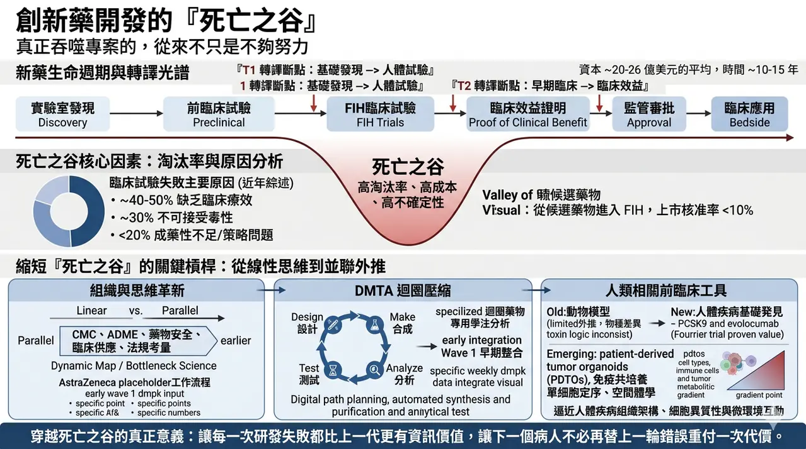
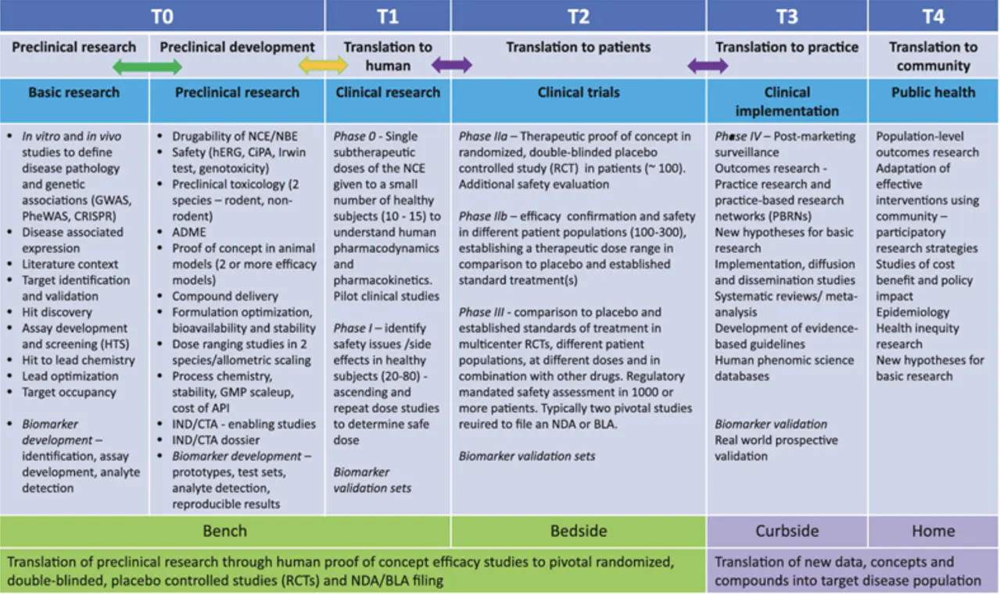
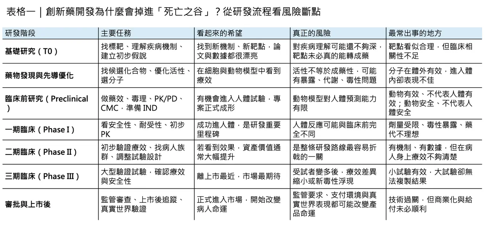
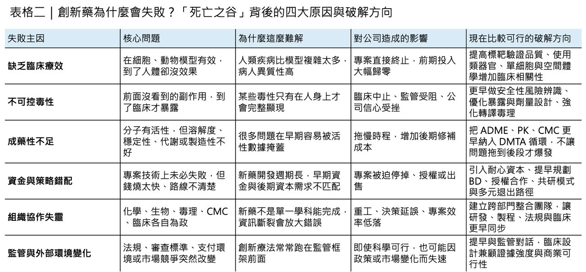

# 創新藥開發的「死亡之谷」

## 真正吞噬專案的，從來不只是不夠努力
創新藥研發最殘酷的地方，不在於它難，而在於你往往在一開始就知道，它極可能失敗，卻還是必須投入多年時間、巨額資本，以及一整個團隊的職業生涯去把它往前推。
所謂「死亡之谷（Valley of Death）」之所以在生技醫藥圈反覆被提起，正是因為它不是一句危言聳聽的行話，而是整個產業最真實的結構性命題：從一個在實驗室裡看起來很有希望的發現，到真正成為能改變病人命運的藥物，中間隔著的不是單一道門檻，而是一整片高失敗率、高成本、高不確定性的無人區。
「死亡之谷」這個比喻本來就不是生醫圈獨有的詞。它在 1990 年代美國的科技政策與創新融資討論中逐漸成形，1998 年美國國會《Unlocking Our Future: Toward a New National Science Policy》已明確用它來描述基礎研究與產業化之間那段最容易失血、也最容易失去支持的斷裂帶；到了 2008 年，Nature 以〈Crossing the valley of death〉為題討論生醫轉譯困境後，這個概念才真正進入今日大家熟悉的「從 bench 到 bedside」語境。
後來，轉譯醫學又把它進一步拆得更細：不只是一個谷，而是沿著 T1、T2、T3、T4 轉譯光譜分布的多重斷點；其中最核心、最致命的，依然是 T1 與 T2，也就是從基礎發現走到人體試驗，以及從早期臨床走到真正證明臨床效益的兩大關口。
✦【這條谷，為什麼總是這麼難過？】
如果把這條谷量化來看，它的殘酷程度其實比大多數人想像得更高。
多篇近年綜述都指出，從候選藥物進入人體試驗開始算，最終能走到核准上市的比例通常仍不到一成；若把前端臨床前淘汰也一併算進去，整體淘汰率只會更高。另一方面，把一個新藥從發現推到市場，常見估計仍落在 10 至 15 年、約 20 億至 26 億美元等級；而且這還只是平均數，並不代表每一個失敗專案都能在早期低成本地被及時止損。
更值得注意的是，2025 年 Nature Communications 的動態成功率分析也提醒大家：所謂「成功率」不是固定常數，不同疾病、不同模態、不同開發策略差異很大，但整體臨床成功率長期仍只在個位數到兩成之間波動，而 Phase II 持續是最難穿越的一段。
為什麼這條谷總是這麼難過？原因其實不神祕，但非常殘酷。
最常見的失敗理由，第一仍是缺乏臨床療效，大約占 40% 到 50%；第二是不可接受的毒性，大約 30%；再往後才是成藥性不足，例如溶解度、暴露、代謝穩定性等藥物樣特性問題，以及商業與策略因素。
換句話說，多數專案不是死於「沒有做到」，而是死於「在人體裡沒有像原本以為的那樣成立」。這也是為什麼死亡之谷從來不只是執行問題，而是預測問題。
✦【真正讓預測失靈的，是生物學本身】
而預測失靈的核心，往往就來自生物學本身。
過去藥廠與學界太習慣把動物模型當成人體的縮影，但實際上，物種差異、疾病模型失真、腫瘤微環境不完整，以及毒性機制在人與動物間的不一致，早就反覆削弱了這種假設。回頭看文獻，對動物與人體毒性一致性的評估其實並不樂觀；有些回顧甚至指出，許多跨物種預測能力只比隨機好一些。
這不是說動物實驗沒有價值，而是說它只能提供「有限且條件性的訊號」，遠遠不足以保證人體結果。也正因如此，從動物有效到人體有效，仍是死亡之谷裡最深的一段。

更麻煩的是，就算你拿到的是一個機制漂亮、遺傳學支持強的標靶，也不代表臨床價值會自動落地。
像 evolocumab（Repatha）這類針對 PCSK9 的藥物，背後的人類遺傳學與機制邏輯都相當強，但它真正站穩臨床地位，靠的仍不是機轉推理本身，而是 FOURIER 這類大型臨床結果試驗去證明它確實能降低主要心血管複合終點。
這個例子真正提醒產業的，不是「好標靶也可能失敗」，而是「從好生物學走到可支付、可複製、可被臨床社群接受的真正價值，中間永遠需要更高層級的人體證據」。
✦【死亡之谷，不只是科學問題】
所以，死亡之谷絕對不只是科學問題，它同時也是資本問題、組織問題與法規問題。
在資本面，早期風險最高時，商業資本往往最猶豫；到了後期風險相對下降，資金需求卻又陡然放大，形成典型的時間錯配。這也是為什麼美國長期用 SBIR、NCATS 這類轉譯資源去填補早期無人承接的地帶：不是因為市場不重要，而是因為很多案子在形成可投資性之前，就已經先死在缺乏橋接資金與轉譯基礎設施的階段。
在組織面，死亡之谷則常常是被「線性思維」放大的。藥物開發本來就不是化學、生物、藥理、毒理、製劑、CMC、臨床與法規各跑各的接力賽，但很多組織實際運作起來，仍像在打分段外包。
結果就是：
🌿 前端只顧 potency，後端才發現暴露不對。
🌿 先把分子做出來，後面才發現放大量產根本不可行。
🌿 等到要進 IND 或 FIH 才回頭補 developability。
近年轉譯科學之所以反覆強調「dynamic map」與「bottleneck science」，正是因為要把這種舊式串聯流程改成更早期的並聯思維，讓 CMC、ADME、藥物安全、臨床供應與法規考量更早進入候選物選擇。
✦【真正縮短死亡之谷的，不是更努力，而是更早知道自己錯在哪裡】
同樣的轉變，也發生在藥物研發最核心的 DMTA（Design–Make–Test–Analyze）迴圈上。
今天沒有人再把 DMTA 當成一條單純的化學工作流；它更像是一套用來壓縮認知錯誤與試錯成本的決策機器。像 AstraZeneca 公開的工作流程就顯示，他們把早期 DMPK Wave 1 的整合測試前移，幾乎以每週節奏把脂溶性、溶解度、蛋白結合與代謝穩定性等資訊回灌到分子設計；而近年的綜述也都把自動化合成、數位化路徑規劃、純化與即時分析，視為縮短 DMTA 週期的關鍵槓桿。
意思很簡單：死亡之谷不可能靠「更努力」被填平，它只能靠更早知道自己錯在哪裡來縮短。

✦【更人類相關的工具，正在讓這條谷慢慢變窄】
真正有機會改寫這條谷形狀的，還有一類更人類相關的前臨床工具。
過去幾年，patient-derived tumor organoids（PDTOs）、免疫共培養、單細胞定序與空間體學快速成熟，最大的意義不是「技術更炫」，而是它們讓我們第一次比較像樣地逼近了人體疾病的組織架構、細胞異質性與微環境互動。
近年的綜述已經相當一致地認為，PDTOs 在標靶驗證、藥效預測與前臨床分層上愈來愈有價值；而空間體學則進一步把細胞位置、細胞互作、代謝梯度與腫瘤生態系統拉回分析框架。若再和免疫共培養、器官晶片與多模態資料整合放在一起，轉譯研究的「人類相關性」確實正在被往前推。
這並不代表死亡之谷會消失，但至少代表未來有更多工具可以讓它變窄。
✦【法規不是最後一道關，而是一路同行的條件設定者】
法規面也一樣。
很多人把監管看成最後一道關，其實它更像一路同行的條件設定者。尤其在細胞治療、基因治療與腫瘤加速核准等領域，近年最明顯的特徵不是「放鬆」或「收緊」這麼簡單，而是證據要求與彈性機制同步演化：
🌿 一方面，FDA 近年持續要求加速核准後的 confirmatory trials 必須更及時、更有能力驗證真正臨床效益。
🌿 另一方面，對細胞與基因治療這類製造與臨床設計都高度特殊的產品，FDA 也持續透過新指引與彈性 CMC 路徑去降低不必要的制度摩擦。
這說明了一件很重要的事：死亡之谷的一部分，其實是制度與技術節奏不同步造成的。
✦【如何跨越死亡之谷？答案從來不是單一解法】
所以，今天再談「如何跨越死亡之谷」，答案早就不可能是單一解法。它不是再去找一個更會講故事的 CEO，也不是把 AI 貼到每一張簡報上，就能把問題自動解決。
真正有效的路徑，通常同時包含幾件事：
🌱 更早期、也更嚴格的人體相關標靶驗證。
🌱 把化學、DMPK、毒理、製程與臨床供應前移整合。

🌱 用更高密度的 DMTA 去縮短錯誤暴露時間。
🌱 用 PDTO、單細胞與空間體學提升前臨床外推能力。
🌱 用 bridge funding、轉譯平台、共研授權與法規科學把最危險的空窗帶補起來。
死亡之谷無法靠單點突破被征服，它只能靠整條價值鏈一起變聰明。
✦【寫在最後】
最後必須說，死亡之谷從來沒有真正消失過。它只是隨著模態改變而不斷換臉。
小分子藥曾經卡在 ADME 與 selectivity；後來 ADC 要處理 linker、payload 與耐受性；細胞治療與基因編輯又把製造、可比性、長期追蹤與病人分層問題重新推到檯面上。
也就是說，創新藥研發不會有一個徹底「沒有死亡之谷」的年代。真正的進步，只會是我們愈來愈早看見風險、愈來愈快修正模型、愈來愈少把病人的時間浪費在根本不該進人體的案子上。
從這個角度看，穿越死亡之谷的真正意義，從來不只是讓藥上市，而是讓每一次研發失敗，都比上一代更有資訊價值；讓下一個病人，不必再替上一輪錯誤重付一次代價。
--------------
參考資料：
[0]: 各公司官網＆公開資料
[1]:
Youtube
Created in 1982 through the Small Business Innovation Development Act, the Small Business Innovation Research (SBIR) is the nation’s largest innovation program. It provides competitively awarded grants to small high-technology firms with technically sound
www.ncbi.nlm.nih.gov
"Introduction - Venture Funding and the NIH SBIR Program - NCBI Bookshelf"
[2]:
Read "Materials in a New Era: Proceedings of the 1999 Solid State Sciences Committee Forum" at NAP.edu
Read chapter Keynote Address: Unlocking Our Future: The 1999 Solid State Sciences Committee Forum, entitled "Materials in a New Era," was held at the Nati...
www.nationalacademies.org
"Read \"Materials in a New Era: Proceedings of the 1999 Solid State Sciences Committee Forum\" at NAP.edu"
[3]:
Lock
Artificial intelligence (AI) can transform drug discovery and early drug development by addressing inefficiencies in traditional methods, which often face high costs, long timelines, and low success rates. In this review we provide an overview of ...
pmc.ncbi.nlm.nih.gov
"Integrating artificial intelligence in drug discovery and early drug development: a transformative approach - PMC"
[4]:
Lock
Drug optimization, which improves drug potency/specificity by structure‒activity relationship (SAR) and drug-like properties, is rigorously performed to select drug candidates for clinical trials. However, the current drug optimization may overlook ...
pmc.ncbi.nlm.nih.gov
"Structure‒tissue exposure/selectivity relationship (STR) correlates with clinical efficacy/safety - PMC"

---

本文僅供產業研究與知識分享，不構成投資、醫療、募資或個股建議。
