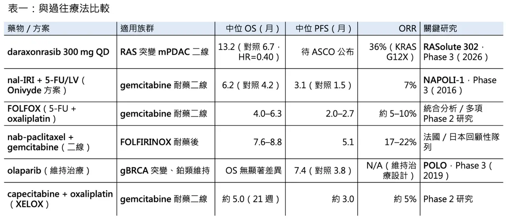
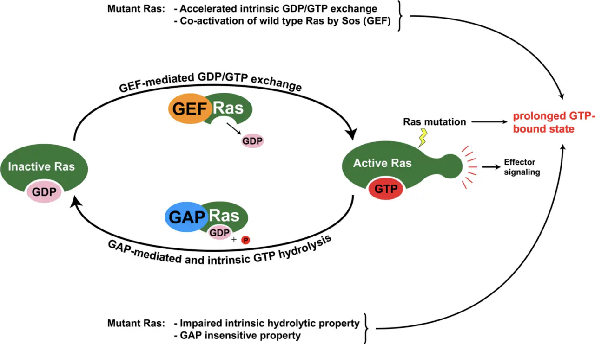
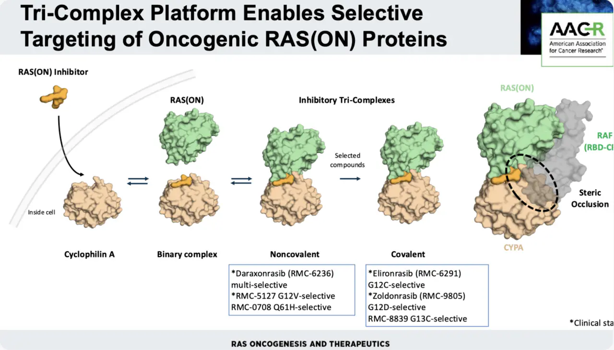
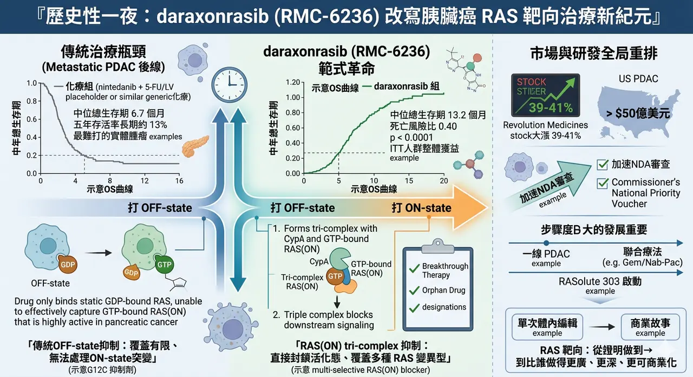

# 歷史性一刻，世紀大藥來了

## 歷史性一夜：daraxonrasib 如何把 RAS 靶向治療推進新紀元
4 月 13 日，Revolution Medicines 公布 daraxonrasib（RMC-6236） 在三期臨床 RASolute 302 的頂線結果。對於既往接受過治療的轉移性胰臟導管腺癌（metastatic PDAC）患者，這顆口服藥把整體意向治療族群的中位總生存期，從化療組的 6.7 個月 拉高到 13.2 個月，死亡風險比為 0.40，且 p < 0.0001。對一個五年存活率長期徘徊在約 13%、幾乎總是被視為「最難打」的實體腫瘤來說，這不是單純的正面數據，而是一個足以改寫臨床心理預期的時刻。
## 🔹 這組結果之所以震撼，不只是因為數字漂亮，而是因為它發生在胰臟癌

胰臟癌的殘酷，從來不只是惡性度高，而是它往往在診斷時就已經太晚，能切除的病人不多，能真正受益於後線治療的選項更少。當二線或後線治療長期只能在有限化療與少數分子分層藥物間勉強周旋時，daraxonrasib 這種把總生存幾乎拉到翻倍的結果，自然會被視為一種帶有里程碑意味的突破。Revolution 也表示，將把這批數據提交全球監管機關，並擬透過 Commissioner’s National Priority Voucher 加速 NDA 審查。

若只把這件事看成「又一顆新藥在胰臟癌成功」，其實還低估了它真正的產業意義。daraxonrasib 更像是 RAS 靶向治療第二場範式革命的象徵。第一場革命，是 KRAS G12C 抑制劑的誕生，像 sotorasib、adagrasib 讓市場第一次看見「RAS 並非永遠不可成藥」；但這些藥本質上仍依賴特定突變位點與 OFF-state 的結合邏輯，能處理的病人族群有限，對胰臟癌這種以 G12D、G12V、G12R 等非 G12C 變異為主的癌種，也始終不夠。
## 🧬 daraxonrasib 的不同，正在於它不是再做一顆更好的 G12C 抑制劑，而是試圖直接改寫整個 RAS 靶向的作用邏輯

根據已發表的藥化研究，它是一款口服、非共價、multi-selective 的 RAS(ON) tri-complex inhibitor。它不是單靠自己去抓住 RAS，而是先與細胞內的 Cyclophilin A（CypA） 形成複合體，再去辨識並結合處於活化狀態、也就是 GTP-bound 的 RAS(ON)，從而阻斷 RAS 與下游效應分子之間的訊號傳遞。從分子設計角度看，這其實是一種很像「分子膠」的思路：不是只找一個現成口袋，而是透過三元複合體重新創造高親和力介面。

這種 ON-state 抑制邏輯之所以重要，是因為它更接近腫瘤真正依賴的功能狀態。過去很多 OFF-state 抑制劑面臨的限制在於：藥物必須等到 RAS 回到 GDP-bound 靜息態才有機會有效佔位，但許多突變型 RAS 在癌細胞中大多時間都停留在活化狀態。對胰臟癌來說，這個問題尤其明顯，因為它不只是 KRAS 高度驅動，還集中在多種傳統藥物更難處理的變異型。也因此，daraxonrasib 不只是把一顆藥推進臨床，而是把「從打 OFF-state 走向打 ON-state」這件事，第一次真正推到了大樣本三期驗證層級。
## 📊 其實，在這次三期之前，市場就已經從早期資料看出它不只是概念

2025 年 ASCO GI 與相關更新資料中，接受建議二期劑量 300 mg QD 的二線胰臟癌病人，已顯示出頗具說服力的訊號：在 KRAS G12X 亞組中，中位無惡化存活期約 8.8 個月；在更廣的 RAS-mutant 人群中約 8.5 個月；客觀緩解率約 27% 到 36%，疾病控制率則高達 91% 到 95%，且伴隨早期且深度的 ctDNA RAS variant allele frequency 下降。也正因這些早期證據，FDA 先後給了 Breakthrough Therapy Designation 與 Orphan Drug Designation。

而 RASolute 302 真正讓人驚訝的，還不只是 OS 好，而是它的好超出了原本最保守的設計預期。根據公司公告，這項研究的主要終點其實鎖定在腫瘤帶有 RAS G12 突變的病人，關鍵次要終點才是整體意向治療人群（ITT）。換句話說，這原本是一個偏向保守、先求在最明確分層人群中證明價值的設計；但最後的結果卻是在整體 ITT 人群中也打出極顯著的 OS 優勢。這種情況對市場的含義很直接：daraxonrasib 的價值，可能不只停留在窄分子分層，而是有機會往更廣的胰臟癌治療場景延伸。
## 💰 資本市場的反應，也幾乎是瞬間完成重估

消息公布當天，Revolution 股價大漲約 39% 到 41%；RBC 認為，單在美國胰臟癌市場，daraxonrasib 就可能擁有超過 50 億美元 的銷售機會。對一家尚未商業化的 Biotech 而言，這種級別的反應，代表市場已不再把它看成「有潛力的研發公司」，而是在開始用真正的重磅藥預期去定價。

但也正因為結果太亮眼，現在更需要冷靜看一件事：daraxonrasib 很可能不是終點，而只是胰臟癌 RAS 靶向治療的新起點。

因為 pan-RAS(ON) 這條路本身並不完美。它的優勢是覆蓋廣、打得深，但代價也可能是安全窗要更精細管理；而且當一條機制成功證明自己有臨床價值後，接下來一定會迎來更高選擇性的迭代品、不同位點的組合打法，以及其他完全不同的旁路切入者。換句話說，daraxonrasib 的成功，不會讓競爭結束，反而會讓胰臟癌這個沉寂很久的賽道開始真正加速。
## 🚀 這種加速，其實已經開始發生
Revolution 在 2026 年 4 月初剛宣布啟動 RASolute 303，把 daraxonrasib 往一線轉移性 PDAC 推進，且同時評估單藥與聯合 gemcitabine / nab-paclitaxel 的策略。也就是說，公司並沒有把這顆藥定位成單純的二線補位資產，而是在用最短時間把它往更大市場、更早線別去擴。這才是真正值得重視的地方：當一顆藥在胰臟癌這種場景交出這樣的三期結果後，它改變的不只是二線標準，而是整個疾病治療排序的想像空間。
## ✨ 所以，這場 4 月 13 日的「歷史性一夜」，真正重要的其實有兩層
第一層，是對病人而言，胰臟癌終於不再只能在悲觀預期裡談進步，現在第一次出現了一顆把總生存直接拉到新水位的口服靶向藥。

第二層，則是對整個產業而言，daraxonrasib 幾乎等於宣告：RAS 靶向治療已經從「證明做得到」的時代，走進「比誰做得更廣、更深、更可商業化」的時代。

對胰臟癌來說，這是起點；

對 RAS 領域來說，這則是一場真正的大局重排。
----------------
參考資料：

[0]: 各公司官網＆公開資料

[1]:

"Daraxonrasib Demonstrates Unprecedented Overall Survival Benefit in Pivotal Phase 3 RASolute 302 Clinical Trial in Patients with Metastatic Pancreatic Cancer | Revolution Medicines"

[2]:

Emerging landscape of KRAS inhibitors in cancer treatment

RAS mutations drive ∼20% of human cancers. This review summarizes clinical outcomes and resistance mechanisms of KRASG12C inhibitors and highlights emerging classes of next-generation (K)RAS inhibitors, focusing on their mechanisms of action, selectivity,

www.cell.com

[3]:

www.sciencedirect.com

https://www.sciencedirect.com/org/science/article/pii/S1520480425002959

www.sciencedirect.com

[4]:

www.asco.org

https://www.asco.org/abstracts-presentations/241485

www.asco.org

[5]:

reuters.com

https://www.reuters.com/business/healthcare-pharmaceuticals/revolution-medicines-experimental-cancer-pill-helps-improve-survival-late-stage-2026-04-13/

www.reuters.com

"Revolution Medicines' experimental cancer pill boosts survival in late-stage study | Reuters"

[6]:

---

本文僅供產業研究與知識分享，不構成投資、醫療、募資或個股建議。
