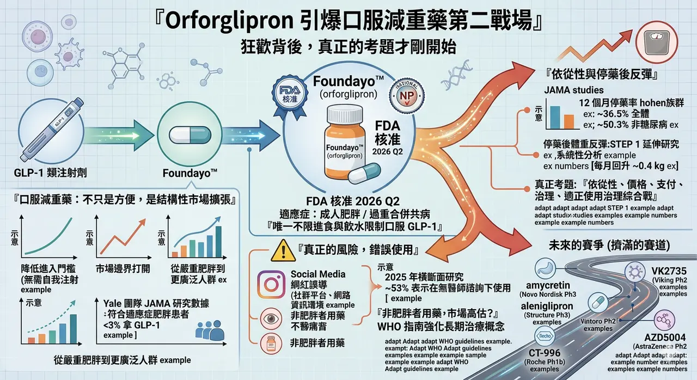
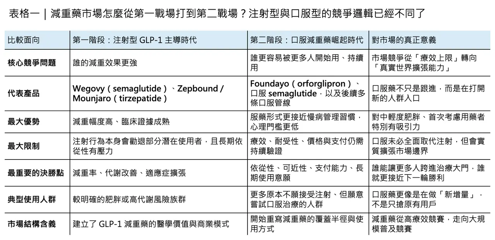
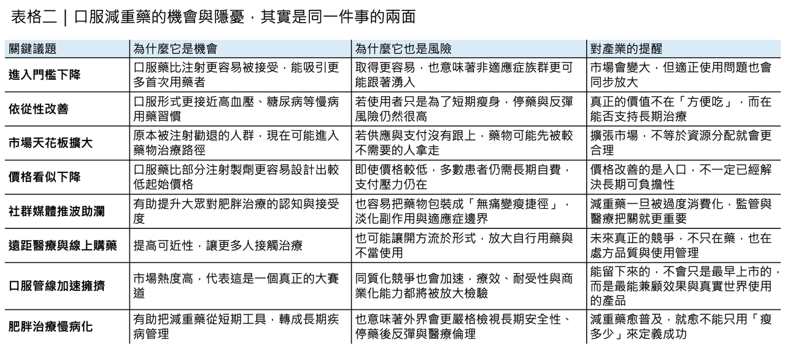

# 禮來口服藥引爆市場？

## Orforglipron 引爆口服減重藥第二戰場：狂歡背後，真正的考題才剛開始
2026 年 4 月，Eli Lilly 的 Foundayo（orforglipron） 獲 FDA 核准，用於成人肥胖，或合併體重相關共病的過重族群。這不只是另一顆減重藥上市，而是一個足以改寫產業節奏的事件：它是美國最新一輪快速審查機制下核准的新分子實體，也是目前唯一獲准用於減重、且可不受進食與飲水限制的口服 GLP-1 藥物。根據 Lilly 公布的資料，ATTAIN-1 研究中，高劑量組完成治療者平均減重約 27.3 磅（12.4%）。這意味著，減重藥市場真正的第二戰場，已經從注射劑正式延伸到口服劑型。
## 🔹 口服減重藥，不只是更方便而已

問題在於，Orforglipron 的上市，帶來的不只是「更方便的 Wegovy 替代品」這麼簡單。它把整個市場的競爭邏輯往前推了一步：過去，GLP-1 類藥物的第一階段競爭，核心是療效能不能成立；現在，這個問題基本上已經被回答。接下來真正決定市場天花板的，會變成誰更容易被開始使用、誰更容易被長期使用、誰更容易被支付體系接受。而這三件事，恰恰都是口服劑型最有可能改寫的地方。
這也是為什麼，口服減重藥不只是劑型創新，而是一場結構性市場擴張。注射型 GLP-1 藥物已經證明，對重度肥胖與高代謝風險族群，它們能提供非常強的臨床價值；但在真實世界裡，很多潛在使用者並不是因為不知道療效，而是在跨不過長期自我注射這道心理門檻。每週一針，看起來頻率不高，對很多第一次接觸減重藥的人來說，卻仍像是一道「我是病人嗎」的身份分界線。口服劑型的價值，正在於它先把這道門檻拆掉。
## 💡 市場邊界，會因為口服劑型而被直接打開

從商業邏輯來看，這會直接改變市場邊界。Lilly 在核准公告裡就說得很直白：今天真正能從 GLP-1 受益的人，遠比實際正在使用的人多。這不是單純的市場宣傳。Yale 團隊在 JAMA 研究中發現，美國真正符合適應症條件的肥胖患者裡，實際拿到 GLP-1 處方的還不到 3%。也就是說，這個市場今天最大的限制，不是需求不夠，而是進入門檻、支付能力與照護體系承接能力還遠遠沒跟上。口服藥的出現，本質上就是在替更廣泛的人群打開入口。
但也正因為入口變寬，另一個更尖銳的問題也開始浮出來：當減重藥變得愈來愈容易取得，它會不會被大規模不適宜使用？
## ⚠️ 真正的風險，不只在副作用，也在錯誤使用

這個擔憂不是空穴來風。2025 年的橫斷面研究指出，受訪的減重藥使用者中，有 53% 表示自己在沒有醫師諮詢下使用藥物；其中 32% 直接從藥局取得、15% 透過線上來源或社群平台取得。這組數字雖然不是全國性真實世界資料，但它非常清楚地揭示一個趨勢：在減重這個高度受社會審美與即時回饋驅動的領域，藥物使用很容易從「醫療決策」滑向「自我優化消費」。
日本的情況尤其值得警惕。日本本來就不是高肥胖盛行率國家，官方對肥胖症用藥也設有限制門檻；然而 2025 年針對日本提供 GLP-1 減重服務的醫療機構網站分析發現，許多網站資訊品質偏低，且常出現誇大宣稱，暗示病人不需要飲食與運動也能靠 GLP-1 輕鬆瘦身。研究者直言，這種網路資訊環境本身就可能促進 GLP-1 的不當使用。另一篇全球社會觀察文章更指出，即使日本保險給付門檻相對嚴格，仍有不少人選擇透過自費的線上診所取得 GLP-1。這說明一件事：當藥物被包裝成「更容易、更快、更無痛」的身材管理工具時，適應症邊界很容易被市場氣氛沖淡。
而且，這不只是日本的問題。全球觀察也顯示，GLP-1 類藥物的早期擴張，常常先流向那些最有支付能力、最有資訊能力、也最受身材文化影響的人群，而不是先流向臨床需求最迫切的人。研究者提到，在巴西，GLP-1 使用者主要集中於較高社經地位、以白人女性為主的族群；在丹麥，媒體與研究也開始關注，為什麼 GLP-1 使用更集中於較富裕、而肥胖率反而較低的區域。這類現象提醒我們：減重藥的擴張，不一定天然等於公共健康資源的最佳配置。
## 🧭 非肥胖者也在用藥，是否代表市場其實被高估了？
所以，非肥胖者使用減重藥，是否意味著整個減重市場其實被高估了？
我認為，答案其實剛好相反。
這種現象代表的，不是市場太小，而是市場正在以不夠理想的方式被分配。
WHO 在 2025 年底發布首份肥胖 GLP-1 用藥指南時明確指出，全球肥胖人口已超過 10 億，而即便在最樂觀的供應情境下，GLP-1 類藥物也大概只能涵蓋約 1 億人，不到現有肥胖人口的十分之一。更進一步地，WHO 還特別強調，GLP-1 可作為成人肥胖的長期治療選項，但同時必須正視成本、長期安全性、停藥後維持、醫療系統準備度與公平性問題。換句話說，今天真正的現實不是「藥太多、需求太少」，而是「藥還遠遠不夠，卻已經開始被部分不該優先的人群搶先消化」。
## 📌 口服化，會把這個矛盾推得更明顯
從這個角度看，口服減重藥其實會把這個矛盾推得更明顯。
一方面，它確實有機會把更多原本不願碰注射針的人帶進治療體系；另一方面，它也更容易被包裝成一種「日常化、去醫療化」的瘦身工具。當藥物的取得門檻下降，而社群媒體又持續放大成功案例、淡化副作用時，不當使用自然會增多。這也是為什麼，Orforglipron 上市才剛起步，FDA 就已要求 Lilly 進一步做上市後研究，追蹤肝損傷、心血管事件、胃排空延遲與哺乳暴露等問題。這不代表 Foundayo 核准有瑕疵，而是監管端很清楚：當一顆藥準備進入更大、更廣、更接近日常消費市場的人群時，安全與適正使用問題會被放大。
這一點，從 FDA 對藥廠宣傳的態度也看得很明顯。2025 年 9 月，FDA 對 Lilly 與 Novo Nordisk 都發出警告信，認定其相關宣傳內容淡化或弱化了 GLP-1 藥物的重要風險資訊，構成誤導。對 Novo 的警告甚至直接指出，影片將副作用與禁忌資訊擺在過於次要的位置，整體效果會誤導觀眾低估風險。這種監管動作傳達的訊號其實很清楚：GLP-1 類藥物可以很成功，但不能被當成一種只講「瘦多少」、不講「代價是什麼」的輕保健商品。
## ⏳ 真正更難的，其實是長期使用
同樣不能忽略的，是依從性與停藥後反彈。
WHO 在最新指南裡之所以特別強調「長期治療」，不是沒有原因。現有研究早就顯示，GLP-1 類藥物一旦停用，體重反彈非常常見。STEP 1 延伸研究曾發現，停用 semaglutide 一年後，受試者平均回升了原先減掉體重的約三分之二；更近期的系統性分析也指出，停用任何減重藥後，平均每月體重回升約 0.4 公斤。而在真實世界裡，長期使用本來就不容易。JAMA Network Open 的大樣本研究顯示，GLP-1 新使用者在 12 個月的整體停藥率為 36.5%；若是「只有肥胖、沒有糖尿病」的族群，12 個月停藥率更高達 50.3%。這說明，減重藥真正的挑戰不只是「能不能瘦」，而是「能不能持續、誰付得起、誰撐得住」。
也因為如此，口服減重藥的真正競爭，不會只是比誰先上市。
它會很快變成一場關於依從性、耐受性、價格、支付、供應與適正使用治理的綜合戰。
## 🚀 第二戰場已經開打，而且不只 Lilly 一家
Orforglipron 只是開了第一槍，後面其實已經擠滿了挑戰者。Novo Nordisk 已在 2025 年確認將口服與皮下注射版 amycretin 推進到第三期；Viking Therapeutics 的口服 VK2735 已在 2025 年 1 月啟動二期；Structure Therapeutics 的 aleniglipron 在 2026 年 3 月公布二期頂線數據後，正朝三期準備前進；Roche 手上的 CT-996 已拿出四週減重 7.3% 的早期資料；AstraZeneca 的 AZD5004 也正在做全球二期。這代表口服減重藥已不是單一產品的故事，而是一條很快會擁擠起來的新賽道。
但這場「第二戰場」和第一階段的注射劑競爭有個根本不同。
注射時代，市場主要爭的是減重幅度與代謝改善幅度；口服時代，市場更可能爭的是能不能把更多原本不會進入治療體系的人拉進來，同時不讓不適宜使用失控。前者是醫學問題，後者則是醫學、商業與社會治理同時疊加的問題。這也是為什麼，口服劑型一旦成功，不代表市場就會無限制外推；相反地，它愈成功，外界愈會追問：究竟誰該用、誰不該用、由誰來把關、什麼情況下應該停藥。
## 🌍 真正的考題，現在才剛開始
所以，Orforglipron 上市後最值得警惕的，不是減重藥會不會賣不動，而是它賣得愈快，適正使用這件事就愈不能拖。
從監管面看，處方審核、遠距醫療開方品質、風險揭露與停藥管理都會變得更重要；從臨床面看，真正成熟的減重藥策略，不可能只有開藥，還必須包含營養、運動、心理支持與長期追蹤；從市場面看，企業若只想放大需求、卻不處理誤用與錯配，最後也可能反而傷到整個類別的社會接受度。
說到底，口服減重藥的第二戰場，當然會很大，甚至很可能真的大到千億美元級別。
但真正能贏到最後的，不會只是把藥做成口服、把價格往下壓、把廣告做得更性感的公司，而是那些能同時回答四個問題的公司：藥效夠不夠、耐受性好不好、誰付錢、誰該用。
Orforglipron 讓減重藥更接近日常生活，這是好事。
但減重藥愈像日用品，醫療體系就愈要清楚劃出邊界。
畢竟，真正值得被放大的，不是「無痛變瘦」的幻想，而是把藥用在真正需要它的人身上。
---------------
參考資料：
[0]: 各公司官網＆公開資料
[1]:
FDA Approves First New Molecular Entity Under National Priority Voucher Program | FDA
The U.S. Food and Drug Administration today approved Foundayo (orforglipron) marking the fifth approval under the Commissioner's National Priority Voucher (CNPV) pilot program.
www.fda.gov
"FDA Approves First New Molecular Entity Under National Priority Voucher Program | FDA"
[2]:
"FDA approves Lilly's Foundayo™ (orforglipron), the only GLP-1 pill for weight loss that can be taken any time of day without food or water restrictions | Eli Lilly and Company"
[3]:
Patterns and predictors of self-medication behavior of weight loss medications: a cross-sectional analysis of social media influence and role of pharmacist intervention
Findings highlight a growing trend of social media-driven decisions regarding weight-loss medication use and the associated risks of unregulated online-purchases. Pharmacists play a crucial role in mitigating adverse outcomes by promoting drug safety and
pubmed.ncbi.nlm.nih.gov
"a cross-sectional analysis of social media influence and ..."
[4]:
JMIR Formative Research - Quality Assessment of Medical Institutions’ Websites Regarding Prescription Drug Misuse of Glucagon-Like Peptide-1 Receptor Agonists by Off-Label Use for Weight Loss: Website Evaluation Study
Background: Misuse of glucagon-like peptide-1 receptor agonists (GLP-1RAs) has emerged globally as individuals increasingly use these drugs for weight loss because of unrealistic and attractive body images advertised and shared on the internet. Objective:
formative.jmir.org
"JMIR Formative Research - Quality Assessment of Medical Institutions’ Websites Regarding Prescription Drug Misuse of Glucagon-Like Peptide-1 Receptor Agonists by Off-Label Use for Weight Loss: Website Evaluation Study"
[5]:
HTTP Status 404 – Not Found
https://journals.plos.org/globalpublichealth/article/file
journals.plos.org
id=10.1371%2Fjournal.pgph.0005516&type=printable "Beyond the prescription: Global observations on the social implications of GLP-1 receptor agonists for weight loss"
[6]:
WHO issues global guideline on the use of GLP-1 medicines in treating obesity
To address the growing global health challenge of obesity, which affects more than 1 billion people, WHO has released its first guideline on the use of Glucagon-Like Peptide-1 (GLP-1) therapies for treating obesity as a chronic, relapsing disease.
www.who.int
"WHO issues global guideline on the use of GLP-1 medicines in treating obesity"
[7]:
reuters.com
https://www.reuters.com/business/healthcare-pharmaceuticals/us-fda-requires-lilly-conduct-post-marketing-studies-obesity-pill-2026-04-14/
www.reuters.com
[8]:
Eli Lilly and Company - 716485 - 09/09/2025 | FDA
False & Misleading Claims/Misbranded
www.fda.gov
"Eli Lilly and Company - 716485 - 09/09/2025 | FDA"
[9]:
Novo Nordisk to advance subcutaneous and oral amycretin for
Bagsværd, Denmark, 12 June 2025 – Novo Nordisk today announced that it will advance subcutaneous and oral amycretin into phase 3 development in weight...
www.globenewswire.com
"Novo Nordisk to advance subcutaneous and oral amycretin for"

---

本文僅供產業研究與知識分享，不構成投資、醫療、募資或個股建議。
