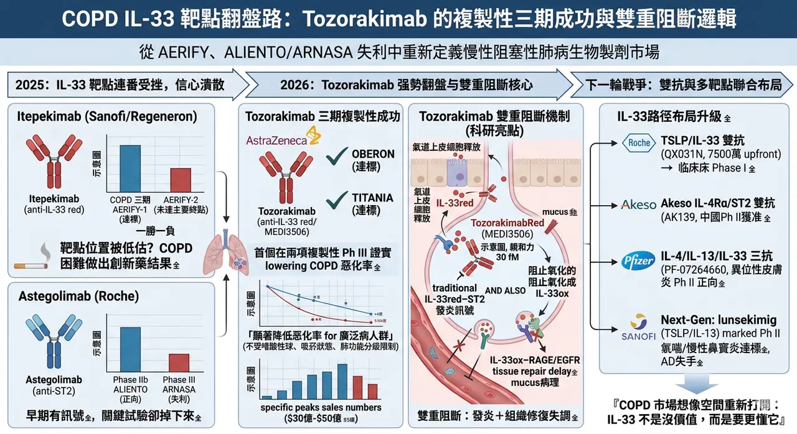
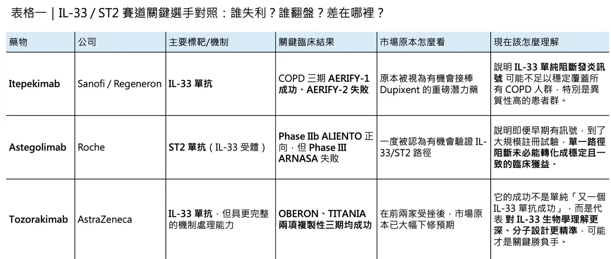
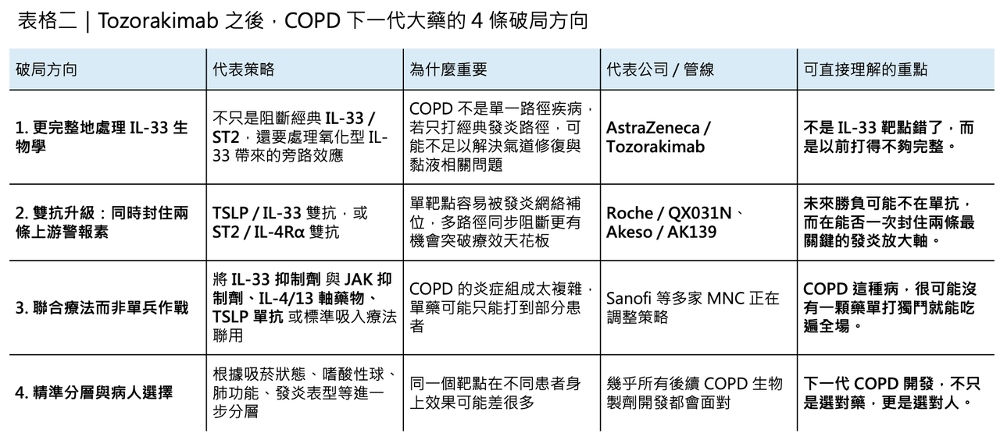

# 慢性阻塞性肺病患者又有新藥可以用了？

## 🔹 IL-33 靶點從連番受挫到強勢翻盤，Tozorakimab 為何能一戰翻身
2025 年，對 IL-33/ST2 這條曾被寄予厚望的發炎路徑而言，幾乎是一整年的信心潰散。

先是 Sanofi / Regeneron 的 itepekimab 在兩項 COPD 三期研究裡只打出「一勝一負」：AERIFY-1 達標，但 AERIFY-2 未達主要終點。接著又輪到 Roche 的 astegolimab，其關鍵開發計畫同樣呈現分裂結果：Phase IIb ALIENTO 正向，但 Phase III ARNASA 失利。當兩家跨國藥廠、兩條相近機制、接連交出這樣的成績單時，市場很自然地開始追問：是不是大家一開始就高估了 IL-33/ST2 在 COPD 的位置？

這種懷疑不是沒有道理。

慢性阻塞性肺病（COPD）本來就是最不容易做出漂亮創新藥結果的疾病之一。它不只是全球主要死因之一，還是一個病理高度異質、病人來源極雜、吸菸史與發炎表型交織在一起的複雜疾病。根據近年的全球資料，COPD 影響的人數已超過 4 億，並持續被視為全球第三大死因之一。問題不在於市場夠不夠大，而在於這個市場太大、太重、也太難打，導致每一次機制失敗，幾乎都會被放大成整條路線的信任危機。

就在這種悲觀情緒幾乎定型的時候，2026 年 3 月，AstraZeneca 公布了 tozorakimab 在兩項複製性三期研究 OBERON 與 TITANIA 的結果：兩項研究都達到主要終點，且公司直接定義它是首個在兩項複製性 Phase III 試驗中，同時證明可顯著降低 COPD 惡化率的 IL-33 生物製劑。更關鍵的是，AstraZeneca 的表述非常強勢：tozorakimab 的效益出現在不同吸菸狀態、不同嗜酸性球水準、不同肺功能分級的廣泛病人族群中。這不只是單一產品報喜，而是一次把整條 IL-33 路徑從陰影裡重新拉出來的結果。

真正有意思的是，這場翻盤不是運氣，而更像是一場藥物設計、疾病機制理解與臨床策略三者一起疊加後的結果。
## ✨ 為什麼 IL-33 一直讓人放不下

COPD 領域之所以一直對 IL-33 有興趣，原因其實很直白。

IL-33 本來就不是下游的小節點，而是受損氣道上皮細胞會釋放出的**上游警報素（alarmin）**之一。理論上，如果能在最上游把它攔住，就有機會比只處理單一發炎分支更廣泛地壓制疾病惡化。這也是為什麼大藥廠這幾年沒有因為 COPD 困難就撤退，反而一再往這個靶點下注。因為一旦這條路真正走通，它的覆蓋病人群可能不只是傳統偏 type 2 inflammation 的族群，而可能擴展到更廣泛的 COPD 亞型。

但理論歸理論，真正到了臨床，問題馬上就浮現了。

Itepekimab 的失利其實已經率先說明：COPD 不是一個只要碰到 IL-33 就自然會成功的病。2025 年 5 月，Sanofi 與 Regeneron 公布兩項三期試驗結果時，明確指出 AERIFY-1 達到主要終點，可將中度或重度急性惡化年化率降低 27%；但 AERIFY-2 沒有複製成功。公司雖然強調藥物在兩項研究中整體耐受性良好，也觀察到部分早期效益，但這樣的結果，還是足以讓市場開始懷疑：同一個靶點，為什麼一個試驗能過，另一個卻過不了？

Astegolimab 的遭遇則把這種不安再推高了一層。

它不是直接打 IL-33，而是打其受體 ST2。2025 年 7 月，Roche 公布資料時指出，Phase IIb ALIENTO 呈現正向結果，但註冊性 Phase III ARNASA 未能顯著降低惡化率。這個結果之所以特別傷，原因很簡單：當一條機制在較早期試驗看起來有訊號，到了更大規模、真正想拿註冊的研究裡卻掉下來，市場最容易得出的結論就是——這條路也許沒有想像中那麼穩。

也正是在這樣的背景下，tozorakimab 的勝利顯得格外有份量。
## 🧬 Tozorakimab 真正贏在哪裡？

如果只看表面，tozorakimab 不過也是一顆 anti-IL-33 monoclonal antibody。

但真正把它和前面幾條失利路線拉開差距的，可能不是靶點名稱，而是它對 IL-33 生物學複雜性的處理方式。2023 年發表於 Scientific Reports 的研究，把這件事講得非常清楚。

Tozorakimab（MEDI3506） 對還原態 IL-33（IL-33red） 的親和力極高，達到 30 fM 等級，且結合速度很快，足以和天然 ST2 受體競爭。更關鍵的是，這顆抗體不只攔截經典的 IL-33red–ST2 發炎訊號，還能透過先把 IL-33red 緊緊抓住，阻止它氧化成 IL-33ox。而一旦 IL-33 在 COPD 的氧化壓力環境中轉成 IL-33ox，它就不再主要走 ST2，而是改走一條 ST2 非依賴、經由 RAGE/EGFR 的訊號路徑，進一步推動上皮異常、修復遲滯與黏液相關病理變化。也就是說，tozorakimab 的優勢不只是「更強力地抗 IL-33」，而是它有機會同時處理 發炎與上皮功能失調這兩件事。

這裡面最值得玩味的，是「雙重阻斷」這件事。

過去大家談 IL-33，多半把它理解成一個典型的上游發炎驅動因子；但如果 COPD 病人的肺部其實同時存在一條由 氧化型 IL-33 推動、偏向組織異常修復與黏液病理的旁路，那麼只堵住 IL-33/ST2，可能還不夠。Tozorakimab 之所以顯得更完整，就在於它不是只攔一條路，而是從源頭把 IL-33red → IL-33ox 這個轉換也截斷。這一點，正是 AstraZeneca 自己反覆強調的差異化，也是學術論文中最有說服力的機制亮點。

這當然也帶出一個合理推論：

Itepekimab 與 astegolimab 並不一定是「靶點錯了」，更可能是它們處理這條路徑的方式還不夠全面。

這種判斷目前比較接近機制推論，而不是已被臨床完全蓋棺論定的結論；但從現有的轉譯研究來看，確實可以合理理解為：在 COPD 這種氧化壓力與上皮損傷高度交纏的疾病裡，誰能更完整地處理 IL-33 的不同活性形態，誰就更有機會把訊號轉成臨床結果。

也因此，tozorakimab 的三期成功，真正證明的可能不只是 AstraZeneca 自己的分子設計，而是整個產業過去一年最困惑的那個問題：IL-33 不是沒價值，而是這個靶點比市場原先理解得更複雜。
## 📈 這不只是翻身，而是整個賽道重新被打開
這場反轉也讓 COPD 市場的想像空間被重新打開。

Jefferies 分析師在 AstraZeneca 公布結果後即指出，這種廣泛且一致的療效表現，有可能支撐公司對 tozorakimab 年銷售高峰 30 億到 50 億美元的期待。這個數字之所以敢喊，不只是因為 COPD 病人多，而是因為現有吸入式三聯療法雖然已是標準治療，但仍有大量病人在接受吸入治療後反覆急性惡化。對這群病人來說，若真有一個不受嗜酸性球高低、吸菸狀態等條件過度限制的上游生物製劑，市場空間當然巨大。

但如果事情只停在「AstraZeneca 贏了」這一層，還是太淺。真正有意思的是，AstraZeneca 的成功，已經在逼整個賽道升級。

因為過去一年所有失敗與成功累積下來，產業現在幾乎已經形成共識：COPD 的問題不只是某一條通路太強，而是整個發炎網路太冗餘、太異質、太會補位。單一靶點即便有用，也可能很快碰到天花板。這也是為什麼下一代 IL-33 路徑布局，正在快速從單抗走向雙抗與聯合療法。
## 🚀 下一輪戰爭，已經不是單抗而已
其中最值得注意的一條線，就是 TSLP + IL-33。

兩者同屬上皮來源的警報素，且在呼吸道發炎啟動與放大中存在相互增強關係。2025 年 10 月，Roche 以 7,500 萬美元 upfront、總潛在金額高達 10.7 億美元，拿下 QX031N 的全球權利；這是一款同時靶向 TSLP 與 IL-33 的雙特異抗體。到 2026 年 3 月，QX031N 已在紐西蘭啟動 Phase I 首位受試者入組。Roche 在 astegolimab 上跌了一跤之後，馬上轉身買進一條更前瞻的雙抗管線，這個動作本身就很說明問題：它並沒有放棄 IL-33，而是換了一種打法繼續打。

除了 TSLP / IL-33，還有另一條升級方向正在成形：IL-4Rα / ST2。

2026 年 2 月，Akeso 宣布其 AK139 已獲准在中國展開多項 Phase II 研究。官方直接把它定義為臨床期、同時靶向 IL-4Rα 與 ST2 的雙抗。這類設計背後的邏輯很清楚：如果單純打 IL-33 還不足以完全壓住 COPD 或其他慢性氣道發炎，那麼把 IL-4 / IL-13 所代表的 type 2 軸一起納入，理論上就有機會處理更複雜的病人生物學。

更往前看，Pfizer 甚至已把這個思路做得更極端。

PF-07264660 是一款同時靶向 IL-4、IL-13、IL-33 的三特異抗體，目前已在異位性皮膚炎 Phase II 中拿到正向訊號。它雖然不在 COPD，但其存在本身說明一件事：大藥廠現在看待 IL-33，已不再只是把它當成單一標靶，而是把它放進更大的上游發炎網絡中一起設計。

Sanofi 自己也在修正路線。

就在 itepekimab 三期結果不如預期之後，Sanofi 並沒有停在原地，而是把更多注意力放到下一代雙抗 lunsekimig 身上。這是一款同時靶向 TSLP 與 IL-13 的雙抗，2026 年 4 月公布的 Phase II 資料顯示，它在氣喘與慢性鼻竇炎合併鼻息肉上達到主要與關鍵次要終點，但在異位性皮膚炎失手。這再次提醒一件事：就算走向雙抗，也不代表從此平步青雲。發炎疾病的異質性，從來不會因為標靶數變多就自動消失。
## 🧭 真正的結論：不是 IL-33 不行，而是你要更懂它
所以，今天再回頭看 IL-33 在 COPD 的故事，真正值得記住的，不是哪一家暫時贏了，而是這條路徑如何在一年之內完成了一次極戲劇化的再定義。

2025 年時，市場看到的是：itepekimab 一勝一負，astegolimab 早期有訊號、關鍵試驗卻失利，於是大家很自然地開始懷疑整條路值不值得繼續走。

到了 2026 年，tozorakimab 用兩項複製性三期同時成功，幾乎是用最乾脆的方式回答了這個問題：不是 IL-33 不行，而是你要更懂它。

從這個角度看，IL-33 的故事其實很像很多創新藥開發的縮影。

一開始，大家以為只要找到對的靶點，成功就只是時間問題；但真的走到臨床，才發現靶點只是起點，真正決定成敗的，是你對疾病微環境、訊號旁路、病人異質性，以及藥物本身分子設計的理解深不深。失敗從來不一定證明方向錯，有時候只是說明，你還沒把方向看得夠完整。

而現在，這條路線顯然不會在這裡停下來。

Tozorakimab 已經證明 IL-33 有機會成為下一代 COPD 生物製劑的重要座標；QX031N、AK139、PF-07264660、lunsekimig 這些下一代布局，則意味著 IL-33 的真正戲碼，可能才正要開始。未來誰能把 IL-33 和 TSLP、IL-4 / IL-13、JAK/STAT 等更大網路做出最有效的組合，誰就更有機會在這個長期缺乏真正大突破的市場裡，做出下一顆 COPD 重磅藥。

IL-33 的故事，遠還沒有結束。真正精彩的，恐怕還在後面。
-------------
參考資料：

[0]: 公開資料＆各公司官網

[1]:

Sanofi

Itepekimab met the primary endpoint in one of two COPD phase 3 studies AERIFY-1 study met its primary endpoint of a statistically significant reduction in moderate or severe exacerbations in former...

www.sanofi.com

[2]:

Shining a spotlight on COPD - raising awareness through media workshops

One factor that influences levels of public awareness on different health issues is the amount of media coverage the topic receives. COPD is rarely reported in the media and the stories of those living with this common, serious condition often remain unto

www.who.int

[3]:

www.astrazeneca.com

https://www.astrazeneca.com/media-centre/press-releases/2026/tozorakimab-met-primary-endpoint-in-oberon-titania-phase-iii-trials-in-patients-with-copd.html

www.astrazeneca.com

[4]:

[Ad hoc announcement pursuant to Art. 53 LR] Roche provides update on astegolimab in chronic obstructive pulmonary disease

The pivotal phase IIb ALIENTO study met the primary endpoint of a statistically significant reduction in the annualised exacerbation rate (AER) at 52 weeks when astegolimab was given every two...

www.roche.com

[5]:

Close banner

Interleukin (IL)-33 is a broad-acting alarmin cytokine that can drive inflammatory responses following tissue damage or infection and is a promising target for treatment of inflammatory disease. Here, we describe the identification of tozorakimab (MEDI350

www.nature.com

---

本文僅供產業研究與知識分享，不構成投資、醫療、募資或個股建議。
