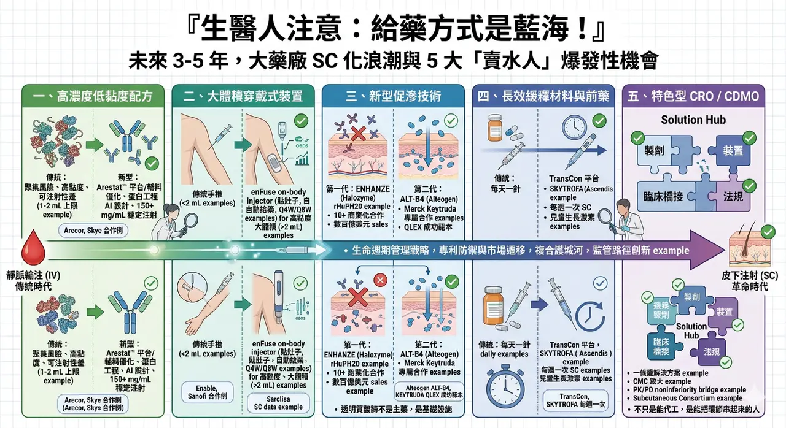
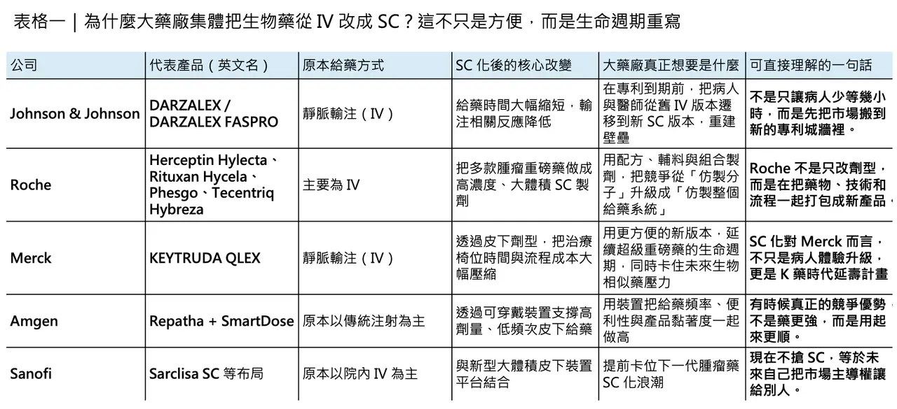
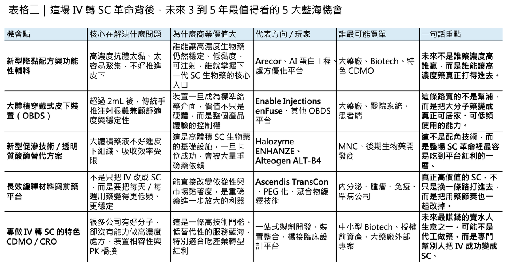

# 投資人請注意，給藥方式是藍海！

## 大藥廠為何集體把生物藥推向皮下？未來 3 到 5 年，真正的大藍海可能不在分子本身，而在給藥方式
這幾年，如果你把跨國藥廠的動作連起來看，會發現一個非常一致、幾乎帶著戰略共識的方向：把原本靠靜脈輸注（IV）的重磅生物藥，盡可能改造成皮下注射（SC）版本。

Roche 把 trastuzumab、rituximab、pertuzumab/trastuzumab，一路做到 Herceptin Hylecta、Rituxan Hycela、Phesgo；之後又把 atezolizumab 做成 Tecentriq Hybreza。Johnson & Johnson 則把 daratumumab 從 IV 推到 DARZALEX FASPRO。Merck 更進一步，在 2025 年讓 KEYTRUDA QLEX（pembrolizumab and berahyaluronidase alfa）獲 FDA 核准，並在同年拿下歐盟皮下給藥核准。這不是單點優化，而是一場明顯的產業級轉向。

表面上，這場轉向很溫和，也很容易被包裝成「以患者為中心」的醫療進步：原本要在醫院坐上幾個小時吊點滴，現在可能幾分鐘，甚至幾十秒到幾分鐘內就能完成皮下注射；病人省時間，醫護省椅位，醫療系統也省資源。這些都是真的。但如果只看到這一層，還是低估了大藥廠的真正用意。更深一層看，SC 化其實是大型藥廠面對專利懸崖與生物相似藥競爭時，最聰明、也最有殺傷力的生命週期管理戰略之一。

✦【一、表面是便利，底層其實是專利防禦與市場遷移】

當一顆生物藥走向專利到期，市場通常第一個想到的是：生物相似藥要來了。但現實是，生物相似藥開發者最容易切入的，往往是原始的 IV 劑型，因為參考產品、開發路徑與臨床使用模式都更清楚。這時候，原廠藥廠如果能在專利到期前兩三年，順利把市場主流處方從 IV 版本遷移到更新、更方便、同時擁有新配方、新裝置或新組合專利保護的 SC 版本，就等於在原本可能被快速侵蝕的市場外，再築起一道新牆。這不只是劑型更新，而是把競爭難度從「仿一顆分子」抬高到「仿一個藥、輔料、裝置與臨床體驗的組合」。

DARZALEX FASPRO 是這條路線最教科書級的案例之一。Johnson & Johnson 在關鍵的 COLUMBA 研究中證明，皮下 daratumumab 在藥動學與療效上對 IV 版本非劣，給藥時間卻可從超過 3 小時降到約 5 分鐘，而且輸注相關反應顯著更少；後續長期分析顯示，SC 版本與 IV 版本的療效與安全性持續相近，而反應事件仍較低。對病人與醫師來說，這種體驗差異一旦形成，很難再退回去接受一個耗時更長、流程更重的 IV 版本。對原廠來說，這就不只是改良，而是把市場從「分子競爭」重塑成「產品體驗競爭」。

Roche 的操作也完全是同一路數。Herceptin Hylecta 把 trastuzumab 的給藥時間壓到約 2 到 5 分鐘，對比 IV 版本常見的 30 到 90 分鐘；Rituxan Hycela 則把 rituximab 的院內給藥壓到約 5 到 7 分鐘，遠低於原本至少 1.5 小時以上的 IV 時間。更進一步的 Phesgo，甚至直接把 pertuzumab + trastuzumab 兩顆 HER2 治療抗體與透明質酸酶做成固定劑量複方 SC 製劑，維持劑量注射時間約 5 分鐘，首劑約 8 分鐘，而原本兩顆藥分開 IV 給藥則常需 60 到 150 分鐘。這不只是「更方便」，而是透過配方與流程設計，把原本兩支藥的輸注體驗濃縮成一支針，直接提升了市場鎖定力。Roche 2025 年全年財報甚至把 Phesgo 列為重要成長驅動之一。

✦【二、真正的護城河，不只是藥，而是藥、輔料、裝置一起做成組合壁壘】

SC 化之所以能成為大藥廠的兵家必爭之地，不只是因為病人喜歡，而是因為它天然適合建立藥物之外的複合護城河。

高濃度、大體積皮下給藥本身就是一個極難的工程問題：蛋白濃度一高，黏度上升、聚集風險變高、可注射性變差；而皮下空間本來就不是為一次承受大量高黏度生物製劑而設計。過去文獻常把 1 到 2 mL 視為傳統皮下注射的舒適上限，超過這個範圍，要嘛要靠促滲技術、要嘛要靠穿戴裝置，要嘛就得把分子和製劑本身重新設計。也就是說，SC 不是把 IV 裝進針筒就好，而是整個給藥系統都要重做。

這也是 Halozyme ENHANZE 之所以吃到第一波紅利的原因。Halozyme 官網顯示，截至 2026 年，ENHANZE 已支撐 10 個商業化合作產品，累積合作產品銷售達到「數百億美元」級別，而且已有超過 100 個市場、超過 100 萬名病人使用。Roche 的 Herceptin Hylecta、Rituxan Hycela、Phesgo、Tecentriq Hybreza，Johnson & Johnson 的 DARZALEX FASPRO，都屬於這條技術路線的重要成果。透明質酸酶不是主藥，但它成了把大體積、大分子藥物成功搬進皮下空間的基礎設施。這種情況下，原廠賣的就不再只是抗體，而是抗體加上專有促滲技術、臨床橋接資料與成熟製程包。

而當 SC 化再往前一步，護城河就會從「藥＋輔料」升級成「藥＋輔料＋裝置」。這在大體積穿戴式注射系統上尤其明顯。Enable Injections 的 enFuse 就是近年很典型的基礎設施型受益者。它的定位不是自己賣藥，而是提供一個可讓高黏度、大體積藥液平穩皮下給藥的穿戴平台。現在，EMPAVELI Injector 已以 enFuse 為基礎拿到美國核准，Enable 也公開表示，2026 年 1 月獲得 Sanofi 3,000 萬美元投資，用來擴充製造能力；而 Sanofi 2026 年 3 月發布 Sarclisa 皮下製劑研究資料時，也明確指出使用的正是 Enable 的 enFuse on-body injector。這說明一件事：當大藥廠推進 SC，不只是想把藥變成針，而是想把藥變成一個更難被複製的完整給藥體驗。

✦【三、真正高階的玩法，是連監管規則都一起做進產品設計裡】

大藥廠在 SC 化上的厲害之處，從來不只是技術，而是連監管路徑都一起設計。

如果把一顆已上市 IV 生物藥改成 SC，每一次都要重新做完整的長期總生存（OS）或硬終點臨床試驗，那這條路在商業上其實很難成立。也因此，近年的 SC 化真正能大量推進，不只是因為製劑技術進步，更因為產業與監管之間逐漸形成了一套更成熟的橋接邏輯：對許多已上市生物藥而言，若能以嚴謹的 PK/PD noninferiority 加上安全性、一致性與使用流程資料去證明 SC 與 IV 的可比性，就有機會走更高效率的監管路徑。這是給藥革命背後最被低估、但其實最值錢的部分。

KEYTRUDA QLEX 幾乎就是這套打法的代表作。Merck 在 MK-3475A-D77 試驗中，並沒有傻傻地等幾年的總生存，而是以 PK 非劣性為關鍵設計：皮下 pembrolizumab 合併 berahyaluronidase alfa，在 AUC 與穩態 trough concentration 上都證明對 IV KEYTRUDA 非劣，同時時間動作分析顯示，SC 給藥可把病人椅位時間、治療室使用時間與醫護操作時間大約減少近一半。2025 年 9 月，FDA 正式核准 KEYTRUDA QLEX 用於大多數已核准的成人實體瘤適應症；同年 11 月，歐盟也核准其用於所有已獲批成人適應症，並直接把它定義為歐洲首個可由醫療人員在約 1 分鐘內完成給藥的皮下免疫檢查點抑制劑。這不只是產品獲批，而是監管端正式替「IV 轉 SC」這條路打開一個極具示範效應的範本。

而且，這種規則不再只是單一公司單打獨鬥。2018 年成立的 Subcutaneous Drug Development & Delivery Consortium，本身就是一個很明確的產業訊號：SC 化已經不只是個別產品優化，而是整個產業在技術、裝置、法規科學與病人體驗上共同投入的一個前競爭合作議題。該 consortium 明確把自己的使命定義為「在前競爭環境下推進皮下藥物開發與遞送的根本進步」，而近年的產業論文也已直接點出，這類聯盟正在促進高劑量／大體積 SC 生物藥的技術與監管理解。也就是說，大藥廠不是在單獨玩一場製劑遊戲，而是在共同把這條賽道的規則往對自己有利的方向做成熟。

✦【四、真正的百億級藍海，不只在原廠藥，也在一整串「賣鏟」機會裡】

如果看懂了前面三層邏輯，就會知道這場 SC 革命真正大的機會，未必只在那幾家賣藥的大藥廠身上。

因為一旦 IV 轉 SC 成為大型生物藥的標準動作，那些幫助這個轉化成立的底層技術、裝置與開發服務，反而可能是未來 3 到 5 年最有爆發力的「賣鏟人」生意。

🔹 第一個機會，在高濃度低黏度配方。

誰能讓 150、200 甚至更高 mg/mL 的抗體製劑，仍維持可注射性、穩定性與低聚集風險，誰就握有新一代大分子 SC 化的核心鑰匙。這裡的路線不只包括新型功能性輔料，也包括更早期的蛋白工程與 AI 輔助設計：在分子設計階段就先把容易導致高黏度、疏水暴露或表面聚集的殘基處理掉，等於是在源頭就替未來的 SC 化鋪路。英國 Arecor Therapeutics 就是這條線上很值得注意的玩家，其 Arestat™ 平台主打以專有配方技術優化高濃度生物製劑與多肽製劑，並已持續拿到合作案，像 2025 年就與 Skye Bioscience 建立配方合作。這類公司最迷人的地方是，它們不一定自己賣藥，卻可能同時出現在很多大藥廠的下一代 SC 產品背後。

🔹 第二個機會，在大體積穿戴式裝置。

當 2 mL 以上的藥液開始變成常態，傳統手推注射很快就會碰到病人舒適度、醫護負擔與流速控制的上限。這時候，像 on-body delivery systems（OBDS）這種貼在肚子上、自動完成高黏度大體積給藥的裝置，就會變得愈來愈重要。Enable enFuse 已經是最有代表性的例子，但未來這個市場絕對不會只有一家。因為只要 SC 化持續往腫瘤、免疫與罕見病重磅生物藥蔓延，裝置就會從配角變成產品定義的一部分。

🔹 第三個機會，在新型促滲技術。

Halozyme 的 rHuPH20 已經證明第一波商業模式成立，但這不代表遊戲結束。真正有價值的問題是：能不能做出一套不依賴既有專利體系、更穩定、起效更快、製造更友善的新一代促滲技術？這也是為什麼韓國 Alteogen 的 ALT-B4 會變得那麼受矚目。2024 年，Alteogen 與 Merck 修訂合作協議，Merck 取得 ALT-B4 在全球用於 pembrolizumab 皮下製劑開發與商業化的專屬權利；後來 KEYTRUDA QLEX 的成功，也讓這條技術路線的價值被進一步放大。這件事的啟示很直接：第一波紅利被 Halozyme 吃掉，不代表第二波就沒有機會；只是機會不在模仿，而在繞開現有護城河。

🔹 第四個機會，在長效緩釋材料與前藥平台。

SC 革命不只是一針打快一點，有時候更大的價值在於把「每天一針」變成「每週一針」，甚至更低頻率。這條路不一定是把原本 IV 改成 SC，但它和 SC 戰略是一體的，因為本質上都是在重寫病人的給藥節奏。Ascendis Pharma 的 TransCon 平台就是一個很典型的例子。其 SKYTROFA（lonapegsomatropin-tcgd）先在 2021 年拿下兒童生長激素缺乏症核准，2025 年又擴展到成人適應症；產品核心是以可控裂解前藥設計，實現每週一次 SC 給藥，同時釋放未修飾的活性原藥。對病人來說，這是舒適度革命；對市場來說，這是高黏著度、高續方率的商業模式。

🔹 第五個機會，在專做 IV 轉 SC 的特色型 CDMO / CRO。

這其實是最容易被低估的一塊。很多中小型 Biotech 手上明明有好分子，但根本沒有能力獨立完成高濃度處方開發、裝置相容性測試、針對 SC 的 CMC 放大、以及後續 PK/PD 橋接與監管溝通。未來真正吃香的，不只是能代工的 CDMO，而是那些能把「製劑、裝置、臨床橋接、法規」做成一條龍解決方案的特色型服務商。因為當 SC 變成大藥廠與 Biotech 的共同語言，最缺的就不再是單點技術，而是能把所有環節串起來的人。這一點，從 SC consortium 的存在、高劑量大體積 SC 的共性技術挑戰，以及 Enable、Halozyme、Alteogen、Arecor 這些公司愈來愈深地嵌進藥廠價值鏈，就看得出來。

✦【五、從靜脈到皮下，看起來只是給藥路徑改變，實際上是整個生物藥產業的再定價】

所以，如果今天再問一次：為什麼 Roche、Johnson & Johnson、Merck、Sanofi 這些公司，會如此瘋狂地把重磅生物藥推向 SC？

答案其實已經很清楚了。

因為 SC 化同時滿足了四件事：

🔹它改善病人體驗，降低醫療系統負擔；

🔹它延長產品生命週期，重建對抗生物相似藥的壁壘；

🔹它把單一分子競爭升級為藥、輔料、裝置與法規能力的複合競爭；

🔹它還順手創造出一整條新的基礎設施產業鏈。

換句話說，從靜脈的冰冷點滴，到皮下的幾分鐘甚至幾十秒注射，這看起來像是一場溫柔的患者體驗革命；但在商業本質上，它其實是一場大型藥廠主導的生命週期重寫工程。

真正厲害的公司，不只是把藥變成針，而是把這支針做成一個別人很難抄、也很難追上的新產品宇宙。

而對創業公司、技術平台與服務商來說，真正的百億藍海，也許根本不在新藥分子本身，而在這場 SC 化浪潮背後那一整套還沒被完全填滿的基礎能力。

未來 3 到 5 年，誰能幫藥廠解決高黏度、促滲、裝置、長效與法規橋接這幾道題，誰就有機會成為下一波生物藥升級裡，最安靜但最賺錢的那群人。
--------
參考資料：

[0]:各公司官網＆公開資料

[1]:

FDA Approves Merck’s KEYTRUDA QLEX™ (pembrolizumab and berahyaluronidase alfa-pmph) Injection for Subcutaneous Use in Adults Across Most Solid Tumor Indications for KEYTRUDA® (pembrolizumab) - Merck.com

KEYTRUDA QLEX is the first and only subcutaneously administered immune checkpoint inhibitor that can be given by a health care provider in as little as one minute Merck (NYSE: MRK), known as MSD outside of the United States and Canada, today announced tha

www.merck.com

[2]:

Merck’s Investigational Subcutaneous Pembrolizumab With Berahyaluronidase Alfa Demonstrates Noninferior Pharmacokinetics Compared to Intravenous (IV) KEYTRUDA® (pembrolizumab) in Pivotal 3475A-D77 Trial - Merck.com

Subcutaneous pembrolizumab administered every six weeks with a median injection time of two minutes, in combination with chemotherapy, shows consistent results across reported efficacy and safety endpoints compared to IV KEYTRUDA in combination with chemo

www.merck.com

[3]:

ENHANZE Drug Delivery Technology | Halozyme

https://halozyme.com/drug-delivery-technologies/enhanze/partners.php

halozyme.com

[4]:

Phase 3 COLUMBA Study Investigating a Subcutaneous Formulation of DARZALEX® (daratumumab) Showed Non-Inferiority to Intravenous Administration in Patients with Relapsed/Refractory Multiple Myeloma

https://www.jnj.com/media-center/press-releases/phase-3-columba-study-investigating-a-subcutaneous-formulation-of-darzalex-daratumumab-showed-non-inferiority-to-intravenous-administration-in-patients-with-relapsed-refractory-multiple-myeloma

www.jnj.com

[5]:

Genentech: Press Releases | Thursday, Feb 28, 2019

Discover the latest news about our company, our products, our policies, and our people.

www.gene.com

[6]:

Lock

Subcutaneous (SC) delivery of biologics has traditionally been limited to fluid volumes of 1–2 mL, with recent increases to volumes of about 3 mL. This injection volume limitation poses challenges for high-dose biologics, as these formulations may ...

pmc.ncbi.nlm.nih.gov

[7]:

FDA Approval Received for EMPAVELI Injector | Enable Injections

Enable Injections' EMPAVELI Injector (enFuse®) receives FDA approval for subcutaneous delivery of EMPAVELI® (pegcetacoplan), enhancing at-home self-administration for PNH patients.

enableinjections.com

[8]:

Who Are We – Subcutaneous Drug Development & Delivery Consortium

https://subcutaneousconsortium.org/who-are-we/

subcutaneousconsortium.org

[9]:

arecor.com

https://arecor.com/wp-content/uploads/2025/05/2025-05-19-ARECOR-ESTABLISHES-PARTNERSHIP-WITH-SKYE-BIOSCIENCE.pdf

arecor.com

[10]:

Enable Injections | High-Volume Wearable Drug Delivery Systems

Enable Injections specializes in high-volume wearable drug delivery systems. Creators of the enFuse® On-Body Platform. Drug delivery redefined.

enableinjections.com

[11]:

알테오젠 ALTEOGEN

https://alteogen.com/en/sub/ir/news.php

alteogen.com

[12]:

---

本文僅供產業研究與知識分享，不構成投資、醫療、募資或個股建議。
