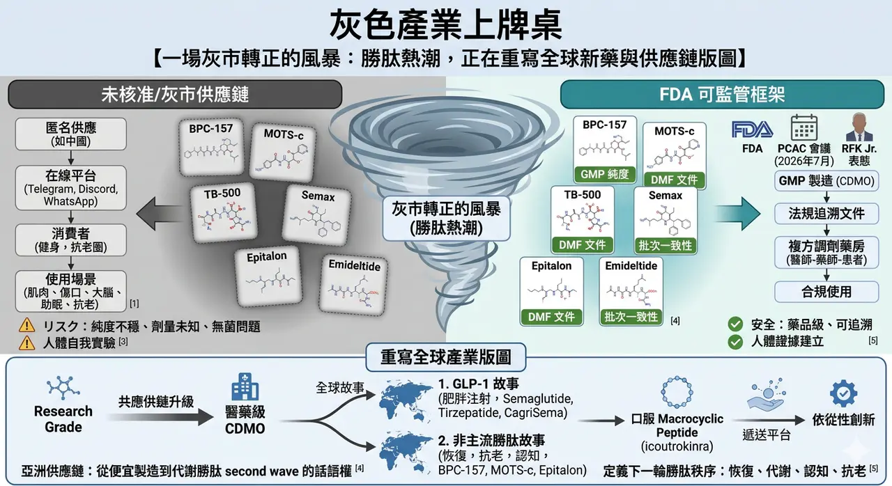
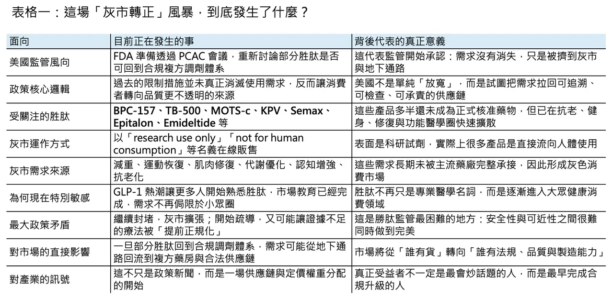
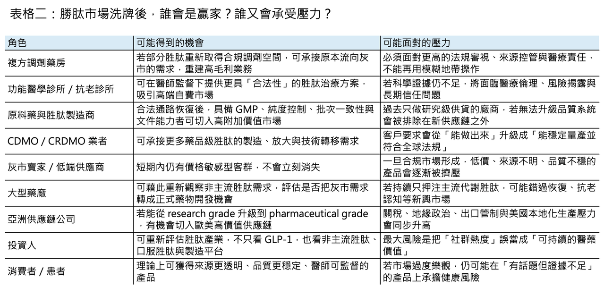

# 灰色產業上牌桌

(已編輯)
## 一場灰市轉正的風暴：胜肽熱潮，正在重寫全球新藥與供應鏈版圖
🌪️ 在一處私人莊園裡，矽谷創業者、生技極客與華爾街資金坐在同一張桌上，話題從 AI、加密貨幣一路滑向更隱密的領域：BPC-157、MOTS-c、TB-500、Semax、Epitalon。這些名字不像藥，更像暗號。它們長期遊走在「研究用」與「人體使用」之間，被健身圈、抗老圈、功能醫學診所與生物駭客社群反覆轉傳。如今，美國監管層終於不再假裝沒看見這件事。2026 年 4 月，美國 FDA 宣布將在 7 月 23 日至 24 日召開 Pharmacy Compounding Advisory Committee（PCAC）會議，討論 BPC-157、KPV、TB-500、MOTS-c、Emideltide、Semax 與 Epitalon 等胜肽（peptides），是否應納入 503A bulks list；Robert F. Kennedy Jr. 也公開表態支持讓更多胜肽（peptides）回到合規調劑體系，而不是繼續被擠在黑市與灰市之間。這不是小眾圈子的八卦，而是監管開始正面承認：需求沒有消失，只是被逼到監管看不見的地方。
## 📌 不是全面開放，而是把需求拉回可監管框架

✨ 不過，這波轉向若要說得精準，並不是一句「直接回到 Category 1」就能帶過。更正確的說法是：FDA 先把部分胜肽（peptides）從 503A nominated bulks 的 Category 2 名單移除，接著再透過 PCAC 與後續程序，評估哪些品項能真正進入合法複方調劑的框架。也就是說，這不是全面開放，更不是默認有效，而是一場把需求從失控的地下供應鏈，往可追溯、可檢查、可承責的通路拉回來的政策試探。這個差別非常重要。因為一旦進入合規通道，市場競爭的核心就不再只是「有沒有貨」，而會變成「誰能提供藥品級純度、批次一致性、文件系統與法規可追溯性」。
## ⚠️ 灰市早就長大，大到無法假裝不存在

🔍 問題是，灰市早就長大了，而且大到監管已經很難假裝它不存在。英國《金融時報》今年 1 月調查指出，約有上千家中國供應商透過即時通訊軟體、線上平台與社群渠道，把未受監管的胜肽（peptides）直接賣給西方消費者；美國與英國的媒體也陸續描繪出同一幅圖像：所謂「研究用化學品」其實大量流向真實人體使用，應用場景從減重、增肌、修復到抗老、助眠、認知強化，幾乎無所不包。胜肽熱潮之所以危險，不只是因為它紅，而是因為它同時結合了三種最難處理的力量：高需求、低門檻敘事，以及跨境匿名供應鏈。
💉 更麻煩的是，灰市賣的已不只是 BPC-157、TB-500 這類「功能型胜肽（functional peptides）」。FDA 今年 2 月已公開警告，市面上有網站把 semaglutide、tirzepatide 甚至仍在研發中的 retatrutide，標示成「for research purposes」或「not for human consumption」直接賣給消費者；澳洲 TGA 也在 4 月示警，未核准的 injectable peptides 包括 BPC-157、GHK-Cu、TB-500、retatrutide 與 CJC-1295，這些產品的無菌性、成分、劑量、純度與實際風險往往根本無法確認。表面上看起來，這是一群人在追逐新一代健康紅利；實際上，它更像是一場沒有標準答案、也沒有品質底線的人體自我實驗。
## 🧭 Kennedy 路線的爭議：堵也不是，放也不是

🧠 這也正是 Kennedy 路線最具爭議的地方。支持者認為，既然禁令並沒有消滅需求，那就應該把需求拉回受監管的複方調劑藥房與臨床系統，至少比讓消費者自己上網找 Telegram、Discord、WhatsApp 賣家來得安全；反對者則提醒，很多爆紅胜肽（peptides）離真正的臨床證據仍然很遠。以 BPC-157 為例，它在運動恢復與組織修復社群裡幾乎被神化，但截至目前，公開可驗證的人體證據依然非常薄弱；Scripps 的 Eric Topol 與多位臨床專家都明確警告，若在缺乏充分人體安全與療效數據的情況下過度放鬆管制，等於把「未被證實的療法」提前制度化。這就是今天胜肽監管真正的兩難：若繼續封堵，灰市坐大；若開始疏導，又可能讓尚未被證實的產品取得制度性背書。
## 💊 產業真正要搶的，不只是需求，而是承接需求的能力
📦 但從產業角度看，無論美國最後開得多大，方向都已經很清楚：這不再只是「有沒有需求」的問題，而是「誰能承接需求回流」。複方調劑藥房會是第一層受益者，因為一旦合規門重新打開，原本被逼到地下通路的處方需求，就有機會回流到醫師—藥師—患者三者可追溯的框架內；第二層受益者是原料與製造端，尤其是那些原本長期供應 research grade、如今有能力往 GMP、DMF、穩定性資料與批間一致性升級的供應商。下一輪競爭未必是誰喊得最大聲，而會是誰最早完成從「研究級貨源」到「醫藥級供應」的升級。灰市轉正，真正被重估的常常不是流量，而是底層製造與品質系統。
## 🌍 全球胜肽產業，正在分裂成兩條敘事
📈 如果把鏡頭再拉遠一點，就會發現全球胜肽產業其實正在分裂成兩條完全不同的敘事。第一條是大家都看得懂、也都搶著追的 GLP-1 故事：Novo Nordisk 的 semaglutide、Eli Lilly 的 tirzepatide 已經把肥胖與代謝市場變成近十年最明確的大藥題材之一；Novo 去年底已向 FDA 送件 CagriSema，Lilly 的 retatrutide 仍在後期開發中，而 Pfizer 也在中國拿下 ecnoglutide 的商業化布局。另一條則是今天才剛開始被主流注意到的「非主流胜肽（non-mainstream peptides）」故事：傷口癒合、炎症修復、認知表現、睡眠調節、抗老與體能優化。前者是已被驗證的大市場，後者則是仍在灰區翻滾、卻可能孕育下一批產品定義權的邊緣市場。真正大的轉折，往往不是出現在主航道最熱的地方，而是出現在主流體系終於被迫承認那些它原本看不上眼的需求。
## 🏭 亞洲供應鏈的角色，其實被低估了
🌏 而在這兩條敘事之間，亞洲供應鏈的角色其實被低估了。中國與印度的 semaglutide 專利在 2026 年陸續進入到期窗口後，當地仿製與類仿製競爭迅速升溫；中國已有多家企業為 semaglutide 注射劑申請上市，Novo 也提前在中國下修 Wegovy 價格以迎戰競爭。另一方面，中國公司不再只滿足於做「下一個 semaglutide」。Innovent 的 mazdutide 已成為全球首個獲批的 GCG/GLP-1 雙重受體致效劑減重藥；Hengrui 與 Kailera 推進的 HRS9531／KAI-9531，則在中國後期研究中打出接近兩成的減重數據。這代表亞洲玩家已不只是便宜製造商，而是在代謝胜肽（metabolic peptides）的 second wave 裡開始擁有部分定價權與技術話語權。只是，若研發視野仍高度集中在肥胖與糖尿病，下一個真正跨出去的勝點，可能仍不在主流 GLP-1，而在那些今天還被歸在「過早」「太灰」「證據不夠」的非主流胜肽領域。
## 🚀 下一輪創新，不一定只發生在肥胖針劑
🧪 更值得注意的是，胜肽（peptides）的下一輪創新，也未必只發生在肥胖針劑。2026 年 3 月，Johnson & Johnson 的 icotrokinra 獲 FDA 核准，成為一個標誌性事件：口服 macrocyclic peptide 不再只是平台敘事，而是開始跨進真實商業化。這背後的產業訊號很直接——胜肽（peptides）的價值正在從「能不能做成」走向「能不能做得更方便、更早使用、更多適應症」。如果說 semaglutide 時代教會市場什麼叫胜肽大藥，那 icotrokinra 類型的產品，正在教市場另一件事：胜肽不一定要待在針筒裡。這意味著未來的競爭，不只在分子本身，還在遞送、劑型、依從性，以及供應鏈能否跟上不同產品型態的工藝要求。
## 🇹🇼 台灣讀者真正該關注的是什麼？
📍 所以，這場風暴真正值得台灣讀者關注的地方，不只是「美國是不是要放寬胜肽」，而是全球產業鏈的重心正在悄悄移動。過去幾年，灰市之所以繁榮，是因為主流醫療體系把大量真實需求排除在外；未來幾年，若監管開始把部分需求導回合規體系，真正吃到紅利的未必是最會行銷的品牌，而是最早建立品質、法規、製造與跨境供應能力的公司。從複方調劑藥房，到原料供應商，再到具備藥品級文件能力的 CDMO，這會是一場重新分配利潤池的過程。灰市不會一夜消失，但一旦合規市場開始長出來，資本就會重新評價誰只是賣流量、誰才是真正掌握底盤的人。
## 📝 最後，真正的問題不是要不要胜肽，而是誰來定義下一輪秩序
🌟 說到底，Kennedy 丟出的訊號不是「胜肽都沒問題了」，而是「監管再也不能假裝需求不存在」。一旦這句話成立，整個產業問題就會從「可不可以賣」變成「誰能合規地賣、穩定地做、長期地活下來」。對美國來說，這是一場監管現實主義；對全球供應鏈來說，這是一場胜肽秩序重建；對亞洲製造與創新公司來說，這更像一次重新排位的窗口期。今天的 BPC-157、MOTS-c、Semax 與 TB-500，可能仍處在證據不足與灰區爭議之中；但它們背後所代表的需求——恢復、代謝優化、認知、抗老、口服化、便利性——都是真實存在，而且規模只會愈來愈大。當灰市開始被導向合規體系，真正的問題就不是「這個世界要不要胜肽」，而是「下一輪胜肽秩序，會由誰來定義」。
----------
參考資料：
[0]: 各公司官網＆公開資料
[1]:
reuters.com
https://www.reuters.com/business/healthcare-pharmaceuticals/us-fda-convene-expert-panel-decide-broader-access-some-peptides-2026-04-15/
www.reuters.com
[2]:
July 23-24, 2026: Meeting of the Pharmacy Compounding Advisory Committee - 07/23/2026 | FDA
On July 23-24, 2026, the Committee will discuss bulk drug substances being considered for inclusion on the 503A Bulks List.
www.fda.gov
[3]:
‘I wouldn’t dare take these drugs’: how China supplies untested peptides to the west
The success of weight-loss drugs has driven demand for injectable compounds that claim to improve everything from sleep to skin
www.ft.com
[4]:
FDA’s Concerns with Unapproved GLP-1 Drugs Used for Weight Loss | FDA
FDA’s Concerns with Unapproved GLP-1 Drugs Used for Weight Loss
www.fda.gov
[5]:
FDA to weigh easing limits on unproven peptides favored by RFK Jr. | AP News
Federal health officials will meet this summer to consider easing restrictions on a controversial group of drugs popular with followers of Robert F. Kennedy Jr.'
apnews.com

---

本文僅供產業研究與知識分享，不構成投資、醫療、募資或個股建議。
