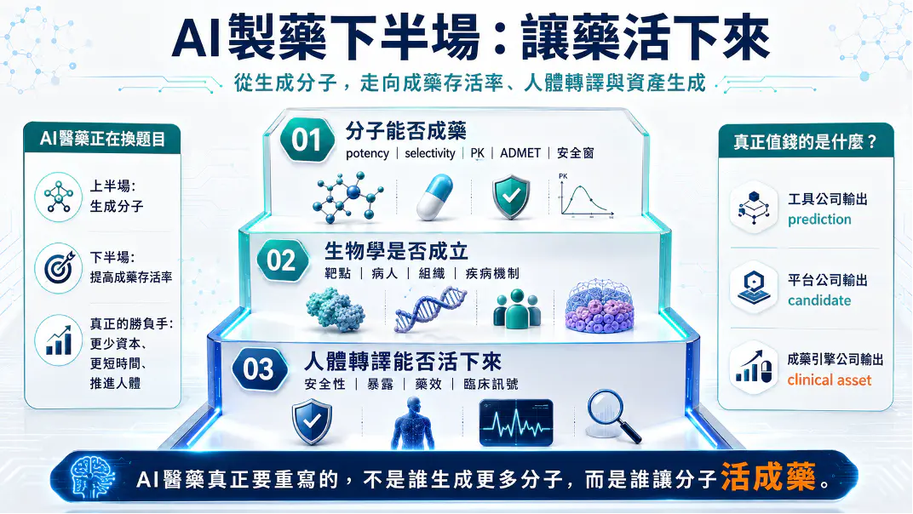
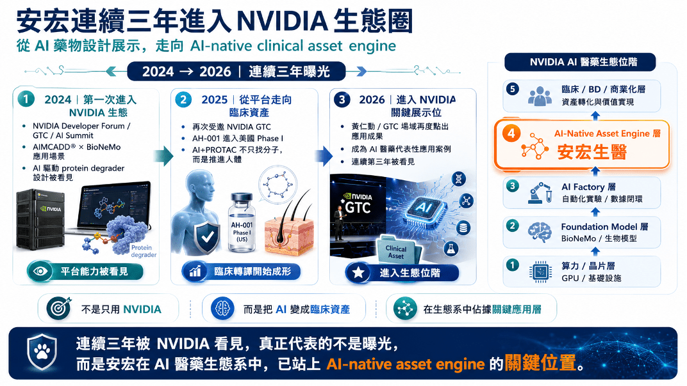
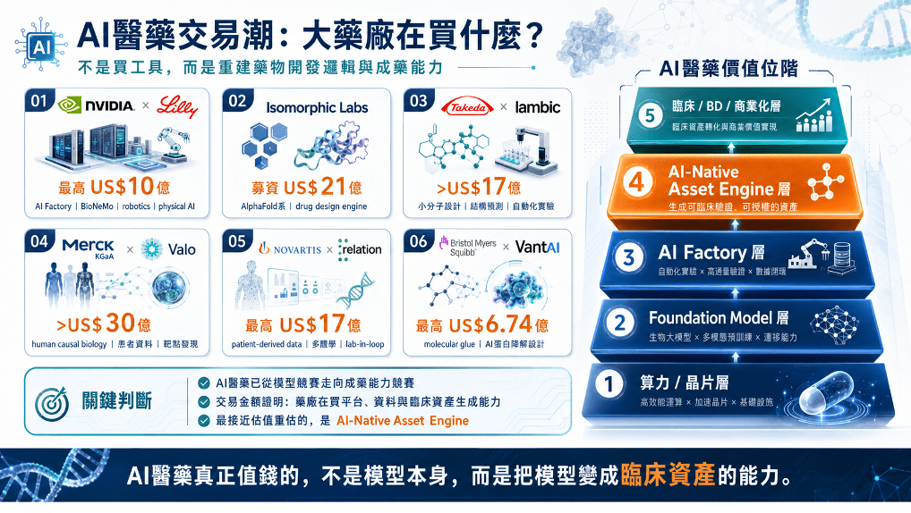
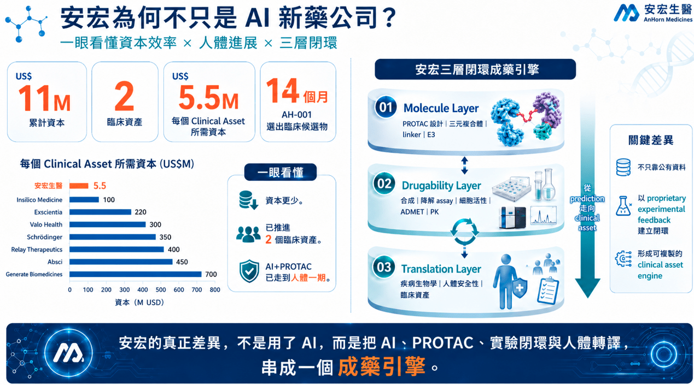
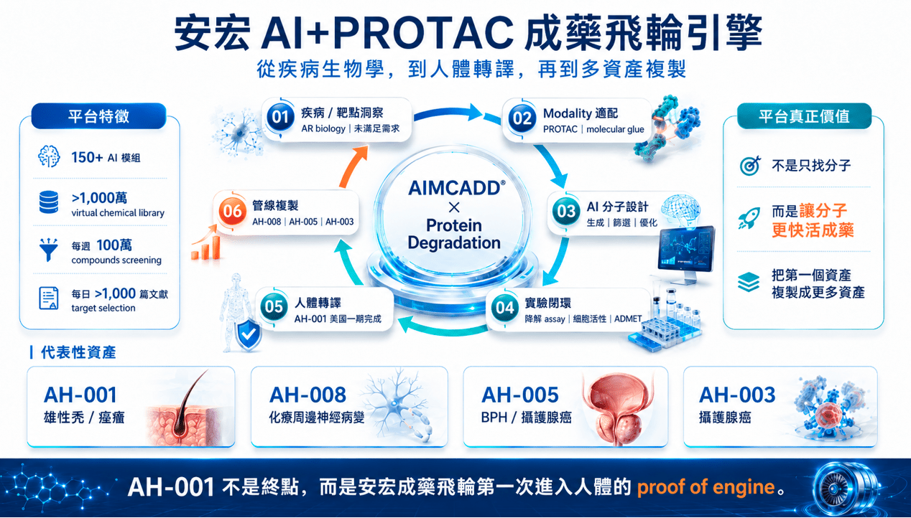
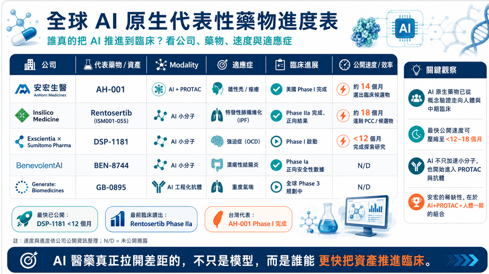

# AI製藥下半場：讓藥活下來

## 輝達 NVIDIA 連續看見安宏背後，台灣 AI + PROTAC 成藥飛輪正在成形
AI 醫藥上半場比生成分子，下半場比成藥存活率。安宏真正值得被看見的，不是單純曝光，而是用 AI + PROTAC（蛋白質降解技術）、實驗閉環與人體轉譯，嘗試形成高資本效率的 clinical asset engine（臨床資產生成引擎）。

全球 AI 醫藥正在重新洗牌。

過去兩年，從 輝達 NVIDIA 與大型藥廠共建 AI Factory，到 Isomorphic、Iambic、Valo、Relation、VantAI 等 AI 原生平台拿下十億美元級交易，市場已經不再只是為「AI 可以生成分子」買單。

大藥廠真正押注的，是一件更核心的事：AI 能不能重構新藥開發流程，讓更多分子更快進入人體，並提高它活過臨床、走向商業化的機率。

這才是 AI 醫藥的下半場。

上半場，比的是模型、算力與生成能力。

下半場，比的是成藥性、人體轉譯與臨床資產生成能力。

因為螢幕上的分子，不是藥。

一個 AI 設計出的分子，要真正成為有價值的資產，必須穿過三道關卡：分子本身要能成藥，疾病生物學要成立，最後還要進入人體，通過安全性、暴露、藥效與臨床訊號的檢驗。所以，AI 醫藥真正值錢的，不是誰能生成更多分子，而是誰能用更少資本、更短時間，把分子推進人體，讓它活成臨床資產。

也正是在這個脈絡下，安宏生醫連續三年進入 NVIDIA 生態系，才值得被重新理解。

它不是單純的曝光，而是一個生態位訊號：安宏不是算力層，不是通用模型層，也不是單純 AI 篩選工具，而是站在更接近價值出口的 AI-native clinical asset engine——把 AI 變成臨床資產的成藥引擎層。

AIMCADD®、AI + PROTAC、AH-001 美國一期臨床，以及後續管線複製，指向的是同一件事：安宏正在嘗試證明，台灣也能長出一套用 AI 產生臨床資產的成藥飛輪。

這才是 NVIDIA 連續看見安宏背後，真正值得市場理解的地方。

不是生成更多分子，而是讓 AI 設計的分子，真的活成藥。
## 01｜AI 醫藥正在換題目：不是生成更多分子，而是讓藥活下來

過去幾年，AI 醫藥最會講的故事，是模型。誰能生成分子、誰能預測蛋白結構、誰能在電腦裡跑出更漂亮的 docking，誰就能吸引資本市場的想像。

但製藥產業真正殘酷的地方，是電腦裡再漂亮的分子，都還不是藥。一個分子要成為藥，必須穿過三道死亡之門：分子本身能不能成藥、生物學是否成立，以及人體轉譯能不能活下來。所以，AI 醫藥真正要重寫的，不是誰能生成更多分子，而是誰能用更少資本、更短時間，把分子推進人體，並提高它活成臨床資產的機率。

這也是安宏生醫連續被 NVIDIA 生態看見時，真正應該被問的問題：它不是只在展示 AI，而是在嘗試證明 AI + PROTAC 能不能形成一套可複製、可推進人體、可生成多資產的成藥飛輪。
## 02｜連續三年進入 NVIDIA 生態圈：曝光背後，是生態位階的改變

如果一家公司只被 NVIDIA 看見一次，那可能是展示；但若從 NVIDIA Developer Forum、GTC、AI Summit，到 GTC Taipei 的 AI 新藥應用場景，連續三年被放進生態系裡，背後代表的就不只是能見度。

安宏的關鍵不是「使用 NVIDIA」本身，而是它提供了一個 AI infrastructure 走向藥物開發實際應用的案例：從 AIMCADD®、BioNeMo 與蛋白降解分子設計，到 AH-001 進入美國 Phase I，再走向 AI-native clinical asset engine 的位置。

在 NVIDIA AI 醫藥生態位階中，最底層是算力與晶片，中間有 Foundation Model 與 AI Factory，而最接近 biotech 估值重估的，是 AI-Native Asset Engine：能把 AI 變成可進臨床、可授權、可交易的新藥資產。
## 03｜全球 AI 醫藥交易潮：大藥廠買的不是工具，而是成藥能力

近期 AI 醫藥交易潮說明一件事：大藥廠不是在買 AI 工具，而是在買新的藥物開發底層能力。

NVIDIA × Lilly 代表 AI Factory；Isomorphic Labs 代表 foundation model 級 drug design engine；Takeda × Iambic 代表小分子設計與自動化實驗閉環；Valo、Relation 代表疾病生物學與患者資料；VantAI 代表 AI 切入 molecular glue 與蛋白降解設計。

這些交易金額不是單純熱錢，而是在重新定義 AI 醫藥的價值位階。越接近臨床資產、BD、商業化與可驗證人體轉譯的公司，越接近真正的價值捕獲。因此安宏不應被放在「AI 工具公司」的位置，而應被放在 AI-Native Asset Engine 的框架裡比較：

📌 能不能產生差異化分子。

📌 能不能推進人體。

📌 能不能把第一個資產複製成更多資產。

這些問題，才是 AI 醫藥下半場真正的估值語言。
## 04｜資本效率與臨床速度：安宏為何不只是 AI 新藥公司？

AI 醫藥公司最後不能只比模型，也不能只比融資規模。真正對投資人與大藥廠有意義的問題是：同樣要把一個分子推進人體，誰花的錢更少、誰用的時間更短、誰更早產生可被藥廠評估的臨床資產。

安宏最值得被重新理解的地方，是 capital-to-clinic efficiency（資本進入臨床效率）。

公司資料顯示，安宏以約 US$11M 資本推進出 2 個 clinical assets，每個 clinical asset 所需資本約 US$5.5M；AH-001 約 14 個月選出臨床候選物，並已完成美國 Phase I。

這個數字不能被過度解讀成療效已被證明，但它代表一個重要訊號：安宏以小型 biotech 的資本量，把 AI + PROTAC 從平台、候選物，一路推進到人體一期。

這就是安宏與一般 AI 工具公司的第一個差異。
## 05｜安宏 AI + PROTAC 成藥飛輪引擎：AH-001 不是終點，而是 proof of engine
如果只把 AH-001 看成雄性禿藥物，安宏的故事會被看小。

AH-001 更重要的意義，是讓安宏的 AI + PROTAC 成藥飛輪第一次進入人體安全性驗證。

這個飛輪包含六個關鍵環節：疾病與靶點洞察、Modality 適配、AI 分子設計、實驗閉環、人體轉譯與管線複製。

中心不是單一模型，而是 AIMCADD® × Protein Degradation 形成的連續學習系統。

AIMCADD® 的價值不只是找分子，而是把疾病生物學、PROTAC 設計、三元複合體、linker、E3、降解 assay、細胞活性、ADMET 與人體轉譯串起來。

當第一個臨床資產的資料回流後，平台才有機會複製出 AH-008、AH-005、AH-003 等更多資產。
## 06｜全球 AI 原生代表性藥物：真正拉開差距的是誰能更快推進臨床
全球 AI 原生藥物已經從概念驗證走向人體與中期臨床。

Insilico 的 Rentosertib 已有 Phase IIa 正向結果，Exscientia × Sumitomo 的 DSP-1181 代表早期 AI 小分子快速進入 Phase I 的案例，BenevolentAI 與 Generate:Biomedicines 則展示 AI 小分子與 AI 工程化抗體走向人體臨床與後期開發。

安宏在這張全球進度表中的稀缺性，不是臨床進度最前，而是 AI + PROTAC + 人體一期 的組合。

AI 不再只是加速小分子，也開始深入蛋白降解、抗體與更複雜的 modality。
## 07｜安宏真正要證明的，是「活藥能力」
AI 醫藥的下一個十年，不會只獎勵會講 AI 的公司，而會獎勵能讓分子活下來的公司。

誰能把 disease biology 做對、誰能選對 modality、誰能讓分子活過藥物化學、誰能建立 AI 與 wet lab 的閉環、誰能把 candidate 推進人體，誰才有機會進入真正的價值重估。

安宏現在還沒有完成最終答案。

AH-001 完成一期，只是安全性與人體轉譯的第一道門檻，不代表療效 POC 已經成立。AH-008、AH-005、AH-003 仍需要更多臨床前、IND-enabling、臨床與商業合作驗證。

但安宏已經站在一個台灣生技過去很少站上的位置：不是只做單一新藥，不是只做 AI 工具，也不是只靠公有資料跑模型，而是把 AI、PROTAC、疾病生物學、實驗閉環與人體轉譯串成一套正在成形的成藥飛輪。
## 結語｜AI 製藥下半場，誰能讓藥活下來？
AI 醫藥的上半場，是生成分子的戰爭；AI 醫藥的下半場，是讓藥活下來的戰爭。

上半場比的是模型，下半場比的是成藥率。

上半場比的是誰能畫出更多可能性，下半場比的是誰能把可能性推進人體，變成臨床資產。

安宏真正值得被放大的，不是一次 GTC 曝光，而是它正在台灣生技裡提出一個更大膽的答案：

AI + PROTAC 不只是生成分子，而是要讓分子活成藥。

如果 AH-001 後續能進一步取得 Phase II 療效訊號，如果 AH-008、AH-005、AH-003 能證明平台可複製，如果 AIMCADD® 能持續把 AI 預測、實驗驗證與人體轉譯資料回流成下一代資產，那麼安宏的故事就不只是台灣多了一家 AI 新藥公司，而是台灣第一次真正切入 AI 原生新藥的核心戰場。

本文為產業趨勢與公司定位分析，不構成任何投資建議。文中關於安宏資本效率、AIMCADD®、管線與科學發表等數據，根據公開資訊整理；全球 AI 藥物與交易資訊依公司公告、新聞稿與公開資料整理。

參考資料：

0. 各公司官網＆公開資料

1. NVIDIA × Lilly｜AI Factory / AI co-innovation lab

NVIDIA

NVIDIA and Eli Lilly and Company today announced a first-of-its-kind AI co-innovation lab focused on applying AI to tackle some of the most enduring challenges in the pharmaceutical industry.

nvidianews.nvidia.com

2. NVIDIA BioNeMo｜AI drug discovery foundation model / toolkit

NVIDIA

Access open-source tools, pretrained models, and GPU-accelerated pipelines to build AI solutions for drug discovery, medical imaging, genomics, healthcare robotics, and digital health.

www.nvidia.com

3. 安宏生醫｜NVIDIA AI Summit / AI 蛋白質降解新藥研發成果

安宏生醫在 NVIDIA AI Summit 發表 AI 蛋白質降解新藥研發成果 - AnHorn Medicines

安宏生醫即將再度於6月5日參加在台北舉行的「NVIDIA AI Summit」分享其運用自主開發AI新藥開發平台，進行蛋白質降解新藥研發，成為此次唯一現場主講的台灣新藥研發公司。公司旗下第一個透過AI輔助設計的全新專利新藥，也將於今（2024）年申請新藥臨床試驗許可。

www.anhornmed.com

4. 安宏生醫｜GTC 2026 開場影片再度曝光 / AH-001 國際潛力

安宏生醫AI新藥研發成果登上輝達GTC舞台 AH-001展現國際潛力 - 生技投資第一站-Genet 觀點

全球AI科技領袖黃仁勳於 GTC 2026 開場影片中，再次以動畫呈現人工智慧在新藥研發的應用。其中，安宏生醫以AI加速藥物設計與開發的成果受到聚焦，凸顯AI正逐步重塑全球新藥研發模式，推動從分子設計邁向臨床驗證的進程。 安宏生醫專注於 AI驅動的新藥研發，並聚焦於蛋白質降解創新藥物平台。首項進入臨床的產品 AH-001，鎖定治療雄性禿（雄激素性脫髮），以全新機制切入疾病根源，提供有別於現行療法的新一代解決方案。 雄性禿是一種影響男女的常見慢性落髮疾病，全球患者超過10億人。隨著外貌管理意識提升與美容醫療

www.genetinfo.com

---

本文僅供產業研究與知識分享，不構成投資、醫療、募資或個股建議。
