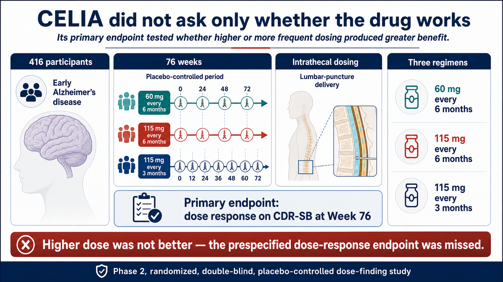
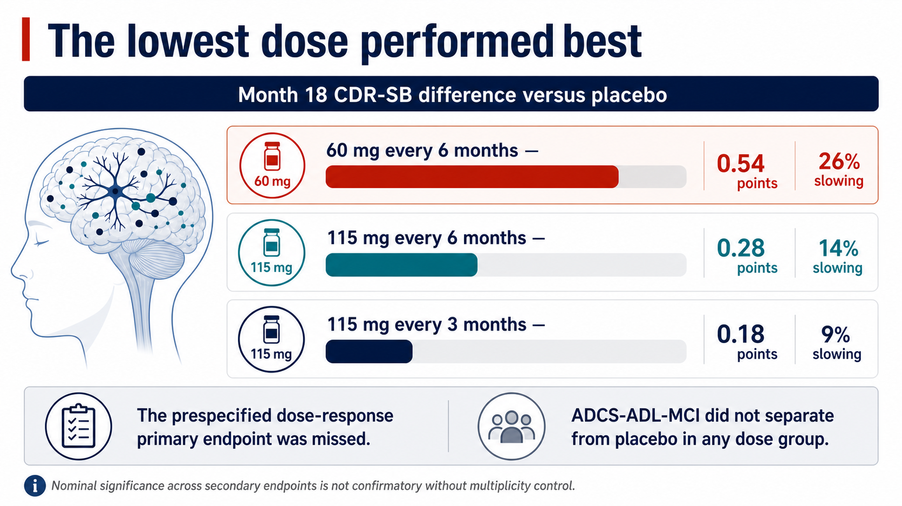
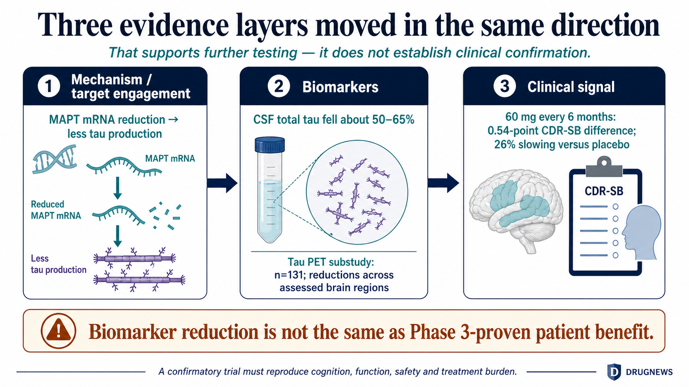
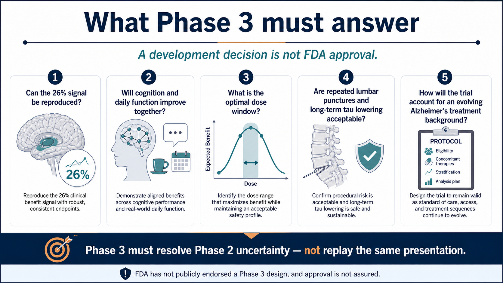

# Tau Earned a Retest: Why Biogen Is Taking Diranersen Into Phase 3 After CELIA Missed Its Primary Endpoint

A Phase 2 study missed its primary endpoint, yet the sponsor says it intends to move the drug into confirmatory Phase 3 testing.

That can sound like an exercise in explaining away failure. But after Biogen presented the complete CELIA dataset for diranersen at the 2026 Alzheimer's Association International Conference, the discussion did not end with the word “failed.” It reopened a more consequential question: can lowering tau genuinely alter the course of early Alzheimer's disease?

The most defensible interpretation sits between two extremes. Tau has not made a clinical comeback, but the failed primary endpoint did not erase every other signal in the dataset.

Drugnews' central judgment is this:

Tau has not been validated. CELIA failed to show that higher or more frequent dosing produced greater benefit, so it missed the prespecified dose-response primary endpoint. At the same time, the lowest dose was associated with 26% less worsening on CDR-SB, while cerebrospinal-fluid tau and tau PET moved in the direction predicted by the mechanism. That combination gives Biogen and Ionis a rational basis to plan Phase 3. It does not establish a second disease-modifying pathway beyond amyloid-beta; one confirmatory trial is still missing.

The statistical problem, the clinical signal and the biomarker consistency all appear in the same dataset. The primary endpoint did not somehow turn positive. What CELIA did was clarify the questions the next study must answer.

## 01 | Start With the Right Question: CELIA Tested Dose Response

Diranersen, also known as BIIB080 and IONIS-MAPTRx, is an antisense oligonucleotide developed by Biogen and Ionis. It binds MAPT messenger RNA with the aim of reducing tau production before the protein is made. That is different from an antibody designed to capture a selected form of tau that already exists.

To reach the central nervous system, diranersen is administered intrathecally through lumbar puncture into the cerebrospinal fluid. The route bypasses the blood-brain barrier, but it also introduces procedural burden and procedure-related adverse events.

CELIA was a global, randomized, double-blind, placebo-controlled Phase 2 dose-finding study. It enrolled 416 people with mild cognitive impairment due to Alzheimer's disease or mild Alzheimer's dementia. The placebo-controlled period lasted 76 weeks, or roughly 18 months. None of the participants had previously received anti-amyloid therapy.

The three diranersen regimens were:

- 60 mg every six months;
- 115 mg every six months; and
- 115 mg every three months.

The primary endpoint asked whether the Week 76 change in CDR-SB demonstrated a dose response. Under the original hypothesis, a higher dose or more frequent dosing should have produced greater clinical benefit.

The result went the other way. The best-performing group received the lowest and least frequent regimen: 60 mg every six months.

CELIA therefore did not meet its primary endpoint. Biogen explicitly acknowledged that statistical conclusion in its formal disclosure.

*Figure 1 | CELIA was a 416-participant, 76-week, randomized, double-blind, placebo-controlled dose-finding study. Higher dosing was not better, so the prespecified dose-response endpoint was missed.*

## 02 | Where Did 26% Come From? Read the Point Difference First

CDR-SB is a common Alzheimer's disease scale that integrates cognitive and functional domains. Higher scores indicate more severe disease. The study compares how much each group worsens over time.

In the 60 mg every-six-months group, Biogen reported 0.54 points less worsening on CDR-SB than placebo at Month 18. Expressed as a relative effect, that corresponds to 26% slowing. The dose group included 60 participants, while the placebo group included 115.

The two other regimens also moved in the favorable direction, but by smaller amounts:

- 115 mg every six months: 0.28 points less worsening, or 14% slowing;
- 115 mg every three months: 0.18 points less worsening, or 9% slowing.

That ordering is precisely why the primary endpoint failed. The study showed a possible drug signal, but it contradicted the prespecified assumption that greater exposure would produce greater CDR-SB benefit.

Several explanations are possible. Tau lowering may have an optimal dose window. The pattern may also reflect sample size, patient heterogeneity, measurement variability or chance. The most direct alternative is that the apparent advantage of the lowest dose may not reproduce in a larger study.

Phase 2 has exposed those uncertainties rather than resolved them. “The lowest dose works best” remains a hypothesis, not an established biological explanation. Conversely, the fact that all three groups moved in the same direction should not be discarded simply because the trend was not linear.

Biogen also reported several cognitive and composite outcomes. In the 60 mg group, ADAS-Cog13, MMSE, modified iADRS and ADCOMS generally favored diranersen, and the company said most comparisons reached nominal statistical significance. The word “nominal” matters. With many secondary comparisons, p-values that are not protected by a complete multiplicity-control strategy do not carry the confirmatory status of a successful primary endpoint.

At the same time, ADCS-ADL-MCI did not separate from placebo in any of the three dose groups. The cognitive signal was therefore not reproduced uniformly across functional measures.

The 26% figure is reportable, but it must remain attached to three qualifications: the primary dose-response endpoint was missed; the signal came from the lowest dose; and functional outcomes were not consistently aligned.

*Figure 2 | The 60 mg every-six-months group showed a 0.54-point difference, or 26% slowing. Higher doses produced smaller differences, which is the reason the primary endpoint failed.*

## 03 | Why the Tau Debate Reopened: Three Evidence Layers Moved Together

If CELIA had produced only one attractive clinical percentage, the case for Phase 3 would be much weaker. The dataset drew attention because mechanism, biomarkers and part of the clinical readout pointed in the same direction.

Diranersen is designed to reduce MAPT messenger RNA so that cells produce less tau. If the drug engages its target, the most direct evidence should be a reduction in tau-related cerebrospinal-fluid markers.

Across the three CELIA dose groups, mean CSF total tau fell by approximately 50% to 65% from baseline. That result indicates that the drug altered its intended molecular marker.

The tau PET substudy adds another layer. It included 131 participants, and Biogen reported reductions from baseline across all assessed brain regions in each of the three dose groups. Tau PET measures a signal associated with tau pathology in the brain. A change in both imaging and cerebrospinal-fluid markers provides more information than either fluid or imaging alone. The images in the accompanying graphic are scientific illustrations, not scans from individual CELIA participants.

Biomarker improvement does not automatically mean that patients live or function better. Alzheimer's drug development offers many examples in which a biological marker moved while clinical function did not move to the same degree. CELIA nevertheless provides a chain worth testing: diranersen reduced tau production, CSF total tau and tau PET declined, and selected cognitive and CDR-SB outcomes moved in a favorable direction.

That chain supports further validation. It should not be promoted by commentators into regulatory confirmation, nor does it establish tau as a validated second disease-modifying pathway. Biogen used “proof of concept” in its own interpretation of the data; responsible analysis must preserve the attribution to the company.

*Figure 3 | MAPT mRNA, CSF total tau, tau PET and selected clinical outcomes form a coherent chain. Biomarker reduction still cannot substitute for confirmatory evidence of patient benefit.*

## 04 | Reducing Tau Production Is Different From Clearing Existing Tau

Tau has been an important Alzheimer's target for years. The protein helps stabilize neuronal microtubules. In Alzheimer's disease and other tauopathies, tau becomes abnormally modified, aggregates and spreads with disease progression. Many earlier programs used antibodies against extracellular tau in an effort to interrupt propagation, but those approaches did not reliably translate into reproducible clinical benefit.

An antisense oligonucleotide acts further upstream by reducing production of tau isoforms through a shared messenger-RNA target. In principle, that can affect both intracellular and extracellular tau without requiring a separate antibody for each conformation or aggregate.

Being upstream creates a different set of questions. Tau has physiological functions in healthy neurons. How much long-term reduction is safe? Is more reduction necessarily better? The fact that CELIA's lowest dose produced the strongest apparent clinical signal is a reminder that biomarker depth and clinical benefit may not have a simple linear relationship.

Intrathecal administration also requires repeated lumbar puncture. If the 60 mg every-six-months regimen reproduces in Phase 3, the treatment burden may be manageable for some patients. If development ultimately requires a loading regimen, a different maintenance schedule or more intensive monitoring, real-world access will look different.

The optimal dose window, cumulative safety and the treatment burden patients are willing to accept all require longer and larger studies.

## 05 | Safety Was Acceptable So Far, but ARIA Cannot Be Declared Impossible

During the 76-week placebo-controlled period, Biogen characterized diranersen as generally well tolerated. Most adverse events were mild to moderate and non-serious, and none resulted in treatment discontinuation or study withdrawal. Common events included procedural pain, post-lumbar-puncture syndrome and confusional state. Most confusional events occurred within days of dosing and resolved within a week.

Those events are closely related to the intrathecal route. If the program enters Phase 3, investigators will need to assess not only the molecule but also the capacity to deliver repeated lumbar punctures, patient acceptance and cumulative procedural risk.

The company also said that amyloid-related imaging abnormalities associated with anti-amyloid antibodies were not expected based on a tau-targeting mechanism, and that CELIA was consistent with that expectation. This is still the company's interpretation based on mechanism and the available dataset. It cannot guarantee that every tau-directed drug will always be free of ARIA.

Monitoring methods, study population and duration of exposure all shape what a trial can detect. We have also excluded a secondary-conference claim about “11 studies” and “0.9% severe ARIA” because no official abstract was available for verification. High-risk medical statements should not be built from untraceable meeting summaries.

## 06 | Do Not Rank CELIA's 26% Beside Leqembi and Kisunla

The 26% figure invites an immediate comparison with relative slowing reported for approved anti-amyloid therapies. A side-by-side ranking may be visually appealing, but it creates a false equivalence.

CELIA was a 416-participant Phase 2 dose-finding study with a dose-response primary endpoint. Other programs differ in patient eligibility, background therapy, follow-up duration, scale analysis, missing-data handling and statistical hierarchy. The fact that two trials use CDR-SB does not make their relative percentages interchangeable.

The clinical meaning of a 0.54-point difference also needs longer follow-up and more functional evidence. Alzheimer's disease is progressive, so a slower rate of decline could accumulate into more time living independently. But if the difference remains confined to scales and is not reflected consistently in functions patients and caregivers can recognize, its value will be limited.

The more useful question is whether Phase 3 can reproduce the 0.54-point difference, demonstrate aligned cognitive and functional benefit, and do so with acceptable safety and treatment burden.

## 07 | Why Is Biogen Willing to Proceed?

Biogen said it plans to advance diranersen into a confirmatory Phase 3 program. That is a company development decision. The FDA has not publicly endorsed a study design, and approval is not assured.

From a development perspective, the rationale is understandable:

- all three CDR-SB dose groups favored diranersen, even though higher doses were not better;
- the lowest-dose signal appeared across several cognitive and composite measures;
- CSF total tau and tau PET demonstrated effects on the intended molecular and pathological markers;
- 60 mg every six months provides a plausible regimen to test further; and
- more than 90% of participants who completed the controlled period elected to enter the extension, which at least indicates willingness to continue.

Phase 3 will still be difficult to design. If Biogen selects 60 mg, it must show that the apparent low-dose advantage was not chance. If it includes additional doses, it must explain why CELIA did not produce a clear dose response. The primary endpoint, sample size, follow-up duration, permitted background anti-amyloid therapy, and the way cognition and function are combined can all change the answer.

Phase 3 must remove the most important uncertainties from Phase 2 rather than replay the same presentation.

*Figure 4 | Advancing to Phase 3 is a development decision, not FDA approval. A confirmatory trial must resolve the central uncertainty left by CELIA.*

## 08 | What Should Taiwan-Based Readers Watch?

As of July 19, 2026, first-party public disclosures did not show any Taiwan-listed company holding direct co-development, manufacturing, delivery or commercialization rights to diranersen.

The most direct public-market exposures are Biogen, listed on Nasdaq as BIIB, and the molecule's originator Ionis Pharmaceuticals, listed as IONS. Biogen exercised its licensing option in 2019 and obtained exclusive worldwide, royalty-bearing development and commercialization rights. That is why both companies have a direct relationship to Phase 3 execution, milestones and commercial value.

Taiwan's industry can still follow three capability areas: long-term manufacturing and quality for central-nervous-system antisense oligonucleotides, standardization of cerebrospinal-fluid biomarkers and tau PET, and large-trial execution that can support repeated intrathecal dosing. A local company should enter the investment narrative only after a formal collaboration, trial-site, supply or licensing disclosure appears.

## 09 | Conclusion: Tau Earned a Retest

CELIA's failed primary endpoint cannot be erased. Neither should the 0.54-point CDR-SB difference and 26% relative slowing in the 60 mg every-six-months group be treated as if they did not exist.

The most defensible conclusion is:

Diranersen has given the tau-lowering strategy a reason to enter Phase 3. Clinical validation still depends on a confirmatory trial.

Five items now matter: whether the Phase 3 design receives constructive regulatory feedback, which dose is selected, whether the primary framework captures both cognition and function, how the trial accommodates an evolving Alzheimer's treatment landscape, and whether repeated lumbar puncture and sustained tau reduction remain acceptable over time.

Alzheimer's development does not lack elegant mechanisms. It lacks effects that reproduce in large trials and preserve a period of life that patients and families can recognize. Tau has received a serious retest, not a diploma.

## References

All references are first-party sources or official trial records. Information verified through July 19, 2026.

1. AAIC 2026 official program, London, July 12–15, 2026: https://aaic.alz.org/program/schedule.asp
2. ClinicalTrials.gov, CELIA, NCT05399888: https://clinicaltrials.gov/study/NCT05399888
3. Biogen, complete CELIA Phase 2 data: https://investors.biogen.com/node/30826
4. Ionis, diranersen and CELIA announcement: https://ir.ionis.com/node/34616
5. Alzheimer's Association, 2026 drug-development pipeline overview: https://www.alz.org/news/2026/alzheimers-disease-drug-development-pipeline-is-growing

## Disclaimer

This article provides biotech, pharmaceutical and industry analysis. It does not constitute medical diagnosis, treatment advice or investment advice. Diranersen is investigational and has not been approved for marketing; clinical-trial results cannot be extrapolated to an individual patient.
