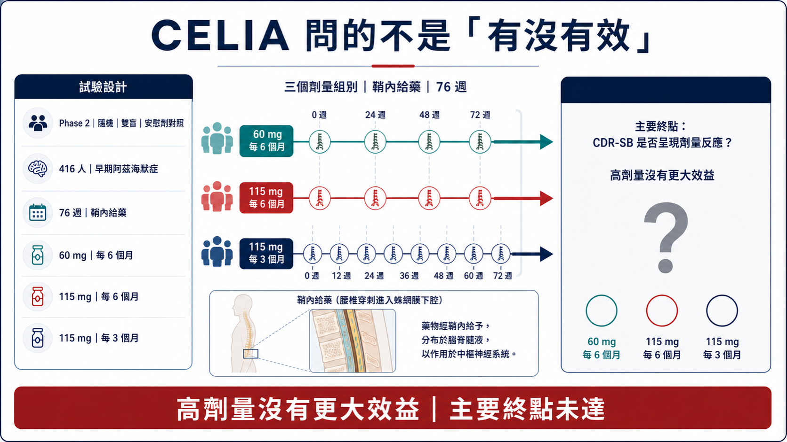
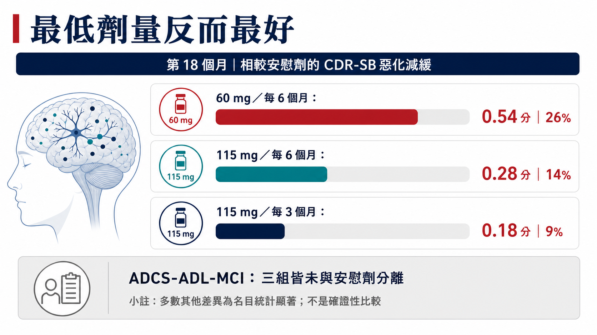
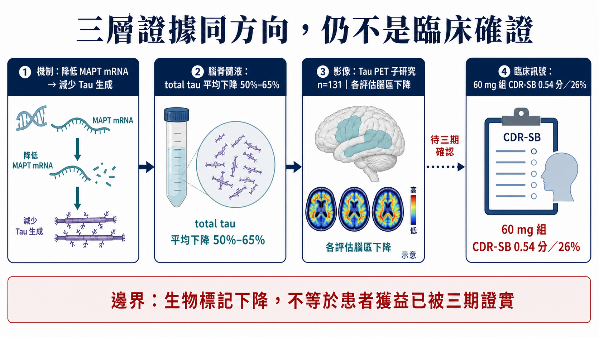
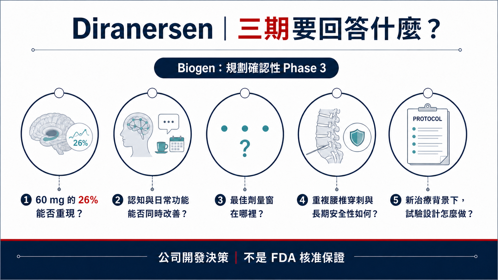

# Tau 拿到補考資格：Diranersen 主終點失敗，為什麼 Biogen 仍要進三期？

一個二期試驗沒有達到主要終點，公司卻說要把藥推進確認性三期。

這通常會被解讀成硬拗。但 2026 年阿茲海默症協會國際會議（AAIC）上，Biogen 公布 diranersen 的 CELIA 完整資料後，市場討論沒有停在「失敗」，反而重新問起：降低 Tau，是否真的可能改變早期阿茲海默症的病程？

目前最合理的讀法介於兩個極端之間：Tau 尚未翻身；主要終點失敗，也沒有抹掉其餘訊號。

藥時事的主判斷是：

Tau 還沒有正式翻身。CELIA 沒有證明劑量愈高、效果愈好，因而未達預設的劑量反應主要終點；最低劑量在 CDR-SB 看到 26% 的惡化減緩，腦脊髓液與 Tau PET 又同時往靶點預期方向移動。這組訊號足以支持 Biogen／Ionis 規劃三期；要宣布「Aβ 之外的第二條疾病修飾路線成立」，還少一場確認性試驗。

同一份資料裡，統計問題、臨床訊號與生物標記一致性同時出現。主終點失敗沒有突然變成功；它讓下一步要回答的問題變得更清楚。

## 01｜先把試驗問題說對：CELIA 問的是劑量反應

Diranersen 也叫 BIIB080、IONIS-MAPTRx，是 Biogen 與 Ionis 共同開發的反義寡核苷酸（ASO）。它和 MAPT mRNA 結合，目的是在蛋白質製造之前降低 Tau 生成；作用位置不同於抓取既有 Tau 聚集體的抗體。

這類藥物要進入中樞神經系統，目前採用鞘內注射，也就是透過腰椎穿刺把藥送進腦脊髓液。它繞過血腦障壁，卻也帶來程序負擔與相關不良反應。

CELIA 是全球 Phase 2、隨機、雙盲、安慰劑對照、劑量探索研究，納入 416 名因阿茲海默症造成的輕度認知障礙，或輕度阿茲海默症失智患者。安慰劑對照期 76 週，也就是約 18 個月。所有入組者先前都沒有接受抗類澱粉蛋白治療。

三種 diranersen 給藥方案是：

- 60 mg，每 6 個月一次；
- 115 mg，每 6 個月一次；
- 115 mg，每 3 個月一次。

試驗的主要終點是看第 76 週 CDR-SB 的變化是否呈現劑量反應。照原本假設，更高或更頻繁的劑量，應該帶來更大的臨床效益。

結果偏偏相反。表現最好的是最低、最不頻繁的 60 mg 每 6 個月組。

因此，CELIA 沒有達到主要終點。Biogen 已在正式公告明確承認這個統計結論。

*圖1｜CELIA 是 416 人、76 週的隨機雙盲安慰劑對照劑量探索研究；更高劑量沒有帶來更大效益，預設劑量反應主要終點未達。*

## 02｜26% 從哪裡來？先看點數，再看百分比

CDR-SB 是阿茲海默症研究常見量表，綜合認知與日常功能面向。分數愈高代表疾病愈嚴重；研究比較的是一段時間後，各組惡化多少。

在 60 mg 每 6 個月組，Biogen 報告相較安慰劑，第 18 個月 CDR-SB 少惡化 0.54 分，換算成相對減緩幅度是 26%。這一組 n=60，對照組 n=115。

另外兩組也往有利方向移動，但幅度較小：

- 115 mg 每 6 個月：少惡化 0.28 分，減緩 14%；
- 115 mg 每 3 個月：少惡化 0.18 分，減緩 9%。

這個排列正是主要終點失敗的原因：藥物看似有訊號，結果卻違反「劑量愈高、效果愈大」的預設。更高劑量沒有帶來更大 CDR-SB 效益。

為什麼會出現這種結果？可能性很多。也許 Tau 降低存在最佳劑量窗；也可能是樣本數、患者差異、量表波動或偶然性造成。還有一種更直接的可能：最低劑量的效果在更大研究裡無法重現。

二期試驗把這些不確定性攤開。「低劑量最好」仍是假說，不是已被證實的生物學解釋；三組同方向的臨床訊號，也不該因趨勢不像直線而被抹掉。

Biogen 還公布多個認知與複合終點。60 mg 組在 ADAS-Cog13、MMSE、modified iADRS、ADCOMS 等指標多數往有利方向，公告稱大部分差異達到名目統計顯著（nominal statistical significance）。「名目」兩字不能省略，因為在多重終點裡反覆比較，若沒有完整控制多重檢定，p 值不能等同主要終點的確證性證據。

同時，ADCS-ADL-MCI 這個日常功能量表在三個劑量組都沒有和安慰劑分離。也就是說，認知訊號並沒有在所有功能指標上整齊複製。

所以 26% 可以寫，但必須和三句話綁在一起：主要劑量反應終點未達；這是最低劑量組；日常功能指標並非全面一致。

*圖2｜60 mg 每 6 個月組少惡化 0.54 分、相對減緩 26%；更高劑量的差異反而較小，正是主要終點失敗的原因。*

## 03｜三層證據同方向，Tau 討論才會升溫

如果 CELIA 只有一個漂亮的臨床百分比，Biogen 要推進三期的說服力會弱很多。這次更受關注的原因，是藥物機制、生物標記與部分臨床結果出現在同一條方向上。

Diranersen 的設計，是降低 MAPT mRNA，讓細胞少製造 Tau。若藥物真的命中靶點，最直接的證據應該是腦脊髓液中的 Tau 下降。

CELIA 三個劑量組的腦脊髓液 total tau，相較基線平均下降約 50%–65%。這表示藥物確實改變了預定的分子標記。

更進一步，Tau PET 子研究納入 131 人。Biogen 表示，三種劑量在所有評估腦區都看到 Tau PET 相較基線下降。PET 觀察的是腦內 Tau 病理訊號；它與腦脊髓液標記同時下降，比單一體液標記提供更多資訊。配圖中的 PET 圖像為科學示意，不是 CELIA 個別患者掃描影像。

標記下降無法自動換算成患者活得更好。阿茲海默症研發史上，生物標記改善、臨床功能卻沒有相應變化的例子並不少。CELIA 提供了一個值得確認的鏈條：藥物降低 Tau 生成，CSF total tau 與 Tau PET 下降，部分認知與 CDR-SB 指標同方向。

這條鏈條可以叫「支持進一步驗證」，不能由我們替監管機關升格成已完成概念驗證，更不能說 Tau 已成為獲確認的第二條疾病修飾路線。Biogen 在公告中使用 proof of concept，是公司的資料詮釋；公開文章要把這個歸屬寫清楚。

*圖3｜MAPT mRNA、CSF total tau、Tau PET 與部分臨床訊號形成一致鏈條；生物標記下降仍不能取代確認性三期的患者效益證據。*

## 04｜降低生成，和過去清除 Tau 有何不同？

Tau 早已是阿茲海默症研發的重要靶點。它和神經元骨架穩定有關；在阿茲海默症等 tauopathy 裡，Tau 會異常修飾、聚集並隨疾病擴散。過去許多計畫想用抗體清除細胞外 Tau，希望阻止病理傳播，卻沒有順利轉成可重複的臨床效益。

ASO 從共同上游減少各種 Tau 亞型生成，不需挑選單一 Tau 構形。理論上，這可以同時影響細胞內與細胞外 Tau，也不必為每種聚集形態各做一支抗體。

但「更上游」也帶來新的問題。Tau 在正常神經元有生理功能，長期降低多少才安全？降得越多是否越好？CELIA 最低劑量反而表現最好，正提醒我們：標記降低幅度和臨床效益未必是簡單線性關係。

另外，鞘內注射需要腰椎穿刺。60 mg 每 6 個月一次的頻率若能在三期重現，給藥負擔可能還算可管理；若未來需要不同起始療程、維持策略或更密集監測，真實世界可近性會改變。

最佳劑量窗、累積安全性與患者願意接受的治療負擔，都要交給更長期、更大規模研究回答。

## 05｜安全性目前可接受，ARIA 仍不能保證為零

在 76 週安慰劑對照期，Biogen 表示 diranersen 整體耐受性良好。多數不良事件是輕至中度、非嚴重，且沒有造成停藥或退出。常見事件包括程序性疼痛、腰椎穿刺後症候群與意識混亂狀態；多數意識混亂事件在給藥後數日內出現，並在一週內緩解。

這些事件和鞘內給藥路徑密切相關。未來產品若進三期，除了藥物本身，腰椎穿刺的執行量能、患者接受度與重複給藥風險都要一起評估。

公司另稱，依 Tau 標靶機制，預期不會出現抗 Aβ 抗體相關的 ARIA，CELIA 結果也符合這個預期。這仍是公司基於機制與現有資料的判讀，無法保證所有 Tau 藥物永遠不會出現 ARIA。

不同試驗的監測方法、族群與暴露時間都會影響安全性觀察。本文也不引用沒有官方摘要可核對的「11 項試驗、0.9% 嚴重 ARIA」數字，避免把會議二手轉述混進高風險醫療主張。

## 06｜別把 26% 和 Leqembi、Kisunla 直接排隊

看到 26%，很多人會立刻把它和已核准抗 Aβ 藥物的相對減緩百分比放在同一張表。這種圖很吸睛，卻容易製造錯誤等號。

CELIA 是 416 人的二期劑量探索研究，主要終點是劑量反應；不同藥物的患者條件、背景治療、追蹤時間、量表分析、缺失資料處理與統計階層都不同。即使同樣使用 CDR-SB，相對百分比也不能直接排成療效名次。

更重要的是，0.54 分代表什麼臨床感受，仍需要更長追蹤與更多功能資料回答。阿茲海默症是持續惡化的疾病，較慢惡化可能隨時間累積成更長的獨立生活；但若差異只停留在量表、沒有穩定反映到患者與照顧者可感受的功能，價值也會受限。

更有意義的判讀是：三期能否重現 0.54 分差異，能否同時改善認知與功能，以及治療負擔和安全性是否可接受。

## 07｜Biogen 為什麼還敢進三期？

Biogen 表示，將把 diranersen 推進確認性 Phase 3。這是公司開發決策；FDA 尚未公開同意試驗設計，核准更沒有保證。

從開發邏輯看，理由可以理解：

- 三個劑量的 CDR-SB 都往有利方向，雖然高劑量沒有更好；
- 最低劑量的臨床訊號跨多個認知／複合指標出現；
- CSF total tau 與 Tau PET 證實靶點和病理標記確實被改變；
- 60 mg 每 6 個月一次提供可進一步驗證的劑量候選；
- 完成對照期的患者中，超過 90% 選擇進入延伸研究，至少顯示持續參與意願。

但三期也會非常難設計。若選 60 mg，必須證明二期的最低劑量優勢不是偶然；若加入其他劑量，又要解釋二期為何沒有清楚劑量反應。主要終點、樣本數、追蹤時間、是否允許背景抗 Aβ 治療，以及認知和功能如何共同判定，都可能改變試驗答案。

三期要消除二期最重要的不確定性，而非重播同一份簡報。

*圖4｜進入三期是公司開發決策，不是 FDA 核准；確認性試驗必須消除二期留下的核心不確定性。*

## 08｜台灣讀者該看什麼？

查證截至 2026 年 7 月 19 日，公開一級資料沒有顯示台灣上市櫃公司直接擁有 diranersen 的共同開發、製造、遞送或商業化權利。

最直接的資本市場標的是 Biogen（Nasdaq: BIIB）與藥物發現者 Ionis Pharmaceuticals（Nasdaq: IONS）。Biogen 在 2019 年行使授權選擇權，取得全球獨家、附權利金的開發與商業化權利；這也是為什麼兩家公司都和後續三期、里程碑與商業價值直接相關。

台灣產業可追三種能力：中樞 ASO 的長期製造與品質、腦脊髓液生物標記與 Tau PET 的標準化，以及可支撐重複鞘內給藥的大型臨床執行。只有出現正式合作、試驗中心、供應或授權公告，才適合把本地公司名字放進來。

## 09｜結論：Tau 拿到補考資格

CELIA 的主要終點失敗，不能擦掉；60 mg 每 6 個月組在 CDR-SB 少惡化 0.54 分、相對減緩 26%，也不能因為主要終點失敗就當作不存在。

最合理的解讀是：

Diranersen 讓 Tau 降低策略拿到進三期的理由，臨床驗證仍待確認性試驗。

接下來請盯五件事：三期設計是否獲得監管溝通支持、選哪個劑量、主要終點是否同時涵蓋認知與功能、能否容納新的阿茲海默症治療背景，以及腰椎穿刺與長期 Tau 降低的安全性。

阿茲海默症研發不缺漂亮機制，缺的是能在大試驗重現、讓患者多保留一段生活能力的效果。Tau 這次拿到的是一張值得認真看的補考單，離畢業還有一場大試驗。

## 參考資料

以下均為一級來源或官方試驗登錄。查證截止：2026-07-19。

1. AAIC 2026 官方日程（London，2026/7/12–7/15）：https://aaic.alz.org/program/schedule.asp
2. ClinicalTrials.gov，CELIA（NCT05399888）：https://clinicaltrials.gov/study/NCT05399888
3. Biogen，CELIA Phase 2 完整資料：https://investors.biogen.com/node/30826
4. Ionis，diranersen／CELIA 公告：https://ir.ionis.com/node/34616
5. Alzheimer's Association，2026 藥物研發管線總覽：https://www.alz.org/news/2026/alzheimers-disease-drug-development-pipeline-is-growing

## 免責聲明

本文為生技醫藥與產業趨勢整理，不構成醫療診斷、治療建議或投資建議。Diranersen 為研究中藥物，尚未獲准上市；臨床結果不能外推至個別患者。
