# 藥王的最佳搭檔？療效翻倍！

新藥競爭不只看單一產品，能不能找到最佳聯合治療夥伴，往往決定藥王生命週期與市場天花板。

## 藥王真正值錢的地方，是能延伸多少場景

一個成功藥物上市後，市場很快會問下一個問題：它能不能和其他藥物搭配，打進更早線別、更大族群或更難治的疾病狀態？如果答案是肯定的，藥王的生命週期就會被大幅延長。

聯合治療的價值不只是療效變好，也包括提高使用順序、擴大適應症、延長專利與建立更強的臨床護城河。

- 搭配藥可以擴大適應症。
- 療效加乘會提高醫師採用意願。
- 生命週期管理是大藥廠最重要的商業能力之一。

## 療效翻倍要看是不是換來更多風險

聯合治療最怕的是療效增加，但毒性、成本與用藥複雜度也一起增加。真正好的組合，是讓風險效益比明顯改善，而不是只在某個指標上看起來漂亮。

因此投資人要看 ORR、PFS、OS，也要看停藥率、劑量調整、病人生活品質與給付可行性。

- 療效加乘必須搭配可接受安全性。
- 商業化要看醫師是否願意改變處方。
- 給付端會評估新增成本是否值得。

## Drugnews 的判斷

藥王不是單一產品，而是一個平台位置。誰能成為最佳搭檔，誰就有機會分享藥王市場的流量與定價能力。這也是為什麼聯合治療常常會帶出授權、併購與新估值故事。

- 聯合治療是商業策略，不只是臨床設計。
- 最佳搭檔可能比單打獨鬥更有價值。

## 小結

這篇文章的重點不是把單一新聞看成短線題材，而是回到 Drugnews 一直強調的分析方法：從臨床證據、商業定位、競爭格局與監管風險四個面向，判斷一個生技醫藥事件是否真的會改變公司價值。

本文僅供產業研究與知識分享，不構成投資、醫療、募資或個股建議。
