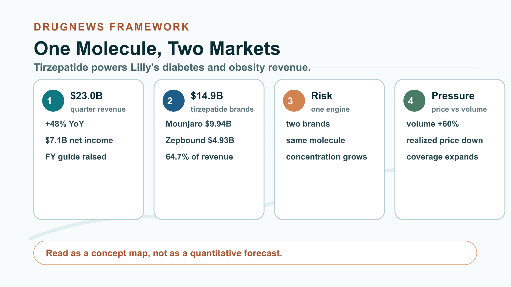
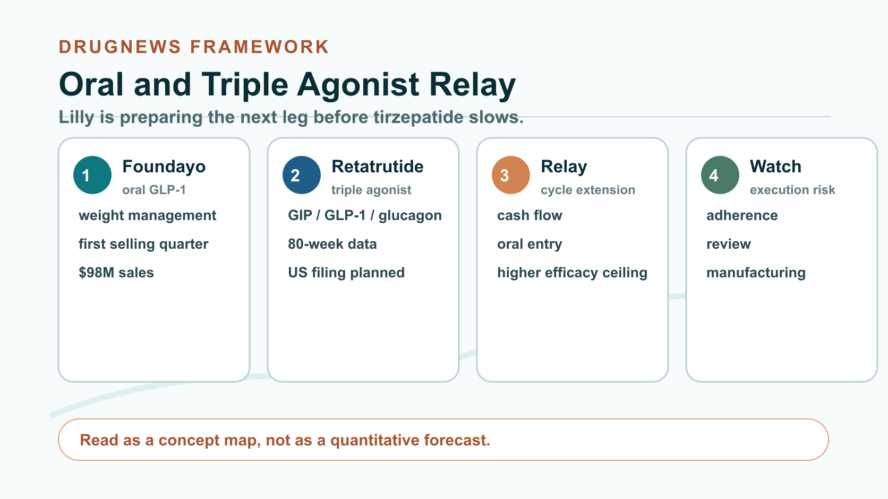
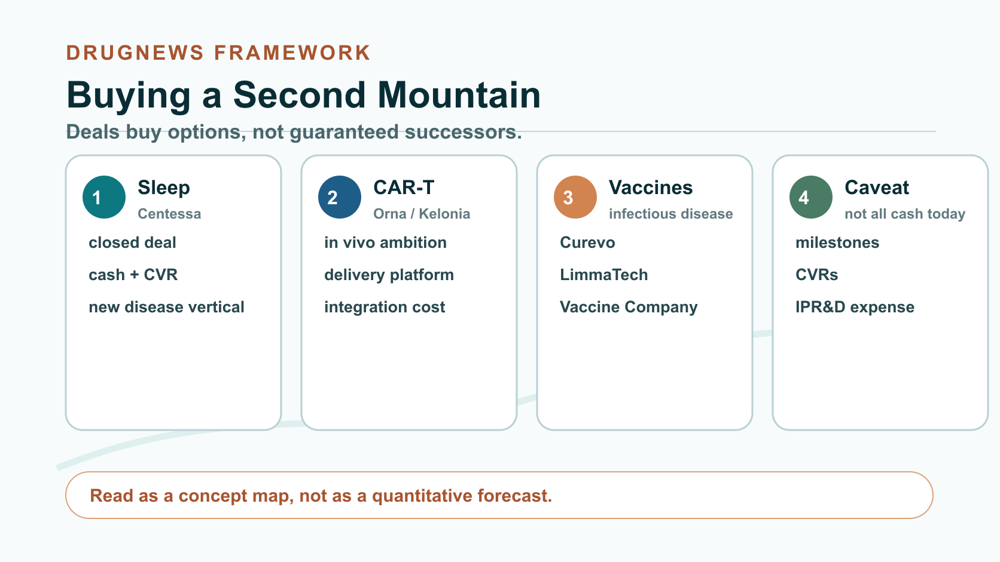
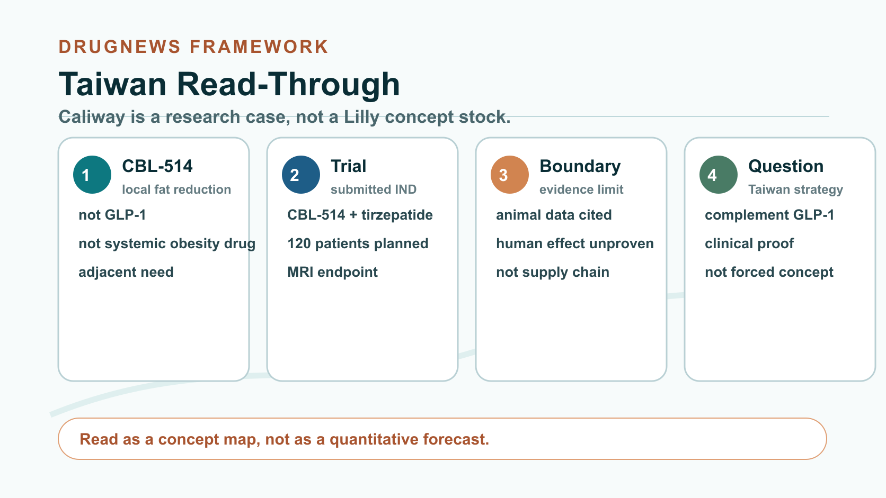

# Eli Lilly Sold $23 Billion in One Quarter. Why Is It Still Rushing to Buy the Next Drug King?

Eli Lilly has delivered another set of results that almost do not look like a traditional Big Pharma quarter.

Second-quarter 2026 revenue reached $22.974 billion, up 48% year over year. Net income was $7.095 billion, up 25%. The company also raised full-year revenue guidance to $85 billion to $87 billion. Mounjaro, the diabetes brand, generated $9.943 billion. Zepbound, the obesity brand, generated $4.928 billion.

Together, the two brands produced $14.871 billion, or 64.7% of Lilly's quarterly revenue.

But investors should not be fooled by the two names. Mounjaro and Zepbound are both powered by the same molecule: tirzepatide.

In other words, Lilly appears to have two money-printing machines, but the core engine is one molecule.

That is why the better the numbers get, the more urgently Lilly has been buying companies. The most comfortable tailwind is also where concentration risk becomes most visible.

## 01 | One molecule, two large markets

Tirzepatide is a dual GIP and GLP-1 incretin agonist. In type 2 diabetes it is sold as Mounjaro. In adults with obesity, or overweight adults who meet treatment criteria, it is sold in the United States as Zepbound.

The molecule first established its strength clinically. In the 751-person SURMOUNT-5 Phase 3 head-to-head study, adults with obesity or overweight without diabetes treated for 72 weeks had an average weight reduction of 20.2% with tirzepatide versus 13.7% with semaglutide. That result supports tirzepatide's advantage under the conditions of that study. It does not mean every patient will experience the same effect, and it cannot be casually transferred to every indication.

The second step was commercial execution. Lilly placed the same molecule into diabetes, weight management and sleep-apnea-related markets, then used LillyDirect, self-pay programs, insurance access and manufacturing expansion to turn clinical differentiation into prescription volume.

The second-quarter numbers are the result of that machine. Mounjaro generated $9.943 billion, up 91% year over year. Zepbound generated $4.928 billion, up 46%. The combined $14.871 billion represented 64.7% of quarterly revenue.

The first half showed the same structure. The two brands produced $27.693 billion against Lilly's total first-half revenue of $42.773 billion, also 64.7%. This is no longer a one-quarter coincidence. It is the company's revenue architecture.

## 02 | Lilly is leading, but the price war has already started

Behind the high growth is another set of numbers that investors should take seriously.

Lilly's second-quarter volume increased 60%, while realized price declined 13%. In the United States, excluding rebate and discount estimate adjustments, overall realized price declined about 9%. That 9% is a company-level U.S. business metric, not a single-product Zepbound price cut. But the direction is clear: the GLP-1 market is trading lower realized price for broader access and greater volume.

China shows the same kind of exchange. After Mounjaro was included in China's national reimbursement drug list, overseas realized price declined while volume increased sharply, driving overseas Mounjaro revenue up 172% year over year.

Novo Nordisk has not left the field either. The company still reported 7% constant-currency adjusted sales growth in the second quarter of 2026. As of July 17, weekly U.S. prescriptions for oral Wegovy had exceeded 265,000.

Lilly is winning the current product and execution cycle. It has not won permanent monopoly status.

The more successful a product becomes, the more payers will demand concessions. The more competitors arrive, the more options physicians and patients will have. Today's 60% volume growth must keep outrunning price erosion if revenue momentum is to hold.

## 03 | Oral and triple agonist programs are Lilly's own relay

Lilly is not waiting for tirzepatide to slow before preparing the next leg.

The first follow-on is Foundayo, or orforglipron, a once-daily oral small-molecule GLP-1 drug. FDA approved it on April 1, 2026 for chronic weight management in eligible adults with obesity or overweight, and Lilly began shipping it on April 6. In its first selling quarter, the product contributed $98 million.

The boundary matters. Foundayo is currently approved in the United States for weight management. Its type 2 diabetes indication remains under regulatory review. Its value is not that it will replace every injectable product, but that it can bring patients who dislike injections, face injection inconvenience or prefer an oral option into treatment.

The second follow-on is retatrutide. This once-weekly triple agonist targets GIP, GLP-1 and glucagon receptors and remains investigational. In the TRIUMPH-1 Phase 3 topline readout, the 12 mg dose produced an average weight reduction of 28.3% at 80 weeks using the efficacy estimand and 25.0% using the treatment-regimen estimand. Lilly plans to submit in the United States in the first quarter of 2027.

One molecule protects the cash flow. One pill expands the entry point. One triple agonist pushes the efficacy ceiling. If the relay works, Lilly can turn a single-product cycle into a platform cycle.

But any weak leg changes the market's view of the growth premium currently attached to tirzepatide. Foundayo has to prove long-term prescription persistence. Retatrutide still has to pass regulatory review and real-world use. Manufacturing has to scale with a larger patient pool.

## 04 | Sleep, CAR-T and vaccines: Lilly is buying a second mountain

Lilly is also using external capital to move beyond metabolic disease.

Acquisitions completed in the second quarter included Orna, Ajax, Centessa and Kelonia. After the quarter, Lilly also completed three infectious-disease acquisitions involving Curevo, LimmaTech and Vaccine Company, and it signed a merger agreement with AtaiBeckley.

The directions look scattered at first. The common logic is that Lilly wants assets with clinical entry points or platform barriers, then intends to apply its development, manufacturing and commercialization capability at scale.

Centessa gives Lilly exposure to sleep-wake disorders. The transaction has closed, with about $6.3 billion in cash consideration at closing and up to $1.5 billion in contingent value rights. Orna and Kelonia point toward in vivo CAR-T and genetic delivery. Orna's transaction value is up to $2.4 billion. Kelonia included $3.25 billion upfront and up to $7.0 billion in total consideration including milestones. Curevo, LimmaTech and Vaccine Company add shingles, drug-resistant bacterial infection and EBV vaccine exposure. The announced maximum consideration across the three deals was about $3.83 billion. AtaiBeckley gives Lilly a potential entry into treatment-resistant depression and related psychiatric disorders, with about $2.8 billion in cash consideration at closing and up to $1.0 billion in CVRs. As of the verification date, that deal should still be treated as pending.

The easiest mistake is to add every maximum number together and describe it as money already spent. Milestones and CVRs require clinical, regulatory or commercial conditions to be met. Announced ceilings are not current cash outflows.

The income statement already shows the cost of this expansion. Lilly recorded $2.8 billion of acquired in-process research and development expense in the quarter, plus $703 million of impairment, restructuring and other special charges, mainly related to Kelonia and Centessa closing and integration.

This is an expensive succession project. What Lilly is buying is optionality, not a guarantee.

## 05 | The real moat is moving science into factories

In May, Lilly committed another $4.5 billion to expand two Indiana manufacturing sites. Since 2020, its committed capital expenditure in the state has exceeded $21 billion. The new facilities cover active pharmaceutical ingredients, Foundayo, retatrutide and genetic medicine.

This may matter more than the acquisition headlines.

Drug development does not always fail at molecule design. Some products succeed clinically and then stumble on capacity, yield, device configuration, supply chain or launch speed. Lilly's current advantage is that the cash generated by a mega-franchise can be directed immediately into the clinical programs and factories required for the next generation of molecules.

Scale creates speed. It also creates risk. The broader the pipeline becomes, the harder resource prioritization gets. The wider the platform set, the greater the integration cost. If acquired assets remain trapped in early clinical development, today's capital intensity can become tomorrow's impairment intensity.

## 06 | Taiwan read-through: Caliway is a research case, not a Lilly concept stock

For Taiwan, the closest public research reference is Caliway Biopharmaceuticals, ticker 6919. The company has submitted an IND to the U.S. FDA for a multicenter Phase 2 trial of CBL-514 in combination with tirzepatide. The indication is reduction of abdominal subcutaneous fat in adults with overweight or obesity. The planned trial is expected to enroll 120 people and use MRI-measured change in abdominal subcutaneous fat volume as the primary endpoint.

The study logic is that after GLP-1 therapy reduces overall body weight, persistent subcutaneous fat and body-composition issues may become a separate clinical problem.

The evidence boundary must be clear. As of August 11, 2026, the company had submitted the Phase 2 IND. That is not the same as FDA allowing the trial to begin. The rebound-weight improvement data cited by the company came from animal research, and human clinical benefit has not yet been established. Caliway is not part of Lilly's supply chain, and the use of Zepbound in a trial should not be packaged as a Lilly concept-stock story.

The more useful question is whether a large GLP-1 market creates clinically testable complementary needs for Taiwanese companies, not whether local names can be forced into the same main battlefield as global giants.

Lilly's greatest strength today is tirzepatide. Its biggest strategic problem is also that tirzepatide has become too strong.

One quarter of $22.974 billion in revenue gives Lilly the capital to pursue oral drugs, triple agonists, sleep disorders, CAR-T, vaccines and psychiatry at the same time. If those investments become products, Lilly may be buying the next decade. If they merely become a stack of expensive early-stage assets, today's strength will magnify tomorrow's gap.

The next drug king is never simply bought.

It has to grow through clinical trials, regulation, factories and markets, one gate at a time.

## References

1. [Eli Lilly 2026 Q2 Form 10-Q](https://www.sec.gov/Archives/edgar/data/59478/000005947826000081/lly-20260630.htm)
2. [Eli Lilly 2026 Q2 sales and earnings press release](https://www.sec.gov/Archives/edgar/data/59478/000005947826000077/q226lillysalesandearningsp.htm)
3. [FDA approval announcement for Foundayo](https://www.fda.gov/news-events/press-announcements/fda-approves-first-new-molecular-entity-under-national-priority-voucher-program)
4. [Foundayo prescribing information](https://www.accessdata.fda.gov/drugsatfda_docs/label/2026/220934Orig1s000lbl.pdf)
5. [NEJM SURMOUNT-5 tirzepatide versus semaglutide](https://www.nejm.org/doi/full/10.1056/NEJMoa2416394)
6. [Lilly Zepbound versus Wegovy SURMOUNT-5 release](https://investor.lilly.com/news-releases/news-release-details/zepbound-tirzepatide-showed-superior-weight-loss-over-wegovy)
7. [Lilly retatrutide TRIUMPH-1 Phase 3 topline release](https://www.prnewswire.com/news-releases/lillys-triple-agonist-retatrutide-delivered-powerful-weight-loss-in-pivotal-phase-3-obesity-trial-302778859.html)
8. [Novo Nordisk 2026 Q2 results](https://www.novonordisk.com/content/nncorp/global/en/news-and-media/news-and-ir-materials/news-details.html?id=916590)
9. [Lilly acquisition and infectious-disease portfolio releases](https://investor.lilly.com/news-releases/news-release-details/lilly-announces-three-acquisitions-build-infectious-disease)
10. [Lilly Indiana manufacturing investment](https://investor.lilly.com/news-releases/news-release-details/lilly-commits-additional-45-billion-across-indiana-manufacturing)
11. [Caliway CBL-514 and tirzepatide combination trial announcement](https://www.caliwaybiopharma.com/news-detail/Caliway-Submits-IND-for-Cbl-514-Combination-Therapy-Phase-2/)

Verification cutoff: August 18, 2026.

## Disclaimer

This article is for industry and business analysis only. It does not constitute medical advice, investment advice, or a recommendation to buy or sell any security. Treatment decisions should be made by qualified healthcare professionals based on individual circumstances.
