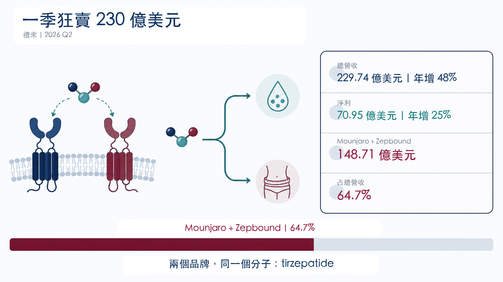
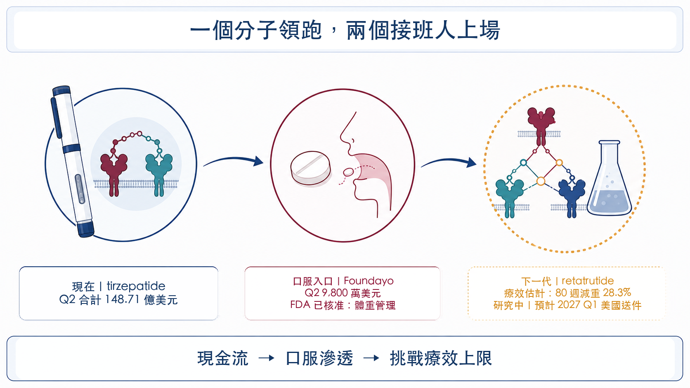
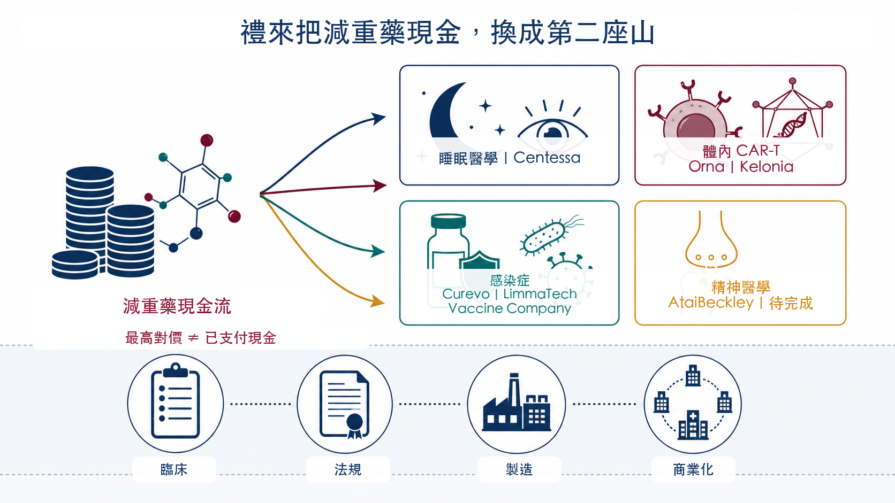
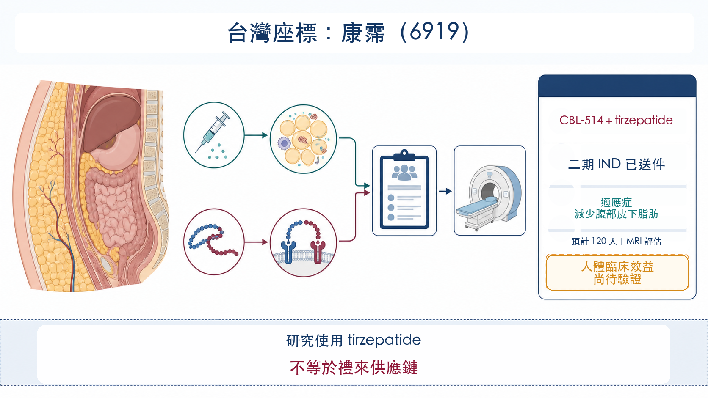

# 一季狂賣 230 億美元，禮來卻急著買下一個藥王

禮來又交出一張幾乎不像大藥廠的成績單。

2026 年第二季營收 229.74 億美元，年增 48%；淨利 70.95 億美元，年增 25%。公司也把全年營收指引上調至 850 億至 870 億美元。其中，糖尿病藥 Mounjaro 賣了 99.43 億美元，減重藥 Zepbound 賣了 49.28 億美元。

兩個品牌加起來 148.71 億美元，占禮來整季營收 64.7%。

但別被兩個名字騙了：Mounjaro 與 Zepbound 背後，都是同一個分子 tirzepatide（替爾泊肽）。

換句話說，禮來目前看似有兩台印鈔機，核心引擎其實只有一具。

這也解釋了為什麼業績越好，禮來買公司的速度反而越快。最舒服的順風局，最怕只有一個引擎。

———

【01｜同一個分子，吃下兩個大市場】💉

Tirzepatide 是 GIP／GLP-1 雙重腸泌素促效劑。用在第二型糖尿病時，以 Mounjaro 銷售；用在肥胖或符合條件的過重成人體重管理時，美國品牌是 Zepbound。

這個分子的厲害之處，先在臨床端建立。

在 751 人參與的 SURMOUNT-5 第三期頭對頭研究中，沒有糖尿病的肥胖或過重成人治療 72 週後，tirzepatide 組平均減重 20.2%，semaglutide 組為 13.7%。這項結果支持 tirzepatide 在該研究條件下的減重優勢；它不代表所有患者都能得到相同效果，也不能用來推論不同適應症的療效。

接著是商業執行。禮來把同一個分子放進糖尿病、體重管理與睡眠呼吸中止等市場，再用 LillyDirect、自費方案、保險准入與產能擴張，把臨床差異轉成處方量。

第二季數字正是這套機器的結果：

📌 Mounjaro：99.43 億美元，年增 91%。

📌 Zepbound：49.28 億美元，年增 46%。

📌 兩者合計：148.71 億美元，占季度營收 64.7%。

上半年也幾乎一樣：兩品牌合計 276.93 億美元，占禮來 427.73 億美元營收的 64.7%。這不是單季偶然，而是公司收入結構。

———

【02｜禮來領先了，價格戰也已經開始】⚔️

高速成長背後，財報藏著另一組值得警覺的數字。

禮來第二季銷量增加 60%，實現價格卻下降 13%。美國市場若排除回扣與折扣估計調整，整體實現價格約下降 9%。這個 9% 是公司美國業務口徑，不能偷換成「Zepbound 單品降價 9%」；但方向很清楚：GLP-1 市場正在用更低價格換更大覆蓋。

中國也呈現同一種交換。Mounjaro 納入中國國家醫保藥品目錄後，海外實現價格下降，銷量則大幅增加，推動海外 Mounjaro 營收年增 172%。

而且，諾和諾德遠沒有退出戰場。該公司 2026 年第二季調整後銷售仍以固定匯率成長 7%；截至 7 月 17 日，Wegovy 口服錠在美國單週處方已超過 26.5 萬張。

所以，禮來贏的是目前這一輪產品與執行，不是永久壟斷。

產品越成功，支付端越會要求降價；競爭者越多，患者與醫師的選項越多。今天的 60% 銷量成長，必須持續跑得比價格下滑更快，營收才守得住。

———

【03｜口服、三靶點：禮來先接好自己的下一棒】🧬

禮來沒有等 tirzepatide 放慢才準備接班。

第一棒是 Foundayo（orforglipron），一款每日一次的口服小分子 GLP-1 藥物。FDA 在 2026 年 4 月 1 日核准它用於符合條件的肥胖或過重成人，4 月 6 日開始出貨；第一個銷售季度已貢獻 9,800 萬美元。

這裡要說清楚：Foundayo 目前在美國核准的是體重管理，第二型糖尿病適應症仍在送件階段。它的價值不是取代所有針劑，而是把不想打針、注射不便或偏好口服的族群拉進治療市場。

第二棒是 retatrutide。這款每週一次的 GIP／GLP-1／升糖素三重受體促效劑仍在研究中。TRIUMPH-1 第三期頂線數據顯示，12 mg 組依療效估計策略計算，80 週平均減重 28.3%；若依治療方案估計策略計算，則為 25.0%。禮來規劃 2027 年第一季在美國提出申請。

一個分子守住現金流，一顆藥錠擴大入口，一個三重促效劑往療效上限再推。這條接力如果順利，禮來就能把單品週期拉成平台週期。

但任何一棒出問題，都會讓市場重新檢視目前給 tirzepatide 的高成長溢價。Foundayo 需要證明長期處方黏著度；retatrutide 仍要經過監管審查與真實世界使用；產能則必須跟得上更大的患者池。

———

【04｜買睡眠、CAR-T、疫苗：禮來在買第二座山】🧩

除了自己做，禮來也把資金撒向代謝疾病之外。

第二季完成的收購包括 Orna、Ajax、Centessa 與 Kelonia；季後又完成 Curevo、LimmaTech、Vaccine Company 三筆感染症收購，並簽下 AtaiBeckley 的併購協議。

方向看似很散，背後其實有一條共同標準：先拿到有臨床入口或平台壁壘的資產，再用禮來的開發、製造與商業化能力把它放大。

🔹 Centessa：睡眠—清醒障礙。交易已完成，交割現金對價約 63 億美元，另有最高 15 億美元或有價值權（CVR）。

🔹 Orna／Kelonia：體內 CAR-T 與基因遞送。Orna 交易最高 24 億美元；Kelonia 交割預付款 32.5 億美元，含里程碑的最高總對價 70 億美元。

🔹 Curevo／LimmaTech／Vaccine Company：帶狀疱疹、抗藥性細菌與 EBV 疫苗。三筆公告的最高總對價合計約 38.3 億美元。

🔹 AtaiBeckley：難治型憂鬱症等精神疾病。禮來已簽約，交割現金對價約 28 億美元，另有最高 10 億美元 CVR；截至查證日仍應視為待完成交易。

這裡最容易犯的錯，是把所有「最高金額」加起來，直接說禮來已經花掉多少錢。里程碑與 CVR 要達成臨床、法規或商業條件才會支付，公告上限不等於當期現金支出。

財報已經先看得到買公司的代價：第二季收購中研發資產費用達 28 億美元，另有 7.03 億美元減損、重整與其他特殊費用，主要與 Kelonia、Centessa 的交割與整合相關。

這是一場很昂貴的接班工程。買進來的是選擇權，不是保證書。

———

【05｜真正的護城河，是把科學送進工廠】🏭

禮來 5 月再加碼 45 億美元擴建印第安納州兩座製造基地，2020 年以來在當地承諾的資本支出已超過 210 億美元。新設施涵蓋原料藥、Foundayo、retatrutide 與基因醫學。

這一步比併購新聞更關鍵。

製藥業最常見的失敗，未必發生在分子設計。有些產品臨床成功，最後卻卡在產能、良率、裝置、供應鏈或上市速度。禮來現在的優勢，是能把超級單品產生的現金，直接灌進下一代分子的臨床與工廠。

規模帶來速度，也帶來另一種風險：管線越多，資源排序越難；平台越廣，整合成本越高。若買來的資產長期停在早期臨床，今天的資本密度，明天就可能變成減損密度。

———

【06｜台灣座標：康霈是研究案例，不是禮來概念股】🔍

台灣若要找直接相關的研究座標，目前可看康霈生技（6919）。

公司已向美國 FDA 遞交 CBL-514 合併 tirzepatide 的多中心二期臨床試驗 IND，適應症是「減少過重或肥胖成人的腹部皮下脂肪」，預計納入 120 人，以 MRI 量測腹部皮下脂肪體積變化。

這項研究的邏輯，是在 GLP-1 降低整體體重後，進一步處理頑固皮下脂肪與停藥後體組成問題。

但證據邊界要畫清楚：截至 2026 年 8 月 11 日，公司僅完成二期 IND 送件，尚不等於 FDA 已准予試驗啟動；公司提出的復胖改善數據來自動物研究，人體臨床效益尚未證實。康霈也不是禮來供應鏈，更不能因為研究使用 Zepbound 就包裝成「禮來概念股」。

真正值得觀察的，是大型 GLP-1 市場出現後，台灣公司能否找到可被臨床驗證的互補問題，而不是在同一條主賽道上硬碰巨頭。

———

禮來現在最強的地方，是 tirzepatide；最需要解決的問題，也正是 tirzepatide 太強。

一季 230 億美元營收，讓它有本錢同時押注口服藥、三重促效劑、睡眠、CAR-T、疫苗與精神醫學。這些投資若能長成產品，禮來買到的會是下一個十年；若只長成一疊昂貴的早期管線，今天的盛況反而會放大明天的落差。

真正的藥王，從來不是被買回來的。

它得在臨床、監管、工廠與市場裡，一關一關長出來。

## 參考資料

1. [Eli Lilly 2026 Q2 Form 10-Q](https://www.sec.gov/Archives/edgar/data/59478/000005947826000081/lly-20260630.htm)
2. [Eli Lilly 2026 Q2 sales and earnings press release](https://www.sec.gov/Archives/edgar/data/59478/000005947826000077/q226lillysalesandearningsp.htm)
3. [FDA approval announcement for Foundayo](https://www.fda.gov/news-events/press-announcements/fda-approves-first-new-molecular-entity-under-national-priority-voucher-program)
4. [Foundayo prescribing information](https://www.accessdata.fda.gov/drugsatfda_docs/label/2026/220934Orig1s000lbl.pdf)
5. [NEJM SURMOUNT-5 tirzepatide versus semaglutide](https://www.nejm.org/doi/full/10.1056/NEJMoa2416394)
6. [Lilly Zepbound versus Wegovy SURMOUNT-5 release](https://investor.lilly.com/news-releases/news-release-details/zepbound-tirzepatide-showed-superior-weight-loss-over-wegovy)
7. [Lilly retatrutide TRIUMPH-1 Phase 3 topline release](https://www.prnewswire.com/news-releases/lillys-triple-agonist-retatrutide-delivered-powerful-weight-loss-in-pivotal-phase-3-obesity-trial-302778859.html)
8. [Novo Nordisk 2026 Q2 results](https://www.novonordisk.com/content/nncorp/global/en/news-and-media/news-and-ir-materials/news-details.html?id=916590)
9. [Lilly acquisition and infectious-disease portfolio releases](https://investor.lilly.com/news-releases/news-release-details/lilly-announces-three-acquisitions-build-infectious-disease)
10. [Lilly Indiana manufacturing investment](https://investor.lilly.com/news-releases/news-release-details/lilly-commits-additional-45-billion-across-indiana-manufacturing)
11. [Caliway CBL-514 and tirzepatide combination trial announcement](https://www.caliwaybiopharma.com/news-detail/Caliway-Submits-IND-for-Cbl-514-Combination-Therapy-Phase-2/)

查證截止日：2026 年 8 月 18 日。

## 免責聲明

本文為產業資訊整理與商業分析，不構成醫療建議、投資建議或任何買賣有價證券之推薦。藥物使用與治療選擇應由合格醫療人員依個別情況評估。
