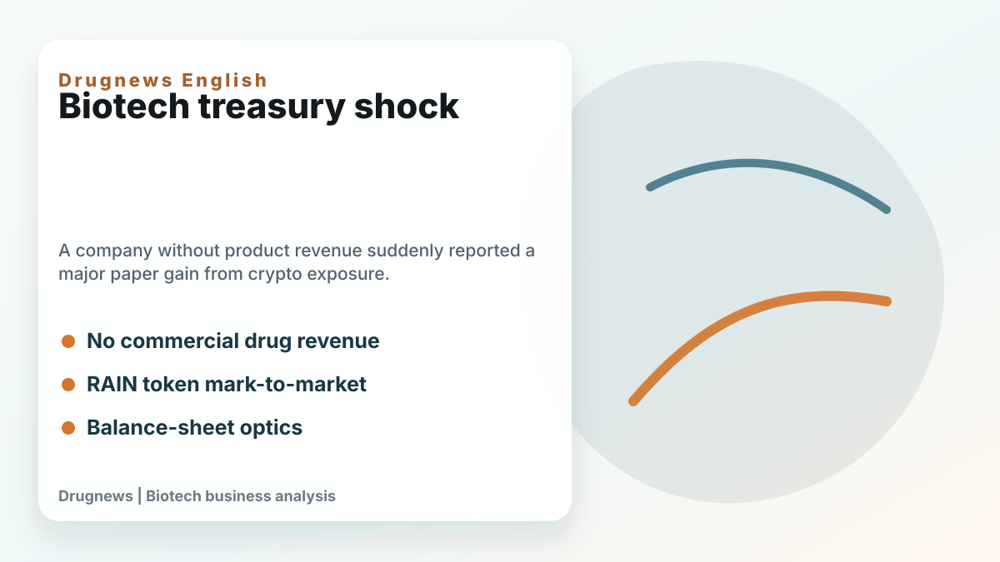
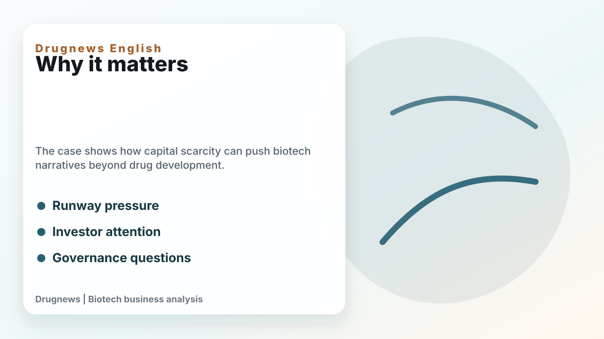
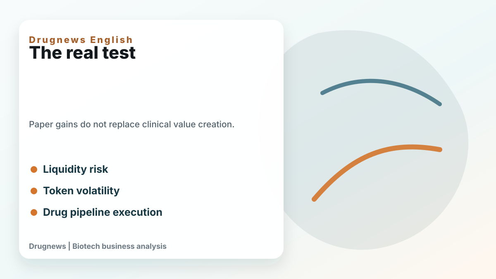

# Enlivex's RAIN Token Windfall: When a Biotech Balance Sheet Starts Looking Like Crypto Treasury Strategy

Enlivex is an unusual biotech case because the headline is not mainly about clinical data. It is about a paper gain linked to RAIN tokens.

For a biotech company without meaningful product revenue, a sudden treasury-related gain can attract attention quickly. It changes the balance-sheet discussion, affects investor psychology, and can make the company look financially stronger than its operating business would otherwise suggest.

But investors need to separate accounting optics from business fundamentals. A biotech company ultimately creates durable value through clinical evidence, regulatory progress, partnership potential, and commercial products. Token exposure can affect liquidity and reported value, but it does not by itself validate the drug pipeline.

That distinction matters because biotech is a capital-intensive industry. When financing markets are difficult, companies look for ways to extend runway, attract market attention, or create alternative sources of value. Some use royalty financing, debt facilities, partnerships, or asset sales. Others may create more unusual treasury stories.

The Enlivex case is important not because every biotech will copy it, but because it shows how far capital-market narratives can stretch when the core business has not yet produced revenue. A paper gain can buy time and attention. It cannot replace clinical execution.

The key questions are practical. Can the token position be converted into usable cash? How volatile is the asset? What governance rules control treasury decisions? Does the company still have enough focus and capital to advance its drug programs? Are investors valuing a pipeline or a financial instrument?

For Drugnews readers, the lesson is to avoid being distracted by a spectacular balance-sheet number. In biotech, cash matters because it funds trials. But the quality of the underlying asset still matters more.

Enlivex may benefit from a strong treasury headline, but the long-term investment question remains the same: can the company turn science into clinical, regulatory, and commercial value?

This article is intended for industry research and knowledge sharing only. It does not constitute investment, medical, fundraising, or individual stock advice.
