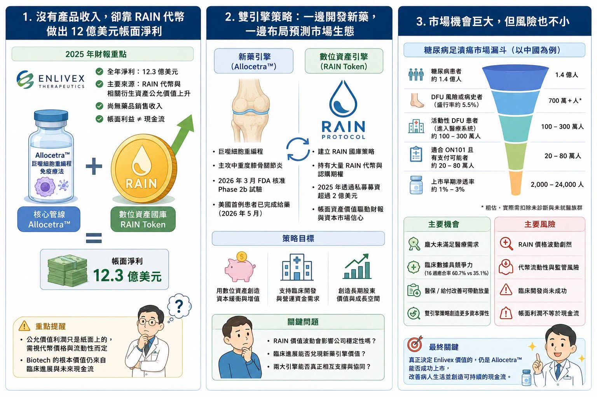

# 【Enlivex 的幣圈豪賭：Biotech 沒收入，卻靠 RAIN 代幣賺出 12 億美元帳面利潤】

一家臨床階段 Biotech，沒有藥品銷售收入，卻在一年內做出 12 億美元級別的淨利。

這聽起來不像生技公司，更像加密貨幣基金。但這正是以色列 Biotech 公司 Enlivex 正在上演的故事。Enlivex 原本是一家臨床階段生技公司，核心管線是 Allocetra™，一款巨噬細胞重編程免疫療法，目前主要聚焦於年齡相關的中重度膝骨關節炎。照傳統 Biotech 劇本，這類公司在產品上市前通常沒有收入，依靠增資、私募、授權或債務融資支撐臨床開發。

但 Enlivex 走了一條非常不尋常的路。

它把大量資本配置到 RAIN token，也就是去中心化預測市場 Rain Protocol 的代幣，並把自己包裝成一家公司同時擁有兩個引擎：一邊是長壽醫學與骨關節炎新藥，一邊是預測市場數位資產國庫。

這讓 Enlivex 成為一個很罕見的案例：一家 Biotech，不靠藥賣錢，先靠代幣公允價值讓財報變漂亮。但這也帶來一個更關鍵的問題：這到底是創新的資本策略，還是把 Biotech 風險疊上加密貨幣風險？

## 01｜0 收入，卻做出 12 億美元級淨利

2025 年，Enlivex 公告全年淨利約 12.3 億美元。

但這筆錢不是來自藥品上市，也不是來自授權金，更不是來自產品銷售。主要來源，是公司持有的 RAIN 代幣與相關衍生資產公允價值上升。換句話說，這是一種帳面上的未實現利益。

這裡要先講清楚一件事：公允價值利潤，不等於現金流。

如果一家公司持有的代幣價格上漲，會計上可以反映成資產價值上升，甚至推升當期利潤。但只要公司沒有真正賣出代幣，這些利潤就仍然是紙面上的。紙面利潤可以改善資產負債表，可以提升股東權益，也可以讓公司在資本市場上看起來更有底氣。但它不一定能直接支付臨床費用、製造費用、員工薪水與試驗中心款項。

這也是 Enlivex 事件最需要冷靜看的地方。它不是單純「炒幣賺錢」，它是在嘗試把加密資產變成 Biotech 的資本緩衝墊。如果 RAIN 價格持續上漲，這當然可能成為公司研發資金的另類來源。但如果 RAIN 流動性不足、價格大幅波動，或監管環境改變，帳面財富也可能快速縮水。

## 02｜RAIN 國庫策略：Enlivex 想用幣圈替藥圈造血
Enlivex 對 RAIN 的布局，不是零星買幣，而是有系統的「數位資產國庫策略」。

公司在 2025 年宣布超過 2 億美元私募，目的之一就是建立 RAIN token treasury strategy，也就是把 RAIN 代幣納入公司資產配置。更重要的是，Enlivex 與 Rain Foundation 簽署協議，取得大量 RAIN 代幣認購權。這讓它不只持有現貨代幣，也持有未來可用固定價格購買更多 RAIN 的選擇權。

這個設計非常像一種高槓桿資本工具。

如果 RAIN 價格上漲，Enlivex 持有的代幣與認購權價值會放大。如果 RAIN 生態擴張、交易量提升、代幣需求增加，Enlivex 可能享有非常大的資產增值空間。但反過來，如果 RAIN 價格下跌，或市場流動性不足，公司資產價值也會劇烈波動。所以，Enlivex 的戰略可以概括成一句話：用預測市場代幣的高波動、高凸性資產，替臨床階段新藥公司提供非傳統資金來源。

這和一般 Biotech 不一樣，傳統 Biotech 缺錢時，通常有幾條路：

增發股票。

私募。

發債。

賣區域權利。

授權管線。

被大藥廠收購。

Enlivex 則試圖開出另一條路：先用數位資產國庫創造帳面價值，再用這個價值支撐臨床研發與資本市場信心，這個策略非常激進，也非常不典型。

## 03｜為什麼 Biotech 會想走這條路？因為融資環境太殘酷
很多人第一反應會是：一家藥廠為什麼要碰加密貨幣？

但如果把 Biotech 融資環境放進來看，這件事就比較能理解，臨床階段 Biotech 是非常燒錢的產業。Phase 2、Phase 3、CMC、GMP、生產放大、臨床試驗中心、法規申請、上市前準備，全部都需要錢。

但問題是，Biotech 融資窗口非常不穩定，如果公司剛好有漂亮臨床數據、熱門機制或大藥廠合作，融資可以很順。但如果沒有催化劑，股價低迷，市場風險偏好下降，公司很容易陷入被迫低價增發的困境。低價增發會稀釋股東；授權太早又可能賣掉未來最大價值；發債則需要信用與還款能力，對未上市產品公司並不容易。Enlivex 的想法，就是希望透過數位資產配置，擺脫臨床階段公司反覆融資、反覆稀釋的循環。

它想建立一個「幣圈造血、藥圈變現」的雙輪模式，幣圈負責提供資產增值與資本緩衝。藥圈則靠 Allocetra™ 在骨關節炎等長壽醫學領域兌現臨床價值。

這個想法很大膽，但是否可持續，還沒有答案。

## 04｜Allocetra™ 才是 Enlivex 真正的藥物故事
如果只看 RAIN，Enlivex 會很像一家加密資產公司。

但它原本的主業，仍然是藥物開發，核心資產 Allocetra™ 是一種巨噬細胞重編程免疫療法。巨噬細胞是免疫系統裡重要的清道夫與調節者，參與發炎、組織修復、免疫平衡與慢性病進展。Enlivex 的邏輯是，很多年齡相關疾病不是單純磨損，而是伴隨慢性低度發炎與免疫失衡。骨關節炎就是其中之一。

膝骨關節炎是一種極常見的退化性疾病，會造成疼痛、僵硬、活動受限與生活品質下降。美國成人患者數量龐大，但目前治療主要仍是止痛、物理治療、體重控制、注射療法與末期關節置換。

真正能改變病程、延緩退化的疾病修正療法，目前仍非常有限。Allocetra™ 想做的，不是單純止痛，而是透過免疫調節與巨噬細胞重編程，嘗試改善關節局部發炎環境，進而影響疼痛、功能與疾病進展。

2026 年 3 月，FDA 已核准 Enlivex 啟動 Allocetra™ 用於年齡相關中重度膝骨關節炎的 Phase 2b 試驗。5 月，公司也宣布美國首例患者已完成給藥。這代表 Enlivex 的臨床故事並沒有停下來。

只是市場現在更關心的是：Allocetra™ 的臨床價值，能不能追得上 RAIN 帳面資產帶來的想像？

## 05｜二級市場為什麼沒有完全買單？
照理說，一家公司持有大量數位資產，帳面價值遠高於市值，市場應該興奮，但 Enlivex 的情況不是這樣，市場對它仍然相當謹慎，原因其實很明顯。

第一，RAIN 不是現金。

代幣與期權可以估值，但能不能用理想價格變現，是另一回事。尤其當持倉規模很大時，賣出本身就可能影響市場價格。

第二，RAIN 價格波動極大。

加密資產的波動幅度遠高於傳統現金、債券或上市股票。今天是公允價值利得，明天也可能變成公允價值損失。

第三，監管風險不確定。

預測市場、代幣、去中心化協議，本來就處在高度變動的監管環境中。不同國家對這類資產的態度可能快速改變。

第四，公司本業尚未商業化。

Allocetra™ 還在 Phase 2b，距離上市仍有 Phase 3、法規審查、商業化等多個關卡。短期內，藥物收入仍無法支撐公司估值。

第五，帳面資產與藥物價值之間沒有天然連動。

RAIN 漲，不代表 Allocetra™ 成功。Allocetra™ 成功，也不一定需要 RAIN。市場最怕的是公司看起來有兩個故事，但兩個故事彼此沒有真正協同。

所以 Enlivex 的市值沒有完全反映 RAIN 的帳面價值，其實不難理解，投資人不是看不懂，而是不願意把高波動、低可見度、難變現的數位資產，直接當成等同現金的價值。

## 06｜Biotech 炒幣，是天才策略還是危險信號？
Enlivex 的案例很新，也很極端。

它有可能成為一種創新資本策略，也可能成為 Biotech 融資焦慮下的危險示範。如果 RAIN 價格持續上漲，公司能以合理方式逐步變現，並把資金投入 Allocetra™ 臨床開發，那麼 Enlivex 可能真的創造出一種新的臨床階段公司資金模型。但如果 RAIN 價格劇烈下跌，或市場流動性不足，帳面富貴就可能快速消失。更麻煩的是，當一家 Biotech 的投資故事被加密資產綁架，市場會開始問：

公司到底是藥廠，還是數位資產公司？

管理層時間放在哪裡？

公司估值該用新藥淨現值算，還是用代幣資產折價算？

臨床資料不好時，能不能靠代幣支撐？

代幣不好時，藥物本業能不能支撐？

這些問題都很現實，Biotech 的核心價值，最後還是臨床成功、產品上市、患者受益與現金流。

數位資產可以當資本工具，但不能取代藥物開發。如果公司因為炒幣賺錢，反而讓市場忽略臨床資料品質，這不是好事。如果公司靠數位資產爭取時間，最後把臨床資產做出來，那才是真正的勝利。

## 07｜這件事對台灣 Biotech 有什麼啟示？
台灣生技公司不應該模仿 Enlivex 去囤幣。

台灣資本市場、監管環境、投資人結構、公司治理文化，都不適合把加密貨幣國庫策略當成 Biotech 的主流融資工具。但 Enlivex 的故事，對台灣 Biotech 仍有重要提醒：臨床階段公司最稀缺的，永遠是時間與現金。

台灣很多未來 6 到 12 個月有 IPO、興櫃、現增、私募或 Pre-IPO 需求的生技公司，都面臨同樣問題：

怎麼在臨床資料成熟前，維持足夠現金？

怎麼避免在低股價時被迫稀釋？

怎麼把資本市場故事和臨床節點連在一起？

怎麼在沒有產品收入前，支撐研發費用？

## 結語｜Biotech 可以找新錢，但不能忘記自己終究要靠藥證明
Enlivex 的故事很有戲劇性。

一家沒有產品收入的 Biotech，靠 RAIN 代幣與認購期權，做出 12 億美元級別帳面淨利。

這在生技產業非常罕見。它也提醒市場，臨床階段 Biotech 在融資困難時，會越來越願意嘗試非傳統資本工具。但這件事不能被浪漫化。

帳面利潤不是現金流。

代幣價值不是藥物價值。

期權內在價值不是確定收入。

加密資產國庫不是臨床成功。

對 Enlivex 來說，真正的答案仍然在 Allocetra™。

如果 Allocetra™ 在膝骨關節炎 Phase 2b 做出漂亮資料，RAIN 國庫策略就會被市場重新解讀為替臨床開發爭取時間的聰明資本配置。如果 Allocetra™ 失敗，RAIN 再漂亮也可能只是一次離奇的財務旁支。

Biotech 可以用各種方法找錢。股權融資、授權、債務、royalty financing、策略投資，甚至像 Enlivex 一樣配置數位資產。但最後，市場還是會回到最基本的問題：

藥有沒有用？

臨床數據好不好？

能不能上市？

能不能賣錢？

能不能真正改善病人生活？

對 Biotech 來說，搞錢可以救命，但真正讓公司長大的，永遠還是藥本身。

參考資料：

[1] Enlivex Therapeutics｜Investor relations and company filings: https://enlivex.com/investors/

[2] GlobeNewswire｜Enlivex company news releases: https://www.globenewswire.com/search/organization/Enlivex%2520Therapeutics

---

本文僅供產業研究與知識分享，不構成投資、醫療、募資或個股建議。
